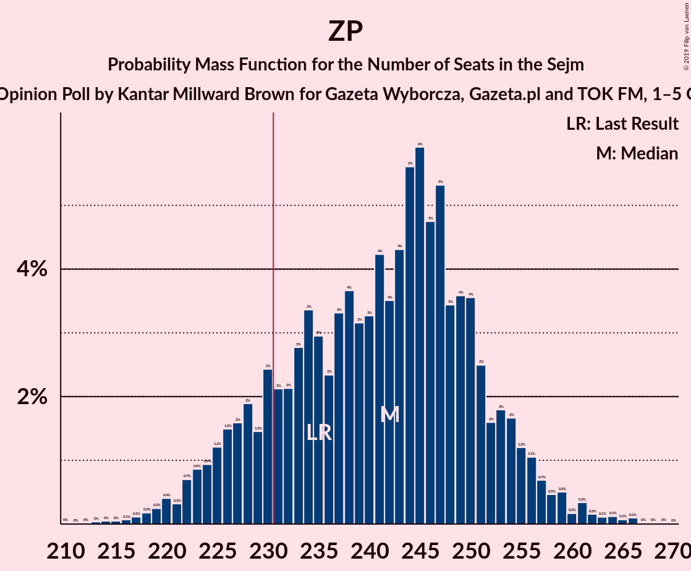
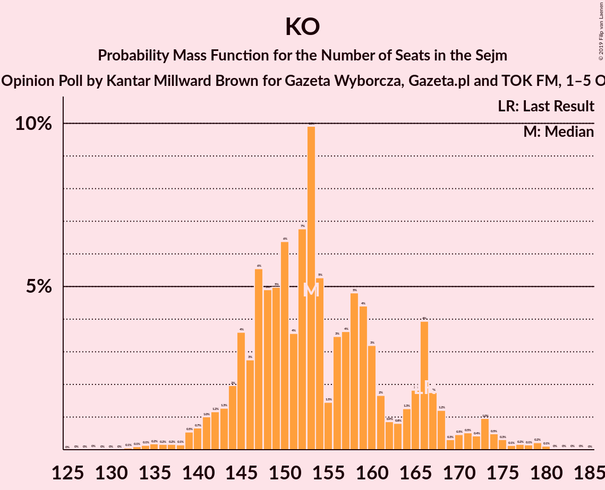

# Opinion Poll by Kantar Millward Brown for Gazeta Wyborcza, Gazeta.pl and TOK FM, 1–5 October 2019

<a href="#voting-intentions">Voting Intentions</a> | <a href="#seats">Seats</a> | <a href="#coalitions">Coalitions</a> | <a href="#technical-information">Technical Information</a>

## Voting Intentions

### Confidence Intervals

| Party | Last Result | Poll Result | 80% Confidence Interval | 90% Confidence Interval | 95% Confidence Interval | 99% Confidence Interval |
|:-----:|:-----------:|:-----------:|:-----------------------:|:-----------------------:|:-----------------------:|:-----------------------:|
| Zjednoczona Prawica | 37.6% | 42.0% | 40.0–44.0% |39.4–44.6% |39.0–45.1% |38.0–46.0% |
| Koalicja Obywatelska | 31.7% | 29.0% | 27.2–30.8% |26.7–31.4% |26.2–31.8% |25.4–32.8% |
| Lewica | 11.7% | 13.0% | 11.8–14.5% |11.4–14.9% |11.1–15.3% |10.5–16.0% |
| Konfederacja | 4.8% | 5.0% | 4.2–6.0% |4.0–6.2% |3.8–6.5% |3.4–7.0% |
| Koalicja Polska | 13.9% | 4.0% | 3.3–4.9% |3.1–5.2% |2.9–5.4% |2.6–5.9% |
| Bezpartyjni Samorządowcy | 0.1% | 1.0% | 0.7–1.5% |0.6–1.7% |0.5–1.8% |0.4–2.1% |

*Note:* The poll result column reflects the actual value used in the calculations. Published results may vary slightly, and in addition be rounded to fewer digits.

## Seats

### Confidence Intervals

| Party | Last Result | Median | 80% Confidence Interval | 90% Confidence Interval | 95% Confidence Interval | 99% Confidence Interval |
|:-----:|:-----------:|:------:|:-----------------------:|:-----------------------:|:-----------------------:|:-----------------------:|
| <a href="#zjednoczona-prawica">Zjednoczona Prawica</a> | 235 | 242 | 228–252 |225–255 |223–257 |218–262 |
| <a href="#koalicja-obywatelska">Koalicja Obywatelska</a> | 166 | 153 | 145–166 |143–168 |141–173 |135–178 |
| <a href="#lewica">Lewica</a> | 0 | 61 | 51–68 |48–71 |46–73 |44–77 |
| <a href="#konfederacja">Konfederacja</a> | 0 | 3 | 0–10 |0–12 |0–15 |0–20 |
| <a href="#koalicja-polska">Koalicja Polska</a> | 58 | 0 | 0 |0–8 |0–10 |0–12 |
| <a href="#bezpartyjni-samorządowcy">Bezpartyjni Samorządowcy</a> | 0 | 0 | 0 |0 |0 |0 |

### Zjednoczona Prawica

*For a full overview of the results for this party, see the [Zjednoczona Prawica](party-zjednoczonaprawica.html) page.*

| Number of Seats | Probability | Accumulated | Special Marks |
|:---------------:|:-----------:|:-----------:|:-------------:|
| 212 | 0% | 100% |  |
| 213 | 0% | 99.9% |  |
| 214 | 0% | 99.9% |  |
| 215 | 0% | 99.9% |  |
| 216 | 0.1% | 99.8% |  |
| 217 | 0.1% | 99.7% |  |
| 218 | 0.2% | 99.6% |  |
| 219 | 0.2% | 99.4% |  |
| 220 | 0.4% | 99.2% |  |
| 221 | 0.3% | 98.8% |  |
| 222 | 0.7% | 98% |  |
| 223 | 0.9% | 98% |  |
| 224 | 0.9% | 97% |  |
| 225 | 1.2% | 96% |  |
| 226 | 1.5% | 95% |  |
| 227 | 2% | 93% |  |
| 228 | 2% | 92% |  |
| 229 | 1.5% | 90% |  |
| 230 | 2% | 88% |  |
| 231 | 2% | 86% | Majority |
| 232 | 2% | 84% |  |
| 233 | 3% | 82% |  |
| 234 | 3% | 79% |  |
| 235 | 3% | 76% | Last Result |
| 236 | 2% | 73% |  |
| 237 | 3% | 70% |  |
| 238 | 4% | 67% |  |
| 239 | 3% | 63% |  |
| 240 | 3% | 60% |  |
| 241 | 4% | 57% |  |
| 242 | 4% | 53% | Median |
| 243 | 4% | 49% |  |
| 244 | 6% | 45% |  |
| 245 | 6% | 39% |  |
| 246 | 5% | 33% |  |
| 247 | 5% | 29% |  |
| 248 | 3% | 23% |  |
| 249 | 4% | 20% |  |
| 250 | 4% | 16% |  |
| 251 | 2% | 13% |  |
| 252 | 2% | 10% |  |
| 253 | 2% | 9% |  |
| 254 | 2% | 7% |  |
| 255 | 1.2% | 5% |  |
| 256 | 1.1% | 4% |  |
| 257 | 0.7% | 3% |  |
| 258 | 0.5% | 2% |  |
| 259 | 0.5% | 2% |  |
| 260 | 0.2% | 1.1% |  |
| 261 | 0.3% | 1.0% |  |
| 262 | 0.2% | 0.6% |  |
| 263 | 0.1% | 0.5% |  |
| 264 | 0.1% | 0.4% |  |
| 265 | 0.1% | 0.3% |  |
| 266 | 0.1% | 0.2% |  |
| 267 | 0% | 0.1% |  |
| 268 | 0% | 0.1% |  |
| 269 | 0% | 0.1% |  |
| 270 | 0% | 0% |  |

### Koalicja Obywatelska

*For a full overview of the results for this party, see the [Koalicja Obywatelska](party-koalicjaobywatelska.html) page.*

| Number of Seats | Probability | Accumulated | Special Marks |
|:---------------:|:-----------:|:-----------:|:-------------:|
| 128 | 0% | 100% |  |
| 129 | 0% | 99.9% |  |
| 130 | 0% | 99.9% |  |
| 131 | 0% | 99.9% |  |
| 132 | 0.1% | 99.9% |  |
| 133 | 0.1% | 99.9% |  |
| 134 | 0.1% | 99.8% |  |
| 135 | 0.2% | 99.6% |  |
| 136 | 0.2% | 99.4% |  |
| 137 | 0.2% | 99.3% |  |
| 138 | 0.1% | 99.1% |  |
| 139 | 0.5% | 99.0% |  |
| 140 | 0.7% | 98% |  |
| 141 | 1.0% | 98% |  |
| 142 | 1.2% | 97% |  |
| 143 | 1.3% | 96% |  |
| 144 | 2% | 94% |  |
| 145 | 4% | 92% |  |
| 146 | 3% | 89% |  |
| 147 | 6% | 86% |  |
| 148 | 5% | 80% |  |
| 149 | 5% | 76% |  |
| 150 | 6% | 71% |  |
| 151 | 4% | 64% |  |
| 152 | 7% | 61% |  |
| 153 | 10% | 54% | Median |
| 154 | 5% | 44% |  |
| 155 | 1.5% | 39% |  |
| 156 | 3% | 37% |  |
| 157 | 4% | 34% |  |
| 158 | 5% | 30% |  |
| 159 | 4% | 25% |  |
| 160 | 3% | 21% |  |
| 161 | 2% | 18% |  |
| 162 | 0.9% | 16% |  |
| 163 | 0.8% | 15% |  |
| 164 | 1.3% | 14% |  |
| 165 | 2% | 13% |  |
| 166 | 4% | 11% | Last Result |
| 167 | 2% | 7% |  |
| 168 | 1.2% | 6% |  |
| 169 | 0.3% | 4% |  |
| 170 | 0.5% | 4% |  |
| 171 | 0.5% | 4% |  |
| 172 | 0.4% | 3% |  |
| 173 | 1.0% | 3% |  |
| 174 | 0.5% | 2% |  |
| 175 | 0.3% | 1.2% |  |
| 176 | 0.1% | 0.9% |  |
| 177 | 0.2% | 0.8% |  |
| 178 | 0.1% | 0.6% |  |
| 179 | 0.2% | 0.5% |  |
| 180 | 0.1% | 0.3% |  |
| 181 | 0% | 0.2% |  |
| 182 | 0% | 0.1% |  |
| 183 | 0% | 0.1% |  |
| 184 | 0% | 0.1% |  |
| 185 | 0% | 0% |  |

### Lewica

*For a full overview of the results for this party, see the [Lewica](party-lewica.html) page.*

| Number of Seats | Probability | Accumulated | Special Marks |
|:---------------:|:-----------:|:-----------:|:-------------:|
| 0 | 0% | 100% | Last Result |
| 1 | 0% | 100% |  |
| 2 | 0% | 100% |  |
| 3 | 0% | 100% |  |
| 4 | 0% | 100% |  |
| 5 | 0% | 100% |  |
| 6 | 0% | 100% |  |
| 7 | 0% | 100% |  |
| 8 | 0% | 100% |  |
| 9 | 0% | 100% |  |
| 10 | 0% | 100% |  |
| 11 | 0% | 100% |  |
| 12 | 0% | 100% |  |
| 13 | 0% | 100% |  |
| 14 | 0% | 100% |  |
| 15 | 0% | 100% |  |
| 16 | 0% | 100% |  |
| 17 | 0% | 100% |  |
| 18 | 0% | 100% |  |
| 19 | 0% | 100% |  |
| 20 | 0% | 100% |  |
| 21 | 0% | 100% |  |
| 22 | 0% | 100% |  |
| 23 | 0% | 100% |  |
| 24 | 0% | 100% |  |
| 25 | 0% | 100% |  |
| 26 | 0% | 100% |  |
| 27 | 0% | 100% |  |
| 28 | 0% | 100% |  |
| 29 | 0% | 100% |  |
| 30 | 0% | 100% |  |
| 31 | 0% | 100% |  |
| 32 | 0% | 100% |  |
| 33 | 0% | 100% |  |
| 34 | 0% | 100% |  |
| 35 | 0% | 100% |  |
| 36 | 0% | 100% |  |
| 37 | 0% | 100% |  |
| 38 | 0% | 100% |  |
| 39 | 0% | 100% |  |
| 40 | 0% | 100% |  |
| 41 | 0% | 99.9% |  |
| 42 | 0.1% | 99.9% |  |
| 43 | 0.1% | 99.9% |  |
| 44 | 1.1% | 99.8% |  |
| 45 | 0.5% | 98.7% |  |
| 46 | 1.1% | 98% |  |
| 47 | 1.3% | 97% |  |
| 48 | 2% | 96% |  |
| 49 | 2% | 94% |  |
| 50 | 1.2% | 92% |  |
| 51 | 2% | 91% |  |
| 52 | 3% | 89% |  |
| 53 | 2% | 86% |  |
| 54 | 4% | 83% |  |
| 55 | 3% | 80% |  |
| 56 | 4% | 76% |  |
| 57 | 5% | 73% |  |
| 58 | 7% | 68% |  |
| 59 | 5% | 61% |  |
| 60 | 5% | 56% |  |
| 61 | 4% | 51% | Median |
| 62 | 4% | 47% |  |
| 63 | 5% | 43% |  |
| 64 | 4% | 37% |  |
| 65 | 4% | 33% |  |
| 66 | 6% | 29% |  |
| 67 | 5% | 23% |  |
| 68 | 9% | 18% |  |
| 69 | 2% | 9% |  |
| 70 | 1.1% | 7% |  |
| 71 | 1.3% | 6% |  |
| 72 | 1.1% | 5% |  |
| 73 | 1.2% | 4% |  |
| 74 | 0.7% | 2% |  |
| 75 | 0.6% | 2% |  |
| 76 | 0.4% | 1.2% |  |
| 77 | 0.4% | 0.8% |  |
| 78 | 0.1% | 0.4% |  |
| 79 | 0.1% | 0.3% |  |
| 80 | 0.1% | 0.2% |  |
| 81 | 0% | 0.1% |  |
| 82 | 0% | 0.1% |  |
| 83 | 0% | 0% |  |

### Konfederacja

*For a full overview of the results for this party, see the [Konfederacja](party-konfederacja.html) page.*

| Number of Seats | Probability | Accumulated | Special Marks |
|:---------------:|:-----------:|:-----------:|:-------------:|
| 0 | 49% | 100% | Last Result |
| 1 | 0% | 51% |  |
| 2 | 0.5% | 51% |  |
| 3 | 5% | 50% | Median |
| 4 | 6% | 45% |  |
| 5 | 7% | 39% |  |
| 6 | 5% | 31% |  |
| 7 | 7% | 26% |  |
| 8 | 5% | 19% |  |
| 9 | 4% | 15% |  |
| 10 | 3% | 11% |  |
| 11 | 1.5% | 8% |  |
| 12 | 2% | 6% |  |
| 13 | 1.3% | 5% |  |
| 14 | 0.8% | 3% |  |
| 15 | 0.6% | 3% |  |
| 16 | 0.4% | 2% |  |
| 17 | 0.4% | 2% |  |
| 18 | 0.4% | 1.3% |  |
| 19 | 0.2% | 0.9% |  |
| 20 | 0.2% | 0.7% |  |
| 21 | 0.2% | 0.4% |  |
| 22 | 0.1% | 0.3% |  |
| 23 | 0.1% | 0.2% |  |
| 24 | 0% | 0.1% |  |
| 25 | 0% | 0% |  |

### Koalicja Polska

*For a full overview of the results for this party, see the [Koalicja Polska](party-koalicjapolska.html) page.*

| Number of Seats | Probability | Accumulated | Special Marks |
|:---------------:|:-----------:|:-----------:|:-------------:|
| 0 | 93% | 100% | Median |
| 1 | 0% | 7% |  |
| 2 | 0% | 7% |  |
| 3 | 0% | 7% |  |
| 4 | 0% | 7% |  |
| 5 | 0% | 7% |  |
| 6 | 0.1% | 7% |  |
| 7 | 1.4% | 7% |  |
| 8 | 2% | 5% |  |
| 9 | 0.9% | 4% |  |
| 10 | 1.0% | 3% |  |
| 11 | 1.0% | 2% |  |
| 12 | 0.6% | 0.8% |  |
| 13 | 0.1% | 0.2% |  |
| 14 | 0.1% | 0.2% |  |
| 15 | 0% | 0.1% |  |
| 16 | 0% | 0.1% |  |
| 17 | 0% | 0% |  |
| 18 | 0% | 0% |  |
| 19 | 0% | 0% |  |
| 20 | 0% | 0% |  |
| 21 | 0% | 0% |  |
| 22 | 0% | 0% |  |
| 23 | 0% | 0% |  |
| 24 | 0% | 0% |  |
| 25 | 0% | 0% |  |
| 26 | 0% | 0% |  |
| 27 | 0% | 0% |  |
| 28 | 0% | 0% |  |
| 29 | 0% | 0% |  |
| 30 | 0% | 0% |  |
| 31 | 0% | 0% |  |
| 32 | 0% | 0% |  |
| 33 | 0% | 0% |  |
| 34 | 0% | 0% |  |
| 35 | 0% | 0% |  |
| 36 | 0% | 0% |  |
| 37 | 0% | 0% |  |
| 38 | 0% | 0% |  |
| 39 | 0% | 0% |  |
| 40 | 0% | 0% |  |
| 41 | 0% | 0% |  |
| 42 | 0% | 0% |  |
| 43 | 0% | 0% |  |
| 44 | 0% | 0% |  |
| 45 | 0% | 0% |  |
| 46 | 0% | 0% |  |
| 47 | 0% | 0% |  |
| 48 | 0% | 0% |  |
| 49 | 0% | 0% |  |
| 50 | 0% | 0% |  |
| 51 | 0% | 0% |  |
| 52 | 0% | 0% |  |
| 53 | 0% | 0% |  |
| 54 | 0% | 0% |  |
| 55 | 0% | 0% |  |
| 56 | 0% | 0% |  |
| 57 | 0% | 0% |  |
| 58 | 0% | 0% | Last Result |

### Bezpartyjni Samorządowcy

*For a full overview of the results for this party, see the [Bezpartyjni Samorządowcy](party-bezpartyjnisamorządowcy.html) page.*

| Number of Seats | Probability | Accumulated | Special Marks |
|:---------------:|:-----------:|:-----------:|:-------------:|
| 0 | 100% | 100% | Last Result, Median |

## Coalitions

### Confidence Intervals

| Coalition | Last Result | Median | Majority? | 80% Confidence Interval | 90% Confidence Interval | 95% Confidence Interval | 99% Confidence Interval |
|:---------:|:-----------:|:------:|:---------:|:-----------------------:|:-----------------------:|:-----------------------:|:-----------------------:|
| Zjednoczona Prawica | 235 | 242 | 86% | 228–252 | 225–255 | 223–257 | 218–262 |
| Koalicja Obywatelska – Lewica – Koalicja Polska | 224 | 215 | 5% | 204–227 | 202–231 | 199–234 | 194–239 |
| Koalicja Obywatelska – Lewica | 166 | 214 | 5% | 204–227 | 201–230 | 199–233 | 194–238 |
| Koalicja Obywatelska | 166 | 153 | 0% | 145–166 | 143–168 | 141–173 | 135–178 |
| Koalicja Obywatelska – Koalicja Polska | 224 | 153 | 0% | 145–166 | 143–170 | 141–173 | 135–179 |

### Zjednoczona Prawica

| Number of Seats | Probability | Accumulated | Special Marks |
|:---------------:|:-----------:|:-----------:|:-------------:|
| 212 | 0% | 100% |  |
| 213 | 0% | 99.9% |  |
| 214 | 0% | 99.9% |  |
| 215 | 0% | 99.9% |  |
| 216 | 0.1% | 99.8% |  |
| 217 | 0.1% | 99.7% |  |
| 218 | 0.2% | 99.6% |  |
| 219 | 0.2% | 99.4% |  |
| 220 | 0.4% | 99.2% |  |
| 221 | 0.3% | 98.8% |  |
| 222 | 0.7% | 98% |  |
| 223 | 0.9% | 98% |  |
| 224 | 0.9% | 97% |  |
| 225 | 1.2% | 96% |  |
| 226 | 1.5% | 95% |  |
| 227 | 2% | 93% |  |
| 228 | 2% | 92% |  |
| 229 | 1.5% | 90% |  |
| 230 | 2% | 88% |  |
| 231 | 2% | 86% | Majority |
| 232 | 2% | 84% |  |
| 233 | 3% | 82% |  |
| 234 | 3% | 79% |  |
| 235 | 3% | 76% | Last Result |
| 236 | 2% | 73% |  |
| 237 | 3% | 70% |  |
| 238 | 4% | 67% |  |
| 239 | 3% | 63% |  |
| 240 | 3% | 60% |  |
| 241 | 4% | 57% |  |
| 242 | 4% | 53% | Median |
| 243 | 4% | 49% |  |
| 244 | 6% | 45% |  |
| 245 | 6% | 39% |  |
| 246 | 5% | 33% |  |
| 247 | 5% | 29% |  |
| 248 | 3% | 23% |  |
| 249 | 4% | 20% |  |
| 250 | 4% | 16% |  |
| 251 | 2% | 13% |  |
| 252 | 2% | 10% |  |
| 253 | 2% | 9% |  |
| 254 | 2% | 7% |  |
| 255 | 1.2% | 5% |  |
| 256 | 1.1% | 4% |  |
| 257 | 0.7% | 3% |  |
| 258 | 0.5% | 2% |  |
| 259 | 0.5% | 2% |  |
| 260 | 0.2% | 1.1% |  |
| 261 | 0.3% | 1.0% |  |
| 262 | 0.2% | 0.6% |  |
| 263 | 0.1% | 0.5% |  |
| 264 | 0.1% | 0.4% |  |
| 265 | 0.1% | 0.3% |  |
| 266 | 0.1% | 0.2% |  |
| 267 | 0% | 0.1% |  |
| 268 | 0% | 0.1% |  |
| 269 | 0% | 0.1% |  |
| 270 | 0% | 0% |  |

### Koalicja Obywatelska – Lewica – Koalicja Polska

| Number of Seats | Probability | Accumulated | Special Marks |
|:---------------:|:-----------:|:-----------:|:-------------:|
| 187 | 0% | 100% |  |
| 188 | 0% | 99.9% |  |
| 189 | 0% | 99.9% |  |
| 190 | 0% | 99.9% |  |
| 191 | 0.1% | 99.8% |  |
| 192 | 0.1% | 99.8% |  |
| 193 | 0.1% | 99.7% |  |
| 194 | 0.2% | 99.6% |  |
| 195 | 0.2% | 99.3% |  |
| 196 | 0.3% | 99.1% |  |
| 197 | 0.4% | 98.8% |  |
| 198 | 0.5% | 98% |  |
| 199 | 0.7% | 98% |  |
| 200 | 0.8% | 97% |  |
| 201 | 1.3% | 96% |  |
| 202 | 2% | 95% |  |
| 203 | 2% | 94% |  |
| 204 | 2% | 92% |  |
| 205 | 2% | 90% |  |
| 206 | 3% | 87% |  |
| 207 | 3% | 84% |  |
| 208 | 3% | 81% |  |
| 209 | 4% | 78% |  |
| 210 | 5% | 73% |  |
| 211 | 4% | 69% |  |
| 212 | 4% | 65% |  |
| 213 | 5% | 61% |  |
| 214 | 5% | 56% | Median |
| 215 | 5% | 51% |  |
| 216 | 5% | 45% |  |
| 217 | 4% | 41% |  |
| 218 | 3% | 36% |  |
| 219 | 4% | 34% |  |
| 220 | 3% | 30% |  |
| 221 | 3% | 27% |  |
| 222 | 4% | 24% |  |
| 223 | 2% | 21% |  |
| 224 | 2% | 18% | Last Result |
| 225 | 2% | 17% |  |
| 226 | 3% | 14% |  |
| 227 | 2% | 12% |  |
| 228 | 2% | 10% |  |
| 229 | 1.2% | 8% |  |
| 230 | 1.5% | 7% |  |
| 231 | 0.9% | 5% | Majority |
| 232 | 1.1% | 5% |  |
| 233 | 0.8% | 3% |  |
| 234 | 0.7% | 3% |  |
| 235 | 0.4% | 2% |  |
| 236 | 0.4% | 2% |  |
| 237 | 0.3% | 1.1% |  |
| 238 | 0.3% | 0.8% |  |
| 239 | 0.1% | 0.5% |  |
| 240 | 0.1% | 0.4% |  |
| 241 | 0.1% | 0.3% |  |
| 242 | 0.1% | 0.2% |  |
| 243 | 0% | 0.1% |  |
| 244 | 0% | 0.1% |  |
| 245 | 0% | 0.1% |  |
| 246 | 0% | 0% |  |

### Koalicja Obywatelska – Lewica

| Number of Seats | Probability | Accumulated | Special Marks |
|:---------------:|:-----------:|:-----------:|:-------------:|
| 166 | 0% | 100% | Last Result |
| 167 | 0% | 100% |  |
| 168 | 0% | 100% |  |
| 169 | 0% | 100% |  |
| 170 | 0% | 100% |  |
| 171 | 0% | 100% |  |
| 172 | 0% | 100% |  |
| 173 | 0% | 100% |  |
| 174 | 0% | 100% |  |
| 175 | 0% | 100% |  |
| 176 | 0% | 100% |  |
| 177 | 0% | 100% |  |
| 178 | 0% | 100% |  |
| 179 | 0% | 100% |  |
| 180 | 0% | 100% |  |
| 181 | 0% | 100% |  |
| 182 | 0% | 100% |  |
| 183 | 0% | 100% |  |
| 184 | 0% | 100% |  |
| 185 | 0% | 100% |  |
| 186 | 0% | 100% |  |
| 187 | 0% | 100% |  |
| 188 | 0% | 99.9% |  |
| 189 | 0% | 99.9% |  |
| 190 | 0% | 99.8% |  |
| 191 | 0.1% | 99.8% |  |
| 192 | 0.1% | 99.7% |  |
| 193 | 0.1% | 99.6% |  |
| 194 | 0.3% | 99.5% |  |
| 195 | 0.3% | 99.2% |  |
| 196 | 0.3% | 99.0% |  |
| 197 | 0.4% | 98.7% |  |
| 198 | 0.6% | 98% |  |
| 199 | 0.8% | 98% |  |
| 200 | 0.9% | 97% |  |
| 201 | 1.4% | 96% |  |
| 202 | 2% | 95% |  |
| 203 | 2% | 93% |  |
| 204 | 2% | 91% |  |
| 205 | 3% | 88% |  |
| 206 | 3% | 86% |  |
| 207 | 3% | 82% |  |
| 208 | 4% | 79% |  |
| 209 | 5% | 76% |  |
| 210 | 5% | 71% |  |
| 211 | 4% | 66% |  |
| 212 | 4% | 62% |  |
| 213 | 5% | 58% |  |
| 214 | 5% | 53% | Median |
| 215 | 5% | 47% |  |
| 216 | 5% | 42% |  |
| 217 | 4% | 37% |  |
| 218 | 2% | 33% |  |
| 219 | 4% | 31% |  |
| 220 | 3% | 27% |  |
| 221 | 3% | 24% |  |
| 222 | 3% | 22% |  |
| 223 | 2% | 18% |  |
| 224 | 2% | 16% |  |
| 225 | 2% | 15% |  |
| 226 | 2% | 13% |  |
| 227 | 2% | 10% |  |
| 228 | 1.4% | 9% |  |
| 229 | 1.0% | 7% |  |
| 230 | 1.4% | 6% |  |
| 231 | 0.8% | 5% | Majority |
| 232 | 1.0% | 4% |  |
| 233 | 0.8% | 3% |  |
| 234 | 0.6% | 2% |  |
| 235 | 0.4% | 2% |  |
| 236 | 0.4% | 1.3% |  |
| 237 | 0.2% | 0.9% |  |
| 238 | 0.3% | 0.7% |  |
| 239 | 0.1% | 0.4% |  |
| 240 | 0.1% | 0.3% |  |
| 241 | 0.1% | 0.2% |  |
| 242 | 0.1% | 0.1% |  |
| 243 | 0% | 0.1% |  |
| 244 | 0% | 0% |  |

### Koalicja Obywatelska

| Number of Seats | Probability | Accumulated | Special Marks |
|:---------------:|:-----------:|:-----------:|:-------------:|
| 128 | 0% | 100% |  |
| 129 | 0% | 99.9% |  |
| 130 | 0% | 99.9% |  |
| 131 | 0% | 99.9% |  |
| 132 | 0.1% | 99.9% |  |
| 133 | 0.1% | 99.9% |  |
| 134 | 0.1% | 99.8% |  |
| 135 | 0.2% | 99.6% |  |
| 136 | 0.2% | 99.4% |  |
| 137 | 0.2% | 99.3% |  |
| 138 | 0.1% | 99.1% |  |
| 139 | 0.5% | 99.0% |  |
| 140 | 0.7% | 98% |  |
| 141 | 1.0% | 98% |  |
| 142 | 1.2% | 97% |  |
| 143 | 1.3% | 96% |  |
| 144 | 2% | 94% |  |
| 145 | 4% | 92% |  |
| 146 | 3% | 89% |  |
| 147 | 6% | 86% |  |
| 148 | 5% | 80% |  |
| 149 | 5% | 76% |  |
| 150 | 6% | 71% |  |
| 151 | 4% | 64% |  |
| 152 | 7% | 61% |  |
| 153 | 10% | 54% | Median |
| 154 | 5% | 44% |  |
| 155 | 1.5% | 39% |  |
| 156 | 3% | 37% |  |
| 157 | 4% | 34% |  |
| 158 | 5% | 30% |  |
| 159 | 4% | 25% |  |
| 160 | 3% | 21% |  |
| 161 | 2% | 18% |  |
| 162 | 0.9% | 16% |  |
| 163 | 0.8% | 15% |  |
| 164 | 1.3% | 14% |  |
| 165 | 2% | 13% |  |
| 166 | 4% | 11% | Last Result |
| 167 | 2% | 7% |  |
| 168 | 1.2% | 6% |  |
| 169 | 0.3% | 4% |  |
| 170 | 0.5% | 4% |  |
| 171 | 0.5% | 4% |  |
| 172 | 0.4% | 3% |  |
| 173 | 1.0% | 3% |  |
| 174 | 0.5% | 2% |  |
| 175 | 0.3% | 1.2% |  |
| 176 | 0.1% | 0.9% |  |
| 177 | 0.2% | 0.8% |  |
| 178 | 0.1% | 0.6% |  |
| 179 | 0.2% | 0.5% |  |
| 180 | 0.1% | 0.3% |  |
| 181 | 0% | 0.2% |  |
| 182 | 0% | 0.1% |  |
| 183 | 0% | 0.1% |  |
| 184 | 0% | 0.1% |  |
| 185 | 0% | 0% |  |

### Koalicja Obywatelska – Koalicja Polska

| Number of Seats | Probability | Accumulated | Special Marks |
|:---------------:|:-----------:|:-----------:|:-------------:|
| 129 | 0% | 100% |  |
| 130 | 0% | 99.9% |  |
| 131 | 0% | 99.9% |  |
| 132 | 0% | 99.9% |  |
| 133 | 0.1% | 99.9% |  |
| 134 | 0.1% | 99.8% |  |
| 135 | 0.2% | 99.7% |  |
| 136 | 0.2% | 99.5% |  |
| 137 | 0.2% | 99.3% |  |
| 138 | 0.1% | 99.2% |  |
| 139 | 0.5% | 99.1% |  |
| 140 | 0.6% | 98.6% |  |
| 141 | 0.9% | 98% |  |
| 142 | 1.1% | 97% |  |
| 143 | 1.1% | 96% |  |
| 144 | 2% | 95% |  |
| 145 | 4% | 93% |  |
| 146 | 3% | 90% |  |
| 147 | 5% | 87% |  |
| 148 | 4% | 82% |  |
| 149 | 5% | 77% |  |
| 150 | 6% | 73% |  |
| 151 | 3% | 67% |  |
| 152 | 7% | 63% |  |
| 153 | 9% | 57% | Median |
| 154 | 5% | 48% |  |
| 155 | 1.5% | 42% |  |
| 156 | 4% | 41% |  |
| 157 | 4% | 37% |  |
| 158 | 5% | 33% |  |
| 159 | 4% | 29% |  |
| 160 | 3% | 24% |  |
| 161 | 2% | 21% |  |
| 162 | 1.1% | 19% |  |
| 163 | 1.0% | 18% |  |
| 164 | 2% | 17% |  |
| 165 | 2% | 15% |  |
| 166 | 4% | 13% |  |
| 167 | 2% | 9% |  |
| 168 | 1.4% | 7% |  |
| 169 | 0.4% | 5% |  |
| 170 | 0.7% | 5% |  |
| 171 | 0.7% | 4% |  |
| 172 | 0.6% | 4% |  |
| 173 | 1.0% | 3% |  |
| 174 | 0.6% | 2% |  |
| 175 | 0.3% | 1.5% |  |
| 176 | 0.2% | 1.1% |  |
| 177 | 0.2% | 1.0% |  |
| 178 | 0.2% | 0.8% |  |
| 179 | 0.2% | 0.6% |  |
| 180 | 0.1% | 0.4% |  |
| 181 | 0% | 0.2% |  |
| 182 | 0% | 0.2% |  |
| 183 | 0% | 0.2% |  |
| 184 | 0% | 0.1% |  |
| 185 | 0% | 0.1% |  |
| 186 | 0% | 0.1% |  |
| 187 | 0% | 0% |  |
| 188 | 0% | 0% |  |
| 189 | 0% | 0% |  |
| 190 | 0% | 0% |  |
| 191 | 0% | 0% |  |
| 192 | 0% | 0% |  |
| 193 | 0% | 0% |  |
| 194 | 0% | 0% |  |
| 195 | 0% | 0% |  |
| 196 | 0% | 0% |  |
| 197 | 0% | 0% |  |
| 198 | 0% | 0% |  |
| 199 | 0% | 0% |  |
| 200 | 0% | 0% |  |
| 201 | 0% | 0% |  |
| 202 | 0% | 0% |  |
| 203 | 0% | 0% |  |
| 204 | 0% | 0% |  |
| 205 | 0% | 0% |  |
| 206 | 0% | 0% |  |
| 207 | 0% | 0% |  |
| 208 | 0% | 0% |  |
| 209 | 0% | 0% |  |
| 210 | 0% | 0% |  |
| 211 | 0% | 0% |  |
| 212 | 0% | 0% |  |
| 213 | 0% | 0% |  |
| 214 | 0% | 0% |  |
| 215 | 0% | 0% |  |
| 216 | 0% | 0% |  |
| 217 | 0% | 0% |  |
| 218 | 0% | 0% |  |
| 219 | 0% | 0% |  |
| 220 | 0% | 0% |  |
| 221 | 0% | 0% |  |
| 222 | 0% | 0% |  |
| 223 | 0% | 0% |  |
| 224 | 0% | 0% | Last Result |

## Technical Information

### Opinion Poll

+ **Polling firm:** Kantar Millward Brown
+ **Commissioner(s):** Gazeta Wyborcza, Gazeta.pl and TOK FM
+ **Fieldwork period:** 1–5 October 2019

### Calculations

+ **Sample size:** 1005
+ **Simulations done:** 1,048,576
+ **Error estimate:** 0.84%

