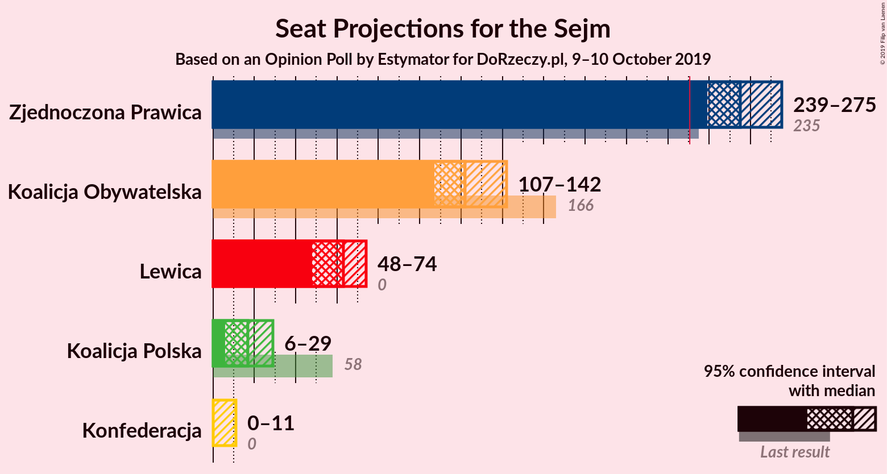
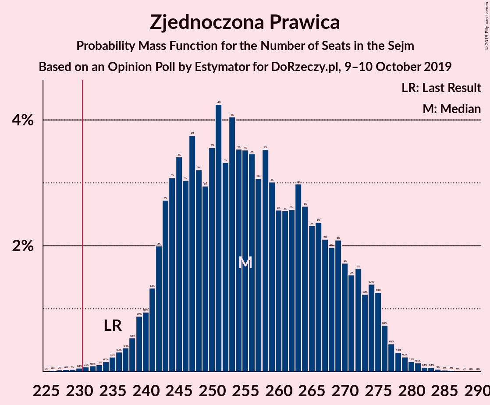
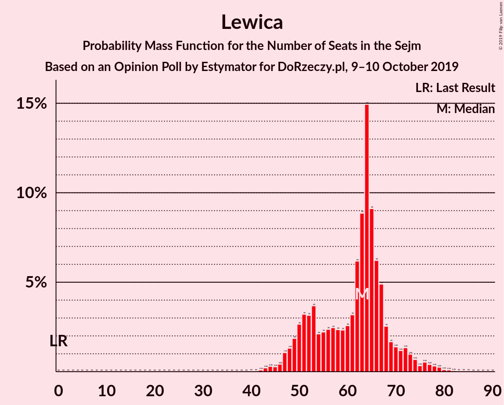

# Opinion Poll by Estymator for DoRzeczy.pl, 9–10 October 2019

<a href="#voting-intentions">Voting Intentions</a> | <a href="#seats">Seats</a> | <a href="#coalitions">Coalitions</a> | <a href="#technical-information">Technical Information</a>

## Voting Intentions

### Confidence Intervals

| Party | Last Result | Poll Result | 80% Confidence Interval | 90% Confidence Interval | 95% Confidence Interval | 99% Confidence Interval |
|:-----:|:-----------:|:-----------:|:-----------------------:|:-----------------------:|:-----------------------:|:-----------------------:|
| Zjednoczona Prawica | 37.6% | 48.2% | 46.2–50.2% |45.6–50.8% |45.1–51.3% |44.1–52.2% |
| Koalicja Obywatelska | 31.7% | 25.3% | 23.6–27.1% |23.1–27.7% |22.7–28.1% |21.9–29.0% |
| Lewica | 11.7% | 14.1% | 12.8–15.6% |12.4–16.0% |12.1–16.4% |11.5–17.1% |
| Koalicja Polska | 13.9% | 6.8% | 5.8–7.9% |5.6–8.2% |5.3–8.5% |5.0–9.1% |
| Konfederacja | 4.8% | 4.9% | 4.1–5.9% |3.9–6.1% |3.7–6.4% |3.4–6.9% |

*Note:* The poll result column reflects the actual value used in the calculations. Published results may vary slightly, and in addition be rounded to fewer digits.

## Seats

### Confidence Intervals

| Party | Last Result | Median | 80% Confidence Interval | 90% Confidence Interval | 95% Confidence Interval | 99% Confidence Interval |
|:-----:|:-----------:|:------:|:-----------------------:|:-----------------------:|:-----------------------:|:-----------------------:|
| <a href="#zjednoczona-prawica">Zjednoczona Prawica</a> | 235 | 254 | 254–264 |254–268 |254–274 |245–276 |
| <a href="#koalicja-obywatelska">Koalicja Obywatelska</a> | 166 | 125 | 110–125 |110–125 |105–125 |105–127 |
| <a href="#lewica">Lewica</a> | 0 | 63 | 62–63 |54–63 |53–69 |49–74 |
| <a href="#koalicja-polska">Koalicja Polska</a> | 58 | 16 | 16–24 |11–24 |6–27 |6–35 |
| <a href="#konfederacja">Konfederacja</a> | 0 | 2 | 0–2 |0–2 |0–7 |0–7 |

### Zjednoczona Prawica

*For a full overview of the results for this party, see the [Zjednoczona Prawica](party-zjednoczonaprawica.html) page.*

| Number of Seats | Probability | Accumulated | Special Marks |
|:---------------:|:-----------:|:-----------:|:-------------:|
| 230 | 0.1% | 100% |  |
| 231 | 0% | 99.9% | Majority |
| 232 | 0% | 99.9% |  |
| 233 | 0% | 99.9% |  |
| 234 | 0% | 99.9% |  |
| 235 | 0% | 99.9% | Last Result |
| 236 | 0% | 99.9% |  |
| 237 | 0% | 99.9% |  |
| 238 | 0% | 99.9% |  |
| 239 | 0% | 99.9% |  |
| 240 | 0.3% | 99.9% |  |
| 241 | 0% | 99.7% |  |
| 242 | 0% | 99.7% |  |
| 243 | 0% | 99.6% |  |
| 244 | 0% | 99.6% |  |
| 245 | 0.2% | 99.6% |  |
| 246 | 0% | 99.4% |  |
| 247 | 0% | 99.4% |  |
| 248 | 0% | 99.4% |  |
| 249 | 0.2% | 99.4% |  |
| 250 | 0.5% | 99.2% |  |
| 251 | 0.3% | 98.7% |  |
| 252 | 0.2% | 98% |  |
| 253 | 0% | 98% |  |
| 254 | 72% | 98% | Median |
| 255 | 5% | 26% |  |
| 256 | 0% | 21% |  |
| 257 | 0% | 21% |  |
| 258 | 0% | 21% |  |
| 259 | 3% | 21% |  |
| 260 | 0% | 18% |  |
| 261 | 0.1% | 18% |  |
| 262 | 0.1% | 18% |  |
| 263 | 0% | 18% |  |
| 264 | 9% | 18% |  |
| 265 | 3% | 9% |  |
| 266 | 0% | 6% |  |
| 267 | 0% | 6% |  |
| 268 | 3% | 6% |  |
| 269 | 0% | 3% |  |
| 270 | 0% | 3% |  |
| 271 | 0% | 3% |  |
| 272 | 0.1% | 3% |  |
| 273 | 0% | 3% |  |
| 274 | 1.1% | 3% |  |
| 275 | 0% | 2% |  |
| 276 | 2% | 2% |  |
| 277 | 0% | 0.1% |  |
| 278 | 0% | 0.1% |  |
| 279 | 0% | 0.1% |  |
| 280 | 0% | 0.1% |  |
| 281 | 0% | 0.1% |  |
| 282 | 0.1% | 0.1% |  |
| 283 | 0% | 0% |  |

### Koalicja Obywatelska

*For a full overview of the results for this party, see the [Koalicja Obywatelska](party-koalicjaobywatelska.html) page.*

| Number of Seats | Probability | Accumulated | Special Marks |
|:---------------:|:-----------:|:-----------:|:-------------:|
| 105 | 3% | 100% |  |
| 106 | 0% | 97% |  |
| 107 | 1.1% | 97% |  |
| 108 | 0.2% | 96% |  |
| 109 | 0.1% | 96% |  |
| 110 | 12% | 96% |  |
| 111 | 0% | 83% |  |
| 112 | 0% | 83% |  |
| 113 | 0% | 83% |  |
| 114 | 0% | 83% |  |
| 115 | 0% | 83% |  |
| 116 | 0% | 83% |  |
| 117 | 0% | 83% |  |
| 118 | 0% | 83% |  |
| 119 | 0% | 83% |  |
| 120 | 0% | 83% |  |
| 121 | 0.1% | 83% |  |
| 122 | 0% | 83% |  |
| 123 | 0.3% | 83% |  |
| 124 | 5% | 83% |  |
| 125 | 76% | 78% | Median |
| 126 | 1.1% | 2% |  |
| 127 | 0.3% | 0.5% |  |
| 128 | 0% | 0.2% |  |
| 129 | 0% | 0.2% |  |
| 130 | 0% | 0.2% |  |
| 131 | 0% | 0.2% |  |
| 132 | 0% | 0.2% |  |
| 133 | 0% | 0.2% |  |
| 134 | 0% | 0.2% |  |
| 135 | 0% | 0.2% |  |
| 136 | 0% | 0.2% |  |
| 137 | 0% | 0.2% |  |
| 138 | 0% | 0.2% |  |
| 139 | 0% | 0.2% |  |
| 140 | 0% | 0.2% |  |
| 141 | 0% | 0.2% |  |
| 142 | 0% | 0.1% |  |
| 143 | 0% | 0.1% |  |
| 144 | 0.1% | 0.1% |  |
| 145 | 0% | 0.1% |  |
| 146 | 0% | 0.1% |  |
| 147 | 0% | 0.1% |  |
| 148 | 0% | 0.1% |  |
| 149 | 0% | 0.1% |  |
| 150 | 0% | 0.1% |  |
| 151 | 0.1% | 0.1% |  |
| 152 | 0% | 0% |  |
| 153 | 0% | 0% |  |
| 154 | 0% | 0% |  |
| 155 | 0% | 0% |  |
| 156 | 0% | 0% |  |
| 157 | 0% | 0% |  |
| 158 | 0% | 0% |  |
| 159 | 0% | 0% |  |
| 160 | 0% | 0% |  |
| 161 | 0% | 0% |  |
| 162 | 0% | 0% |  |
| 163 | 0% | 0% |  |
| 164 | 0% | 0% |  |
| 165 | 0% | 0% |  |
| 166 | 0% | 0% | Last Result |

### Lewica

*For a full overview of the results for this party, see the [Lewica](party-lewica.html) page.*

| Number of Seats | Probability | Accumulated | Special Marks |
|:---------------:|:-----------:|:-----------:|:-------------:|
| 0 | 0% | 100% | Last Result |
| 1 | 0% | 100% |  |
| 2 | 0% | 100% |  |
| 3 | 0% | 100% |  |
| 4 | 0% | 100% |  |
| 5 | 0% | 100% |  |
| 6 | 0% | 100% |  |
| 7 | 0% | 100% |  |
| 8 | 0% | 100% |  |
| 9 | 0% | 100% |  |
| 10 | 0% | 100% |  |
| 11 | 0% | 100% |  |
| 12 | 0% | 100% |  |
| 13 | 0% | 100% |  |
| 14 | 0% | 100% |  |
| 15 | 0% | 100% |  |
| 16 | 0% | 100% |  |
| 17 | 0% | 100% |  |
| 18 | 0% | 100% |  |
| 19 | 0% | 100% |  |
| 20 | 0% | 100% |  |
| 21 | 0% | 100% |  |
| 22 | 0% | 100% |  |
| 23 | 0% | 100% |  |
| 24 | 0% | 100% |  |
| 25 | 0% | 100% |  |
| 26 | 0% | 100% |  |
| 27 | 0% | 100% |  |
| 28 | 0% | 100% |  |
| 29 | 0% | 100% |  |
| 30 | 0% | 100% |  |
| 31 | 0% | 100% |  |
| 32 | 0% | 100% |  |
| 33 | 0% | 100% |  |
| 34 | 0% | 100% |  |
| 35 | 0% | 100% |  |
| 36 | 0% | 100% |  |
| 37 | 0% | 100% |  |
| 38 | 0% | 100% |  |
| 39 | 0.1% | 100% |  |
| 40 | 0% | 99.9% |  |
| 41 | 0% | 99.9% |  |
| 42 | 0% | 99.9% |  |
| 43 | 0% | 99.9% |  |
| 44 | 0.1% | 99.9% |  |
| 45 | 0% | 99.9% |  |
| 46 | 0.1% | 99.9% |  |
| 47 | 0% | 99.8% |  |
| 48 | 0% | 99.8% |  |
| 49 | 2% | 99.8% |  |
| 50 | 0% | 98% |  |
| 51 | 0.1% | 98% |  |
| 52 | 0% | 98% |  |
| 53 | 2% | 98% |  |
| 54 | 1.1% | 96% |  |
| 55 | 0% | 95% |  |
| 56 | 0% | 95% |  |
| 57 | 0% | 95% |  |
| 58 | 0% | 95% |  |
| 59 | 0.2% | 95% |  |
| 60 | 0% | 95% |  |
| 61 | 3% | 94% |  |
| 62 | 9% | 91% |  |
| 63 | 77% | 82% | Median |
| 64 | 0% | 5% |  |
| 65 | 0.1% | 5% |  |
| 66 | 0.8% | 5% |  |
| 67 | 0% | 4% |  |
| 68 | 0.4% | 4% |  |
| 69 | 3% | 4% |  |
| 70 | 0% | 0.8% |  |
| 71 | 0% | 0.8% |  |
| 72 | 0% | 0.8% |  |
| 73 | 0% | 0.8% |  |
| 74 | 0.3% | 0.8% |  |
| 75 | 0% | 0.5% |  |
| 76 | 0% | 0.5% |  |
| 77 | 0% | 0.5% |  |
| 78 | 0% | 0.5% |  |
| 79 | 0% | 0.5% |  |
| 80 | 0.4% | 0.5% |  |
| 81 | 0% | 0% |  |

### Koalicja Polska

*For a full overview of the results for this party, see the [Koalicja Polska](party-koalicjapolska.html) page.*

| Number of Seats | Probability | Accumulated | Special Marks |
|:---------------:|:-----------:|:-----------:|:-------------:|
| 0 | 0.4% | 100% |  |
| 1 | 0% | 99.6% |  |
| 2 | 0% | 99.6% |  |
| 3 | 0% | 99.6% |  |
| 4 | 0% | 99.6% |  |
| 5 | 0% | 99.6% |  |
| 6 | 3% | 99.6% |  |
| 7 | 0% | 97% |  |
| 8 | 0.1% | 97% |  |
| 9 | 0% | 97% |  |
| 10 | 0% | 97% |  |
| 11 | 3% | 97% |  |
| 12 | 0% | 94% |  |
| 13 | 0% | 94% |  |
| 14 | 0% | 94% |  |
| 15 | 0% | 94% |  |
| 16 | 77% | 94% | Median |
| 17 | 0% | 16% |  |
| 18 | 0% | 16% |  |
| 19 | 0.1% | 16% |  |
| 20 | 0% | 16% |  |
| 21 | 0.2% | 16% |  |
| 22 | 0.3% | 16% |  |
| 23 | 0% | 16% |  |
| 24 | 12% | 16% |  |
| 25 | 0% | 3% |  |
| 26 | 0.1% | 3% |  |
| 27 | 2% | 3% |  |
| 28 | 0% | 1.0% |  |
| 29 | 0% | 1.0% |  |
| 30 | 0% | 1.0% |  |
| 31 | 0% | 1.0% |  |
| 32 | 0% | 1.0% |  |
| 33 | 0% | 1.0% |  |
| 34 | 0% | 1.0% |  |
| 35 | 0.7% | 1.0% |  |
| 36 | 0% | 0.3% |  |
| 37 | 0.3% | 0.3% |  |
| 38 | 0% | 0% |  |
| 39 | 0% | 0% |  |
| 40 | 0% | 0% |  |
| 41 | 0% | 0% |  |
| 42 | 0% | 0% |  |
| 43 | 0% | 0% |  |
| 44 | 0% | 0% |  |
| 45 | 0% | 0% |  |
| 46 | 0% | 0% |  |
| 47 | 0% | 0% |  |
| 48 | 0% | 0% |  |
| 49 | 0% | 0% |  |
| 50 | 0% | 0% |  |
| 51 | 0% | 0% |  |
| 52 | 0% | 0% |  |
| 53 | 0% | 0% |  |
| 54 | 0% | 0% |  |
| 55 | 0% | 0% |  |
| 56 | 0% | 0% |  |
| 57 | 0% | 0% |  |
| 58 | 0% | 0% | Last Result |

### Konfederacja

*For a full overview of the results for this party, see the [Konfederacja](party-konfederacja.html) page.*

| Number of Seats | Probability | Accumulated | Special Marks |
|:---------------:|:-----------:|:-----------:|:-------------:|
| 0 | 19% | 100% | Last Result |
| 1 | 0% | 81% |  |
| 2 | 78% | 81% | Median |
| 3 | 0% | 3% |  |
| 4 | 0.1% | 3% |  |
| 5 | 0.1% | 3% |  |
| 6 | 0% | 3% |  |
| 7 | 3% | 3% |  |
| 8 | 0.1% | 0.3% |  |
| 9 | 0% | 0.1% |  |
| 10 | 0% | 0.1% |  |
| 11 | 0% | 0.1% |  |
| 12 | 0% | 0.1% |  |
| 13 | 0% | 0.1% |  |
| 14 | 0% | 0.1% |  |
| 15 | 0.1% | 0.1% |  |
| 16 | 0% | 0% |  |

## Coalitions

### Confidence Intervals

| Coalition | Last Result | Median | Majority? | 80% Confidence Interval | 90% Confidence Interval | 95% Confidence Interval | 99% Confidence Interval |
|:---------:|:-----------:|:------:|:---------:|:-----------------------:|:-----------------------:|:-----------------------:|:-----------------------:|
| Zjednoczona Prawica | 235 | 254 | 99.9% | 254–264 | 254–268 | 254–274 | 245–276 |
| Koalicja Obywatelska – Lewica – Koalicja Polska | 224 | 204 | 0% | 196–204 | 186–204 | 185–204 | 184–215 |
| Koalicja Obywatelska – Lewica | 166 | 188 | 0% | 172–188 | 172–188 | 171–188 | 171–191 |
| Koalicja Obywatelska – Koalicja Polska | 224 | 141 | 0% | 134–141 | 131–141 | 116–152 | 116–152 |
| Koalicja Obywatelska | 166 | 125 | 0% | 110–125 | 110–125 | 105–125 | 105–127 |

### Zjednoczona Prawica

| Number of Seats | Probability | Accumulated | Special Marks |
|:---------------:|:-----------:|:-----------:|:-------------:|
| 230 | 0.1% | 100% |  |
| 231 | 0% | 99.9% | Majority |
| 232 | 0% | 99.9% |  |
| 233 | 0% | 99.9% |  |
| 234 | 0% | 99.9% |  |
| 235 | 0% | 99.9% | Last Result |
| 236 | 0% | 99.9% |  |
| 237 | 0% | 99.9% |  |
| 238 | 0% | 99.9% |  |
| 239 | 0% | 99.9% |  |
| 240 | 0.3% | 99.9% |  |
| 241 | 0% | 99.7% |  |
| 242 | 0% | 99.7% |  |
| 243 | 0% | 99.6% |  |
| 244 | 0% | 99.6% |  |
| 245 | 0.2% | 99.6% |  |
| 246 | 0% | 99.4% |  |
| 247 | 0% | 99.4% |  |
| 248 | 0% | 99.4% |  |
| 249 | 0.2% | 99.4% |  |
| 250 | 0.5% | 99.2% |  |
| 251 | 0.3% | 98.7% |  |
| 252 | 0.2% | 98% |  |
| 253 | 0% | 98% |  |
| 254 | 72% | 98% | Median |
| 255 | 5% | 26% |  |
| 256 | 0% | 21% |  |
| 257 | 0% | 21% |  |
| 258 | 0% | 21% |  |
| 259 | 3% | 21% |  |
| 260 | 0% | 18% |  |
| 261 | 0.1% | 18% |  |
| 262 | 0.1% | 18% |  |
| 263 | 0% | 18% |  |
| 264 | 9% | 18% |  |
| 265 | 3% | 9% |  |
| 266 | 0% | 6% |  |
| 267 | 0% | 6% |  |
| 268 | 3% | 6% |  |
| 269 | 0% | 3% |  |
| 270 | 0% | 3% |  |
| 271 | 0% | 3% |  |
| 272 | 0.1% | 3% |  |
| 273 | 0% | 3% |  |
| 274 | 1.1% | 3% |  |
| 275 | 0% | 2% |  |
| 276 | 2% | 2% |  |
| 277 | 0% | 0.1% |  |
| 278 | 0% | 0.1% |  |
| 279 | 0% | 0.1% |  |
| 280 | 0% | 0.1% |  |
| 281 | 0% | 0.1% |  |
| 282 | 0.1% | 0.1% |  |
| 283 | 0% | 0% |  |

### Koalicja Obywatelska – Lewica – Koalicja Polska

| Number of Seats | Probability | Accumulated | Special Marks |
|:---------------:|:-----------:|:-----------:|:-------------:|
| 174 | 0.1% | 100% |  |
| 175 | 0% | 99.9% |  |
| 176 | 0% | 99.9% |  |
| 177 | 0% | 99.9% |  |
| 178 | 0% | 99.9% |  |
| 179 | 0% | 99.9% |  |
| 180 | 0% | 99.9% |  |
| 181 | 0% | 99.9% |  |
| 182 | 0% | 99.9% |  |
| 183 | 0.1% | 99.9% |  |
| 184 | 2% | 99.8% |  |
| 185 | 3% | 98% |  |
| 186 | 1.1% | 95% |  |
| 187 | 0% | 94% |  |
| 188 | 0% | 94% |  |
| 189 | 0% | 94% |  |
| 190 | 0% | 94% |  |
| 191 | 0% | 94% |  |
| 192 | 0% | 94% |  |
| 193 | 0% | 94% |  |
| 194 | 0% | 94% |  |
| 195 | 3% | 94% |  |
| 196 | 9% | 91% |  |
| 197 | 0% | 82% |  |
| 198 | 0.1% | 82% |  |
| 199 | 0% | 82% |  |
| 200 | 0% | 82% |  |
| 201 | 3% | 82% |  |
| 202 | 0% | 79% |  |
| 203 | 5% | 79% |  |
| 204 | 72% | 74% | Median |
| 205 | 0% | 2% |  |
| 206 | 0% | 2% |  |
| 207 | 0% | 2% |  |
| 208 | 0.7% | 2% |  |
| 209 | 0.5% | 1.1% |  |
| 210 | 0% | 0.7% |  |
| 211 | 0% | 0.6% |  |
| 212 | 0% | 0.6% |  |
| 213 | 0% | 0.6% |  |
| 214 | 0% | 0.6% |  |
| 215 | 0.2% | 0.6% |  |
| 216 | 0% | 0.4% |  |
| 217 | 0% | 0.4% |  |
| 218 | 0% | 0.4% |  |
| 219 | 0% | 0.3% |  |
| 220 | 0.3% | 0.3% |  |
| 221 | 0% | 0.1% |  |
| 222 | 0% | 0.1% |  |
| 223 | 0% | 0.1% |  |
| 224 | 0% | 0.1% | Last Result |
| 225 | 0.1% | 0.1% |  |
| 226 | 0% | 0% |  |

### Koalicja Obywatelska – Lewica

| Number of Seats | Probability | Accumulated | Special Marks |
|:---------------:|:-----------:|:-----------:|:-------------:|
| 156 | 0% | 100% |  |
| 157 | 0% | 99.9% |  |
| 158 | 0.1% | 99.9% |  |
| 159 | 0% | 99.9% |  |
| 160 | 0% | 99.9% |  |
| 161 | 0% | 99.9% |  |
| 162 | 0% | 99.9% |  |
| 163 | 0% | 99.9% |  |
| 164 | 0.1% | 99.9% |  |
| 165 | 0% | 99.8% |  |
| 166 | 0% | 99.8% | Last Result |
| 167 | 0% | 99.8% |  |
| 168 | 0% | 99.8% |  |
| 169 | 0% | 99.8% |  |
| 170 | 0% | 99.8% |  |
| 171 | 3% | 99.8% |  |
| 172 | 9% | 97% |  |
| 173 | 0.7% | 88% |  |
| 174 | 5% | 87% |  |
| 175 | 0% | 82% |  |
| 176 | 0% | 82% |  |
| 177 | 0% | 82% |  |
| 178 | 2% | 82% |  |
| 179 | 0% | 80% |  |
| 180 | 1.1% | 80% |  |
| 181 | 0% | 79% |  |
| 182 | 0% | 79% |  |
| 183 | 0.3% | 79% |  |
| 184 | 0% | 79% |  |
| 185 | 0% | 79% |  |
| 186 | 0% | 79% |  |
| 187 | 6% | 79% |  |
| 188 | 72% | 73% | Median |
| 189 | 0% | 0.7% |  |
| 190 | 0% | 0.7% |  |
| 191 | 0.2% | 0.7% |  |
| 192 | 0% | 0.5% |  |
| 193 | 0% | 0.5% |  |
| 194 | 0% | 0.5% |  |
| 195 | 0% | 0.5% |  |
| 196 | 0% | 0.5% |  |
| 197 | 0% | 0.5% |  |
| 198 | 0% | 0.5% |  |
| 199 | 0% | 0.5% |  |
| 200 | 0% | 0.5% |  |
| 201 | 0.3% | 0.5% |  |
| 202 | 0% | 0.1% |  |
| 203 | 0% | 0.1% |  |
| 204 | 0.1% | 0.1% |  |
| 205 | 0% | 0.1% |  |
| 206 | 0% | 0.1% |  |
| 207 | 0% | 0% |  |

### Koalicja Obywatelska – Koalicja Polska

| Number of Seats | Probability | Accumulated | Special Marks |
|:---------------:|:-----------:|:-----------:|:-------------:|
| 109 | 0.1% | 100% |  |
| 110 | 0% | 99.9% |  |
| 111 | 0% | 99.9% |  |
| 112 | 0% | 99.9% |  |
| 113 | 0% | 99.9% |  |
| 114 | 0% | 99.9% |  |
| 115 | 0% | 99.9% |  |
| 116 | 3% | 99.9% |  |
| 117 | 0% | 97% |  |
| 118 | 0% | 97% |  |
| 119 | 0% | 97% |  |
| 120 | 0% | 97% |  |
| 121 | 0% | 97% |  |
| 122 | 0% | 97% |  |
| 123 | 0% | 97% |  |
| 124 | 0% | 97% |  |
| 125 | 0% | 97% |  |
| 126 | 0% | 97% |  |
| 127 | 0.3% | 97% |  |
| 128 | 0.1% | 96% |  |
| 129 | 0.3% | 96% |  |
| 130 | 0% | 96% |  |
| 131 | 2% | 96% |  |
| 132 | 1.2% | 94% |  |
| 133 | 0.1% | 93% |  |
| 134 | 12% | 93% |  |
| 135 | 0% | 81% |  |
| 136 | 0% | 81% |  |
| 137 | 0% | 81% |  |
| 138 | 0% | 81% |  |
| 139 | 0% | 81% |  |
| 140 | 5% | 81% |  |
| 141 | 72% | 76% | Median |
| 142 | 0.5% | 4% |  |
| 143 | 0.2% | 3% |  |
| 144 | 0.1% | 3% |  |
| 145 | 0% | 3% |  |
| 146 | 0% | 3% |  |
| 147 | 0.3% | 3% |  |
| 148 | 0% | 3% |  |
| 149 | 0% | 3% |  |
| 150 | 0% | 3% |  |
| 151 | 0% | 3% |  |
| 152 | 2% | 3% |  |
| 153 | 0% | 0.4% |  |
| 154 | 0% | 0.4% |  |
| 155 | 0% | 0.4% |  |
| 156 | 0% | 0.4% |  |
| 157 | 0% | 0.4% |  |
| 158 | 0% | 0.4% |  |
| 159 | 0% | 0.4% |  |
| 160 | 0% | 0.4% |  |
| 161 | 0.2% | 0.3% |  |
| 162 | 0% | 0.1% |  |
| 163 | 0% | 0.1% |  |
| 164 | 0% | 0.1% |  |
| 165 | 0% | 0.1% |  |
| 166 | 0% | 0.1% |  |
| 167 | 0% | 0.1% |  |
| 168 | 0% | 0.1% |  |
| 169 | 0% | 0.1% |  |
| 170 | 0% | 0.1% |  |
| 171 | 0% | 0.1% |  |
| 172 | 0.1% | 0.1% |  |
| 173 | 0% | 0% |  |
| 174 | 0% | 0% |  |
| 175 | 0% | 0% |  |
| 176 | 0% | 0% |  |
| 177 | 0% | 0% |  |
| 178 | 0% | 0% |  |
| 179 | 0% | 0% |  |
| 180 | 0% | 0% |  |
| 181 | 0% | 0% |  |
| 182 | 0% | 0% |  |
| 183 | 0% | 0% |  |
| 184 | 0% | 0% |  |
| 185 | 0% | 0% |  |
| 186 | 0% | 0% |  |
| 187 | 0% | 0% |  |
| 188 | 0% | 0% |  |
| 189 | 0% | 0% |  |
| 190 | 0% | 0% |  |
| 191 | 0% | 0% |  |
| 192 | 0% | 0% |  |
| 193 | 0% | 0% |  |
| 194 | 0% | 0% |  |
| 195 | 0% | 0% |  |
| 196 | 0% | 0% |  |
| 197 | 0% | 0% |  |
| 198 | 0% | 0% |  |
| 199 | 0% | 0% |  |
| 200 | 0% | 0% |  |
| 201 | 0% | 0% |  |
| 202 | 0% | 0% |  |
| 203 | 0% | 0% |  |
| 204 | 0% | 0% |  |
| 205 | 0% | 0% |  |
| 206 | 0% | 0% |  |
| 207 | 0% | 0% |  |
| 208 | 0% | 0% |  |
| 209 | 0% | 0% |  |
| 210 | 0% | 0% |  |
| 211 | 0% | 0% |  |
| 212 | 0% | 0% |  |
| 213 | 0% | 0% |  |
| 214 | 0% | 0% |  |
| 215 | 0% | 0% |  |
| 216 | 0% | 0% |  |
| 217 | 0% | 0% |  |
| 218 | 0% | 0% |  |
| 219 | 0% | 0% |  |
| 220 | 0% | 0% |  |
| 221 | 0% | 0% |  |
| 222 | 0% | 0% |  |
| 223 | 0% | 0% |  |
| 224 | 0% | 0% | Last Result |

### Koalicja Obywatelska

| Number of Seats | Probability | Accumulated | Special Marks |
|:---------------:|:-----------:|:-----------:|:-------------:|
| 105 | 3% | 100% |  |
| 106 | 0% | 97% |  |
| 107 | 1.1% | 97% |  |
| 108 | 0.2% | 96% |  |
| 109 | 0.1% | 96% |  |
| 110 | 12% | 96% |  |
| 111 | 0% | 83% |  |
| 112 | 0% | 83% |  |
| 113 | 0% | 83% |  |
| 114 | 0% | 83% |  |
| 115 | 0% | 83% |  |
| 116 | 0% | 83% |  |
| 117 | 0% | 83% |  |
| 118 | 0% | 83% |  |
| 119 | 0% | 83% |  |
| 120 | 0% | 83% |  |
| 121 | 0.1% | 83% |  |
| 122 | 0% | 83% |  |
| 123 | 0.3% | 83% |  |
| 124 | 5% | 83% |  |
| 125 | 76% | 78% | Median |
| 126 | 1.1% | 2% |  |
| 127 | 0.3% | 0.5% |  |
| 128 | 0% | 0.2% |  |
| 129 | 0% | 0.2% |  |
| 130 | 0% | 0.2% |  |
| 131 | 0% | 0.2% |  |
| 132 | 0% | 0.2% |  |
| 133 | 0% | 0.2% |  |
| 134 | 0% | 0.2% |  |
| 135 | 0% | 0.2% |  |
| 136 | 0% | 0.2% |  |
| 137 | 0% | 0.2% |  |
| 138 | 0% | 0.2% |  |
| 139 | 0% | 0.2% |  |
| 140 | 0% | 0.2% |  |
| 141 | 0% | 0.2% |  |
| 142 | 0% | 0.1% |  |
| 143 | 0% | 0.1% |  |
| 144 | 0.1% | 0.1% |  |
| 145 | 0% | 0.1% |  |
| 146 | 0% | 0.1% |  |
| 147 | 0% | 0.1% |  |
| 148 | 0% | 0.1% |  |
| 149 | 0% | 0.1% |  |
| 150 | 0% | 0.1% |  |
| 151 | 0.1% | 0.1% |  |
| 152 | 0% | 0% |  |
| 153 | 0% | 0% |  |
| 154 | 0% | 0% |  |
| 155 | 0% | 0% |  |
| 156 | 0% | 0% |  |
| 157 | 0% | 0% |  |
| 158 | 0% | 0% |  |
| 159 | 0% | 0% |  |
| 160 | 0% | 0% |  |
| 161 | 0% | 0% |  |
| 162 | 0% | 0% |  |
| 163 | 0% | 0% |  |
| 164 | 0% | 0% |  |
| 165 | 0% | 0% |  |
| 166 | 0% | 0% | Last Result |

## Technical Information

### Opinion Poll

+ **Polling firm:** Estymator
+ **Commissioner(s):** DoRzeczy.pl
+ **Fieldwork period:** 9–10 October 2019

### Calculations

+ **Sample size:** 1007
+ **Simulations done:** 1,024
+ **Error estimate:** 2.44%

