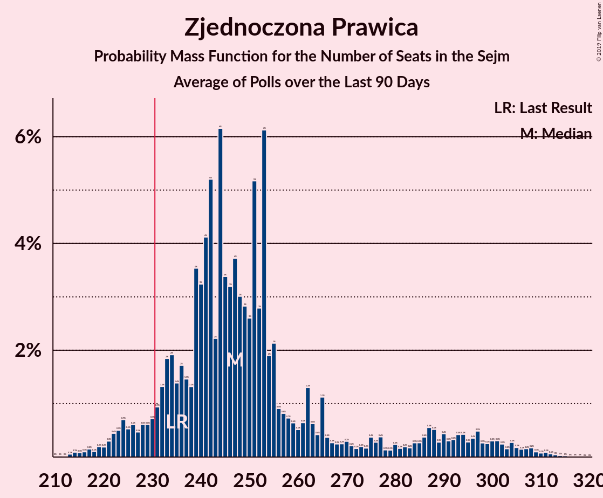
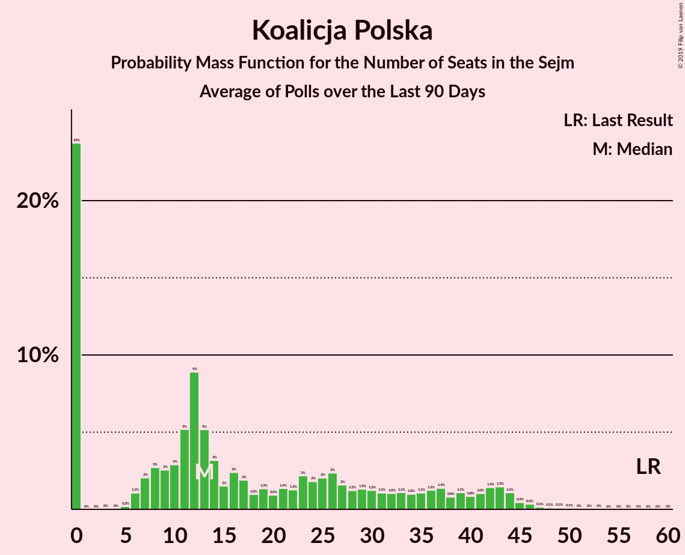
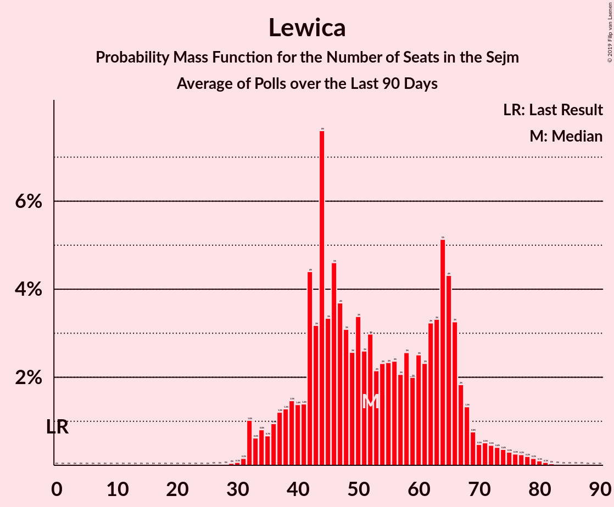
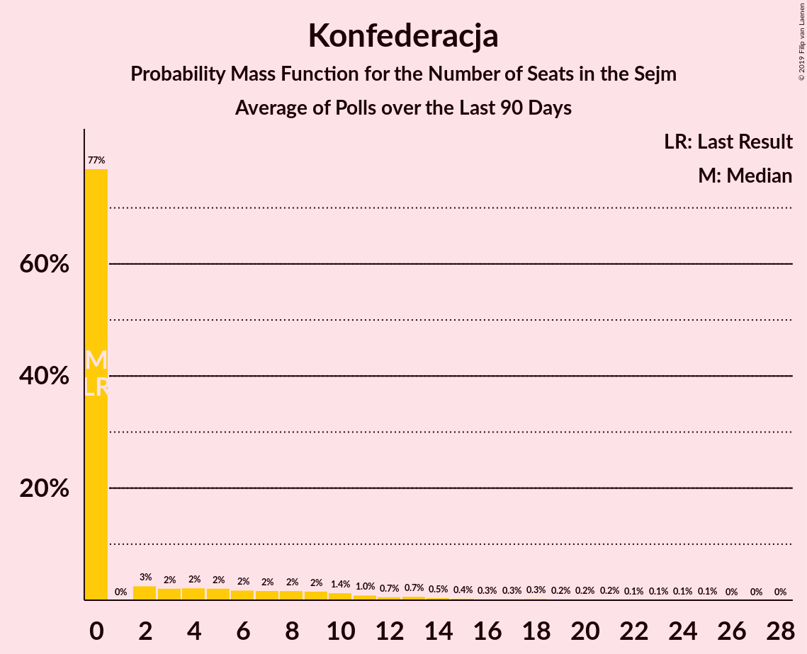
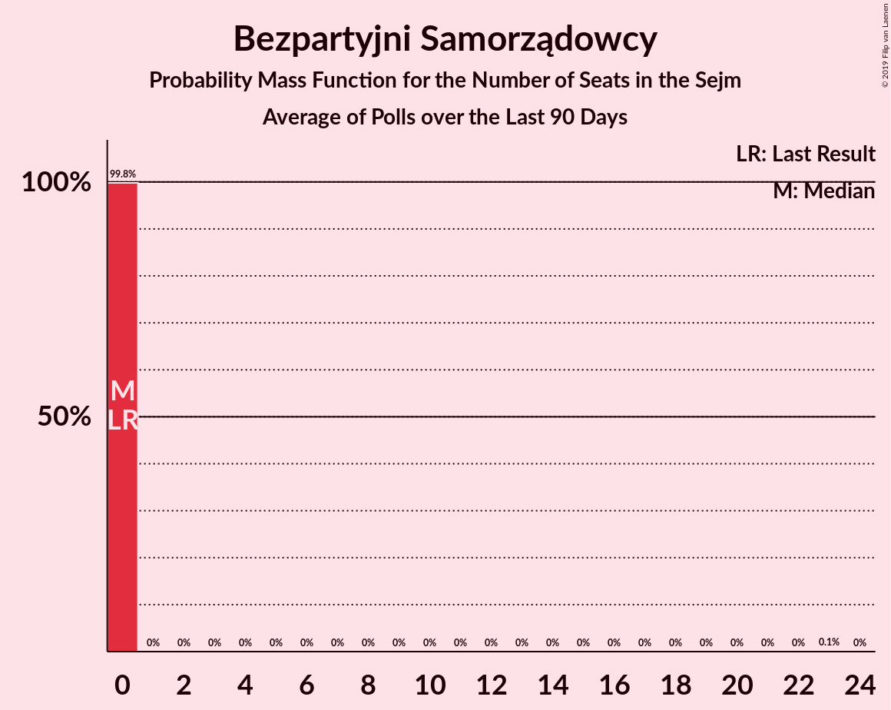
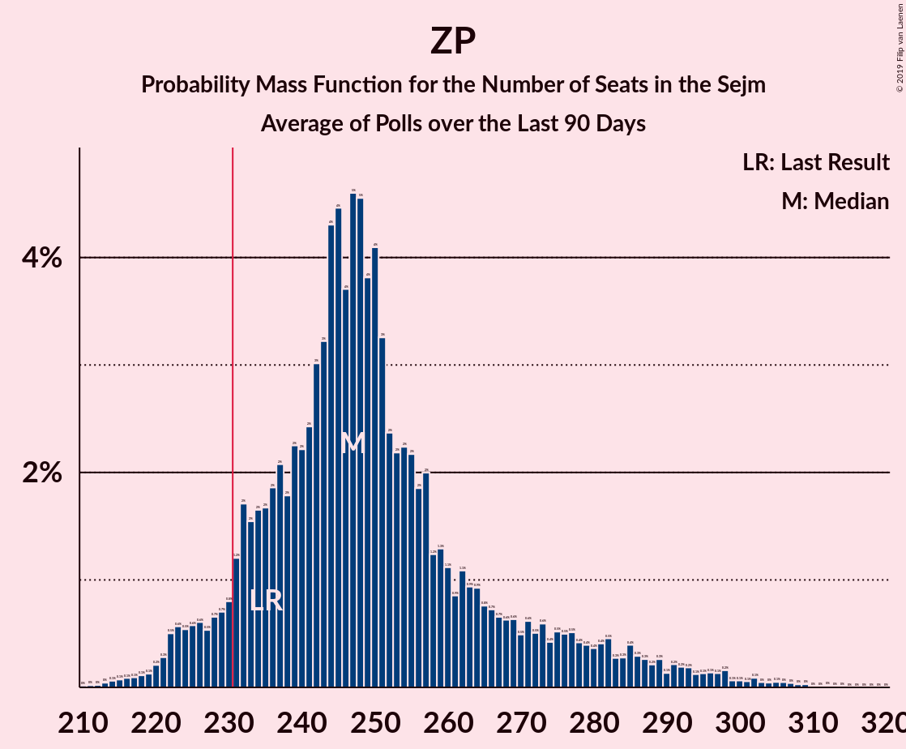
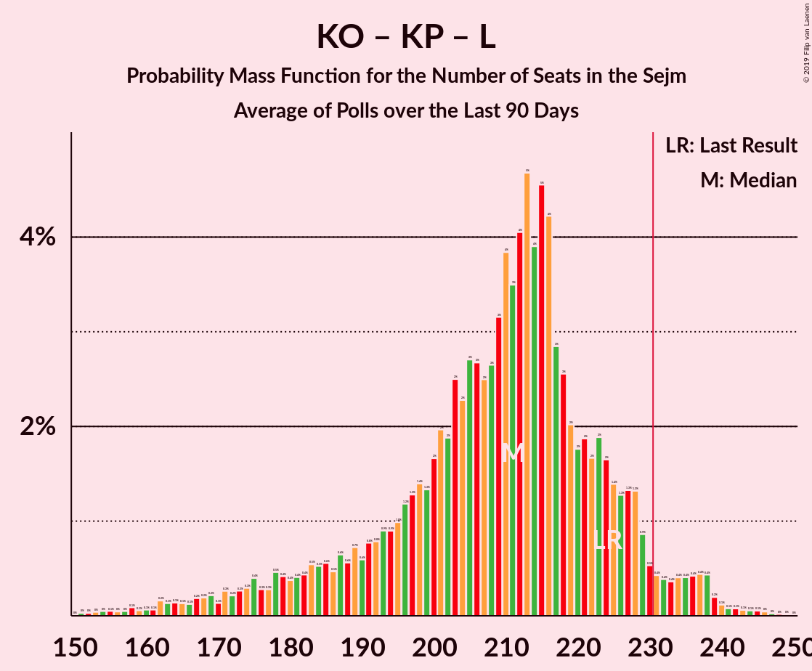
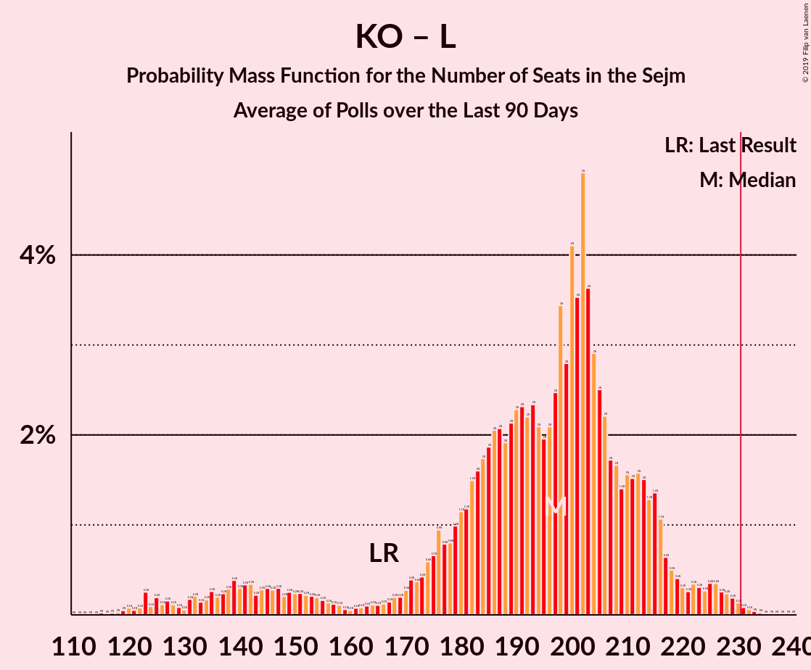
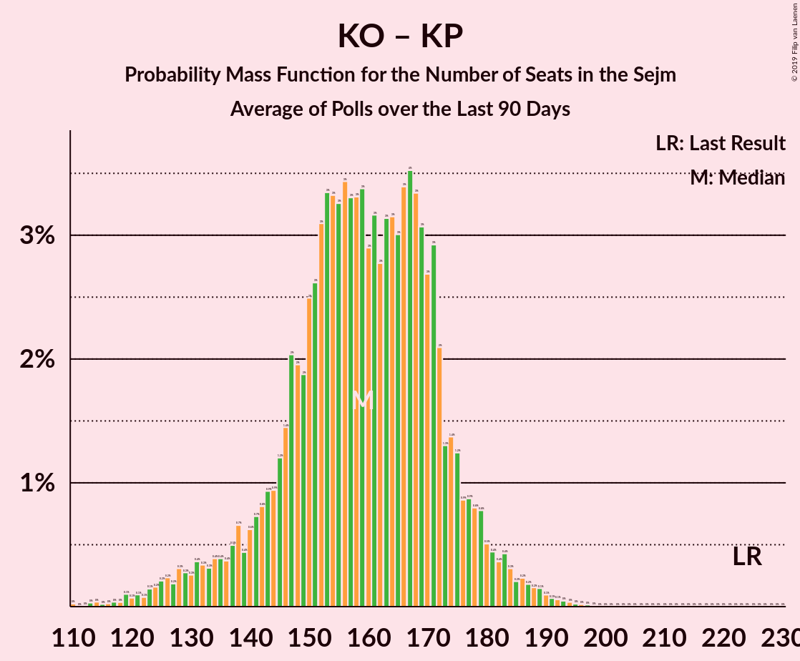

# Poll Average

<a href="#voting-intentions">Voting Intentions</a> | <a href="#seats">Seats</a> | <a href="#coalitions">Coalitions</a> | <a href="#technical-information">Technical Information</a>

## Summary

The table below lists the polls on which the average is based. They are the most recent polls (less than 90 days old) registered and analyzed so far.

| Period     | Polling firm/Commissioner(s) | PiS | ZP | KO | PO | KP | K | .N | PSL | SLD | W | Konf | R | Wi | MN | L | BS |
|:----------:|:----------------------------:|:--:|:--:|:--:|:--:|:--:|:--:|:--:|:--:|:--:|:--:|:--:|:--:|:--:|:--:|:--:|:--:|
| 25 October 2015 | General Election | 37.6%   235 | 37.6%   235 | 31.7%   166 | 24.1%   138 | 13.9%   58 | 8.8%   42 | 7.6%   28 | 5.1%   16 | 7.6%   0 | 4.8%   0 | 4.8%   0 | 3.6%   0 | 0.0%   0 | 0.2%   1 | 11.7%   0 | 0.1%   0 |
| N/A | Poll Average | N/A   N/A | 38–48%   223–271 | 22–32%   115–166 | N/A   N/A | 4–11%   0–43 | N/A   N/A | N/A   N/A | N/A   N/A | N/A   N/A | N/A   N/A | 2–7%   0–16 | N/A   N/A | N/A   N/A | N/A   N/A | 9–15%   37–73 | 0–3%   0 |
| [17–19 September 2019](2019-09-19-Estymator.html) | Estymator   DoRzeczy.pl | N/A   N/A | N/A   N/A | N/A   N/A | N/A   N/A | N/A   N/A | N/A   N/A | N/A   N/A | N/A   N/A | N/A   N/A | N/A   N/A | N/A   N/A | N/A   N/A | N/A   N/A | N/A   N/A | N/A   N/A | N/A   N/A |
| [12–19 September 2019](2019-09-19-CBOS.html) | CBOS | N/A   N/A | N/A   N/A | N/A   N/A | N/A   N/A | N/A   N/A | N/A   N/A | N/A   N/A | N/A   N/A | N/A   N/A | N/A   N/A | N/A   N/A | N/A   N/A | N/A   N/A | N/A   N/A | N/A   N/A | N/A   N/A |
| [13–17 September 2019](2019-09-17-KantarMillwardBrown.html) | Kantar Millward Brown   Gazeta Wyborcza | N/A   N/A | N/A   N/A | N/A   N/A | N/A   N/A | N/A   N/A | N/A   N/A | N/A   N/A | N/A   N/A | N/A   N/A | N/A   N/A | N/A   N/A | N/A   N/A | N/A   N/A | N/A   N/A | N/A   N/A | N/A   N/A |
| [12–14 September 2019](2019-09-14-IBSP.html) | IBSP | N/A   N/A | 43–49%   226–260 | 28–34%   140–171 | N/A   N/A | 3–6%   0–9 | N/A   N/A | N/A   N/A | N/A   N/A | N/A   N/A | N/A   N/A | 5–8%   0–24 | N/A   N/A | N/A   N/A | N/A   N/A | 10–14%   38–64 | N/A   N/A |
| [12–13 September 2019](2019-09-13-InstytutBadańPollster.html) | Instytut Badań Pollster   Super Express | N/A   N/A | 42–48%   222–258 | 23–29%   113–146 | N/A   N/A | 7–10%   15–41 | N/A   N/A | N/A   N/A | N/A   N/A | N/A   N/A | N/A   N/A | 4–6%   0–12 | N/A   N/A | N/A   N/A | N/A   N/A | 12–16%   47–73 | N/A   N/A |
| [6–11 September 2019](2019-09-11-SocialChanges.html) | Social Changes   wpolityce.pl | N/A   N/A | 43–49%   219–253 | 24–29%   112–144 | N/A   N/A | 8–12%   26–47 | N/A   N/A | N/A   N/A | N/A   N/A | N/A   N/A | N/A   N/A | 3–6%   0–4 | N/A   N/A | N/A   N/A | N/A   N/A | 12–16%   45–68 | N/A   N/A |
| [6–11 September 2019](2019-09-11-KantarPublic.html) | Kantar Public   TVN | N/A   N/A | 37–43%   228–269 | 21–27%   121–156 | N/A   N/A | 5–8%   0–33 | N/A   N/A | N/A   N/A | N/A   N/A | N/A   N/A | N/A   N/A | 1–3%   0 | N/A   N/A | N/A   N/A | N/A   N/A | 9–13%   40–66 | N/A   N/A |
| [6–7 September 2019](2019-09-07-IBRiS.html) | IBRiS   Rzeczpospolita | N/A   N/A | 39–45%   237–276 | 20–25%   109–145 | N/A   N/A | 4–7%   0–26 | N/A   N/A | N/A   N/A | N/A   N/A | N/A   N/A | N/A   N/A | 2–5%   0 | N/A   N/A | N/A   N/A | N/A   N/A | 11–15%   51–79 | 0–1%   0 |
| [23–29 August 2019](2019-08-29-DobraOpinia.html) | Dobra Opinia   PPG | N/A   N/A | 44–46%   244–253 | 29–31%   151–159 | N/A   N/A | 5–7%   8–14 | N/A   N/A | N/A   N/A | N/A   N/A | N/A   N/A | N/A   N/A | 4%   0 | N/A   N/A | N/A   N/A | N/A   N/A | 10–12%   42–48 | 2–3%   0 |
| [26–28 August 2019](2019-08-28-Ipsos.html) | Ipsos   OKO | N/A   N/A | 38–44%   219–254 | 25–31%   138–168 | N/A   N/A | 4–7%   0–18 | N/A   N/A | N/A   N/A | N/A   N/A | N/A   N/A | N/A   N/A | 4–7%   0–15 | N/A   N/A | N/A   N/A | N/A   N/A | 11–15%   47–75 | 1–3%   0 |
| [24–26 August 2019](2019-08-26-CBMIndicator.html) | CBM Indicator   TVP | N/A   N/A | 38–44%   222–258 | 26–31%   142–174 | N/A   N/A | 4–7%   0–26 | N/A   N/A | N/A   N/A | N/A   N/A | N/A   N/A | N/A   N/A | 2–4%   0 | N/A   N/A | N/A   N/A | N/A   N/A | 9–13%   38–65 | N/A   N/A |
| [16–20 August 2019](2019-08-20-Ariadna.html) | Ariadna | N/A   N/A | 42–48%   242–277 | 24–30%   129–161 | N/A   N/A | 5–8%   0–27 | N/A   N/A | N/A   N/A | N/A   N/A | N/A   N/A | N/A   N/A | 3–5%   0–5 | N/A   N/A | N/A   N/A | N/A   N/A | 8–12%   32–52 | N/A   N/A |
| 25 October 2015 | General Election | 37.6%   235 | 37.6%   235 | 31.7%   166 | 24.1%   138 | 13.9%   58 | 8.8%   42 | 7.6%   28 | 5.1%   16 | 7.6%   0 | 4.8%   0 | 4.8%   0 | 3.6%   0 | 0.0%   0 | 0.2%   1 | 11.7%   0 | 0.1%   0 |

Only polls for which at least the sample size has been published are included in the table above.

**Legend:**
+ **Top half of each row:** Voting intentions (95% confidence interval)
+ **Bottom half of each row:** Seat projections for the Sejm (95% confidence interval)
+ **PiS:** Prawo i Sprawiedliwość
+ **ZP:** Zjednoczona Prawica
+ **KO:** Koalicja Obywatelska
+ **PO:** Platforma Obywatelska
+ **KP:** Koalicja Polska
+ **K:** Kukiz’15
+ **.N:** .Nowoczesna
+ **PSL:** Polskie Stronnictwo Ludowe
+ **SLD:** Sojusz Lewicy Demokratycznej
+ **W:** KORWiN
+ **Konf:** Konfederacja
+ **R:** Lewica Razem
+ **Wi:** Wiosna
+ **MN:** Mniejszość Niemiecka
+ **L:** Lewica
+ **BS:** Bezpartyjni Samorządowcy
+ **N/A (single party):** Party not included the published results
+ **N/A (entire row):** Calculation for this opinion poll not started yet

## Voting Intentions

### Confidence Intervals

| Party | Last Result | Median | 80% Confidence Interval | 90% Confidence Interval | 95% Confidence Interval | 99% Confidence Interval |
|:-----:|:-----------:|:------:|:-----------------------:|:-----------------------:|:-----------------------:|:-----------------------:|
| <a href="#prawo-i-sprawiedliwość">Prawo i Sprawiedliwość</a> | 37.6% | N/A | N/A |N/A | N/A | N/A |
| <a href="#zjednoczona-prawica">Zjednoczona Prawica</a> | 37.6% | 43.9% | 39.8–46.5% |39.0–47.2% | 38.4–47.8% | 37.2–48.9% |
| <a href="#koalicja-obywatelska">Koalicja Obywatelska</a> | 31.7% | 27.2% | 23.1–30.5% |22.2–31.3% | 21.6–32.0% | 20.5–33.4% |
| <a href="#platforma-obywatelska">Platforma Obywatelska</a> | 24.1% | N/A | N/A |N/A | N/A | N/A |
| <a href="#koalicja-polska">Koalicja Polska</a> | 13.9% | 6.0% | 4.4–9.1% |4.0–10.0% | 3.7–10.6% | 3.2–11.5% |
| <a href="#lewica">Lewica</a> | 11.7% | 12.2% | 10.2–14.5% |9.7–15.0% | 9.3–15.4% | 8.5–16.3% |
| <a href="#kukiz’15">Kukiz’15</a> | 8.8% | N/A | N/A |N/A | N/A | N/A |
| <a href="#.nowoczesna">.Nowoczesna</a> | 7.6% | N/A | N/A |N/A | N/A | N/A |
| <a href="#sojusz-lewicy-demokratycznej">Sojusz Lewicy Demokratycznej</a> | 7.6% | N/A | N/A |N/A | N/A | N/A |
| <a href="#polskie-stronnictwo-ludowe">Polskie Stronnictwo Ludowe</a> | 5.1% | N/A | N/A |N/A | N/A | N/A |
| <a href="#korwin">KORWiN</a> | 4.8% | N/A | N/A |N/A | N/A | N/A |
| <a href="#konfederacja">Konfederacja</a> | 4.8% | 4.1% | 2.5–6.0% |2.0–6.6% | 1.8–7.0% | 1.4–7.8% |
| <a href="#lewica-razem">Lewica Razem</a> | 3.6% | N/A | N/A |N/A | N/A | N/A |
| <a href="#mniejszość-niemiecka">Mniejszość Niemiecka</a> | 0.2% | N/A | N/A |N/A | N/A | N/A |
| <a href="#bezpartyjni-samorządowcy">Bezpartyjni Samorządowcy</a> | 0.1% | 2.0% | 0.5–2.7% |0.4–2.8% | 0.4–2.9% | 0.3–3.2% |
| <a href="#wiosna">Wiosna</a> | 0.0% | N/A | N/A |N/A | N/A | N/A |

### Zjednoczona Prawica

*For a full overview of the results for this party, see the [Zjednoczona Prawica](party-zjednoczonaprawica.html) page.*

| Voting Intentions | Probability | Accumulated | Special Marks |
|:-----------------:|:-----------:|:-----------:|:-------------:|
| 34.5–35.5% | 0% | 100% |  |
| 35.5–36.5% | 0.2% | 100% |  |
| 36.5–37.5% | 0.7% | 99.8% |  |
| 37.5–38.5% | 2% | 99.1% | Last Result |
| 38.5–39.5% | 5% | 97% |  |
| 39.5–40.5% | 8% | 92% |  |
| 40.5–41.5% | 10% | 84% |  |
| 41.5–42.5% | 10% | 74% |  |
| 42.5–43.5% | 10% | 64% |  |
| 43.5–44.5% | 13% | 54% | Median |
| 44.5–45.5% | 19% | 41% |  |
| 45.5–46.5% | 12% | 22% |  |
| 46.5–47.5% | 6% | 10% |  |
| 47.5–48.5% | 3% | 3% |  |
| 48.5–49.5% | 0.7% | 0.9% |  |
| 49.5–50.5% | 0.1% | 0.2% |  |
| 50.5–51.5% | 0% | 0% |  |

### Koalicja Obywatelska

*For a full overview of the results for this party, see the [Koalicja Obywatelska](party-koalicjaobywatelska.html) page.*

| Voting Intentions | Probability | Accumulated | Special Marks |
|:-----------------:|:-----------:|:-----------:|:-------------:|
| 17.5–18.5% | 0% | 100% |  |
| 18.5–19.5% | 0.1% | 100% |  |
| 19.5–20.5% | 0.5% | 99.9% |  |
| 20.5–21.5% | 2% | 99.5% |  |
| 21.5–22.5% | 4% | 98% |  |
| 22.5–23.5% | 6% | 93% |  |
| 23.5–24.5% | 7% | 87% |  |
| 24.5–25.5% | 9% | 80% |  |
| 25.5–26.5% | 12% | 71% |  |
| 26.5–27.5% | 13% | 59% | Median |
| 27.5–28.5% | 12% | 46% |  |
| 28.5–29.5% | 11% | 34% |  |
| 29.5–30.5% | 13% | 23% |  |
| 30.5–31.5% | 6% | 10% |  |
| 31.5–32.5% | 2% | 4% | Last Result |
| 32.5–33.5% | 1.1% | 1.5% |  |
| 33.5–34.5% | 0.3% | 0.4% |  |
| 34.5–35.5% | 0.1% | 0.1% |  |
| 35.5–36.5% | 0% | 0% |  |

### Koalicja Polska

*For a full overview of the results for this party, see the [Koalicja Polska](party-koalicjapolska.html) page.*

| Voting Intentions | Probability | Accumulated | Special Marks |
|:-----------------:|:-----------:|:-----------:|:-------------:|
| 1.5–2.5% | 0% | 100% |  |
| 2.5–3.5% | 2% | 100% |  |
| 3.5–4.5% | 10% | 98% |  |
| 4.5–5.5% | 22% | 88% |  |
| 5.5–6.5% | 34% | 66% | Median |
| 6.5–7.5% | 11% | 31% |  |
| 7.5–8.5% | 7% | 20% |  |
| 8.5–9.5% | 6% | 14% |  |
| 9.5–10.5% | 5% | 7% |  |
| 10.5–11.5% | 2% | 3% |  |
| 11.5–12.5% | 0.4% | 0.4% |  |
| 12.5–13.5% | 0% | 0% |  |
| 13.5–14.5% | 0% | 0% | Last Result |

### Lewica

*For a full overview of the results for this party, see the [Lewica](party-lewica.html) page.*

| Voting Intentions | Probability | Accumulated | Special Marks |
|:-----------------:|:-----------:|:-----------:|:-------------:|
| 6.5–7.5% | 0% | 100% |  |
| 7.5–8.5% | 0.5% | 100% |  |
| 8.5–9.5% | 4% | 99.5% |  |
| 9.5–10.5% | 11% | 96% |  |
| 10.5–11.5% | 24% | 85% |  |
| 11.5–12.5% | 18% | 61% | Last Result, Median |
| 12.5–13.5% | 19% | 43% |  |
| 13.5–14.5% | 15% | 24% |  |
| 14.5–15.5% | 7% | 9% |  |
| 15.5–16.5% | 2% | 2% |  |
| 16.5–17.5% | 0.3% | 0.3% |  |
| 17.5–18.5% | 0% | 0% |  |

### Konfederacja

*For a full overview of the results for this party, see the [Konfederacja](party-konfederacja.html) page.*

| Voting Intentions | Probability | Accumulated | Special Marks |
|:-----------------:|:-----------:|:-----------:|:-------------:|
| 0.0–0.5% | 0% | 100% |  |
| 0.5–1.5% | 1.0% | 100% |  |
| 1.5–2.5% | 10% | 99.0% |  |
| 2.5–3.5% | 19% | 89% |  |
| 3.5–4.5% | 36% | 70% | Median |
| 4.5–5.5% | 19% | 35% | Last Result |
| 5.5–6.5% | 10% | 15% |  |
| 6.5–7.5% | 4% | 5% |  |
| 7.5–8.5% | 0.8% | 0.9% |  |
| 8.5–9.5% | 0.1% | 0.1% |  |
| 9.5–10.5% | 0% | 0% |  |

### Bezpartyjni Samorządowcy

*For a full overview of the results for this party, see the [Bezpartyjni Samorządowcy](party-bezpartyjnisamorządowcy.html) page.*

| Voting Intentions | Probability | Accumulated | Special Marks |
|:-----------------:|:-----------:|:-----------:|:-------------:|
| 0.0–0.5% | 10% | 100% | Last Result |
| 0.5–1.5% | 26% | 90% |  |
| 1.5–2.5% | 44% | 63% | Median |
| 2.5–3.5% | 19% | 19% |  |
| 3.5–4.5% | 0.1% | 0.1% |  |
| 4.5–5.5% | 0% | 0% |  |

## Seats

### Confidence Intervals

| Party | Last Result | Median | 80% Confidence Interval | 90% Confidence Interval | 95% Confidence Interval | 99% Confidence Interval |
|:-----:|:-----------:|:------:|:-----------------------:|:-----------------------:|:-----------------------:|:-----------------------:|
| <a href="#prawo-i-sprawiedliwość">Prawo i Sprawiedliwość</a> | 235 | N/A | N/A |N/A | N/A | N/A |
| <a href="#zjednoczona-prawica">Zjednoczona Prawica</a> | 235 | 245 | 232–260 |226–266 | 223–271 | 217–277 |
| <a href="#koalicja-obywatelska">Koalicja Obywatelska</a> | 166 | 146 | 122–158 |118–162 | 115–166 | 109–174 |
| <a href="#platforma-obywatelska">Platforma Obywatelska</a> | 138 | N/A | N/A |N/A | N/A | N/A |
| <a href="#koalicja-polska">Koalicja Polska</a> | 58 | 13 | 0–34 |0–41 | 0–43 | 0–46 |
| <a href="#lewica">Lewica</a> | 0 | 53 | 42–66 |40–69 | 37–73 | 32–79 |
| <a href="#kukiz’15">Kukiz’15</a> | 42 | N/A | N/A |N/A | N/A | N/A |
| <a href="#.nowoczesna">.Nowoczesna</a> | 28 | N/A | N/A |N/A | N/A | N/A |
| <a href="#sojusz-lewicy-demokratycznej">Sojusz Lewicy Demokratycznej</a> | 0 | N/A | N/A |N/A | N/A | N/A |
| <a href="#polskie-stronnictwo-ludowe">Polskie Stronnictwo Ludowe</a> | 16 | N/A | N/A |N/A | N/A | N/A |
| <a href="#korwin">KORWiN</a> | 0 | N/A | N/A |N/A | N/A | N/A |
| <a href="#konfederacja">Konfederacja</a> | 0 | 0 | 0–8 |0–12 | 0–16 | 0–23 |
| <a href="#lewica-razem">Lewica Razem</a> | 0 | N/A | N/A |N/A | N/A | N/A |
| <a href="#mniejszość-niemiecka">Mniejszość Niemiecka</a> | 1 | N/A | N/A |N/A | N/A | N/A |
| <a href="#bezpartyjni-samorządowcy">Bezpartyjni Samorządowcy</a> | 0 | 0 | 0 |0 | 0 | 0 |
| <a href="#wiosna">Wiosna</a> | 0 | N/A | N/A |N/A | N/A | N/A |

### Zjednoczona Prawica

*For a full overview of the results for this party, see the [Zjednoczona Prawica](party-zjednoczonaprawica.html) page.*

| Number of Seats | Probability | Accumulated | Special Marks |
|:---------------:|:-----------:|:-----------:|:-------------:|
| 210 | 0% | 100% |  |
| 211 | 0% | 99.9% |  |
| 212 | 0% | 99.9% |  |
| 213 | 0.1% | 99.9% |  |
| 214 | 0.1% | 99.8% |  |
| 215 | 0.1% | 99.7% |  |
| 216 | 0.1% | 99.6% |  |
| 217 | 0.1% | 99.5% |  |
| 218 | 0.1% | 99.4% |  |
| 219 | 0.2% | 99.3% |  |
| 220 | 0.3% | 99.1% |  |
| 221 | 0.4% | 98.8% |  |
| 222 | 0.6% | 98% |  |
| 223 | 0.7% | 98% |  |
| 224 | 0.7% | 97% |  |
| 225 | 0.7% | 96% |  |
| 226 | 0.8% | 96% |  |
| 227 | 0.7% | 95% |  |
| 228 | 0.8% | 94% |  |
| 229 | 0.9% | 93% |  |
| 230 | 1.0% | 93% |  |
| 231 | 1.4% | 92% | Majority |
| 232 | 2% | 90% |  |
| 233 | 2% | 88% |  |
| 234 | 2% | 86% |  |
| 235 | 2% | 84% | Last Result |
| 236 | 2% | 82% |  |
| 237 | 2% | 80% |  |
| 238 | 2% | 77% |  |
| 239 | 3% | 75% |  |
| 240 | 3% | 73% |  |
| 241 | 3% | 70% |  |
| 242 | 4% | 67% |  |
| 243 | 4% | 64% |  |
| 244 | 5% | 60% |  |
| 245 | 5% | 55% | Median |
| 246 | 4% | 50% |  |
| 247 | 5% | 46% |  |
| 248 | 4% | 40% |  |
| 249 | 4% | 36% |  |
| 250 | 4% | 32% |  |
| 251 | 3% | 28% |  |
| 252 | 3% | 25% |  |
| 253 | 2% | 22% |  |
| 254 | 2% | 20% |  |
| 255 | 2% | 18% |  |
| 256 | 1.5% | 16% |  |
| 257 | 2% | 14% |  |
| 258 | 1.3% | 13% |  |
| 259 | 1.3% | 11% |  |
| 260 | 1.0% | 10% |  |
| 261 | 0.8% | 9% |  |
| 262 | 1.0% | 8% |  |
| 263 | 0.8% | 7% |  |
| 264 | 0.8% | 7% |  |
| 265 | 0.7% | 6% |  |
| 266 | 0.7% | 5% |  |
| 267 | 0.6% | 4% |  |
| 268 | 0.5% | 4% |  |
| 269 | 0.5% | 3% |  |
| 270 | 0.3% | 3% |  |
| 271 | 0.4% | 3% |  |
| 272 | 0.4% | 2% |  |
| 273 | 0.4% | 2% |  |
| 274 | 0.3% | 1.3% |  |
| 275 | 0.3% | 1.1% |  |
| 276 | 0.2% | 0.8% |  |
| 277 | 0.2% | 0.6% |  |
| 278 | 0.1% | 0.4% |  |
| 279 | 0.1% | 0.3% |  |
| 280 | 0.1% | 0.3% |  |
| 281 | 0.1% | 0.2% |  |
| 282 | 0% | 0.1% |  |
| 283 | 0% | 0.1% |  |
| 284 | 0% | 0.1% |  |
| 285 | 0% | 0% |  |

### Koalicja Obywatelska

*For a full overview of the results for this party, see the [Koalicja Obywatelska](party-koalicjaobywatelska.html) page.*

| Number of Seats | Probability | Accumulated | Special Marks |
|:---------------:|:-----------:|:-----------:|:-------------:|
| 101 | 0% | 100% |  |
| 102 | 0% | 99.9% |  |
| 103 | 0% | 99.9% |  |
| 104 | 0% | 99.9% |  |
| 105 | 0% | 99.8% |  |
| 106 | 0.1% | 99.8% |  |
| 107 | 0.1% | 99.7% |  |
| 108 | 0.1% | 99.7% |  |
| 109 | 0.2% | 99.6% |  |
| 110 | 0.2% | 99.4% |  |
| 111 | 0.2% | 99.2% |  |
| 112 | 0.5% | 99.0% |  |
| 113 | 0.4% | 98% |  |
| 114 | 0.5% | 98% |  |
| 115 | 0.7% | 98% |  |
| 116 | 0.9% | 97% |  |
| 117 | 0.6% | 96% |  |
| 118 | 0.8% | 95% |  |
| 119 | 1.3% | 95% |  |
| 120 | 1.2% | 93% |  |
| 121 | 1.3% | 92% |  |
| 122 | 2% | 91% |  |
| 123 | 2% | 89% |  |
| 124 | 2% | 87% |  |
| 125 | 2% | 86% |  |
| 126 | 2% | 84% |  |
| 127 | 2% | 82% |  |
| 128 | 2% | 80% |  |
| 129 | 2% | 78% |  |
| 130 | 2% | 76% |  |
| 131 | 2% | 75% |  |
| 132 | 1.2% | 73% |  |
| 133 | 1.2% | 72% |  |
| 134 | 1.2% | 71% |  |
| 135 | 1.2% | 69% |  |
| 136 | 2% | 68% |  |
| 137 | 2% | 67% |  |
| 138 | 1.5% | 65% |  |
| 139 | 1.3% | 64% |  |
| 140 | 2% | 62% |  |
| 141 | 2% | 60% |  |
| 142 | 2% | 59% |  |
| 143 | 2% | 57% |  |
| 144 | 2% | 55% |  |
| 145 | 2% | 53% |  |
| 146 | 2% | 51% | Median |
| 147 | 3% | 48% |  |
| 148 | 3% | 46% |  |
| 149 | 3% | 43% |  |
| 150 | 3% | 40% |  |
| 151 | 3% | 37% |  |
| 152 | 3% | 34% |  |
| 153 | 3% | 32% |  |
| 154 | 3% | 29% |  |
| 155 | 3% | 25% |  |
| 156 | 6% | 23% |  |
| 157 | 2% | 17% |  |
| 158 | 5% | 15% |  |
| 159 | 2% | 9% |  |
| 160 | 1.1% | 8% |  |
| 161 | 1.0% | 6% |  |
| 162 | 0.8% | 5% |  |
| 163 | 0.8% | 5% |  |
| 164 | 0.6% | 4% |  |
| 165 | 0.5% | 3% |  |
| 166 | 0.4% | 3% | Last Result |
| 167 | 0.4% | 2% |  |
| 168 | 0.4% | 2% |  |
| 169 | 0.3% | 2% |  |
| 170 | 0.2% | 1.3% |  |
| 171 | 0.2% | 1.1% |  |
| 172 | 0.2% | 0.9% |  |
| 173 | 0.2% | 0.7% |  |
| 174 | 0.1% | 0.5% |  |
| 175 | 0.1% | 0.4% |  |
| 176 | 0.1% | 0.3% |  |
| 177 | 0% | 0.2% |  |
| 178 | 0% | 0.1% |  |
| 179 | 0% | 0.1% |  |
| 180 | 0% | 0.1% |  |
| 181 | 0% | 0.1% |  |
| 182 | 0% | 0% |  |

### Koalicja Polska

*For a full overview of the results for this party, see the [Koalicja Polska](party-koalicjapolska.html) page.*

| Number of Seats | Probability | Accumulated | Special Marks |
|:---------------:|:-----------:|:-----------:|:-------------:|
| 0 | 21% | 100% |  |
| 1 | 0% | 79% |  |
| 2 | 0% | 79% |  |
| 3 | 0% | 79% |  |
| 4 | 0% | 79% |  |
| 5 | 0.1% | 79% |  |
| 6 | 0.3% | 79% |  |
| 7 | 2% | 79% |  |
| 8 | 3% | 78% |  |
| 9 | 3% | 75% |  |
| 10 | 3% | 72% |  |
| 11 | 6% | 69% |  |
| 12 | 10% | 63% |  |
| 13 | 6% | 53% | Median |
| 14 | 4% | 47% |  |
| 15 | 2% | 43% |  |
| 16 | 3% | 41% |  |
| 17 | 2% | 38% |  |
| 18 | 1.1% | 36% |  |
| 19 | 2% | 35% |  |
| 20 | 1.1% | 34% |  |
| 21 | 2% | 32% |  |
| 22 | 1.5% | 31% |  |
| 23 | 3% | 29% |  |
| 24 | 2% | 27% |  |
| 25 | 2% | 25% |  |
| 26 | 3% | 22% |  |
| 27 | 2% | 19% |  |
| 28 | 1.3% | 18% |  |
| 29 | 1.5% | 16% |  |
| 30 | 1.2% | 15% |  |
| 31 | 1.0% | 14% |  |
| 32 | 0.9% | 13% |  |
| 33 | 1.0% | 12% |  |
| 34 | 0.8% | 11% |  |
| 35 | 0.8% | 10% |  |
| 36 | 0.8% | 9% |  |
| 37 | 0.8% | 8% |  |
| 38 | 0.7% | 7% |  |
| 39 | 0.9% | 7% |  |
| 40 | 0.7% | 6% |  |
| 41 | 0.9% | 5% |  |
| 42 | 1.4% | 4% |  |
| 43 | 1.1% | 3% |  |
| 44 | 0.8% | 2% |  |
| 45 | 0.5% | 1.1% |  |
| 46 | 0.3% | 0.6% |  |
| 47 | 0.1% | 0.4% |  |
| 48 | 0.1% | 0.3% |  |
| 49 | 0.1% | 0.2% |  |
| 50 | 0.1% | 0.1% |  |
| 51 | 0% | 0.1% |  |
| 52 | 0% | 0.1% |  |
| 53 | 0% | 0% |  |
| 54 | 0% | 0% |  |
| 55 | 0% | 0% |  |
| 56 | 0% | 0% |  |
| 57 | 0% | 0% |  |
| 58 | 0% | 0% | Last Result |

### Lewica

*For a full overview of the results for this party, see the [Lewica](party-lewica.html) page.*

| Number of Seats | Probability | Accumulated | Special Marks |
|:---------------:|:-----------:|:-----------:|:-------------:|
| 0 | 0% | 100% | Last Result |
| 1 | 0% | 100% |  |
| 2 | 0% | 100% |  |
| 3 | 0% | 100% |  |
| 4 | 0% | 100% |  |
| 5 | 0% | 100% |  |
| 6 | 0% | 100% |  |
| 7 | 0% | 100% |  |
| 8 | 0% | 100% |  |
| 9 | 0% | 100% |  |
| 10 | 0% | 100% |  |
| 11 | 0% | 100% |  |
| 12 | 0% | 100% |  |
| 13 | 0% | 100% |  |
| 14 | 0% | 100% |  |
| 15 | 0% | 100% |  |
| 16 | 0% | 100% |  |
| 17 | 0% | 100% |  |
| 18 | 0% | 100% |  |
| 19 | 0% | 100% |  |
| 20 | 0% | 100% |  |
| 21 | 0% | 100% |  |
| 22 | 0% | 100% |  |
| 23 | 0% | 100% |  |
| 24 | 0% | 100% |  |
| 25 | 0% | 100% |  |
| 26 | 0% | 100% |  |
| 27 | 0% | 100% |  |
| 28 | 0% | 100% |  |
| 29 | 0% | 100% |  |
| 30 | 0% | 100% |  |
| 31 | 0.1% | 99.9% |  |
| 32 | 0.6% | 99.9% |  |
| 33 | 0.3% | 99.3% |  |
| 34 | 0.4% | 99.0% |  |
| 35 | 0.4% | 98.6% |  |
| 36 | 0.7% | 98% |  |
| 37 | 0.7% | 98% |  |
| 38 | 0.6% | 97% |  |
| 39 | 1.2% | 96% |  |
| 40 | 1.0% | 95% |  |
| 41 | 1.0% | 94% |  |
| 42 | 4% | 93% |  |
| 43 | 3% | 89% |  |
| 44 | 8% | 86% |  |
| 45 | 3% | 77% |  |
| 46 | 5% | 74% |  |
| 47 | 4% | 69% |  |
| 48 | 3% | 66% |  |
| 49 | 3% | 63% |  |
| 50 | 3% | 60% |  |
| 51 | 3% | 57% |  |
| 52 | 3% | 54% |  |
| 53 | 2% | 52% | Median |
| 54 | 2% | 50% |  |
| 55 | 3% | 47% |  |
| 56 | 3% | 45% |  |
| 57 | 2% | 42% |  |
| 58 | 3% | 40% |  |
| 59 | 2% | 37% |  |
| 60 | 3% | 35% |  |
| 61 | 3% | 32% |  |
| 62 | 3% | 30% |  |
| 63 | 4% | 26% |  |
| 64 | 5% | 23% |  |
| 65 | 5% | 17% |  |
| 66 | 4% | 13% |  |
| 67 | 2% | 9% |  |
| 68 | 2% | 7% |  |
| 69 | 0.9% | 5% |  |
| 70 | 0.6% | 4% |  |
| 71 | 0.6% | 4% |  |
| 72 | 0.5% | 3% |  |
| 73 | 0.5% | 3% |  |
| 74 | 0.4% | 2% |  |
| 75 | 0.4% | 2% |  |
| 76 | 0.3% | 1.4% |  |
| 77 | 0.3% | 1.1% |  |
| 78 | 0.2% | 0.8% |  |
| 79 | 0.2% | 0.5% |  |
| 80 | 0.1% | 0.3% |  |
| 81 | 0.1% | 0.2% |  |
| 82 | 0% | 0.1% |  |
| 83 | 0% | 0.1% |  |
| 84 | 0% | 0.1% |  |
| 85 | 0% | 0% |  |

### Konfederacja

*For a full overview of the results for this party, see the [Konfederacja](party-konfederacja.html) page.*

| Number of Seats | Probability | Accumulated | Special Marks |
|:---------------:|:-----------:|:-----------:|:-------------:|
| 0 | 75% | 100% | Last Result, Median |
| 1 | 0% | 25% |  |
| 2 | 3% | 25% |  |
| 3 | 2% | 21% |  |
| 4 | 2% | 19% |  |
| 5 | 2% | 17% |  |
| 6 | 2% | 15% |  |
| 7 | 2% | 13% |  |
| 8 | 2% | 11% |  |
| 9 | 2% | 9% |  |
| 10 | 1.4% | 8% |  |
| 11 | 1.0% | 6% |  |
| 12 | 0.8% | 5% |  |
| 13 | 0.9% | 4% |  |
| 14 | 0.6% | 4% |  |
| 15 | 0.4% | 3% |  |
| 16 | 0.3% | 3% |  |
| 17 | 0.3% | 2% |  |
| 18 | 0.4% | 2% |  |
| 19 | 0.3% | 2% |  |
| 20 | 0.3% | 1.2% |  |
| 21 | 0.2% | 1.0% |  |
| 22 | 0.2% | 0.7% |  |
| 23 | 0.2% | 0.5% |  |
| 24 | 0.1% | 0.4% |  |
| 25 | 0.1% | 0.2% |  |
| 26 | 0.1% | 0.1% |  |
| 27 | 0% | 0.1% |  |
| 28 | 0% | 0.1% |  |
| 29 | 0% | 0% |  |

### Bezpartyjni Samorządowcy

*For a full overview of the results for this party, see the [Bezpartyjni Samorządowcy](party-bezpartyjnisamorządowcy.html) page.*

| Number of Seats | Probability | Accumulated | Special Marks |
|:---------------:|:-----------:|:-----------:|:-------------:|
| 0 | 100% | 100% | Last Result, Median |

## Coalitions

### Confidence Intervals

| Coalition | Last Result | Median | Majority? | 80% Confidence Interval | 90% Confidence Interval | 95% Confidence Interval | 99% Confidence Interval |
|:---------:|:-----------:|:------:|:---------:|:-----------------------:|:-----------------------:|:-----------------------:|:-----------------------:|
| Zjednoczona Prawica | 235 | 245 | 92% | 232–260 | 226–266 | 223–271 | 217–277 |
| Koalicja Obywatelska – Koalicja Polska – Lewica | 224 | 213 | 5% | 198–227 | 193–231 | 189–236 | 182–241 |
| Koalicja Obywatelska – Lewica | 166 | 198 | 0.3% | 180–213 | 176–216 | 173–223 | 166–229 |
| Koalicja Obywatelska – Koalicja Polska | 224 | 159 | 0% | 144–172 | 136–176 | 129–180 | 120–187 |
| Koalicja Obywatelska | 166 | 146 | 0% | 122–158 | 118–162 | 115–166 | 109–174 |

### Zjednoczona Prawica

| Number of Seats | Probability | Accumulated | Special Marks |
|:---------------:|:-----------:|:-----------:|:-------------:|
| 210 | 0% | 100% |  |
| 211 | 0% | 99.9% |  |
| 212 | 0% | 99.9% |  |
| 213 | 0.1% | 99.9% |  |
| 214 | 0.1% | 99.8% |  |
| 215 | 0.1% | 99.7% |  |
| 216 | 0.1% | 99.6% |  |
| 217 | 0.1% | 99.5% |  |
| 218 | 0.1% | 99.4% |  |
| 219 | 0.2% | 99.3% |  |
| 220 | 0.3% | 99.1% |  |
| 221 | 0.4% | 98.8% |  |
| 222 | 0.6% | 98% |  |
| 223 | 0.7% | 98% |  |
| 224 | 0.7% | 97% |  |
| 225 | 0.7% | 96% |  |
| 226 | 0.8% | 96% |  |
| 227 | 0.7% | 95% |  |
| 228 | 0.8% | 94% |  |
| 229 | 0.9% | 93% |  |
| 230 | 1.0% | 93% |  |
| 231 | 1.4% | 92% | Majority |
| 232 | 2% | 90% |  |
| 233 | 2% | 88% |  |
| 234 | 2% | 86% |  |
| 235 | 2% | 84% | Last Result |
| 236 | 2% | 82% |  |
| 237 | 2% | 80% |  |
| 238 | 2% | 77% |  |
| 239 | 3% | 75% |  |
| 240 | 3% | 73% |  |
| 241 | 3% | 70% |  |
| 242 | 4% | 67% |  |
| 243 | 4% | 64% |  |
| 244 | 5% | 60% |  |
| 245 | 5% | 55% | Median |
| 246 | 4% | 50% |  |
| 247 | 5% | 46% |  |
| 248 | 4% | 40% |  |
| 249 | 4% | 36% |  |
| 250 | 4% | 32% |  |
| 251 | 3% | 28% |  |
| 252 | 3% | 25% |  |
| 253 | 2% | 22% |  |
| 254 | 2% | 20% |  |
| 255 | 2% | 18% |  |
| 256 | 1.5% | 16% |  |
| 257 | 2% | 14% |  |
| 258 | 1.3% | 13% |  |
| 259 | 1.3% | 11% |  |
| 260 | 1.0% | 10% |  |
| 261 | 0.8% | 9% |  |
| 262 | 1.0% | 8% |  |
| 263 | 0.8% | 7% |  |
| 264 | 0.8% | 7% |  |
| 265 | 0.7% | 6% |  |
| 266 | 0.7% | 5% |  |
| 267 | 0.6% | 4% |  |
| 268 | 0.5% | 4% |  |
| 269 | 0.5% | 3% |  |
| 270 | 0.3% | 3% |  |
| 271 | 0.4% | 3% |  |
| 272 | 0.4% | 2% |  |
| 273 | 0.4% | 2% |  |
| 274 | 0.3% | 1.3% |  |
| 275 | 0.3% | 1.1% |  |
| 276 | 0.2% | 0.8% |  |
| 277 | 0.2% | 0.6% |  |
| 278 | 0.1% | 0.4% |  |
| 279 | 0.1% | 0.3% |  |
| 280 | 0.1% | 0.3% |  |
| 281 | 0.1% | 0.2% |  |
| 282 | 0% | 0.1% |  |
| 283 | 0% | 0.1% |  |
| 284 | 0% | 0.1% |  |
| 285 | 0% | 0% |  |

### Koalicja Obywatelska – Koalicja Polska – Lewica

| Number of Seats | Probability | Accumulated | Special Marks |
|:---------------:|:-----------:|:-----------:|:-------------:|
| 176 | 0% | 100% |  |
| 177 | 0% | 99.9% |  |
| 178 | 0.1% | 99.9% |  |
| 179 | 0.1% | 99.9% |  |
| 180 | 0.1% | 99.8% |  |
| 181 | 0.1% | 99.7% |  |
| 182 | 0.1% | 99.6% |  |
| 183 | 0.2% | 99.5% |  |
| 184 | 0.2% | 99.3% |  |
| 185 | 0.3% | 99.1% |  |
| 186 | 0.3% | 98.8% |  |
| 187 | 0.5% | 98% |  |
| 188 | 0.4% | 98% |  |
| 189 | 0.5% | 98% |  |
| 190 | 0.4% | 97% |  |
| 191 | 0.7% | 97% |  |
| 192 | 0.7% | 96% |  |
| 193 | 0.8% | 95% |  |
| 194 | 0.9% | 94% |  |
| 195 | 0.9% | 94% |  |
| 196 | 1.1% | 93% |  |
| 197 | 1.2% | 92% |  |
| 198 | 1.3% | 90% |  |
| 199 | 1.3% | 89% |  |
| 200 | 1.4% | 88% |  |
| 201 | 2% | 86% |  |
| 202 | 2% | 85% |  |
| 203 | 2% | 82% |  |
| 204 | 2% | 80% |  |
| 205 | 2% | 78% |  |
| 206 | 2% | 76% |  |
| 207 | 3% | 73% |  |
| 208 | 3% | 71% |  |
| 209 | 3% | 68% |  |
| 210 | 4% | 65% |  |
| 211 | 4% | 61% |  |
| 212 | 4% | 57% | Median |
| 213 | 5% | 53% |  |
| 214 | 5% | 47% |  |
| 215 | 5% | 43% |  |
| 216 | 5% | 37% |  |
| 217 | 3% | 33% |  |
| 218 | 3% | 30% |  |
| 219 | 2% | 27% |  |
| 220 | 2% | 24% |  |
| 221 | 2% | 22% |  |
| 222 | 2% | 20% |  |
| 223 | 2% | 18% |  |
| 224 | 2% | 16% | Last Result |
| 225 | 2% | 14% |  |
| 226 | 2% | 12% |  |
| 227 | 2% | 10% |  |
| 228 | 2% | 9% |  |
| 229 | 1.1% | 7% |  |
| 230 | 0.7% | 6% |  |
| 231 | 0.5% | 5% | Majority |
| 232 | 0.5% | 5% |  |
| 233 | 0.5% | 4% |  |
| 234 | 0.5% | 4% |  |
| 235 | 0.5% | 3% |  |
| 236 | 0.5% | 3% |  |
| 237 | 0.6% | 2% |  |
| 238 | 0.6% | 2% |  |
| 239 | 0.3% | 1.0% |  |
| 240 | 0.2% | 0.8% |  |
| 241 | 0.1% | 0.6% |  |
| 242 | 0.1% | 0.5% |  |
| 243 | 0.1% | 0.4% |  |
| 244 | 0.1% | 0.3% |  |
| 245 | 0.1% | 0.2% |  |
| 246 | 0.1% | 0.2% |  |
| 247 | 0% | 0.1% |  |
| 248 | 0% | 0.1% |  |
| 249 | 0% | 0.1% |  |
| 250 | 0% | 0% |  |

### Koalicja Obywatelska – Lewica

| Number of Seats | Probability | Accumulated | Special Marks |
|:---------------:|:-----------:|:-----------:|:-------------:|
| 160 | 0% | 100% |  |
| 161 | 0% | 99.9% |  |
| 162 | 0% | 99.9% |  |
| 163 | 0.1% | 99.9% |  |
| 164 | 0.1% | 99.8% |  |
| 165 | 0.1% | 99.7% |  |
| 166 | 0.1% | 99.6% | Last Result |
| 167 | 0.2% | 99.5% |  |
| 168 | 0.2% | 99.3% |  |
| 169 | 0.2% | 99.1% |  |
| 170 | 0.3% | 98.9% |  |
| 171 | 0.5% | 98.5% |  |
| 172 | 0.5% | 98% |  |
| 173 | 0.5% | 98% |  |
| 174 | 0.7% | 97% |  |
| 175 | 0.8% | 96% |  |
| 176 | 1.2% | 96% |  |
| 177 | 1.0% | 94% |  |
| 178 | 0.9% | 93% |  |
| 179 | 1.2% | 92% |  |
| 180 | 1.4% | 91% |  |
| 181 | 1.4% | 90% |  |
| 182 | 2% | 88% |  |
| 183 | 2% | 87% |  |
| 184 | 2% | 85% |  |
| 185 | 2% | 83% |  |
| 186 | 3% | 80% |  |
| 187 | 2% | 78% |  |
| 188 | 2% | 75% |  |
| 189 | 2% | 73% |  |
| 190 | 3% | 71% |  |
| 191 | 3% | 68% |  |
| 192 | 2% | 66% |  |
| 193 | 3% | 63% |  |
| 194 | 2% | 61% |  |
| 195 | 2% | 58% |  |
| 196 | 2% | 56% |  |
| 197 | 3% | 54% |  |
| 198 | 4% | 51% |  |
| 199 | 3% | 47% | Median |
| 200 | 5% | 45% |  |
| 201 | 4% | 40% |  |
| 202 | 6% | 36% |  |
| 203 | 4% | 30% |  |
| 204 | 3% | 27% |  |
| 205 | 2% | 24% |  |
| 206 | 2% | 22% |  |
| 207 | 2% | 20% |  |
| 208 | 2% | 18% |  |
| 209 | 1.4% | 16% |  |
| 210 | 1.3% | 15% |  |
| 211 | 1.4% | 13% |  |
| 212 | 2% | 12% |  |
| 213 | 2% | 10% |  |
| 214 | 2% | 9% |  |
| 215 | 2% | 7% |  |
| 216 | 1.1% | 6% |  |
| 217 | 0.6% | 5% |  |
| 218 | 0.5% | 4% |  |
| 219 | 0.4% | 4% |  |
| 220 | 0.3% | 3% |  |
| 221 | 0.2% | 3% |  |
| 222 | 0.3% | 3% |  |
| 223 | 0.3% | 3% |  |
| 224 | 0.3% | 2% |  |
| 225 | 0.4% | 2% |  |
| 226 | 0.4% | 2% |  |
| 227 | 0.3% | 1.2% |  |
| 228 | 0.3% | 0.9% |  |
| 229 | 0.2% | 0.7% |  |
| 230 | 0.1% | 0.4% |  |
| 231 | 0.1% | 0.3% | Majority |
| 232 | 0.1% | 0.2% |  |
| 233 | 0% | 0.2% |  |
| 234 | 0% | 0.1% |  |
| 235 | 0% | 0.1% |  |
| 236 | 0% | 0.1% |  |
| 237 | 0% | 0.1% |  |
| 238 | 0% | 0.1% |  |
| 239 | 0% | 0.1% |  |
| 240 | 0% | 0% |  |

### Koalicja Obywatelska – Koalicja Polska

| Number of Seats | Probability | Accumulated | Special Marks |
|:---------------:|:-----------:|:-----------:|:-------------:|
| 110 | 0% | 100% |  |
| 111 | 0% | 99.9% |  |
| 112 | 0% | 99.9% |  |
| 113 | 0% | 99.9% |  |
| 114 | 0.1% | 99.9% |  |
| 115 | 0% | 99.8% |  |
| 116 | 0% | 99.8% |  |
| 117 | 0.1% | 99.8% |  |
| 118 | 0% | 99.7% |  |
| 119 | 0.1% | 99.7% |  |
| 120 | 0.1% | 99.5% |  |
| 121 | 0.1% | 99.5% |  |
| 122 | 0.1% | 99.3% |  |
| 123 | 0.2% | 99.2% |  |
| 124 | 0.2% | 99.0% |  |
| 125 | 0.2% | 98.8% |  |
| 126 | 0.3% | 98.6% |  |
| 127 | 0.2% | 98% |  |
| 128 | 0.4% | 98% |  |
| 129 | 0.3% | 98% |  |
| 130 | 0.3% | 97% |  |
| 131 | 0.4% | 97% |  |
| 132 | 0.4% | 97% |  |
| 133 | 0.3% | 96% |  |
| 134 | 0.4% | 96% |  |
| 135 | 0.4% | 96% |  |
| 136 | 0.4% | 95% |  |
| 137 | 0.5% | 95% |  |
| 138 | 0.7% | 94% |  |
| 139 | 0.4% | 94% |  |
| 140 | 0.7% | 93% |  |
| 141 | 0.7% | 93% |  |
| 142 | 0.8% | 92% |  |
| 143 | 1.0% | 91% |  |
| 144 | 1.0% | 90% |  |
| 145 | 1.2% | 89% |  |
| 146 | 1.4% | 88% |  |
| 147 | 2% | 86% |  |
| 148 | 2% | 84% |  |
| 149 | 2% | 83% |  |
| 150 | 2% | 81% |  |
| 151 | 3% | 78% |  |
| 152 | 3% | 76% |  |
| 153 | 3% | 73% |  |
| 154 | 3% | 69% |  |
| 155 | 3% | 66% |  |
| 156 | 3% | 63% |  |
| 157 | 3% | 60% |  |
| 158 | 3% | 56% |  |
| 159 | 3% | 53% | Median |
| 160 | 3% | 50% |  |
| 161 | 3% | 47% |  |
| 162 | 3% | 44% |  |
| 163 | 3% | 41% |  |
| 164 | 3% | 38% |  |
| 165 | 3% | 35% |  |
| 166 | 3% | 31% |  |
| 167 | 4% | 28% |  |
| 168 | 4% | 24% |  |
| 169 | 3% | 21% |  |
| 170 | 3% | 17% |  |
| 171 | 3% | 14% |  |
| 172 | 2% | 11% |  |
| 173 | 1.2% | 9% |  |
| 174 | 1.2% | 7% |  |
| 175 | 1.0% | 6% |  |
| 176 | 0.8% | 5% |  |
| 177 | 0.8% | 4% |  |
| 178 | 0.5% | 4% |  |
| 179 | 0.5% | 3% |  |
| 180 | 0.4% | 3% |  |
| 181 | 0.4% | 2% |  |
| 182 | 0.3% | 2% |  |
| 183 | 0.3% | 2% |  |
| 184 | 0.2% | 1.2% |  |
| 185 | 0.1% | 1.0% |  |
| 186 | 0.2% | 0.8% |  |
| 187 | 0.2% | 0.6% |  |
| 188 | 0.1% | 0.5% |  |
| 189 | 0.1% | 0.4% |  |
| 190 | 0.1% | 0.3% |  |
| 191 | 0.1% | 0.2% |  |
| 192 | 0% | 0.2% |  |
| 193 | 0% | 0.1% |  |
| 194 | 0% | 0.1% |  |
| 195 | 0% | 0.1% |  |
| 196 | 0% | 0% |  |
| 197 | 0% | 0% |  |
| 198 | 0% | 0% |  |
| 199 | 0% | 0% |  |
| 200 | 0% | 0% |  |
| 201 | 0% | 0% |  |
| 202 | 0% | 0% |  |
| 203 | 0% | 0% |  |
| 204 | 0% | 0% |  |
| 205 | 0% | 0% |  |
| 206 | 0% | 0% |  |
| 207 | 0% | 0% |  |
| 208 | 0% | 0% |  |
| 209 | 0% | 0% |  |
| 210 | 0% | 0% |  |
| 211 | 0% | 0% |  |
| 212 | 0% | 0% |  |
| 213 | 0% | 0% |  |
| 214 | 0% | 0% |  |
| 215 | 0% | 0% |  |
| 216 | 0% | 0% |  |
| 217 | 0% | 0% |  |
| 218 | 0% | 0% |  |
| 219 | 0% | 0% |  |
| 220 | 0% | 0% |  |
| 221 | 0% | 0% |  |
| 222 | 0% | 0% |  |
| 223 | 0% | 0% |  |
| 224 | 0% | 0% | Last Result |

### Koalicja Obywatelska

| Number of Seats | Probability | Accumulated | Special Marks |
|:---------------:|:-----------:|:-----------:|:-------------:|
| 101 | 0% | 100% |  |
| 102 | 0% | 99.9% |  |
| 103 | 0% | 99.9% |  |
| 104 | 0% | 99.9% |  |
| 105 | 0% | 99.8% |  |
| 106 | 0.1% | 99.8% |  |
| 107 | 0.1% | 99.7% |  |
| 108 | 0.1% | 99.7% |  |
| 109 | 0.2% | 99.6% |  |
| 110 | 0.2% | 99.4% |  |
| 111 | 0.2% | 99.2% |  |
| 112 | 0.5% | 99.0% |  |
| 113 | 0.4% | 98% |  |
| 114 | 0.5% | 98% |  |
| 115 | 0.7% | 98% |  |
| 116 | 0.9% | 97% |  |
| 117 | 0.6% | 96% |  |
| 118 | 0.8% | 95% |  |
| 119 | 1.3% | 95% |  |
| 120 | 1.2% | 93% |  |
| 121 | 1.3% | 92% |  |
| 122 | 2% | 91% |  |
| 123 | 2% | 89% |  |
| 124 | 2% | 87% |  |
| 125 | 2% | 86% |  |
| 126 | 2% | 84% |  |
| 127 | 2% | 82% |  |
| 128 | 2% | 80% |  |
| 129 | 2% | 78% |  |
| 130 | 2% | 76% |  |
| 131 | 2% | 75% |  |
| 132 | 1.2% | 73% |  |
| 133 | 1.2% | 72% |  |
| 134 | 1.2% | 71% |  |
| 135 | 1.2% | 69% |  |
| 136 | 2% | 68% |  |
| 137 | 2% | 67% |  |
| 138 | 1.5% | 65% |  |
| 139 | 1.3% | 64% |  |
| 140 | 2% | 62% |  |
| 141 | 2% | 60% |  |
| 142 | 2% | 59% |  |
| 143 | 2% | 57% |  |
| 144 | 2% | 55% |  |
| 145 | 2% | 53% |  |
| 146 | 2% | 51% | Median |
| 147 | 3% | 48% |  |
| 148 | 3% | 46% |  |
| 149 | 3% | 43% |  |
| 150 | 3% | 40% |  |
| 151 | 3% | 37% |  |
| 152 | 3% | 34% |  |
| 153 | 3% | 32% |  |
| 154 | 3% | 29% |  |
| 155 | 3% | 25% |  |
| 156 | 6% | 23% |  |
| 157 | 2% | 17% |  |
| 158 | 5% | 15% |  |
| 159 | 2% | 9% |  |
| 160 | 1.1% | 8% |  |
| 161 | 1.0% | 6% |  |
| 162 | 0.8% | 5% |  |
| 163 | 0.8% | 5% |  |
| 164 | 0.6% | 4% |  |
| 165 | 0.5% | 3% |  |
| 166 | 0.4% | 3% | Last Result |
| 167 | 0.4% | 2% |  |
| 168 | 0.4% | 2% |  |
| 169 | 0.3% | 2% |  |
| 170 | 0.2% | 1.3% |  |
| 171 | 0.2% | 1.1% |  |
| 172 | 0.2% | 0.9% |  |
| 173 | 0.2% | 0.7% |  |
| 174 | 0.1% | 0.5% |  |
| 175 | 0.1% | 0.4% |  |
| 176 | 0.1% | 0.3% |  |
| 177 | 0% | 0.2% |  |
| 178 | 0% | 0.1% |  |
| 179 | 0% | 0.1% |  |
| 180 | 0% | 0.1% |  |
| 181 | 0% | 0.1% |  |
| 182 | 0% | 0% |  |

## Technical Information

+ **Number of polls included in this average:** 12
+ **Lowest number of simulations done in a poll included in this average:** 0
+ **Total number of simulations done in the polls included in this average:** 9,437,184
+ **Error estimate:** 1.52%
