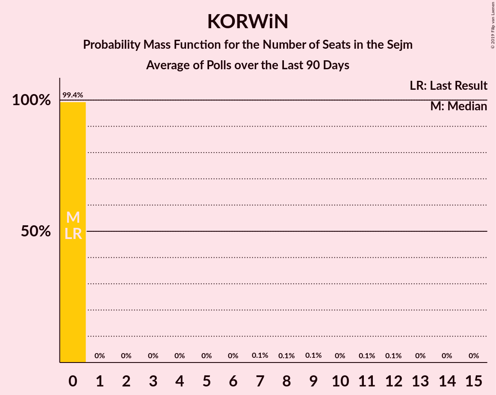
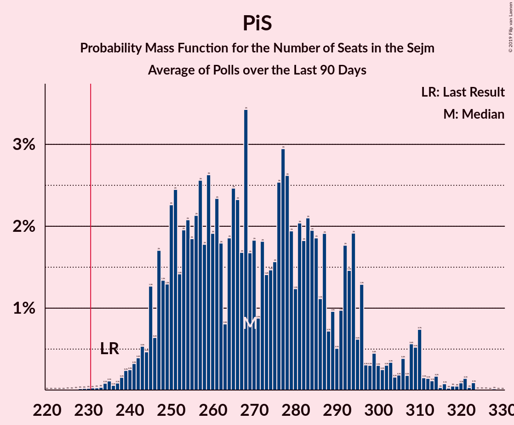
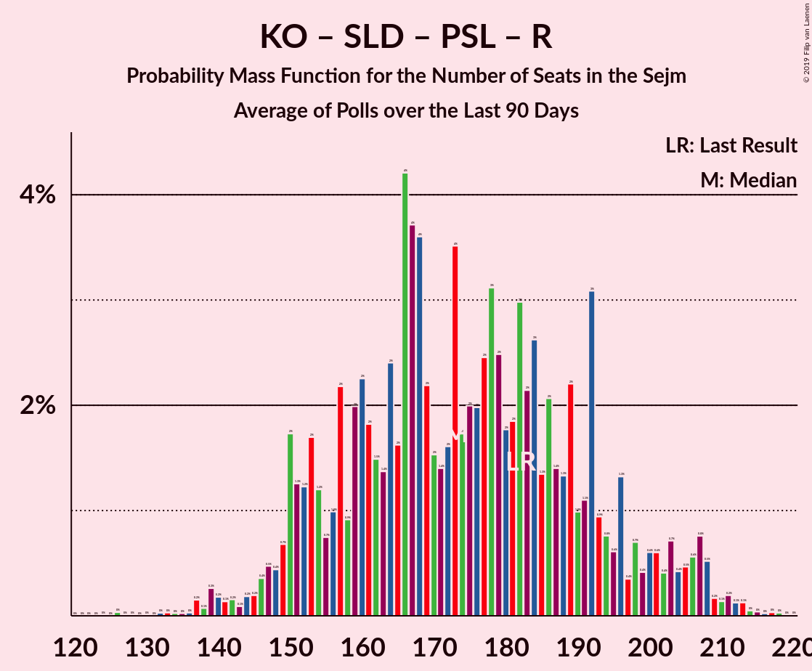
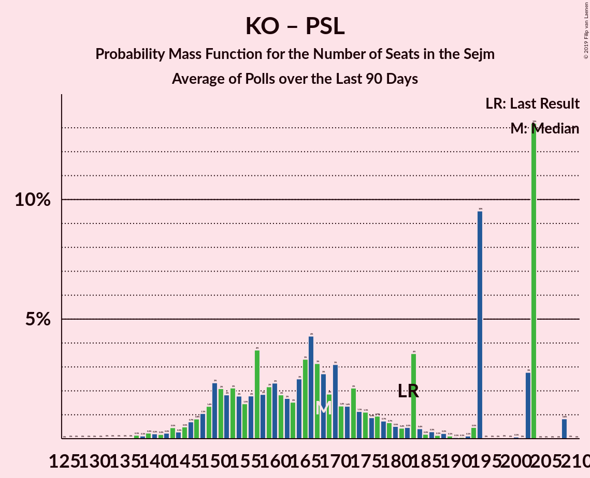
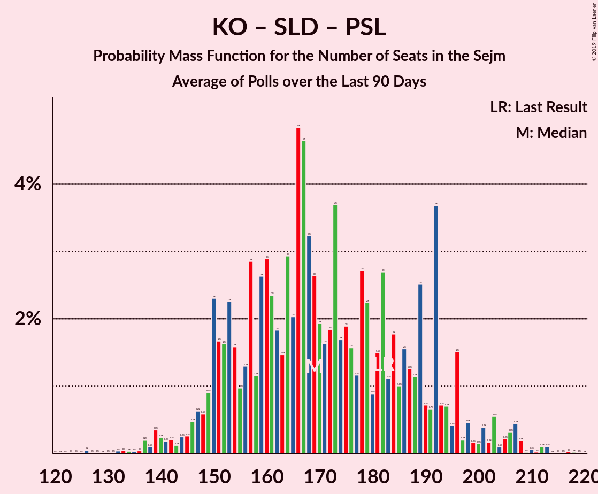
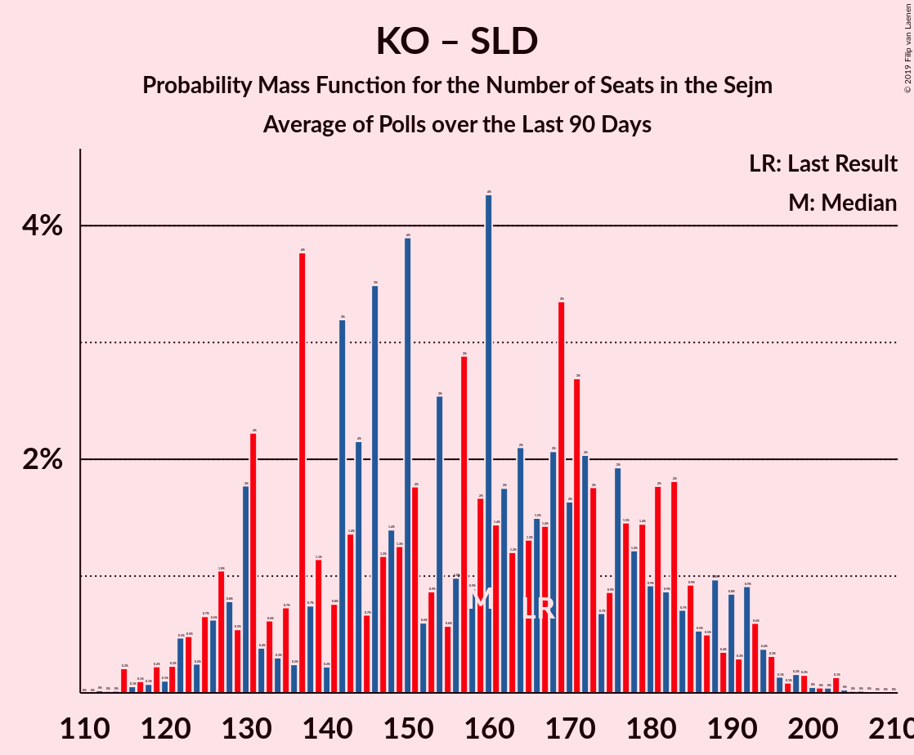

# Poll Average

<a href="#voting-intentions">Voting Intentions</a> | <a href="#seats">Seats</a> | <a href="#coalitions">Coalitions</a> | <a href="#technical-information">Technical Information</a>

## Summary

The table below lists the polls on which the average is based. They are the most recent polls (less than 90 days old) registered and analyzed so far.

| Period     | Polling firm/Commissioner(s) | PiS | KO | PO | K | .N | PSL | SLD | W | R | Wi | MN |
|:----------:|:----------------------------:|:--:|:--:|:--:|:--:|:--:|:--:|:--:|:--:|:--:|:--:|:--:|
| 25 October 2015 | General Election | 37.6%   235 | 31.7%   166 | 24.1%   138 | 8.8%   42 | 7.6%   28 | 5.1%   16 | 7.6%   0 | 4.8%   0 | 3.6%   0 | 0.0%   0 | 0.2%   1 |
| N/A | Poll Average | 39–46%   254–308 | 24–30%   143–194 | N/A   N/A | 5–8%   0–35 | N/A   N/A | 2–4%   0–17 | 1–3%   0 | 2–4%   0 | 1–3%   0 | 4–6%   0–18 | N/A   N/A |
| [12–15 July 2019](2019-07-15-KantarMillwardBrown.html) | Kantar Millward Brown   TVN and TVN24 | 39–45%   254–308 | 24–30%   143–194 | N/A   N/A | 5–8%   0–35 | N/A   N/A | 2–4%   0–17 | 1–3%   0 | 2–4%   0 | 1–3%   0 | 4–7%   0–18 | N/A   N/A |
| [12–13 July 2019](2019-07-13-IBRiS.html) | IBRiS   Rzeczpospolita | 40–46%   N/A | 24–29%   N/A | N/A   N/A | 2–4%   N/A | N/A   N/A | 3–6%   N/A | 5–7%   N/A | 3–5%   N/A | 1–2%   N/A | 3–6%   N/A | N/A   N/A |
| [4–11 July 2019](2019-07-11-CBOS.html) | CBOS | N/A   N/A | N/A   N/A | N/A   N/A | N/A   N/A | N/A   N/A | N/A   N/A | N/A   N/A | N/A   N/A | N/A   N/A | N/A   N/A | N/A   N/A |
| [5–10 July 2019](2019-07-10-SocialChanges.html) | Social Changes | N/A   N/A | N/A   N/A | N/A   N/A | N/A   N/A | N/A   N/A | N/A   N/A | N/A   N/A | N/A   N/A | N/A   N/A | N/A   N/A | N/A   N/A |
| [19–20 June 2019](2019-06-20-Estymator.html) | Estymator   DoRzeczy.pl | N/A   N/A | N/A   N/A | N/A   N/A | N/A   N/A | N/A   N/A | N/A   N/A | N/A   N/A | N/A   N/A | N/A   N/A | N/A   N/A | N/A   N/A |
| 25 October 2015 | General Election | 37.6%   235 | 31.7%   166 | 24.1%   138 | 8.8%   42 | 7.6%   28 | 5.1%   16 | 7.6%   0 | 4.8%   0 | 3.6%   0 | 0.0%   0 | 0.2%   1 |

Only polls for which at least the sample size has been published are included in the table above.

**Legend:**
+ **Top half of each row:** Voting intentions (95% confidence interval)
+ **Bottom half of each row:** Seat projections for the Sejm (95% confidence interval)
+ **PiS:** Prawo i Sprawiedliwość
+ **KO:** Koalicja Obywatelska
+ **PO:** Platforma Obywatelska
+ **K:** Kukiz’15
+ **.N:** .Nowoczesna
+ **PSL:** Polskie Stronnictwo Ludowe
+ **SLD:** Sojusz Lewicy Demokratycznej
+ **W:** KORWiN
+ **R:** Lewica Razem
+ **Wi:** Wiosna
+ **MN:** Mniejszość Niemiecka
+ **N/A (single party):** Party not included the published results
+ **N/A (entire row):** Calculation for this opinion poll not started yet

## Voting Intentions

### Confidence Intervals

| Party | Last Result | Median | 80% Confidence Interval | 90% Confidence Interval | 95% Confidence Interval | 99% Confidence Interval |
|:-----:|:-----------:|:------:|:-----------------------:|:-----------------------:|:-----------------------:|:-----------------------:|
| <a href="#prawo-i-sprawiedliwość">Prawo i Sprawiedliwość</a> | 37.6% | 42.5% | 40.5–44.6% |39.9–45.2% | 39.4–45.7% | 38.4–46.6% |
| <a href="#koalicja-obywatelska">Koalicja Obywatelska</a> | 31.7% | 27.1% | 25.3–28.9% |24.8–29.4% | 24.4–29.9% | 23.6–30.8% |
| <a href="#platforma-obywatelska">Platforma Obywatelska</a> | 24.1% | N/A | N/A |N/A | N/A | N/A |
| <a href="#kukiz’15">Kukiz’15</a> | 8.8% | 6.0% | 5.1–7.1% |4.9–7.4% | 4.7–7.6% | 4.3–8.2% |
| <a href="#.nowoczesna">.Nowoczesna</a> | 7.6% | N/A | N/A |N/A | N/A | N/A |
| <a href="#sojusz-lewicy-demokratycznej">Sojusz Lewicy Demokratycznej</a> | 7.6% | 2.1% | 1.5–2.7% |1.4–2.9% | 1.3–3.1% | 1.1–3.4% |
| <a href="#polskie-stronnictwo-ludowe">Polskie Stronnictwo Ludowe</a> | 5.1% | 3.1% | 2.4–3.8% |2.2–4.0% | 2.1–4.2% | 1.9–4.7% |
| <a href="#korwin">KORWiN</a> | 4.8% | 3.1% | 2.4–3.8% |2.2–4.0% | 2.1–4.2% | 1.9–4.7% |
| <a href="#lewica-razem">Lewica Razem</a> | 3.6% | 2.1% | 1.5–2.7% |1.4–2.9% | 1.3–3.1% | 1.1–3.4% |
| <a href="#mniejszość-niemiecka">Mniejszość Niemiecka</a> | 0.2% | N/A | N/A |N/A | N/A | N/A |
| <a href="#wiosna">Wiosna</a> | 0.0% | 5.1% | 4.2–6.0% |4.0–6.3% | 3.8–6.5% | 3.5–7.0% |

### Prawo i Sprawiedliwość

*For a full overview of the results for this party, see the [Prawo i Sprawiedliwość](party-prawoisprawiedliwość.html) page.*

| Voting Intentions | Probability | Accumulated | Special Marks |
|:-----------------:|:-----------:|:-----------:|:-------------:|
| 35.5–36.5% | 0% | 100% |  |
| 36.5–37.5% | 0.1% | 100% |  |
| 37.5–38.5% | 0.6% | 99.9% | Last Result |
| 38.5–39.5% | 3% | 99.3% |  |
| 39.5–40.5% | 8% | 97% |  |
| 40.5–41.5% | 16% | 89% |  |
| 41.5–42.5% | 24% | 73% |  |
| 42.5–43.5% | 23% | 49% | Median |
| 43.5–44.5% | 16% | 26% |  |
| 44.5–45.5% | 7% | 10% |  |
| 45.5–46.5% | 2% | 3% |  |
| 46.5–47.5% | 0.5% | 0.6% |  |
| 47.5–48.5% | 0.1% | 0.1% |  |
| 48.5–49.5% | 0% | 0% |  |

### Koalicja Obywatelska

*For a full overview of the results for this party, see the [Koalicja Obywatelska](party-koalicjaobywatelska.html) page.*

| Voting Intentions | Probability | Accumulated | Special Marks |
|:-----------------:|:-----------:|:-----------:|:-------------:|
| 21.5–22.5% | 0% | 100% |  |
| 22.5–23.5% | 0.4% | 100% |  |
| 23.5–24.5% | 3% | 99.5% |  |
| 24.5–25.5% | 10% | 97% |  |
| 25.5–26.5% | 22% | 87% |  |
| 26.5–27.5% | 28% | 65% | Median |
| 27.5–28.5% | 22% | 37% |  |
| 28.5–29.5% | 11% | 15% |  |
| 29.5–30.5% | 3% | 4% |  |
| 30.5–31.5% | 0.7% | 0.8% |  |
| 31.5–32.5% | 0.1% | 0.1% | Last Result |
| 32.5–33.5% | 0% | 0% |  |

### Kukiz’15

*For a full overview of the results for this party, see the [Kukiz’15](party-kukiz’15.html) page.*

| Voting Intentions | Probability | Accumulated | Special Marks |
|:-----------------:|:-----------:|:-----------:|:-------------:|
| 2.5–3.5% | 0% | 100% |  |
| 3.5–4.5% | 2% | 100% |  |
| 4.5–5.5% | 23% | 98% |  |
| 5.5–6.5% | 50% | 75% | Median |
| 6.5–7.5% | 22% | 26% |  |
| 7.5–8.5% | 3% | 3% |  |
| 8.5–9.5% | 0.1% | 0.1% | Last Result |
| 9.5–10.5% | 0% | 0% |  |

### Sojusz Lewicy Demokratycznej

*For a full overview of the results for this party, see the [Sojusz Lewicy Demokratycznej](party-sojuszlewicydemokratycznej.html) page.*

| Voting Intentions | Probability | Accumulated | Special Marks |
|:-----------------:|:-----------:|:-----------:|:-------------:|
| 0.0–0.5% | 0% | 100% |  |
| 0.5–1.5% | 11% | 100% |  |
| 1.5–2.5% | 74% | 89% | Median |
| 2.5–3.5% | 15% | 16% |  |
| 3.5–4.5% | 0.3% | 0.3% |  |
| 4.5–5.5% | 0% | 0% |  |
| 5.5–6.5% | 0% | 0% |  |
| 6.5–7.5% | 0% | 0% |  |
| 7.5–8.5% | 0% | 0% | Last Result |

### Polskie Stronnictwo Ludowe

*For a full overview of the results for this party, see the [Polskie Stronnictwo Ludowe](party-polskiestronnictwoludowe.html) page.*

| Voting Intentions | Probability | Accumulated | Special Marks |
|:-----------------:|:-----------:|:-----------:|:-------------:|
| 0.5–1.5% | 0% | 100% |  |
| 1.5–2.5% | 16% | 100% |  |
| 2.5–3.5% | 65% | 84% | Median |
| 3.5–4.5% | 19% | 19% |  |
| 4.5–5.5% | 0.8% | 0.8% | Last Result |
| 5.5–6.5% | 0% | 0% |  |

### KORWiN

*For a full overview of the results for this party, see the [KORWiN](party-korwin.html) page.*

| Voting Intentions | Probability | Accumulated | Special Marks |
|:-----------------:|:-----------:|:-----------:|:-------------:|
| 0.5–1.5% | 0% | 100% |  |
| 1.5–2.5% | 16% | 100% |  |
| 2.5–3.5% | 65% | 84% | Median |
| 3.5–4.5% | 19% | 19% |  |
| 4.5–5.5% | 0.8% | 0.8% | Last Result |
| 5.5–6.5% | 0% | 0% |  |

### Lewica Razem

*For a full overview of the results for this party, see the [Lewica Razem](party-lewicarazem.html) page.*

| Voting Intentions | Probability | Accumulated | Special Marks |
|:-----------------:|:-----------:|:-----------:|:-------------:|
| 0.0–0.5% | 0% | 100% |  |
| 0.5–1.5% | 11% | 100% |  |
| 1.5–2.5% | 74% | 89% | Median |
| 2.5–3.5% | 15% | 16% |  |
| 3.5–4.5% | 0.3% | 0.3% | Last Result |
| 4.5–5.5% | 0% | 0% |  |

### Wiosna

*For a full overview of the results for this party, see the [Wiosna](party-wiosna.html) page.*

| Voting Intentions | Probability | Accumulated | Special Marks |
|:-----------------:|:-----------:|:-----------:|:-------------:|
| 0.0–0.5% | 0% | 100% | Last Result |
| 0.5–1.5% | 0% | 100% |  |
| 1.5–2.5% | 0% | 100% |  |
| 2.5–3.5% | 0.8% | 100% |  |
| 3.5–4.5% | 22% | 99.2% |  |
| 4.5–5.5% | 53% | 77% | Median |
| 5.5–6.5% | 22% | 24% |  |
| 6.5–7.5% | 2% | 2% |  |
| 7.5–8.5% | 0.1% | 0.1% |  |
| 8.5–9.5% | 0% | 0% |  |

## Seats

### Confidence Intervals

| Party | Last Result | Median | 80% Confidence Interval | 90% Confidence Interval | 95% Confidence Interval | 99% Confidence Interval |
|:-----:|:-----------:|:------:|:-----------------------:|:-----------------------:|:-----------------------:|:-----------------------:|
| <a href="#prawo-i-sprawiedliwość">Prawo i Sprawiedliwość</a> | 235 | 264 | 254–289 |254–294 | 254–308 | 232–308 |
| <a href="#koalicja-obywatelska">Koalicja Obywatelska</a> | 166 | 160 | 143–179 |143–179 | 143–194 | 122–196 |
| <a href="#platforma-obywatelska">Platforma Obywatelska</a> | 138 | N/A | N/A |N/A | N/A | N/A |
| <a href="#kukiz’15">Kukiz’15</a> | 42 | 14 | 11–19 |0–22 | 0–35 | 0–37 |
| <a href="#.nowoczesna">.Nowoczesna</a> | 28 | N/A | N/A |N/A | N/A | N/A |
| <a href="#sojusz-lewicy-demokratycznej">Sojusz Lewicy Demokratycznej</a> | 0 | 0 | 0 |0 | 0 | 0 |
| <a href="#polskie-stronnictwo-ludowe">Polskie Stronnictwo Ludowe</a> | 16 | 0 | 0–17 |0–17 | 0–17 | 0–17 |
| <a href="#korwin">KORWiN</a> | 0 | 0 | 0 |0 | 0 | 0 |
| <a href="#lewica-razem">Lewica Razem</a> | 0 | 0 | 0 |0 | 0 | 0 |
| <a href="#mniejszość-niemiecka">Mniejszość Niemiecka</a> | 1 | N/A | N/A |N/A | N/A | N/A |
| <a href="#wiosna">Wiosna</a> | 0 | 0 | 0–16 |0–16 | 0–18 | 0–27 |

### Prawo i Sprawiedliwość

*For a full overview of the results for this party, see the [Prawo i Sprawiedliwość](party-prawoisprawiedliwość.html) page.*

| Number of Seats | Probability | Accumulated | Special Marks |
|:---------------:|:-----------:|:-----------:|:-------------:|
| 231 | 0.1% | 100% | Majority |
| 232 | 0.9% | 99.9% |  |
| 233 | 0% | 99.0% |  |
| 234 | 0% | 99.0% |  |
| 235 | 0% | 99.0% | Last Result |
| 236 | 0% | 99.0% |  |
| 237 | 0% | 99.0% |  |
| 238 | 0% | 99.0% |  |
| 239 | 0% | 99.0% |  |
| 240 | 0% | 98.9% |  |
| 241 | 0% | 98.9% |  |
| 242 | 0% | 98.9% |  |
| 243 | 0% | 98.9% |  |
| 244 | 0% | 98.9% |  |
| 245 | 0% | 98.9% |  |
| 246 | 0% | 98.9% |  |
| 247 | 0.1% | 98.9% |  |
| 248 | 0% | 98.8% |  |
| 249 | 0% | 98.8% |  |
| 250 | 0% | 98.8% |  |
| 251 | 0% | 98.8% |  |
| 252 | 0% | 98.8% |  |
| 253 | 0% | 98.8% |  |
| 254 | 44% | 98.8% |  |
| 255 | 0.5% | 54% |  |
| 256 | 0.1% | 54% |  |
| 257 | 0.1% | 54% |  |
| 258 | 0% | 54% |  |
| 259 | 0% | 54% |  |
| 260 | 2% | 54% |  |
| 261 | 0.4% | 52% |  |
| 262 | 0% | 51% |  |
| 263 | 0% | 51% |  |
| 264 | 2% | 51% | Median |
| 265 | 0.1% | 49% |  |
| 266 | 0.1% | 49% |  |
| 267 | 0.1% | 49% |  |
| 268 | 0% | 49% |  |
| 269 | 0% | 49% |  |
| 270 | 0.2% | 49% |  |
| 271 | 0% | 49% |  |
| 272 | 0% | 49% |  |
| 273 | 0% | 49% |  |
| 274 | 0% | 49% |  |
| 275 | 0% | 49% |  |
| 276 | 0% | 49% |  |
| 277 | 0% | 49% |  |
| 278 | 3% | 49% |  |
| 279 | 0% | 46% |  |
| 280 | 0% | 46% |  |
| 281 | 0% | 46% |  |
| 282 | 0% | 46% |  |
| 283 | 0.1% | 46% |  |
| 284 | 0% | 46% |  |
| 285 | 12% | 46% |  |
| 286 | 0% | 35% |  |
| 287 | 0% | 35% |  |
| 288 | 18% | 35% |  |
| 289 | 9% | 16% |  |
| 290 | 0% | 7% |  |
| 291 | 0% | 7% |  |
| 292 | 0% | 7% |  |
| 293 | 0% | 7% |  |
| 294 | 2% | 7% |  |
| 295 | 0.2% | 4% |  |
| 296 | 0% | 4% |  |
| 297 | 0% | 4% |  |
| 298 | 0% | 4% |  |
| 299 | 0% | 4% |  |
| 300 | 0% | 4% |  |
| 301 | 0% | 4% |  |
| 302 | 0.2% | 4% |  |
| 303 | 0% | 4% |  |
| 304 | 0% | 4% |  |
| 305 | 0% | 4% |  |
| 306 | 0% | 4% |  |
| 307 | 0% | 4% |  |
| 308 | 4% | 4% |  |
| 309 | 0% | 0% |  |

### Koalicja Obywatelska

*For a full overview of the results for this party, see the [Koalicja Obywatelska](party-koalicjaobywatelska.html) page.*

| Number of Seats | Probability | Accumulated | Special Marks |
|:---------------:|:-----------:|:-----------:|:-------------:|
| 122 | 0.8% | 100% |  |
| 123 | 0% | 99.2% |  |
| 124 | 0% | 99.2% |  |
| 125 | 0% | 99.2% |  |
| 126 | 0% | 99.2% |  |
| 127 | 0% | 99.2% |  |
| 128 | 0% | 99.2% |  |
| 129 | 0% | 99.2% |  |
| 130 | 0% | 99.2% |  |
| 131 | 0% | 99.2% |  |
| 132 | 0% | 99.2% |  |
| 133 | 0% | 99.2% |  |
| 134 | 0% | 99.2% |  |
| 135 | 0% | 99.2% |  |
| 136 | 0% | 99.2% |  |
| 137 | 0% | 99.2% |  |
| 138 | 0.2% | 99.2% |  |
| 139 | 0% | 99.1% |  |
| 140 | 0% | 99.0% |  |
| 141 | 0% | 99.0% |  |
| 142 | 0% | 99.0% |  |
| 143 | 11% | 99.0% |  |
| 144 | 0% | 88% |  |
| 145 | 0% | 88% |  |
| 146 | 3% | 88% |  |
| 147 | 0.2% | 86% |  |
| 148 | 0% | 85% |  |
| 149 | 2% | 85% |  |
| 150 | 0.4% | 83% |  |
| 151 | 0% | 83% |  |
| 152 | 4% | 83% |  |
| 153 | 18% | 79% |  |
| 154 | 0% | 61% |  |
| 155 | 9% | 61% |  |
| 156 | 0% | 51% |  |
| 157 | 0% | 51% |  |
| 158 | 0.2% | 51% |  |
| 159 | 0% | 51% |  |
| 160 | 3% | 51% | Median |
| 161 | 0.1% | 49% |  |
| 162 | 0.2% | 48% |  |
| 163 | 0.1% | 48% |  |
| 164 | 0% | 48% |  |
| 165 | 0% | 48% |  |
| 166 | 0.1% | 48% | Last Result |
| 167 | 0.1% | 48% |  |
| 168 | 0% | 48% |  |
| 169 | 0% | 48% |  |
| 170 | 0% | 48% |  |
| 171 | 0% | 48% |  |
| 172 | 0% | 48% |  |
| 173 | 0% | 48% |  |
| 174 | 2% | 48% |  |
| 175 | 0% | 46% |  |
| 176 | 0% | 46% |  |
| 177 | 0.1% | 46% |  |
| 178 | 0% | 46% |  |
| 179 | 43% | 46% |  |
| 180 | 0.4% | 3% |  |
| 181 | 0% | 3% |  |
| 182 | 0% | 3% |  |
| 183 | 0% | 3% |  |
| 184 | 0% | 3% |  |
| 185 | 0% | 3% |  |
| 186 | 0% | 3% |  |
| 187 | 0% | 3% |  |
| 188 | 0% | 3% |  |
| 189 | 0% | 3% |  |
| 190 | 0% | 3% |  |
| 191 | 0.1% | 3% |  |
| 192 | 0% | 3% |  |
| 193 | 0% | 3% |  |
| 194 | 0.9% | 3% |  |
| 195 | 0% | 2% |  |
| 196 | 2% | 2% |  |
| 197 | 0% | 0.1% |  |
| 198 | 0.1% | 0.1% |  |
| 199 | 0% | 0% |  |

### Kukiz’15

*For a full overview of the results for this party, see the [Kukiz’15](party-kukiz’15.html) page.*

| Number of Seats | Probability | Accumulated | Special Marks |
|:---------------:|:-----------:|:-----------:|:-------------:|
| 0 | 7% | 100% |  |
| 1 | 0% | 93% |  |
| 2 | 0% | 93% |  |
| 3 | 0% | 93% |  |
| 4 | 0% | 93% |  |
| 5 | 0% | 93% |  |
| 6 | 0% | 93% |  |
| 7 | 0% | 93% |  |
| 8 | 0% | 93% |  |
| 9 | 0.4% | 93% |  |
| 10 | 0% | 93% |  |
| 11 | 43% | 93% |  |
| 12 | 0% | 50% |  |
| 13 | 0% | 50% |  |
| 14 | 2% | 50% | Median |
| 15 | 11% | 48% |  |
| 16 | 9% | 38% |  |
| 17 | 0% | 28% |  |
| 18 | 0.2% | 28% |  |
| 19 | 18% | 28% |  |
| 20 | 2% | 10% |  |
| 21 | 0% | 7% |  |
| 22 | 3% | 7% |  |
| 23 | 0% | 5% |  |
| 24 | 0% | 5% |  |
| 25 | 0% | 5% |  |
| 26 | 0% | 5% |  |
| 27 | 0.8% | 5% |  |
| 28 | 0% | 4% |  |
| 29 | 0% | 4% |  |
| 30 | 0% | 4% |  |
| 31 | 0.1% | 4% |  |
| 32 | 0% | 4% |  |
| 33 | 0% | 4% |  |
| 34 | 1.1% | 4% |  |
| 35 | 0.4% | 3% |  |
| 36 | 0% | 2% |  |
| 37 | 2% | 2% |  |
| 38 | 0.1% | 0.2% |  |
| 39 | 0% | 0.1% |  |
| 40 | 0.1% | 0.1% |  |
| 41 | 0% | 0% |  |
| 42 | 0% | 0% | Last Result |

### Sojusz Lewicy Demokratycznej

*For a full overview of the results for this party, see the [Sojusz Lewicy Demokratycznej](party-sojuszlewicydemokratycznej.html) page.*

| Number of Seats | Probability | Accumulated | Special Marks |
|:---------------:|:-----------:|:-----------:|:-------------:|
| 0 | 100% | 100% | Last Result, Median |

### Polskie Stronnictwo Ludowe

*For a full overview of the results for this party, see the [Polskie Stronnictwo Ludowe](party-polskiestronnictwoludowe.html) page.*

| Number of Seats | Probability | Accumulated | Special Marks |
|:---------------:|:-----------:|:-----------:|:-------------:|
| 0 | 89% | 100% | Median |
| 1 | 0% | 11% |  |
| 2 | 0% | 11% |  |
| 3 | 0% | 11% |  |
| 4 | 0% | 11% |  |
| 5 | 0% | 11% |  |
| 6 | 0% | 11% |  |
| 7 | 0% | 11% |  |
| 8 | 0% | 11% |  |
| 9 | 0% | 11% |  |
| 10 | 0% | 11% |  |
| 11 | 0% | 11% |  |
| 12 | 0% | 11% |  |
| 13 | 0% | 11% |  |
| 14 | 0% | 11% |  |
| 15 | 0% | 11% |  |
| 16 | 0% | 11% | Last Result |
| 17 | 11% | 11% |  |
| 18 | 0% | 0.2% |  |
| 19 | 0% | 0.2% |  |
| 20 | 0% | 0.2% |  |
| 21 | 0% | 0.2% |  |
| 22 | 0% | 0.1% |  |
| 23 | 0.1% | 0.1% |  |
| 24 | 0% | 0% |  |

### KORWiN

*For a full overview of the results for this party, see the [KORWiN](party-korwin.html) page.*

| Number of Seats | Probability | Accumulated | Special Marks |
|:---------------:|:-----------:|:-----------:|:-------------:|
| 0 | 99.9% | 100% | Last Result, Median |
| 1 | 0% | 0.1% |  |
| 2 | 0% | 0.1% |  |
| 3 | 0% | 0.1% |  |
| 4 | 0% | 0.1% |  |
| 5 | 0% | 0.1% |  |
| 6 | 0% | 0.1% |  |
| 7 | 0% | 0.1% |  |
| 8 | 0% | 0.1% |  |
| 9 | 0% | 0.1% |  |
| 10 | 0% | 0.1% |  |
| 11 | 0% | 0.1% |  |
| 12 | 0.1% | 0.1% |  |
| 13 | 0% | 0% |  |

### Lewica Razem

*For a full overview of the results for this party, see the [Lewica Razem](party-lewicarazem.html) page.*

| Number of Seats | Probability | Accumulated | Special Marks |
|:---------------:|:-----------:|:-----------:|:-------------:|
| 0 | 100% | 100% | Last Result, Median |

### Wiosna

*For a full overview of the results for this party, see the [Wiosna](party-wiosna.html) page.*

| Number of Seats | Probability | Accumulated | Special Marks |
|:---------------:|:-----------:|:-----------:|:-------------:|
| 0 | 51% | 100% | Last Result, Median |
| 1 | 0% | 49% |  |
| 2 | 0% | 49% |  |
| 3 | 0% | 49% |  |
| 4 | 0% | 49% |  |
| 5 | 0% | 49% |  |
| 6 | 0% | 49% |  |
| 7 | 0% | 49% |  |
| 8 | 0% | 49% |  |
| 9 | 0% | 49% |  |
| 10 | 0% | 49% |  |
| 11 | 0% | 49% |  |
| 12 | 0% | 49% |  |
| 13 | 0% | 49% |  |
| 14 | 3% | 49% |  |
| 15 | 0.1% | 46% |  |
| 16 | 43% | 46% |  |
| 17 | 0% | 3% |  |
| 18 | 2% | 3% |  |
| 19 | 0% | 1.5% |  |
| 20 | 0% | 1.5% |  |
| 21 | 0% | 1.5% |  |
| 22 | 0% | 1.5% |  |
| 23 | 0% | 1.5% |  |
| 24 | 0% | 1.5% |  |
| 25 | 0% | 1.5% |  |
| 26 | 0.8% | 1.5% |  |
| 27 | 0.3% | 0.7% |  |
| 28 | 0.3% | 0.4% |  |
| 29 | 0.1% | 0.1% |  |
| 30 | 0% | 0% |  |

## Coalitions

### Confidence Intervals

| Coalition | Last Result | Median | Majority? | 80% Confidence Interval | 90% Confidence Interval | 95% Confidence Interval | 99% Confidence Interval |
|:---------:|:-----------:|:------:|:---------:|:-----------------------:|:-----------------------:|:-----------------------:|:-----------------------:|
| Prawo i Sprawiedliwość | 235 | 264 | 100% | 254–289 | 254–294 | 254–308 | 232–308 |
| Koalicja Obywatelska – Sojusz Lewicy Demokratycznej – Polskie Stronnictwo Ludowe – Lewica Razem | 182 | 160 | 0% | 152–179 | 149–179 | 146–194 | 122–196 |
| Koalicja Obywatelska – Polskie Stronnictwo Ludowe | 182 | 160 | 0% | 152–179 | 149–179 | 146–194 | 122–196 |
| Koalicja Obywatelska – Sojusz Lewicy Demokratycznej – Polskie Stronnictwo Ludowe | 182 | 160 | 0% | 152–179 | 149–179 | 146–194 | 122–196 |
| Koalicja Obywatelska | 166 | 160 | 0% | 143–179 | 143–179 | 143–194 | 122–196 |
| Koalicja Obywatelska – Sojusz Lewicy Demokratycznej | 166 | 160 | 0% | 143–179 | 143–179 | 143–194 | 122–196 |

### Prawo i Sprawiedliwość

| Number of Seats | Probability | Accumulated | Special Marks |
|:---------------:|:-----------:|:-----------:|:-------------:|
| 231 | 0.1% | 100% | Majority |
| 232 | 0.9% | 99.9% |  |
| 233 | 0% | 99.0% |  |
| 234 | 0% | 99.0% |  |
| 235 | 0% | 99.0% | Last Result |
| 236 | 0% | 99.0% |  |
| 237 | 0% | 99.0% |  |
| 238 | 0% | 99.0% |  |
| 239 | 0% | 99.0% |  |
| 240 | 0% | 98.9% |  |
| 241 | 0% | 98.9% |  |
| 242 | 0% | 98.9% |  |
| 243 | 0% | 98.9% |  |
| 244 | 0% | 98.9% |  |
| 245 | 0% | 98.9% |  |
| 246 | 0% | 98.9% |  |
| 247 | 0.1% | 98.9% |  |
| 248 | 0% | 98.8% |  |
| 249 | 0% | 98.8% |  |
| 250 | 0% | 98.8% |  |
| 251 | 0% | 98.8% |  |
| 252 | 0% | 98.8% |  |
| 253 | 0% | 98.8% |  |
| 254 | 44% | 98.8% |  |
| 255 | 0.5% | 54% |  |
| 256 | 0.1% | 54% |  |
| 257 | 0.1% | 54% |  |
| 258 | 0% | 54% |  |
| 259 | 0% | 54% |  |
| 260 | 2% | 54% |  |
| 261 | 0.4% | 52% |  |
| 262 | 0% | 51% |  |
| 263 | 0% | 51% |  |
| 264 | 2% | 51% | Median |
| 265 | 0.1% | 49% |  |
| 266 | 0.1% | 49% |  |
| 267 | 0.1% | 49% |  |
| 268 | 0% | 49% |  |
| 269 | 0% | 49% |  |
| 270 | 0.2% | 49% |  |
| 271 | 0% | 49% |  |
| 272 | 0% | 49% |  |
| 273 | 0% | 49% |  |
| 274 | 0% | 49% |  |
| 275 | 0% | 49% |  |
| 276 | 0% | 49% |  |
| 277 | 0% | 49% |  |
| 278 | 3% | 49% |  |
| 279 | 0% | 46% |  |
| 280 | 0% | 46% |  |
| 281 | 0% | 46% |  |
| 282 | 0% | 46% |  |
| 283 | 0.1% | 46% |  |
| 284 | 0% | 46% |  |
| 285 | 12% | 46% |  |
| 286 | 0% | 35% |  |
| 287 | 0% | 35% |  |
| 288 | 18% | 35% |  |
| 289 | 9% | 16% |  |
| 290 | 0% | 7% |  |
| 291 | 0% | 7% |  |
| 292 | 0% | 7% |  |
| 293 | 0% | 7% |  |
| 294 | 2% | 7% |  |
| 295 | 0.2% | 4% |  |
| 296 | 0% | 4% |  |
| 297 | 0% | 4% |  |
| 298 | 0% | 4% |  |
| 299 | 0% | 4% |  |
| 300 | 0% | 4% |  |
| 301 | 0% | 4% |  |
| 302 | 0.2% | 4% |  |
| 303 | 0% | 4% |  |
| 304 | 0% | 4% |  |
| 305 | 0% | 4% |  |
| 306 | 0% | 4% |  |
| 307 | 0% | 4% |  |
| 308 | 4% | 4% |  |
| 309 | 0% | 0% |  |

### Koalicja Obywatelska – Sojusz Lewicy Demokratycznej – Polskie Stronnictwo Ludowe – Lewica Razem

| Number of Seats | Probability | Accumulated | Special Marks |
|:---------------:|:-----------:|:-----------:|:-------------:|
| 122 | 0.8% | 100% |  |
| 123 | 0% | 99.2% |  |
| 124 | 0% | 99.2% |  |
| 125 | 0% | 99.2% |  |
| 126 | 0% | 99.2% |  |
| 127 | 0% | 99.2% |  |
| 128 | 0% | 99.2% |  |
| 129 | 0% | 99.2% |  |
| 130 | 0% | 99.2% |  |
| 131 | 0% | 99.2% |  |
| 132 | 0% | 99.2% |  |
| 133 | 0% | 99.2% |  |
| 134 | 0% | 99.2% |  |
| 135 | 0% | 99.2% |  |
| 136 | 0% | 99.2% |  |
| 137 | 0% | 99.2% |  |
| 138 | 0.2% | 99.2% |  |
| 139 | 0% | 99.1% |  |
| 140 | 0% | 99.0% |  |
| 141 | 0% | 99.0% |  |
| 142 | 0% | 99.0% |  |
| 143 | 0% | 99.0% |  |
| 144 | 0% | 99.0% |  |
| 145 | 0% | 99.0% |  |
| 146 | 3% | 99.0% |  |
| 147 | 0.2% | 96% |  |
| 148 | 0% | 96% |  |
| 149 | 2% | 96% |  |
| 150 | 0.4% | 94% |  |
| 151 | 0% | 94% |  |
| 152 | 4% | 94% |  |
| 153 | 18% | 90% |  |
| 154 | 0% | 71% |  |
| 155 | 9% | 71% |  |
| 156 | 0% | 62% |  |
| 157 | 0% | 62% |  |
| 158 | 0.2% | 62% |  |
| 159 | 0% | 62% |  |
| 160 | 13% | 62% | Median |
| 161 | 0.1% | 49% |  |
| 162 | 0.2% | 49% |  |
| 163 | 0% | 48% |  |
| 164 | 0% | 48% |  |
| 165 | 0% | 48% |  |
| 166 | 0.1% | 48% |  |
| 167 | 0.1% | 48% |  |
| 168 | 0% | 48% |  |
| 169 | 0% | 48% |  |
| 170 | 0% | 48% |  |
| 171 | 0% | 48% |  |
| 172 | 0% | 48% |  |
| 173 | 0% | 48% |  |
| 174 | 2% | 48% |  |
| 175 | 0% | 47% |  |
| 176 | 0% | 47% |  |
| 177 | 0.1% | 46% |  |
| 178 | 0% | 46% |  |
| 179 | 43% | 46% |  |
| 180 | 0.4% | 4% |  |
| 181 | 0% | 3% |  |
| 182 | 0% | 3% | Last Result |
| 183 | 0% | 3% |  |
| 184 | 0% | 3% |  |
| 185 | 0% | 3% |  |
| 186 | 0.1% | 3% |  |
| 187 | 0% | 3% |  |
| 188 | 0% | 3% |  |
| 189 | 0% | 3% |  |
| 190 | 0% | 3% |  |
| 191 | 0.1% | 3% |  |
| 192 | 0% | 3% |  |
| 193 | 0% | 3% |  |
| 194 | 0.9% | 3% |  |
| 195 | 0% | 2% |  |
| 196 | 2% | 2% |  |
| 197 | 0% | 0.1% |  |
| 198 | 0.1% | 0.1% |  |
| 199 | 0% | 0% |  |

### Koalicja Obywatelska – Polskie Stronnictwo Ludowe

| Number of Seats | Probability | Accumulated | Special Marks |
|:---------------:|:-----------:|:-----------:|:-------------:|
| 122 | 0.8% | 100% |  |
| 123 | 0% | 99.2% |  |
| 124 | 0% | 99.2% |  |
| 125 | 0% | 99.2% |  |
| 126 | 0% | 99.2% |  |
| 127 | 0% | 99.2% |  |
| 128 | 0% | 99.2% |  |
| 129 | 0% | 99.2% |  |
| 130 | 0% | 99.2% |  |
| 131 | 0% | 99.2% |  |
| 132 | 0% | 99.2% |  |
| 133 | 0% | 99.2% |  |
| 134 | 0% | 99.2% |  |
| 135 | 0% | 99.2% |  |
| 136 | 0% | 99.2% |  |
| 137 | 0% | 99.2% |  |
| 138 | 0.2% | 99.2% |  |
| 139 | 0% | 99.1% |  |
| 140 | 0% | 99.0% |  |
| 141 | 0% | 99.0% |  |
| 142 | 0% | 99.0% |  |
| 143 | 0% | 99.0% |  |
| 144 | 0% | 99.0% |  |
| 145 | 0% | 99.0% |  |
| 146 | 3% | 99.0% |  |
| 147 | 0.2% | 96% |  |
| 148 | 0% | 96% |  |
| 149 | 2% | 96% |  |
| 150 | 0.4% | 94% |  |
| 151 | 0% | 94% |  |
| 152 | 4% | 94% |  |
| 153 | 18% | 90% |  |
| 154 | 0% | 71% |  |
| 155 | 9% | 71% |  |
| 156 | 0% | 62% |  |
| 157 | 0% | 62% |  |
| 158 | 0.2% | 62% |  |
| 159 | 0% | 62% |  |
| 160 | 13% | 62% | Median |
| 161 | 0.1% | 49% |  |
| 162 | 0.2% | 49% |  |
| 163 | 0% | 48% |  |
| 164 | 0% | 48% |  |
| 165 | 0% | 48% |  |
| 166 | 0.1% | 48% |  |
| 167 | 0.1% | 48% |  |
| 168 | 0% | 48% |  |
| 169 | 0% | 48% |  |
| 170 | 0% | 48% |  |
| 171 | 0% | 48% |  |
| 172 | 0% | 48% |  |
| 173 | 0% | 48% |  |
| 174 | 2% | 48% |  |
| 175 | 0% | 47% |  |
| 176 | 0% | 47% |  |
| 177 | 0.1% | 46% |  |
| 178 | 0% | 46% |  |
| 179 | 43% | 46% |  |
| 180 | 0.4% | 4% |  |
| 181 | 0% | 3% |  |
| 182 | 0% | 3% | Last Result |
| 183 | 0% | 3% |  |
| 184 | 0% | 3% |  |
| 185 | 0% | 3% |  |
| 186 | 0.1% | 3% |  |
| 187 | 0% | 3% |  |
| 188 | 0% | 3% |  |
| 189 | 0% | 3% |  |
| 190 | 0% | 3% |  |
| 191 | 0.1% | 3% |  |
| 192 | 0% | 3% |  |
| 193 | 0% | 3% |  |
| 194 | 0.9% | 3% |  |
| 195 | 0% | 2% |  |
| 196 | 2% | 2% |  |
| 197 | 0% | 0.1% |  |
| 198 | 0.1% | 0.1% |  |
| 199 | 0% | 0% |  |

### Koalicja Obywatelska – Sojusz Lewicy Demokratycznej – Polskie Stronnictwo Ludowe

| Number of Seats | Probability | Accumulated | Special Marks |
|:---------------:|:-----------:|:-----------:|:-------------:|
| 122 | 0.8% | 100% |  |
| 123 | 0% | 99.2% |  |
| 124 | 0% | 99.2% |  |
| 125 | 0% | 99.2% |  |
| 126 | 0% | 99.2% |  |
| 127 | 0% | 99.2% |  |
| 128 | 0% | 99.2% |  |
| 129 | 0% | 99.2% |  |
| 130 | 0% | 99.2% |  |
| 131 | 0% | 99.2% |  |
| 132 | 0% | 99.2% |  |
| 133 | 0% | 99.2% |  |
| 134 | 0% | 99.2% |  |
| 135 | 0% | 99.2% |  |
| 136 | 0% | 99.2% |  |
| 137 | 0% | 99.2% |  |
| 138 | 0.2% | 99.2% |  |
| 139 | 0% | 99.1% |  |
| 140 | 0% | 99.0% |  |
| 141 | 0% | 99.0% |  |
| 142 | 0% | 99.0% |  |
| 143 | 0% | 99.0% |  |
| 144 | 0% | 99.0% |  |
| 145 | 0% | 99.0% |  |
| 146 | 3% | 99.0% |  |
| 147 | 0.2% | 96% |  |
| 148 | 0% | 96% |  |
| 149 | 2% | 96% |  |
| 150 | 0.4% | 94% |  |
| 151 | 0% | 94% |  |
| 152 | 4% | 94% |  |
| 153 | 18% | 90% |  |
| 154 | 0% | 71% |  |
| 155 | 9% | 71% |  |
| 156 | 0% | 62% |  |
| 157 | 0% | 62% |  |
| 158 | 0.2% | 62% |  |
| 159 | 0% | 62% |  |
| 160 | 13% | 62% | Median |
| 161 | 0.1% | 49% |  |
| 162 | 0.2% | 49% |  |
| 163 | 0% | 48% |  |
| 164 | 0% | 48% |  |
| 165 | 0% | 48% |  |
| 166 | 0.1% | 48% |  |
| 167 | 0.1% | 48% |  |
| 168 | 0% | 48% |  |
| 169 | 0% | 48% |  |
| 170 | 0% | 48% |  |
| 171 | 0% | 48% |  |
| 172 | 0% | 48% |  |
| 173 | 0% | 48% |  |
| 174 | 2% | 48% |  |
| 175 | 0% | 47% |  |
| 176 | 0% | 47% |  |
| 177 | 0.1% | 46% |  |
| 178 | 0% | 46% |  |
| 179 | 43% | 46% |  |
| 180 | 0.4% | 4% |  |
| 181 | 0% | 3% |  |
| 182 | 0% | 3% | Last Result |
| 183 | 0% | 3% |  |
| 184 | 0% | 3% |  |
| 185 | 0% | 3% |  |
| 186 | 0.1% | 3% |  |
| 187 | 0% | 3% |  |
| 188 | 0% | 3% |  |
| 189 | 0% | 3% |  |
| 190 | 0% | 3% |  |
| 191 | 0.1% | 3% |  |
| 192 | 0% | 3% |  |
| 193 | 0% | 3% |  |
| 194 | 0.9% | 3% |  |
| 195 | 0% | 2% |  |
| 196 | 2% | 2% |  |
| 197 | 0% | 0.1% |  |
| 198 | 0.1% | 0.1% |  |
| 199 | 0% | 0% |  |

### Koalicja Obywatelska

| Number of Seats | Probability | Accumulated | Special Marks |
|:---------------:|:-----------:|:-----------:|:-------------:|
| 122 | 0.8% | 100% |  |
| 123 | 0% | 99.2% |  |
| 124 | 0% | 99.2% |  |
| 125 | 0% | 99.2% |  |
| 126 | 0% | 99.2% |  |
| 127 | 0% | 99.2% |  |
| 128 | 0% | 99.2% |  |
| 129 | 0% | 99.2% |  |
| 130 | 0% | 99.2% |  |
| 131 | 0% | 99.2% |  |
| 132 | 0% | 99.2% |  |
| 133 | 0% | 99.2% |  |
| 134 | 0% | 99.2% |  |
| 135 | 0% | 99.2% |  |
| 136 | 0% | 99.2% |  |
| 137 | 0% | 99.2% |  |
| 138 | 0.2% | 99.2% |  |
| 139 | 0% | 99.1% |  |
| 140 | 0% | 99.0% |  |
| 141 | 0% | 99.0% |  |
| 142 | 0% | 99.0% |  |
| 143 | 11% | 99.0% |  |
| 144 | 0% | 88% |  |
| 145 | 0% | 88% |  |
| 146 | 3% | 88% |  |
| 147 | 0.2% | 86% |  |
| 148 | 0% | 85% |  |
| 149 | 2% | 85% |  |
| 150 | 0.4% | 83% |  |
| 151 | 0% | 83% |  |
| 152 | 4% | 83% |  |
| 153 | 18% | 79% |  |
| 154 | 0% | 61% |  |
| 155 | 9% | 61% |  |
| 156 | 0% | 51% |  |
| 157 | 0% | 51% |  |
| 158 | 0.2% | 51% |  |
| 159 | 0% | 51% |  |
| 160 | 3% | 51% | Median |
| 161 | 0.1% | 49% |  |
| 162 | 0.2% | 48% |  |
| 163 | 0.1% | 48% |  |
| 164 | 0% | 48% |  |
| 165 | 0% | 48% |  |
| 166 | 0.1% | 48% | Last Result |
| 167 | 0.1% | 48% |  |
| 168 | 0% | 48% |  |
| 169 | 0% | 48% |  |
| 170 | 0% | 48% |  |
| 171 | 0% | 48% |  |
| 172 | 0% | 48% |  |
| 173 | 0% | 48% |  |
| 174 | 2% | 48% |  |
| 175 | 0% | 46% |  |
| 176 | 0% | 46% |  |
| 177 | 0.1% | 46% |  |
| 178 | 0% | 46% |  |
| 179 | 43% | 46% |  |
| 180 | 0.4% | 3% |  |
| 181 | 0% | 3% |  |
| 182 | 0% | 3% |  |
| 183 | 0% | 3% |  |
| 184 | 0% | 3% |  |
| 185 | 0% | 3% |  |
| 186 | 0% | 3% |  |
| 187 | 0% | 3% |  |
| 188 | 0% | 3% |  |
| 189 | 0% | 3% |  |
| 190 | 0% | 3% |  |
| 191 | 0.1% | 3% |  |
| 192 | 0% | 3% |  |
| 193 | 0% | 3% |  |
| 194 | 0.9% | 3% |  |
| 195 | 0% | 2% |  |
| 196 | 2% | 2% |  |
| 197 | 0% | 0.1% |  |
| 198 | 0.1% | 0.1% |  |
| 199 | 0% | 0% |  |

### Koalicja Obywatelska – Sojusz Lewicy Demokratycznej

| Number of Seats | Probability | Accumulated | Special Marks |
|:---------------:|:-----------:|:-----------:|:-------------:|
| 122 | 0.8% | 100% |  |
| 123 | 0% | 99.2% |  |
| 124 | 0% | 99.2% |  |
| 125 | 0% | 99.2% |  |
| 126 | 0% | 99.2% |  |
| 127 | 0% | 99.2% |  |
| 128 | 0% | 99.2% |  |
| 129 | 0% | 99.2% |  |
| 130 | 0% | 99.2% |  |
| 131 | 0% | 99.2% |  |
| 132 | 0% | 99.2% |  |
| 133 | 0% | 99.2% |  |
| 134 | 0% | 99.2% |  |
| 135 | 0% | 99.2% |  |
| 136 | 0% | 99.2% |  |
| 137 | 0% | 99.2% |  |
| 138 | 0.2% | 99.2% |  |
| 139 | 0% | 99.1% |  |
| 140 | 0% | 99.0% |  |
| 141 | 0% | 99.0% |  |
| 142 | 0% | 99.0% |  |
| 143 | 11% | 99.0% |  |
| 144 | 0% | 88% |  |
| 145 | 0% | 88% |  |
| 146 | 3% | 88% |  |
| 147 | 0.2% | 86% |  |
| 148 | 0% | 85% |  |
| 149 | 2% | 85% |  |
| 150 | 0.4% | 83% |  |
| 151 | 0% | 83% |  |
| 152 | 4% | 83% |  |
| 153 | 18% | 79% |  |
| 154 | 0% | 61% |  |
| 155 | 9% | 61% |  |
| 156 | 0% | 51% |  |
| 157 | 0% | 51% |  |
| 158 | 0.2% | 51% |  |
| 159 | 0% | 51% |  |
| 160 | 3% | 51% | Median |
| 161 | 0.1% | 49% |  |
| 162 | 0.2% | 48% |  |
| 163 | 0.1% | 48% |  |
| 164 | 0% | 48% |  |
| 165 | 0% | 48% |  |
| 166 | 0.1% | 48% | Last Result |
| 167 | 0.1% | 48% |  |
| 168 | 0% | 48% |  |
| 169 | 0% | 48% |  |
| 170 | 0% | 48% |  |
| 171 | 0% | 48% |  |
| 172 | 0% | 48% |  |
| 173 | 0% | 48% |  |
| 174 | 2% | 48% |  |
| 175 | 0% | 46% |  |
| 176 | 0% | 46% |  |
| 177 | 0.1% | 46% |  |
| 178 | 0% | 46% |  |
| 179 | 43% | 46% |  |
| 180 | 0.4% | 3% |  |
| 181 | 0% | 3% |  |
| 182 | 0% | 3% |  |
| 183 | 0% | 3% |  |
| 184 | 0% | 3% |  |
| 185 | 0% | 3% |  |
| 186 | 0% | 3% |  |
| 187 | 0% | 3% |  |
| 188 | 0% | 3% |  |
| 189 | 0% | 3% |  |
| 190 | 0% | 3% |  |
| 191 | 0.1% | 3% |  |
| 192 | 0% | 3% |  |
| 193 | 0% | 3% |  |
| 194 | 0.9% | 3% |  |
| 195 | 0% | 2% |  |
| 196 | 2% | 2% |  |
| 197 | 0% | 0.1% |  |
| 198 | 0.1% | 0.1% |  |
| 199 | 0% | 0% |  |

## Technical Information

+ **Number of polls included in this average:** 5
+ **Lowest number of simulations done in a poll included in this average:** 0
+ **Total number of simulations done in the polls included in this average:** 1,024
+ **Error estimate:** 6.31%
