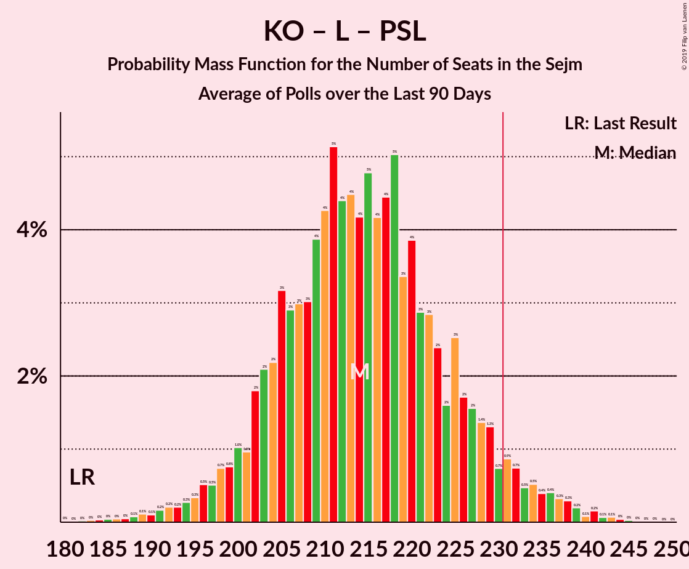

# Poll Average

<a href="#voting-intentions">Voting Intentions</a> | <a href="#seats">Seats</a> | <a href="#coalitions">Coalitions</a> | <a href="#technical-information">Technical Information</a>

## Summary

The table below lists the polls on which the average is based. They are the most recent polls (less than 90 days old) registered and analyzed so far.

| Period     | Polling firm/Commissioner(s) | PiS | ZP | KO | PO | KP | K | .N | PSL | SLD | W | Konf | R | Wi | MN | L | BS |
|:----------:|:----------------------------:|:--:|:--:|:--:|:--:|:--:|:--:|:--:|:--:|:--:|:--:|:--:|:--:|:--:|:--:|:--:|:--:|
| 25 October 2015 | General Election | 37.6%   235 | 37.6%   235 | 31.7%   166 | 24.1%   138 | 13.9%   58 | 8.8%   42 | 7.6%   28 | 5.1%   16 | 7.6%   0 | 4.8%   0 | 4.8%   0 | 3.6%   0 | 0.0%   0 | 0.2%   1 | 11.7%   0 | 0.1%   0 |
| N/A | Poll Average | 40–46%   222–258 | 38–55%   215–301 | 21–32%   101–170 | N/A   N/A | 4–10%   0–41 | 4–6%   0–14 | N/A   N/A | 4–6%   0–22 | N/A   N/A | 3–5%   0–5 | 2–7%   0–17 | N/A   N/A | N/A   N/A | N/A   N/A | 9–15%   33–76 | 1–4%   0 |
| [4–6 September 2019](2019-09-06-Estymator.html) | Estymator   DoRzeczy.pl | N/A   N/A | 44–50%   238–275 | 25–30%   120–153 | N/A   N/A | 5–8%   0–25 | N/A   N/A | N/A   N/A | N/A   N/A | N/A   N/A | N/A   N/A | 3–5%   0–3 | N/A   N/A | N/A   N/A | N/A   N/A | 11–15%   43–67 | 1–3%   0 |
| [24 August–4 September 2019](2019-09-04-IBRiS.html) | IBRiS   Onet | N/A   N/A | 42–45%   253–269 | 20–22%   107–120 | N/A   N/A | 5–6%   9–19 | N/A   N/A | N/A   N/A | N/A   N/A | N/A   N/A | N/A   N/A | 4–5%   0–6 | N/A   N/A | N/A   N/A | N/A   N/A | 13–15%   66–77 | N/A   N/A |
| [23–29 August 2019](2019-08-29-DobraOpinia.html) | Dobra Opinia   PPG | N/A   N/A | 44–46%   244–253 | 29–31%   151–159 | N/A   N/A | 5–7%   8–14 | N/A   N/A | N/A   N/A | N/A   N/A | N/A   N/A | N/A   N/A | 4%   0 | N/A   N/A | N/A   N/A | N/A   N/A | 10–12%   42–48 | 2–3%   0 |
| [22–29 August 2019](2019-08-29-CBOS.html) | CBOS | N/A   N/A | 51–57%   276–311 | 19–25%   93–120 | N/A   N/A | 6–9%   8–32 | N/A   N/A | N/A   N/A | N/A   N/A | N/A   N/A | N/A   N/A | 2–3%   0 | N/A   N/A | N/A   N/A | N/A   N/A | 9–12%   32–51 | 2–5%   0 |
| [23–28 August 2019](2019-08-28-SocialChanges.html) | Social Changes   wpolityce.pl | N/A   N/A | 42–48%   215–251 | 28–34%   135–167 | N/A   N/A | 7–11%   22–46 | N/A   N/A | N/A   N/A | N/A   N/A | N/A   N/A | N/A   N/A | 4–7%   0–12 | N/A   N/A | N/A   N/A | N/A   N/A | 9–12%   30–49 | N/A   N/A |
| [26–28 August 2019](2019-08-28-Ipsos.html) | Ipsos   OKO | N/A   N/A | 38–44%   219–254 | 25–31%   138–168 | N/A   N/A | 4–7%   0–18 | N/A   N/A | N/A   N/A | N/A   N/A | N/A   N/A | N/A   N/A | 4–7%   0–15 | N/A   N/A | N/A   N/A | N/A   N/A | 11–15%   47–75 | 1–3%   0 |
| [24–26 August 2019](2019-08-26-CBMIndicator.html) | CBM Indicator   TVP | N/A   N/A | 38–44%   222–258 | 26–31%   142–174 | N/A   N/A | 4–7%   0–26 | N/A   N/A | N/A   N/A | N/A   N/A | N/A   N/A | N/A   N/A | 2–4%   0 | N/A   N/A | N/A   N/A | N/A   N/A | 9–13%   38–65 | N/A   N/A |
| [22 August 2019](2019-08-22-KantarPublic.html) | Kantar Public   TVN | N/A   N/A | 36–42%   205–243 | 27–33%   148–181 | N/A   N/A | 5–8%   0–27 | N/A   N/A | N/A   N/A | N/A   N/A | N/A   N/A | N/A   N/A | 5–8%   0–26 | N/A   N/A | N/A   N/A | N/A   N/A | 9–13%   36–60 | 1–2%   0 |
| [16–20 August 2019](2019-08-20-Ariadna.html) | Ariadna | N/A   N/A | 42–48%   242–277 | 24–30%   129–161 | N/A   N/A | 5–8%   0–27 | N/A   N/A | N/A   N/A | N/A   N/A | N/A   N/A | N/A   N/A | 3–5%   0–5 | N/A   N/A | N/A   N/A | N/A   N/A | 8–12%   32–52 | N/A   N/A |
| [6–7 August 2019](2019-08-07-InstytutBadańPollster.html) | Instytut Badań Pollster   Super Express | 40–46%   222–258 | N/A   N/A | 24–30%   126–156 | N/A   N/A | N/A   N/A | 4–6%   0–14 | N/A   N/A | 4–6%   0–22 | N/A   N/A | 3–5%   0–5 | N/A   N/A | N/A   N/A | N/A   N/A | N/A   N/A | 12–16%   51–78 | N/A   N/A |
| 25 October 2015 | General Election | 37.6%   235 | 37.6%   235 | 31.7%   166 | 24.1%   138 | 13.9%   58 | 8.8%   42 | 7.6%   28 | 5.1%   16 | 7.6%   0 | 4.8%   0 | 4.8%   0 | 3.6%   0 | 0.0%   0 | 0.2%   1 | 11.7%   0 | 0.1%   0 |

Only polls for which at least the sample size has been published are included in the table above.

**Legend:**
+ **Top half of each row:** Voting intentions (95% confidence interval)
+ **Bottom half of each row:** Seat projections for the Sejm (95% confidence interval)
+ **PiS:** Prawo i Sprawiedliwość
+ **ZP:** Zjednoczona Prawica
+ **KO:** Koalicja Obywatelska
+ **PO:** Platforma Obywatelska
+ **KP:** Koalicja Polska
+ **K:** Kukiz’15
+ **.N:** .Nowoczesna
+ **PSL:** Polskie Stronnictwo Ludowe
+ **SLD:** Sojusz Lewicy Demokratycznej
+ **W:** KORWiN
+ **Konf:** Konfederacja
+ **R:** Lewica Razem
+ **Wi:** Wiosna
+ **MN:** Mniejszość Niemiecka
+ **L:** Lewica
+ **BS:** Bezpartyjni Samorządowcy
+ **N/A (single party):** Party not included the published results
+ **N/A (entire row):** Calculation for this opinion poll not started yet

## Voting Intentions

### Confidence Intervals

| Party | Last Result | Median | 80% Confidence Interval | 90% Confidence Interval | 95% Confidence Interval | 99% Confidence Interval |
|:-----:|:-----------:|:------:|:-----------------------:|:-----------------------:|:-----------------------:|:-----------------------:|
| <a href="#prawo-i-sprawiedliwość">Prawo i Sprawiedliwość</a> | 37.6% | 43.0% | 41.1–45.0% |40.5–45.5% | 40.0–46.0% | 39.1–46.9% |
| <a href="#zjednoczona-prawica">Zjednoczona Prawica</a> | 37.6% | 44.1% | 39.5–52.0% |38.5–54.2% | 37.7–55.2% | 36.4–56.6% |
| <a href="#koalicja-obywatelska">Koalicja Obywatelska</a> | 31.7% | 27.9% | 21.5–30.7% |21.0–31.4% | 20.7–32.1% | 19.8–33.3% |
| <a href="#platforma-obywatelska">Platforma Obywatelska</a> | 24.1% | N/A | N/A |N/A | N/A | N/A |
| <a href="#koalicja-polska">Koalicja Polska</a> | 13.9% | 6.0% | 5.1–8.3% |4.7–9.3% | 4.4–9.9% | 3.9–10.8% |
| <a href="#lewica">Lewica</a> | 11.7% | 11.5% | 9.8–14.3% |9.3–14.7% | 9.0–15.1% | 8.4–16.0% |
| <a href="#kukiz’15">Kukiz’15</a> | 8.8% | 5.0% | 4.2–6.0% |4.0–6.2% | 3.8–6.5% | 3.5–7.0% |
| <a href="#.nowoczesna">.Nowoczesna</a> | 7.6% | N/A | N/A |N/A | N/A | N/A |
| <a href="#sojusz-lewicy-demokratycznej">Sojusz Lewicy Demokratycznej</a> | 7.6% | N/A | N/A |N/A | N/A | N/A |
| <a href="#polskie-stronnictwo-ludowe">Polskie Stronnictwo Ludowe</a> | 5.1% | 5.0% | 4.2–6.0% |4.0–6.2% | 3.8–6.5% | 3.5–7.0% |
| <a href="#korwin">KORWiN</a> | 4.8% | 4.1% | 3.4–4.9% |3.2–5.2% | 3.0–5.4% | 2.7–5.9% |
| <a href="#konfederacja">Konfederacja</a> | 4.8% | 4.3% | 2.7–5.9% |2.3–6.4% | 2.0–6.8% | 1.7–7.5% |
| <a href="#lewica-razem">Lewica Razem</a> | 3.6% | N/A | N/A |N/A | N/A | N/A |
| <a href="#mniejszość-niemiecka">Mniejszość Niemiecka</a> | 0.2% | N/A | N/A |N/A | N/A | N/A |
| <a href="#bezpartyjni-samorządowcy">Bezpartyjni Samorządowcy</a> | 0.1% | 2.2% | 1.0–3.5% |0.8–3.9% | 0.7–4.2% | 0.5–4.7% |
| <a href="#wiosna">Wiosna</a> | 0.0% | N/A | N/A |N/A | N/A | N/A |

### Zjednoczona Prawica

*For a full overview of the results for this party, see the [Zjednoczona Prawica](party-zjednoczonaprawica.html) page.*

| Voting Intentions | Probability | Accumulated | Special Marks |
|:-----------------:|:-----------:|:-----------:|:-------------:|
| 33.5–34.5% | 0% | 100% |  |
| 34.5–35.5% | 0.1% | 100% |  |
| 35.5–36.5% | 0.5% | 99.9% |  |
| 36.5–37.5% | 1.5% | 99.4% |  |
| 37.5–38.5% | 3% | 98% | Last Result |
| 38.5–39.5% | 5% | 95% |  |
| 39.5–40.5% | 7% | 90% |  |
| 40.5–41.5% | 7% | 83% |  |
| 41.5–42.5% | 7% | 76% |  |
| 42.5–43.5% | 12% | 69% |  |
| 43.5–44.5% | 13% | 57% | Median |
| 44.5–45.5% | 14% | 44% |  |
| 45.5–46.5% | 8% | 29% |  |
| 46.5–47.5% | 5% | 22% |  |
| 47.5–48.5% | 3% | 17% |  |
| 48.5–49.5% | 2% | 14% |  |
| 49.5–50.5% | 0.7% | 12% |  |
| 50.5–51.5% | 0.6% | 11% |  |
| 51.5–52.5% | 1.3% | 11% |  |
| 52.5–53.5% | 2% | 9% |  |
| 53.5–54.5% | 3% | 7% |  |
| 54.5–55.5% | 2% | 4% |  |
| 55.5–56.5% | 1.2% | 2% |  |
| 56.5–57.5% | 0.5% | 0.6% |  |
| 57.5–58.5% | 0.1% | 0.1% |  |
| 58.5–59.5% | 0% | 0% |  |

### Prawo i Sprawiedliwość

*For a full overview of the results for this party, see the [Prawo i Sprawiedliwość](party-prawoisprawiedliwość.html) page.*

| Voting Intentions | Probability | Accumulated | Special Marks |
|:-----------------:|:-----------:|:-----------:|:-------------:|
| 36.5–37.5% | 0% | 100% |  |
| 37.5–38.5% | 0.1% | 100% | Last Result |
| 38.5–39.5% | 0.9% | 99.8% |  |
| 39.5–40.5% | 4% | 98.9% |  |
| 40.5–41.5% | 12% | 95% |  |
| 41.5–42.5% | 22% | 83% |  |
| 42.5–43.5% | 26% | 62% | Median |
| 43.5–44.5% | 21% | 36% |  |
| 44.5–45.5% | 11% | 15% |  |
| 45.5–46.5% | 4% | 5% |  |
| 46.5–47.5% | 0.9% | 1.0% |  |
| 47.5–48.5% | 0.1% | 0.1% |  |
| 48.5–49.5% | 0% | 0% |  |

### Koalicja Obywatelska

*For a full overview of the results for this party, see the [Koalicja Obywatelska](party-koalicjaobywatelska.html) page.*

| Voting Intentions | Probability | Accumulated | Special Marks |
|:-----------------:|:-----------:|:-----------:|:-------------:|
| 17.5–18.5% | 0% | 100% |  |
| 18.5–19.5% | 0.3% | 100% |  |
| 19.5–20.5% | 2% | 99.7% |  |
| 20.5–21.5% | 9% | 98% |  |
| 21.5–22.5% | 6% | 89% |  |
| 22.5–23.5% | 2% | 83% |  |
| 23.5–24.5% | 2% | 81% |  |
| 24.5–25.5% | 3% | 79% |  |
| 25.5–26.5% | 8% | 76% |  |
| 26.5–27.5% | 13% | 68% |  |
| 27.5–28.5% | 14% | 55% | Median |
| 28.5–29.5% | 14% | 41% |  |
| 29.5–30.5% | 16% | 27% |  |
| 30.5–31.5% | 7% | 12% |  |
| 31.5–32.5% | 3% | 4% | Last Result |
| 32.5–33.5% | 1.1% | 1.4% |  |
| 33.5–34.5% | 0.3% | 0.3% |  |
| 34.5–35.5% | 0% | 0.1% |  |
| 35.5–36.5% | 0% | 0% |  |

### Koalicja Polska

*For a full overview of the results for this party, see the [Koalicja Polska](party-koalicjapolska.html) page.*

| Voting Intentions | Probability | Accumulated | Special Marks |
|:-----------------:|:-----------:|:-----------:|:-------------:|
| 1.5–2.5% | 0% | 100% |  |
| 2.5–3.5% | 0.1% | 100% |  |
| 3.5–4.5% | 3% | 99.9% |  |
| 4.5–5.5% | 20% | 96% |  |
| 5.5–6.5% | 46% | 76% | Median |
| 6.5–7.5% | 15% | 30% |  |
| 7.5–8.5% | 6% | 15% |  |
| 8.5–9.5% | 5% | 9% |  |
| 9.5–10.5% | 3% | 4% |  |
| 10.5–11.5% | 0.8% | 0.8% |  |
| 11.5–12.5% | 0.1% | 0.1% |  |
| 12.5–13.5% | 0% | 0% |  |
| 13.5–14.5% | 0% | 0% | Last Result |

### Lewica

*For a full overview of the results for this party, see the [Lewica](party-lewica.html) page.*

| Voting Intentions | Probability | Accumulated | Special Marks |
|:-----------------:|:-----------:|:-----------:|:-------------:|
| 6.5–7.5% | 0% | 100% |  |
| 7.5–8.5% | 0.8% | 100% |  |
| 8.5–9.5% | 6% | 99.1% |  |
| 9.5–10.5% | 17% | 93% |  |
| 10.5–11.5% | 26% | 76% |  |
| 11.5–12.5% | 14% | 49% | Last Result, Median |
| 12.5–13.5% | 12% | 35% |  |
| 13.5–14.5% | 16% | 23% |  |
| 14.5–15.5% | 5% | 7% |  |
| 15.5–16.5% | 1.0% | 1.1% |  |
| 16.5–17.5% | 0.1% | 0.1% |  |
| 17.5–18.5% | 0% | 0% |  |

### Kukiz’15

*For a full overview of the results for this party, see the [Kukiz’15](party-kukiz’15.html) page.*

| Voting Intentions | Probability | Accumulated | Special Marks |
|:-----------------:|:-----------:|:-----------:|:-------------:|
| 1.5–2.5% | 0% | 100% |  |
| 2.5–3.5% | 0.7% | 100% |  |
| 3.5–4.5% | 22% | 99.3% |  |
| 4.5–5.5% | 54% | 77% | Median |
| 5.5–6.5% | 21% | 23% |  |
| 6.5–7.5% | 2% | 2% |  |
| 7.5–8.5% | 0.1% | 0.1% |  |
| 8.5–9.5% | 0% | 0% | Last Result |

### Polskie Stronnictwo Ludowe

*For a full overview of the results for this party, see the [Polskie Stronnictwo Ludowe](party-polskiestronnictwoludowe.html) page.*

| Voting Intentions | Probability | Accumulated | Special Marks |
|:-----------------:|:-----------:|:-----------:|:-------------:|
| 1.5–2.5% | 0% | 100% |  |
| 2.5–3.5% | 0.7% | 100% |  |
| 3.5–4.5% | 22% | 99.3% |  |
| 4.5–5.5% | 54% | 77% | Last Result, Median |
| 5.5–6.5% | 21% | 23% |  |
| 6.5–7.5% | 2% | 2% |  |
| 7.5–8.5% | 0.1% | 0.1% |  |
| 8.5–9.5% | 0% | 0% |  |

### Konfederacja

*For a full overview of the results for this party, see the [Konfederacja](party-konfederacja.html) page.*

| Voting Intentions | Probability | Accumulated | Special Marks |
|:-----------------:|:-----------:|:-----------:|:-------------:|
| 0.0–0.5% | 0% | 100% |  |
| 0.5–1.5% | 0.2% | 100% |  |
| 1.5–2.5% | 8% | 99.8% |  |
| 2.5–3.5% | 17% | 92% |  |
| 3.5–4.5% | 32% | 75% | Median |
| 4.5–5.5% | 27% | 43% | Last Result |
| 5.5–6.5% | 12% | 16% |  |
| 6.5–7.5% | 3% | 4% |  |
| 7.5–8.5% | 0.4% | 0.4% |  |
| 8.5–9.5% | 0% | 0% |  |

### KORWiN

*For a full overview of the results for this party, see the [KORWiN](party-korwin.html) page.*

| Voting Intentions | Probability | Accumulated | Special Marks |
|:-----------------:|:-----------:|:-----------:|:-------------:|
| 0.5–1.5% | 0% | 100% |  |
| 1.5–2.5% | 0.1% | 100% |  |
| 2.5–3.5% | 17% | 99.9% |  |
| 3.5–4.5% | 59% | 83% | Median |
| 4.5–5.5% | 22% | 23% | Last Result |
| 5.5–6.5% | 2% | 2% |  |
| 6.5–7.5% | 0% | 0% |  |

### Bezpartyjni Samorządowcy

*For a full overview of the results for this party, see the [Bezpartyjni Samorządowcy](party-bezpartyjnisamorządowcy.html) page.*

| Voting Intentions | Probability | Accumulated | Special Marks |
|:-----------------:|:-----------:|:-----------:|:-------------:|
| 0.0–0.5% | 0.5% | 100% | Last Result |
| 0.5–1.5% | 28% | 99.5% |  |
| 1.5–2.5% | 40% | 71% | Median |
| 2.5–3.5% | 22% | 31% |  |
| 3.5–4.5% | 8% | 9% |  |
| 4.5–5.5% | 0.8% | 0.8% |  |
| 5.5–6.5% | 0% | 0% |  |

## Seats

### Confidence Intervals

| Party | Last Result | Median | 80% Confidence Interval | 90% Confidence Interval | 95% Confidence Interval | 99% Confidence Interval |
|:-----:|:-----------:|:------:|:-----------------------:|:-----------------------:|:-----------------------:|:-----------------------:|
| <a href="#prawo-i-sprawiedliwość">Prawo i Sprawiedliwość</a> | 235 | 242 | 230–252 |226–254 | 222–258 | 216–265 |
| <a href="#zjednoczona-prawica">Zjednoczona Prawica</a> | 235 | 247 | 224–283 |220–294 | 215–301 | 207–309 |
| <a href="#koalicja-obywatelska">Koalicja Obywatelska</a> | 166 | 148 | 112–161 |107–166 | 101–170 | 95–179 |
| <a href="#platforma-obywatelska">Platforma Obywatelska</a> | 138 | N/A | N/A |N/A | N/A | N/A |
| <a href="#koalicja-polska">Koalicja Polska</a> | 58 | 13 | 6–28 |0–35 | 0–41 | 0–45 |
| <a href="#lewica">Lewica</a> | 0 | 48 | 37–69 |34–73 | 33–76 | 31–78 |
| <a href="#kukiz’15">Kukiz’15</a> | 42 | 3 | 0–10 |0–12 | 0–14 | 0–19 |
| <a href="#.nowoczesna">.Nowoczesna</a> | 28 | N/A | N/A |N/A | N/A | N/A |
| <a href="#sojusz-lewicy-demokratycznej">Sojusz Lewicy Demokratycznej</a> | 0 | N/A | N/A |N/A | N/A | N/A |
| <a href="#polskie-stronnictwo-ludowe">Polskie Stronnictwo Ludowe</a> | 16 | 0 | 0–17 |0–20 | 0–22 | 0–23 |
| <a href="#korwin">KORWiN</a> | 0 | 0 | 0 |0–3 | 0–5 | 0–9 |
| <a href="#konfederacja">Konfederacja</a> | 0 | 0 | 0–9 |0–13 | 0–17 | 0–24 |
| <a href="#lewica-razem">Lewica Razem</a> | 0 | N/A | N/A |N/A | N/A | N/A |
| <a href="#mniejszość-niemiecka">Mniejszość Niemiecka</a> | 1 | N/A | N/A |N/A | N/A | N/A |
| <a href="#bezpartyjni-samorządowcy">Bezpartyjni Samorządowcy</a> | 0 | 0 | 0 |0 | 0 | 0 |
| <a href="#wiosna">Wiosna</a> | 0 | N/A | N/A |N/A | N/A | N/A |

### Zjednoczona Prawica

*For a full overview of the results for this party, see the [Zjednoczona Prawica](party-zjednoczonaprawica.html) page.*

| Number of Seats | Probability | Accumulated | Special Marks |
|:---------------:|:-----------:|:-----------:|:-------------:|
| 199 | 0% | 100% |  |
| 200 | 0% | 99.9% |  |
| 201 | 0% | 99.9% |  |
| 202 | 0% | 99.9% |  |
| 203 | 0% | 99.8% |  |
| 204 | 0.1% | 99.8% |  |
| 205 | 0.1% | 99.7% |  |
| 206 | 0.1% | 99.7% |  |
| 207 | 0.1% | 99.6% |  |
| 208 | 0.1% | 99.5% |  |
| 209 | 0.2% | 99.4% |  |
| 210 | 0.2% | 99.2% |  |
| 211 | 0.2% | 99.0% |  |
| 212 | 0.2% | 98.8% |  |
| 213 | 0.3% | 98.6% |  |
| 214 | 0.4% | 98% |  |
| 215 | 0.5% | 98% |  |
| 216 | 0.6% | 97% |  |
| 217 | 0.5% | 97% |  |
| 218 | 0.6% | 96% |  |
| 219 | 0.8% | 96% |  |
| 220 | 0.8% | 95% |  |
| 221 | 1.0% | 94% |  |
| 222 | 1.1% | 93% |  |
| 223 | 1.2% | 92% |  |
| 224 | 1.1% | 91% |  |
| 225 | 1.1% | 90% |  |
| 226 | 1.0% | 89% |  |
| 227 | 1.1% | 88% |  |
| 228 | 1.2% | 87% |  |
| 229 | 1.2% | 85% |  |
| 230 | 1.1% | 84% |  |
| 231 | 1.2% | 83% | Majority |
| 232 | 1.3% | 82% |  |
| 233 | 1.1% | 81% |  |
| 234 | 1.4% | 79% |  |
| 235 | 1.5% | 78% | Last Result |
| 236 | 2% | 77% |  |
| 237 | 2% | 75% |  |
| 238 | 1.4% | 73% |  |
| 239 | 2% | 72% |  |
| 240 | 2% | 70% |  |
| 241 | 2% | 69% |  |
| 242 | 2% | 67% |  |
| 243 | 2% | 65% |  |
| 244 | 3% | 63% |  |
| 245 | 4% | 60% |  |
| 246 | 3% | 56% |  |
| 247 | 4% | 53% | Median |
| 248 | 3% | 50% |  |
| 249 | 3% | 47% |  |
| 250 | 3% | 44% |  |
| 251 | 2% | 41% |  |
| 252 | 2% | 39% |  |
| 253 | 1.5% | 37% |  |
| 254 | 2% | 36% |  |
| 255 | 2% | 34% |  |
| 256 | 2% | 32% |  |
| 257 | 2% | 31% |  |
| 258 | 2% | 29% |  |
| 259 | 2% | 28% |  |
| 260 | 2% | 26% |  |
| 261 | 2% | 24% |  |
| 262 | 2% | 22% |  |
| 263 | 1.4% | 21% |  |
| 264 | 1.3% | 19% |  |
| 265 | 1.1% | 18% |  |
| 266 | 1.1% | 17% |  |
| 267 | 1.0% | 16% |  |
| 268 | 0.7% | 15% |  |
| 269 | 0.6% | 14% |  |
| 270 | 0.5% | 13% |  |
| 271 | 0.4% | 13% |  |
| 272 | 0.3% | 13% |  |
| 273 | 0.3% | 12% |  |
| 274 | 0.3% | 12% |  |
| 275 | 0.2% | 12% |  |
| 276 | 0.2% | 11% |  |
| 277 | 0.2% | 11% |  |
| 278 | 0.2% | 11% |  |
| 279 | 0.2% | 11% |  |
| 280 | 0.2% | 11% |  |
| 281 | 0.2% | 10% |  |
| 282 | 0.2% | 10% |  |
| 283 | 0.2% | 10% |  |
| 284 | 0.3% | 10% |  |
| 285 | 0.3% | 9% |  |
| 286 | 0.5% | 9% |  |
| 287 | 0.4% | 9% |  |
| 288 | 0.6% | 8% |  |
| 289 | 0.3% | 8% |  |
| 290 | 0.5% | 7% |  |
| 291 | 0.4% | 7% |  |
| 292 | 0.4% | 6% |  |
| 293 | 0.5% | 6% |  |
| 294 | 0.5% | 5% |  |
| 295 | 0.3% | 5% |  |
| 296 | 0.4% | 5% |  |
| 297 | 0.6% | 4% |  |
| 298 | 0.3% | 4% |  |
| 299 | 0.3% | 3% |  |
| 300 | 0.4% | 3% |  |
| 301 | 0.4% | 3% |  |
| 302 | 0.3% | 2% |  |
| 303 | 0.2% | 2% |  |
| 304 | 0.3% | 2% |  |
| 305 | 0.2% | 1.4% |  |
| 306 | 0.2% | 1.2% |  |
| 307 | 0.2% | 1.0% |  |
| 308 | 0.2% | 0.8% |  |
| 309 | 0.1% | 0.6% |  |
| 310 | 0.1% | 0.5% |  |
| 311 | 0.1% | 0.4% |  |
| 312 | 0.1% | 0.3% |  |
| 313 | 0.1% | 0.2% |  |
| 314 | 0% | 0.1% |  |
| 315 | 0% | 0.1% |  |
| 316 | 0% | 0.1% |  |
| 317 | 0% | 0% |  |

### Prawo i Sprawiedliwość

*For a full overview of the results for this party, see the [Prawo i Sprawiedliwość](party-prawoisprawiedliwość.html) page.*

| Number of Seats | Probability | Accumulated | Special Marks |
|:---------------:|:-----------:|:-----------:|:-------------:|
| 210 | 0% | 100% |  |
| 211 | 0% | 99.9% |  |
| 212 | 0% | 99.9% |  |
| 213 | 0.1% | 99.9% |  |
| 214 | 0.1% | 99.8% |  |
| 215 | 0.2% | 99.7% |  |
| 216 | 0.2% | 99.6% |  |
| 217 | 0.2% | 99.4% |  |
| 218 | 0.2% | 99.2% |  |
| 219 | 0.3% | 99.0% |  |
| 220 | 0.3% | 98.6% |  |
| 221 | 0.4% | 98% |  |
| 222 | 0.5% | 98% |  |
| 223 | 0.5% | 97% |  |
| 224 | 0.9% | 97% |  |
| 225 | 0.6% | 96% |  |
| 226 | 1.0% | 95% |  |
| 227 | 1.0% | 94% |  |
| 228 | 1.5% | 93% |  |
| 229 | 2% | 92% |  |
| 230 | 1.1% | 90% |  |
| 231 | 2% | 89% | Majority |
| 232 | 2% | 87% |  |
| 233 | 2% | 85% |  |
| 234 | 3% | 83% |  |
| 235 | 3% | 80% | Last Result |
| 236 | 3% | 77% |  |
| 237 | 5% | 74% |  |
| 238 | 5% | 69% |  |
| 239 | 5% | 65% |  |
| 240 | 5% | 60% |  |
| 241 | 3% | 55% |  |
| 242 | 5% | 52% | Median |
| 243 | 5% | 47% |  |
| 244 | 5% | 42% |  |
| 245 | 6% | 37% |  |
| 246 | 4% | 31% |  |
| 247 | 4% | 27% |  |
| 248 | 3% | 23% |  |
| 249 | 3% | 20% |  |
| 250 | 3% | 17% |  |
| 251 | 3% | 14% |  |
| 252 | 2% | 11% |  |
| 253 | 1.3% | 8% |  |
| 254 | 2% | 7% |  |
| 255 | 0.8% | 5% |  |
| 256 | 0.5% | 4% |  |
| 257 | 0.8% | 4% |  |
| 258 | 0.5% | 3% |  |
| 259 | 0.4% | 2% |  |
| 260 | 0.4% | 2% |  |
| 261 | 0.2% | 2% |  |
| 262 | 0.3% | 1.3% |  |
| 263 | 0.2% | 1.0% |  |
| 264 | 0.2% | 0.8% |  |
| 265 | 0.1% | 0.6% |  |
| 266 | 0.1% | 0.5% |  |
| 267 | 0.1% | 0.4% |  |
| 268 | 0.1% | 0.3% |  |
| 269 | 0% | 0.2% |  |
| 270 | 0% | 0.2% |  |
| 271 | 0.1% | 0.1% |  |
| 272 | 0% | 0.1% |  |
| 273 | 0% | 0.1% |  |
| 274 | 0% | 0% |  |

### Koalicja Obywatelska

*For a full overview of the results for this party, see the [Koalicja Obywatelska](party-koalicjaobywatelska.html) page.*

| Number of Seats | Probability | Accumulated | Special Marks |
|:---------------:|:-----------:|:-----------:|:-------------:|
| 91 | 0% | 100% |  |
| 92 | 0.1% | 99.9% |  |
| 93 | 0.1% | 99.8% |  |
| 94 | 0.2% | 99.7% |  |
| 95 | 0.2% | 99.6% |  |
| 96 | 0.3% | 99.4% |  |
| 97 | 0.4% | 99.1% |  |
| 98 | 0.4% | 98.7% |  |
| 99 | 0.3% | 98% |  |
| 100 | 0.3% | 98% |  |
| 101 | 0.5% | 98% |  |
| 102 | 0.4% | 97% |  |
| 103 | 0.4% | 97% |  |
| 104 | 0.4% | 96% |  |
| 105 | 0.3% | 96% |  |
| 106 | 0.5% | 96% |  |
| 107 | 0.6% | 95% |  |
| 108 | 0.5% | 95% |  |
| 109 | 0.9% | 94% |  |
| 110 | 1.0% | 93% |  |
| 111 | 0.8% | 92% |  |
| 112 | 4% | 91% |  |
| 113 | 0.8% | 87% |  |
| 114 | 1.2% | 87% |  |
| 115 | 2% | 85% |  |
| 116 | 1.4% | 84% |  |
| 117 | 0.6% | 82% |  |
| 118 | 0.6% | 82% |  |
| 119 | 0.8% | 81% |  |
| 120 | 0.5% | 80% |  |
| 121 | 0.2% | 80% |  |
| 122 | 0.2% | 80% |  |
| 123 | 0.2% | 80% |  |
| 124 | 0.3% | 79% |  |
| 125 | 0.3% | 79% |  |
| 126 | 0.2% | 79% |  |
| 127 | 0.3% | 79% |  |
| 128 | 0.4% | 78% |  |
| 129 | 0.4% | 78% |  |
| 130 | 0.4% | 78% |  |
| 131 | 0.4% | 77% |  |
| 132 | 0.5% | 77% |  |
| 133 | 0.5% | 76% |  |
| 134 | 0.7% | 76% |  |
| 135 | 0.7% | 75% |  |
| 136 | 1.0% | 74% |  |
| 137 | 1.3% | 73% |  |
| 138 | 1.1% | 72% |  |
| 139 | 2% | 71% |  |
| 140 | 2% | 69% |  |
| 141 | 2% | 67% |  |
| 142 | 2% | 65% |  |
| 143 | 2% | 64% |  |
| 144 | 2% | 61% |  |
| 145 | 3% | 59% |  |
| 146 | 3% | 56% |  |
| 147 | 3% | 54% |  |
| 148 | 3% | 50% | Median |
| 149 | 3% | 47% |  |
| 150 | 3% | 45% |  |
| 151 | 3% | 42% |  |
| 152 | 3% | 39% |  |
| 153 | 3% | 36% |  |
| 154 | 3% | 33% |  |
| 155 | 3% | 30% |  |
| 156 | 5% | 27% |  |
| 157 | 2% | 22% |  |
| 158 | 5% | 20% |  |
| 159 | 2% | 14% |  |
| 160 | 1.4% | 12% |  |
| 161 | 1.2% | 11% |  |
| 162 | 1.2% | 10% |  |
| 163 | 1.3% | 8% |  |
| 164 | 0.9% | 7% |  |
| 165 | 0.8% | 6% |  |
| 166 | 0.8% | 5% | Last Result |
| 167 | 0.6% | 5% |  |
| 168 | 0.7% | 4% |  |
| 169 | 0.5% | 3% |  |
| 170 | 0.4% | 3% |  |
| 171 | 0.3% | 2% |  |
| 172 | 0.3% | 2% |  |
| 173 | 0.3% | 2% |  |
| 174 | 0.3% | 2% |  |
| 175 | 0.3% | 1.3% |  |
| 176 | 0.2% | 0.9% |  |
| 177 | 0.1% | 0.7% |  |
| 178 | 0.1% | 0.6% |  |
| 179 | 0.1% | 0.5% |  |
| 180 | 0.1% | 0.4% |  |
| 181 | 0.1% | 0.3% |  |
| 182 | 0.1% | 0.3% |  |
| 183 | 0.1% | 0.2% |  |
| 184 | 0% | 0.1% |  |
| 185 | 0% | 0.1% |  |
| 186 | 0% | 0.1% |  |
| 187 | 0% | 0% |  |

### Koalicja Polska

*For a full overview of the results for this party, see the [Koalicja Polska](party-koalicjapolska.html) page.*

| Number of Seats | Probability | Accumulated | Special Marks |
|:---------------:|:-----------:|:-----------:|:-------------:|
| 0 | 9% | 100% |  |
| 1 | 0% | 91% |  |
| 2 | 0% | 91% |  |
| 3 | 0% | 91% |  |
| 4 | 0% | 91% |  |
| 5 | 0.1% | 91% |  |
| 6 | 1.0% | 90% |  |
| 7 | 2% | 89% |  |
| 8 | 3% | 87% |  |
| 9 | 4% | 84% |  |
| 10 | 5% | 80% |  |
| 11 | 10% | 75% |  |
| 12 | 14% | 66% |  |
| 13 | 8% | 52% | Median |
| 14 | 5% | 44% |  |
| 15 | 3% | 38% |  |
| 16 | 3% | 36% |  |
| 17 | 2% | 32% |  |
| 18 | 2% | 30% |  |
| 19 | 2% | 28% |  |
| 20 | 2% | 26% |  |
| 21 | 2% | 23% |  |
| 22 | 2% | 22% |  |
| 23 | 2% | 20% |  |
| 24 | 2% | 17% |  |
| 25 | 1.5% | 16% |  |
| 26 | 2% | 14% |  |
| 27 | 1.2% | 12% |  |
| 28 | 0.9% | 11% |  |
| 29 | 0.9% | 10% |  |
| 30 | 0.9% | 9% |  |
| 31 | 0.8% | 8% |  |
| 32 | 0.5% | 7% |  |
| 33 | 0.6% | 7% |  |
| 34 | 0.6% | 6% |  |
| 35 | 0.7% | 6% |  |
| 36 | 0.5% | 5% |  |
| 37 | 0.4% | 4% |  |
| 38 | 0.4% | 4% |  |
| 39 | 0.4% | 3% |  |
| 40 | 0.5% | 3% |  |
| 41 | 0.7% | 3% |  |
| 42 | 0.6% | 2% |  |
| 43 | 0.5% | 1.2% |  |
| 44 | 0.1% | 0.7% |  |
| 45 | 0.2% | 0.6% |  |
| 46 | 0.1% | 0.4% |  |
| 47 | 0.1% | 0.2% |  |
| 48 | 0.1% | 0.2% |  |
| 49 | 0% | 0.1% |  |
| 50 | 0% | 0.1% |  |
| 51 | 0% | 0% |  |
| 52 | 0% | 0% |  |
| 53 | 0% | 0% |  |
| 54 | 0% | 0% |  |
| 55 | 0% | 0% |  |
| 56 | 0% | 0% |  |
| 57 | 0% | 0% |  |
| 58 | 0% | 0% | Last Result |

### Lewica

*For a full overview of the results for this party, see the [Lewica](party-lewica.html) page.*

| Number of Seats | Probability | Accumulated | Special Marks |
|:---------------:|:-----------:|:-----------:|:-------------:|
| 0 | 0% | 100% | Last Result |
| 1 | 0% | 100% |  |
| 2 | 0% | 100% |  |
| 3 | 0% | 100% |  |
| 4 | 0% | 100% |  |
| 5 | 0% | 100% |  |
| 6 | 0% | 100% |  |
| 7 | 0% | 100% |  |
| 8 | 0% | 100% |  |
| 9 | 0% | 100% |  |
| 10 | 0% | 100% |  |
| 11 | 0% | 100% |  |
| 12 | 0% | 100% |  |
| 13 | 0% | 100% |  |
| 14 | 0% | 100% |  |
| 15 | 0% | 100% |  |
| 16 | 0% | 100% |  |
| 17 | 0% | 100% |  |
| 18 | 0% | 100% |  |
| 19 | 0% | 100% |  |
| 20 | 0% | 100% |  |
| 21 | 0% | 100% |  |
| 22 | 0% | 100% |  |
| 23 | 0% | 100% |  |
| 24 | 0% | 100% |  |
| 25 | 0% | 100% |  |
| 26 | 0% | 100% |  |
| 27 | 0.1% | 100% |  |
| 28 | 0.1% | 99.9% |  |
| 29 | 0.1% | 99.8% |  |
| 30 | 0.2% | 99.7% |  |
| 31 | 0.5% | 99.5% |  |
| 32 | 1.5% | 99.0% |  |
| 33 | 1.3% | 98% |  |
| 34 | 2% | 96% |  |
| 35 | 1.4% | 94% |  |
| 36 | 2% | 93% |  |
| 37 | 2% | 91% |  |
| 38 | 2% | 89% |  |
| 39 | 2% | 87% |  |
| 40 | 2% | 84% |  |
| 41 | 2% | 82% |  |
| 42 | 6% | 80% |  |
| 43 | 4% | 75% |  |
| 44 | 9% | 71% |  |
| 45 | 3% | 62% |  |
| 46 | 4% | 59% |  |
| 47 | 3% | 54% |  |
| 48 | 3% | 51% | Median |
| 49 | 2% | 48% |  |
| 50 | 2% | 47% |  |
| 51 | 2% | 44% |  |
| 52 | 2% | 42% |  |
| 53 | 2% | 40% |  |
| 54 | 2% | 38% |  |
| 55 | 2% | 37% |  |
| 56 | 2% | 35% |  |
| 57 | 1.4% | 33% |  |
| 58 | 2% | 32% |  |
| 59 | 1.3% | 30% |  |
| 60 | 1.3% | 29% |  |
| 61 | 1.3% | 28% |  |
| 62 | 2% | 27% |  |
| 63 | 2% | 25% |  |
| 64 | 3% | 23% |  |
| 65 | 3% | 20% |  |
| 66 | 2% | 18% |  |
| 67 | 3% | 15% |  |
| 68 | 2% | 13% |  |
| 69 | 1.2% | 11% |  |
| 70 | 2% | 9% |  |
| 71 | 1.1% | 8% |  |
| 72 | 1.0% | 7% |  |
| 73 | 1.0% | 6% |  |
| 74 | 1.4% | 5% |  |
| 75 | 0.8% | 4% |  |
| 76 | 2% | 3% |  |
| 77 | 0.7% | 1.2% |  |
| 78 | 0.2% | 0.6% |  |
| 79 | 0.1% | 0.3% |  |
| 80 | 0.1% | 0.2% |  |
| 81 | 0% | 0.1% |  |
| 82 | 0% | 0.1% |  |
| 83 | 0% | 0% |  |

### Kukiz’15

*For a full overview of the results for this party, see the [Kukiz’15](party-kukiz’15.html) page.*

| Number of Seats | Probability | Accumulated | Special Marks |
|:---------------:|:-----------:|:-----------:|:-------------:|
| 0 | 48% | 100% |  |
| 1 | 0% | 52% |  |
| 2 | 0.1% | 52% |  |
| 3 | 4% | 52% | Median |
| 4 | 7% | 48% |  |
| 5 | 10% | 41% |  |
| 6 | 7% | 31% |  |
| 7 | 4% | 23% |  |
| 8 | 4% | 20% |  |
| 9 | 3% | 16% |  |
| 10 | 5% | 13% |  |
| 11 | 3% | 8% |  |
| 12 | 1.0% | 5% |  |
| 13 | 1.0% | 4% |  |
| 14 | 1.1% | 3% |  |
| 15 | 0.7% | 2% |  |
| 16 | 0.3% | 1.5% |  |
| 17 | 0.3% | 1.2% |  |
| 18 | 0.1% | 0.9% |  |
| 19 | 0.2% | 0.7% |  |
| 20 | 0.1% | 0.5% |  |
| 21 | 0.1% | 0.4% |  |
| 22 | 0.1% | 0.3% |  |
| 23 | 0.1% | 0.2% |  |
| 24 | 0% | 0.1% |  |
| 25 | 0% | 0.1% |  |
| 26 | 0% | 0.1% |  |
| 27 | 0% | 0.1% |  |
| 28 | 0% | 0% |  |
| 29 | 0% | 0% |  |
| 30 | 0% | 0% |  |
| 31 | 0% | 0% |  |
| 32 | 0% | 0% |  |
| 33 | 0% | 0% |  |
| 34 | 0% | 0% |  |
| 35 | 0% | 0% |  |
| 36 | 0% | 0% |  |
| 37 | 0% | 0% |  |
| 38 | 0% | 0% |  |
| 39 | 0% | 0% |  |
| 40 | 0% | 0% |  |
| 41 | 0% | 0% |  |
| 42 | 0% | 0% | Last Result |

### Polskie Stronnictwo Ludowe

*For a full overview of the results for this party, see the [Polskie Stronnictwo Ludowe](party-polskiestronnictwoludowe.html) page.*

| Number of Seats | Probability | Accumulated | Special Marks |
|:---------------:|:-----------:|:-----------:|:-------------:|
| 0 | 51% | 100% | Median |
| 1 | 0% | 49% |  |
| 2 | 0% | 49% |  |
| 3 | 0% | 49% |  |
| 4 | 0% | 49% |  |
| 5 | 0% | 49% |  |
| 6 | 0% | 49% |  |
| 7 | 0% | 49% |  |
| 8 | 0% | 49% |  |
| 9 | 0% | 49% |  |
| 10 | 0% | 49% |  |
| 11 | 5% | 49% |  |
| 12 | 3% | 44% |  |
| 13 | 4% | 41% |  |
| 14 | 6% | 37% |  |
| 15 | 10% | 31% |  |
| 16 | 9% | 21% | Last Result |
| 17 | 3% | 12% |  |
| 18 | 2% | 9% |  |
| 19 | 2% | 8% |  |
| 20 | 2% | 6% |  |
| 21 | 1.2% | 4% |  |
| 22 | 2% | 3% |  |
| 23 | 0.7% | 1.1% |  |
| 24 | 0.3% | 0.4% |  |
| 25 | 0.1% | 0.1% |  |
| 26 | 0% | 0.1% |  |
| 27 | 0% | 0% |  |

### Konfederacja

*For a full overview of the results for this party, see the [Konfederacja](party-konfederacja.html) page.*

| Number of Seats | Probability | Accumulated | Special Marks |
|:---------------:|:-----------:|:-----------:|:-------------:|
| 0 | 72% | 100% | Last Result, Median |
| 1 | 0% | 28% |  |
| 2 | 3% | 28% |  |
| 3 | 2% | 24% |  |
| 4 | 3% | 23% |  |
| 5 | 3% | 19% |  |
| 6 | 2% | 16% |  |
| 7 | 2% | 14% |  |
| 8 | 2% | 12% |  |
| 9 | 1.4% | 11% |  |
| 10 | 1.2% | 9% |  |
| 11 | 1.3% | 8% |  |
| 12 | 2% | 7% |  |
| 13 | 0.8% | 5% |  |
| 14 | 0.7% | 4% |  |
| 15 | 0.5% | 4% |  |
| 16 | 0.5% | 3% |  |
| 17 | 0.3% | 3% |  |
| 18 | 0.3% | 2% |  |
| 19 | 0.3% | 2% |  |
| 20 | 0.3% | 2% |  |
| 21 | 0.2% | 1.3% |  |
| 22 | 0.3% | 1.1% |  |
| 23 | 0.2% | 0.8% |  |
| 24 | 0.2% | 0.6% |  |
| 25 | 0.1% | 0.5% |  |
| 26 | 0.1% | 0.3% |  |
| 27 | 0.1% | 0.2% |  |
| 28 | 0.1% | 0.2% |  |
| 29 | 0% | 0.1% |  |
| 30 | 0% | 0.1% |  |
| 31 | 0% | 0% |  |

### KORWiN

*For a full overview of the results for this party, see the [KORWiN](party-korwin.html) page.*

| Number of Seats | Probability | Accumulated | Special Marks |
|:---------------:|:-----------:|:-----------:|:-------------:|
| 0 | 92% | 100% | Last Result, Median |
| 1 | 0% | 8% |  |
| 2 | 1.4% | 8% |  |
| 3 | 2% | 6% |  |
| 4 | 1.4% | 4% |  |
| 5 | 0.8% | 3% |  |
| 6 | 1.1% | 2% |  |
| 7 | 0.5% | 1.2% |  |
| 8 | 0.2% | 0.7% |  |
| 9 | 0.2% | 0.5% |  |
| 10 | 0.1% | 0.3% |  |
| 11 | 0.1% | 0.2% |  |
| 12 | 0% | 0.1% |  |
| 13 | 0% | 0.1% |  |
| 14 | 0% | 0% |  |

### Bezpartyjni Samorządowcy

*For a full overview of the results for this party, see the [Bezpartyjni Samorządowcy](party-bezpartyjnisamorządowcy.html) page.*

| Number of Seats | Probability | Accumulated | Special Marks |
|:---------------:|:-----------:|:-----------:|:-------------:|
| 0 | 99.8% | 100% | Last Result, Median |
| 1 | 0% | 0.2% |  |
| 2 | 0% | 0.2% |  |
| 3 | 0% | 0.2% |  |
| 4 | 0% | 0.2% |  |
| 5 | 0% | 0.2% |  |
| 6 | 0% | 0.2% |  |
| 7 | 0% | 0.2% |  |
| 8 | 0% | 0.2% |  |
| 9 | 0% | 0.2% |  |
| 10 | 0% | 0.2% |  |
| 11 | 0% | 0.2% |  |
| 12 | 0% | 0.2% |  |
| 13 | 0% | 0.2% |  |
| 14 | 0% | 0.2% |  |
| 15 | 0% | 0.2% |  |
| 16 | 0% | 0.2% |  |
| 17 | 0% | 0.2% |  |
| 18 | 0% | 0.2% |  |
| 19 | 0% | 0.2% |  |
| 20 | 0% | 0.2% |  |
| 21 | 0% | 0.2% |  |
| 22 | 0% | 0.1% |  |
| 23 | 0.1% | 0.1% |  |
| 24 | 0% | 0% |  |

## Coalitions

### Confidence Intervals

| Coalition | Last Result | Median | Majority? | 80% Confidence Interval | 90% Confidence Interval | 95% Confidence Interval | 99% Confidence Interval |
|:---------:|:-----------:|:------:|:---------:|:-----------------------:|:-----------------------:|:-----------------------:|:-----------------------:|
| Zjednoczona Prawica | 235 | 247 | 83% | 224–283 | 220–294 | 215–301 | 207–309 |
| Prawo i Sprawiedliwość | 235 | 242 | 89% | 230–252 | 226–254 | 222–258 | 216–265 |
| Koalicja Obywatelska – Koalicja Polska – Lewica | 224 | 212 | 8% | 177–229 | 165–234 | 159–238 | 151–244 |
| Koalicja Obywatelska – Lewica – Polskie Stronnictwo Ludowe | 182 | 214 | 5% | 203–226 | 200–230 | 197–234 | 190–239 |
| Koalicja Obywatelska – Lewica | 166 | 198 | 0.5% | 166–214 | 148–219 | 141–225 | 133–230 |
| Koalicja Obywatelska – Koalicja Polska | 224 | 162 | 0% | 125–184 | 122–190 | 118–194 | 111–201 |
| Koalicja Obywatelska | 166 | 148 | 0% | 112–161 | 107–166 | 101–170 | 95–179 |
| Koalicja Obywatelska – Polskie Stronnictwo Ludowe | 182 | 150 | 0% | 138–162 | 135–165 | 132–168 | 125–174 |

### Zjednoczona Prawica

| Number of Seats | Probability | Accumulated | Special Marks |
|:---------------:|:-----------:|:-----------:|:-------------:|
| 199 | 0% | 100% |  |
| 200 | 0% | 99.9% |  |
| 201 | 0% | 99.9% |  |
| 202 | 0% | 99.9% |  |
| 203 | 0% | 99.8% |  |
| 204 | 0.1% | 99.8% |  |
| 205 | 0.1% | 99.7% |  |
| 206 | 0.1% | 99.7% |  |
| 207 | 0.1% | 99.6% |  |
| 208 | 0.1% | 99.5% |  |
| 209 | 0.2% | 99.4% |  |
| 210 | 0.2% | 99.2% |  |
| 211 | 0.2% | 99.0% |  |
| 212 | 0.2% | 98.8% |  |
| 213 | 0.3% | 98.6% |  |
| 214 | 0.4% | 98% |  |
| 215 | 0.5% | 98% |  |
| 216 | 0.6% | 97% |  |
| 217 | 0.5% | 97% |  |
| 218 | 0.6% | 96% |  |
| 219 | 0.8% | 96% |  |
| 220 | 0.8% | 95% |  |
| 221 | 1.0% | 94% |  |
| 222 | 1.1% | 93% |  |
| 223 | 1.2% | 92% |  |
| 224 | 1.1% | 91% |  |
| 225 | 1.1% | 90% |  |
| 226 | 1.0% | 89% |  |
| 227 | 1.1% | 88% |  |
| 228 | 1.2% | 87% |  |
| 229 | 1.2% | 85% |  |
| 230 | 1.1% | 84% |  |
| 231 | 1.2% | 83% | Majority |
| 232 | 1.3% | 82% |  |
| 233 | 1.1% | 81% |  |
| 234 | 1.4% | 79% |  |
| 235 | 1.5% | 78% | Last Result |
| 236 | 2% | 77% |  |
| 237 | 2% | 75% |  |
| 238 | 1.4% | 73% |  |
| 239 | 2% | 72% |  |
| 240 | 2% | 70% |  |
| 241 | 2% | 69% |  |
| 242 | 2% | 67% |  |
| 243 | 2% | 65% |  |
| 244 | 3% | 63% |  |
| 245 | 4% | 60% |  |
| 246 | 3% | 56% |  |
| 247 | 4% | 53% | Median |
| 248 | 3% | 50% |  |
| 249 | 3% | 47% |  |
| 250 | 3% | 44% |  |
| 251 | 2% | 41% |  |
| 252 | 2% | 39% |  |
| 253 | 1.5% | 37% |  |
| 254 | 2% | 36% |  |
| 255 | 2% | 34% |  |
| 256 | 2% | 32% |  |
| 257 | 2% | 31% |  |
| 258 | 2% | 29% |  |
| 259 | 2% | 28% |  |
| 260 | 2% | 26% |  |
| 261 | 2% | 24% |  |
| 262 | 2% | 22% |  |
| 263 | 1.4% | 21% |  |
| 264 | 1.3% | 19% |  |
| 265 | 1.1% | 18% |  |
| 266 | 1.1% | 17% |  |
| 267 | 1.0% | 16% |  |
| 268 | 0.7% | 15% |  |
| 269 | 0.6% | 14% |  |
| 270 | 0.5% | 13% |  |
| 271 | 0.4% | 13% |  |
| 272 | 0.3% | 13% |  |
| 273 | 0.3% | 12% |  |
| 274 | 0.3% | 12% |  |
| 275 | 0.2% | 12% |  |
| 276 | 0.2% | 11% |  |
| 277 | 0.2% | 11% |  |
| 278 | 0.2% | 11% |  |
| 279 | 0.2% | 11% |  |
| 280 | 0.2% | 11% |  |
| 281 | 0.2% | 10% |  |
| 282 | 0.2% | 10% |  |
| 283 | 0.2% | 10% |  |
| 284 | 0.3% | 10% |  |
| 285 | 0.3% | 9% |  |
| 286 | 0.5% | 9% |  |
| 287 | 0.4% | 9% |  |
| 288 | 0.6% | 8% |  |
| 289 | 0.3% | 8% |  |
| 290 | 0.5% | 7% |  |
| 291 | 0.4% | 7% |  |
| 292 | 0.4% | 6% |  |
| 293 | 0.5% | 6% |  |
| 294 | 0.5% | 5% |  |
| 295 | 0.3% | 5% |  |
| 296 | 0.4% | 5% |  |
| 297 | 0.6% | 4% |  |
| 298 | 0.3% | 4% |  |
| 299 | 0.3% | 3% |  |
| 300 | 0.4% | 3% |  |
| 301 | 0.4% | 3% |  |
| 302 | 0.3% | 2% |  |
| 303 | 0.2% | 2% |  |
| 304 | 0.3% | 2% |  |
| 305 | 0.2% | 1.4% |  |
| 306 | 0.2% | 1.2% |  |
| 307 | 0.2% | 1.0% |  |
| 308 | 0.2% | 0.8% |  |
| 309 | 0.1% | 0.6% |  |
| 310 | 0.1% | 0.5% |  |
| 311 | 0.1% | 0.4% |  |
| 312 | 0.1% | 0.3% |  |
| 313 | 0.1% | 0.2% |  |
| 314 | 0% | 0.1% |  |
| 315 | 0% | 0.1% |  |
| 316 | 0% | 0.1% |  |
| 317 | 0% | 0% |  |

### Prawo i Sprawiedliwość

| Number of Seats | Probability | Accumulated | Special Marks |
|:---------------:|:-----------:|:-----------:|:-------------:|
| 210 | 0% | 100% |  |
| 211 | 0% | 99.9% |  |
| 212 | 0% | 99.9% |  |
| 213 | 0.1% | 99.9% |  |
| 214 | 0.1% | 99.8% |  |
| 215 | 0.2% | 99.7% |  |
| 216 | 0.2% | 99.6% |  |
| 217 | 0.2% | 99.4% |  |
| 218 | 0.2% | 99.2% |  |
| 219 | 0.3% | 99.0% |  |
| 220 | 0.3% | 98.6% |  |
| 221 | 0.4% | 98% |  |
| 222 | 0.5% | 98% |  |
| 223 | 0.5% | 97% |  |
| 224 | 0.9% | 97% |  |
| 225 | 0.6% | 96% |  |
| 226 | 1.0% | 95% |  |
| 227 | 1.0% | 94% |  |
| 228 | 1.5% | 93% |  |
| 229 | 2% | 92% |  |
| 230 | 1.1% | 90% |  |
| 231 | 2% | 89% | Majority |
| 232 | 2% | 87% |  |
| 233 | 2% | 85% |  |
| 234 | 3% | 83% |  |
| 235 | 3% | 80% | Last Result |
| 236 | 3% | 77% |  |
| 237 | 5% | 74% |  |
| 238 | 5% | 69% |  |
| 239 | 5% | 65% |  |
| 240 | 5% | 60% |  |
| 241 | 3% | 55% |  |
| 242 | 5% | 52% | Median |
| 243 | 5% | 47% |  |
| 244 | 5% | 42% |  |
| 245 | 6% | 37% |  |
| 246 | 4% | 31% |  |
| 247 | 4% | 27% |  |
| 248 | 3% | 23% |  |
| 249 | 3% | 20% |  |
| 250 | 3% | 17% |  |
| 251 | 3% | 14% |  |
| 252 | 2% | 11% |  |
| 253 | 1.3% | 8% |  |
| 254 | 2% | 7% |  |
| 255 | 0.8% | 5% |  |
| 256 | 0.5% | 4% |  |
| 257 | 0.8% | 4% |  |
| 258 | 0.5% | 3% |  |
| 259 | 0.4% | 2% |  |
| 260 | 0.4% | 2% |  |
| 261 | 0.2% | 2% |  |
| 262 | 0.3% | 1.3% |  |
| 263 | 0.2% | 1.0% |  |
| 264 | 0.2% | 0.8% |  |
| 265 | 0.1% | 0.6% |  |
| 266 | 0.1% | 0.5% |  |
| 267 | 0.1% | 0.4% |  |
| 268 | 0.1% | 0.3% |  |
| 269 | 0% | 0.2% |  |
| 270 | 0% | 0.2% |  |
| 271 | 0.1% | 0.1% |  |
| 272 | 0% | 0.1% |  |
| 273 | 0% | 0.1% |  |
| 274 | 0% | 0% |  |

### Koalicja Obywatelska – Koalicja Polska – Lewica

| Number of Seats | Probability | Accumulated | Special Marks |
|:---------------:|:-----------:|:-----------:|:-------------:|
| 144 | 0% | 100% |  |
| 145 | 0% | 99.9% |  |
| 146 | 0% | 99.9% |  |
| 147 | 0.1% | 99.9% |  |
| 148 | 0.1% | 99.8% |  |
| 149 | 0.1% | 99.7% |  |
| 150 | 0.1% | 99.6% |  |
| 151 | 0.1% | 99.5% |  |
| 152 | 0.2% | 99.4% |  |
| 153 | 0.2% | 99.2% |  |
| 154 | 0.2% | 99.0% |  |
| 155 | 0.2% | 98.8% |  |
| 156 | 0.3% | 98.6% |  |
| 157 | 0.2% | 98% |  |
| 158 | 0.3% | 98% |  |
| 159 | 0.4% | 98% |  |
| 160 | 0.4% | 97% |  |
| 161 | 0.3% | 97% |  |
| 162 | 0.3% | 97% |  |
| 163 | 0.6% | 96% |  |
| 164 | 0.4% | 96% |  |
| 165 | 0.3% | 95% |  |
| 166 | 0.5% | 95% |  |
| 167 | 0.5% | 94% |  |
| 168 | 0.4% | 94% |  |
| 169 | 0.4% | 94% |  |
| 170 | 0.5% | 93% |  |
| 171 | 0.3% | 93% |  |
| 172 | 0.6% | 92% |  |
| 173 | 0.4% | 92% |  |
| 174 | 0.5% | 91% |  |
| 175 | 0.3% | 91% |  |
| 176 | 0.3% | 90% |  |
| 177 | 0.2% | 90% |  |
| 178 | 0.2% | 90% |  |
| 179 | 0.2% | 90% |  |
| 180 | 0.2% | 89% |  |
| 181 | 0.2% | 89% |  |
| 182 | 0.2% | 89% |  |
| 183 | 0.2% | 89% |  |
| 184 | 0.2% | 89% |  |
| 185 | 0.3% | 88% |  |
| 186 | 0.3% | 88% |  |
| 187 | 0.3% | 88% |  |
| 188 | 0.3% | 88% |  |
| 189 | 0.4% | 87% |  |
| 190 | 0.5% | 87% |  |
| 191 | 0.7% | 86% |  |
| 192 | 0.8% | 86% |  |
| 193 | 1.2% | 85% |  |
| 194 | 1.3% | 84% |  |
| 195 | 1.3% | 82% |  |
| 196 | 1.4% | 81% |  |
| 197 | 2% | 80% |  |
| 198 | 2% | 78% |  |
| 199 | 2% | 76% |  |
| 200 | 2% | 75% |  |
| 201 | 2% | 73% |  |
| 202 | 2% | 71% |  |
| 203 | 2% | 69% |  |
| 204 | 2% | 68% |  |
| 205 | 2% | 66% |  |
| 206 | 2% | 64% |  |
| 207 | 2% | 62% |  |
| 208 | 2% | 61% |  |
| 209 | 2% | 59% | Median |
| 210 | 3% | 57% |  |
| 211 | 3% | 54% |  |
| 212 | 3% | 51% |  |
| 213 | 4% | 48% |  |
| 214 | 4% | 43% |  |
| 215 | 5% | 39% |  |
| 216 | 4% | 35% |  |
| 217 | 2% | 31% |  |
| 218 | 2% | 29% |  |
| 219 | 1.5% | 27% |  |
| 220 | 2% | 26% |  |
| 221 | 2% | 23% |  |
| 222 | 2% | 22% |  |
| 223 | 2% | 20% |  |
| 224 | 2% | 18% | Last Result |
| 225 | 2% | 16% |  |
| 226 | 2% | 14% |  |
| 227 | 1.2% | 13% |  |
| 228 | 1.1% | 12% |  |
| 229 | 1.3% | 11% |  |
| 230 | 1.1% | 9% |  |
| 231 | 1.1% | 8% | Majority |
| 232 | 0.9% | 7% |  |
| 233 | 0.9% | 6% |  |
| 234 | 0.8% | 5% |  |
| 235 | 0.7% | 5% |  |
| 236 | 0.6% | 4% |  |
| 237 | 0.6% | 3% |  |
| 238 | 0.5% | 3% |  |
| 239 | 0.5% | 2% |  |
| 240 | 0.4% | 2% |  |
| 241 | 0.2% | 1.3% |  |
| 242 | 0.2% | 1.0% |  |
| 243 | 0.2% | 0.8% |  |
| 244 | 0.1% | 0.6% |  |
| 245 | 0.1% | 0.5% |  |
| 246 | 0.1% | 0.3% |  |
| 247 | 0.1% | 0.2% |  |
| 248 | 0.1% | 0.2% |  |
| 249 | 0% | 0.1% |  |
| 250 | 0% | 0.1% |  |
| 251 | 0% | 0.1% |  |
| 252 | 0% | 0% |  |

### Koalicja Obywatelska – Lewica – Polskie Stronnictwo Ludowe

| Number of Seats | Probability | Accumulated | Special Marks |
|:---------------:|:-----------:|:-----------:|:-------------:|
| 182 | 0% | 100% | Last Result |
| 183 | 0% | 99.9% |  |
| 184 | 0% | 99.9% |  |
| 185 | 0% | 99.9% |  |
| 186 | 0% | 99.8% |  |
| 187 | 0% | 99.8% |  |
| 188 | 0.1% | 99.7% |  |
| 189 | 0.1% | 99.7% |  |
| 190 | 0.1% | 99.6% |  |
| 191 | 0.2% | 99.5% |  |
| 192 | 0.2% | 99.3% |  |
| 193 | 0.2% | 99.1% |  |
| 194 | 0.3% | 98.9% |  |
| 195 | 0.3% | 98.6% |  |
| 196 | 0.5% | 98% | Median |
| 197 | 0.5% | 98% |  |
| 198 | 0.7% | 97% |  |
| 199 | 0.8% | 96% |  |
| 200 | 1.0% | 96% |  |
| 201 | 1.0% | 95% |  |
| 202 | 2% | 94% |  |
| 203 | 2% | 92% |  |
| 204 | 2% | 90% |  |
| 205 | 3% | 88% |  |
| 206 | 3% | 85% |  |
| 207 | 3% | 82% |  |
| 208 | 3% | 79% |  |
| 209 | 4% | 76% |  |
| 210 | 4% | 72% |  |
| 211 | 5% | 67% |  |
| 212 | 4% | 62% |  |
| 213 | 4% | 58% |  |
| 214 | 4% | 53% |  |
| 215 | 5% | 49% |  |
| 216 | 4% | 44% |  |
| 217 | 4% | 40% |  |
| 218 | 5% | 36% |  |
| 219 | 3% | 31% |  |
| 220 | 4% | 27% |  |
| 221 | 3% | 24% |  |
| 222 | 3% | 21% |  |
| 223 | 2% | 18% |  |
| 224 | 2% | 16% |  |
| 225 | 3% | 14% |  |
| 226 | 2% | 11% |  |
| 227 | 2% | 10% |  |
| 228 | 1.4% | 8% |  |
| 229 | 1.3% | 7% |  |
| 230 | 0.7% | 5% |  |
| 231 | 0.9% | 5% | Majority |
| 232 | 0.7% | 4% |  |
| 233 | 0.5% | 3% |  |
| 234 | 0.5% | 3% |  |
| 235 | 0.4% | 2% |  |
| 236 | 0.4% | 2% |  |
| 237 | 0.3% | 1.3% |  |
| 238 | 0.3% | 1.0% |  |
| 239 | 0.2% | 0.7% |  |
| 240 | 0.1% | 0.5% |  |
| 241 | 0.2% | 0.4% |  |
| 242 | 0.1% | 0.2% |  |
| 243 | 0.1% | 0.2% |  |
| 244 | 0% | 0.1% |  |
| 245 | 0% | 0.1% |  |
| 246 | 0% | 0% |  |

### Koalicja Obywatelska – Lewica

| Number of Seats | Probability | Accumulated | Special Marks |
|:---------------:|:-----------:|:-----------:|:-------------:|
| 126 | 0% | 100% |  |
| 127 | 0% | 99.9% |  |
| 128 | 0% | 99.9% |  |
| 129 | 0% | 99.9% |  |
| 130 | 0.1% | 99.8% |  |
| 131 | 0.1% | 99.8% |  |
| 132 | 0.1% | 99.7% |  |
| 133 | 0.1% | 99.6% |  |
| 134 | 0.1% | 99.4% |  |
| 135 | 0.2% | 99.3% |  |
| 136 | 0.2% | 99.1% |  |
| 137 | 0.3% | 98.9% |  |
| 138 | 0.3% | 98.6% |  |
| 139 | 0.4% | 98% |  |
| 140 | 0.3% | 98% |  |
| 141 | 0.4% | 98% |  |
| 142 | 0.3% | 97% |  |
| 143 | 0.4% | 97% |  |
| 144 | 0.4% | 97% |  |
| 145 | 0.4% | 96% |  |
| 146 | 0.4% | 96% |  |
| 147 | 0.3% | 95% |  |
| 148 | 0.5% | 95% |  |
| 149 | 0.5% | 94% |  |
| 150 | 0.5% | 94% |  |
| 151 | 0.5% | 93% |  |
| 152 | 0.4% | 93% |  |
| 153 | 0.3% | 93% |  |
| 154 | 0.5% | 92% |  |
| 155 | 0.4% | 92% |  |
| 156 | 0.3% | 91% |  |
| 157 | 0.2% | 91% |  |
| 158 | 0.2% | 91% |  |
| 159 | 0.1% | 91% |  |
| 160 | 0.1% | 91% |  |
| 161 | 0.1% | 90% |  |
| 162 | 0.1% | 90% |  |
| 163 | 0.1% | 90% |  |
| 164 | 0.1% | 90% |  |
| 165 | 0.1% | 90% |  |
| 166 | 0.1% | 90% | Last Result |
| 167 | 0.1% | 90% |  |
| 168 | 0.1% | 90% |  |
| 169 | 0.1% | 90% |  |
| 170 | 0.2% | 90% |  |
| 171 | 0.2% | 89% |  |
| 172 | 0.2% | 89% |  |
| 173 | 0.3% | 89% |  |
| 174 | 0.4% | 89% |  |
| 175 | 0.4% | 88% |  |
| 176 | 0.5% | 88% |  |
| 177 | 0.6% | 88% |  |
| 178 | 0.5% | 87% |  |
| 179 | 0.8% | 87% |  |
| 180 | 1.2% | 86% |  |
| 181 | 1.3% | 85% |  |
| 182 | 2% | 83% |  |
| 183 | 2% | 82% |  |
| 184 | 2% | 80% |  |
| 185 | 2% | 78% |  |
| 186 | 2% | 76% |  |
| 187 | 2% | 74% |  |
| 188 | 2% | 72% |  |
| 189 | 2% | 69% |  |
| 190 | 2% | 67% |  |
| 191 | 2% | 66% |  |
| 192 | 2% | 64% |  |
| 193 | 2% | 62% |  |
| 194 | 2% | 60% |  |
| 195 | 2% | 58% |  |
| 196 | 2% | 57% | Median |
| 197 | 2% | 55% |  |
| 198 | 3% | 53% |  |
| 199 | 3% | 50% |  |
| 200 | 4% | 47% |  |
| 201 | 3% | 43% |  |
| 202 | 5% | 40% |  |
| 203 | 3% | 35% |  |
| 204 | 3% | 31% |  |
| 205 | 2% | 29% |  |
| 206 | 2% | 27% |  |
| 207 | 2% | 24% |  |
| 208 | 2% | 22% |  |
| 209 | 2% | 21% |  |
| 210 | 2% | 19% |  |
| 211 | 2% | 17% |  |
| 212 | 2% | 16% |  |
| 213 | 2% | 14% |  |
| 214 | 2% | 12% |  |
| 215 | 2% | 10% |  |
| 216 | 1.4% | 8% |  |
| 217 | 0.9% | 7% |  |
| 218 | 0.7% | 6% |  |
| 219 | 0.5% | 5% |  |
| 220 | 0.5% | 5% |  |
| 221 | 0.4% | 4% |  |
| 222 | 0.5% | 4% |  |
| 223 | 0.3% | 3% |  |
| 224 | 0.4% | 3% |  |
| 225 | 0.5% | 3% |  |
| 226 | 0.5% | 2% |  |
| 227 | 0.3% | 2% |  |
| 228 | 0.3% | 1.2% |  |
| 229 | 0.3% | 0.9% |  |
| 230 | 0.2% | 0.6% |  |
| 231 | 0.1% | 0.5% | Majority |
| 232 | 0.1% | 0.4% |  |
| 233 | 0.1% | 0.3% |  |
| 234 | 0% | 0.2% |  |
| 235 | 0% | 0.2% |  |
| 236 | 0% | 0.1% |  |
| 237 | 0% | 0.1% |  |
| 238 | 0% | 0.1% |  |
| 239 | 0% | 0.1% |  |
| 240 | 0% | 0% |  |

### Koalicja Obywatelska – Koalicja Polska

| Number of Seats | Probability | Accumulated | Special Marks |
|:---------------:|:-----------:|:-----------:|:-------------:|
| 105 | 0% | 100% |  |
| 106 | 0% | 99.9% |  |
| 107 | 0% | 99.9% |  |
| 108 | 0% | 99.9% |  |
| 109 | 0.1% | 99.8% |  |
| 110 | 0.1% | 99.7% |  |
| 111 | 0.2% | 99.7% |  |
| 112 | 0.2% | 99.5% |  |
| 113 | 0.2% | 99.3% |  |
| 114 | 0.2% | 99.1% |  |
| 115 | 0.3% | 98.9% |  |
| 116 | 0.3% | 98.6% |  |
| 117 | 0.4% | 98% |  |
| 118 | 0.6% | 98% |  |
| 119 | 0.4% | 97% |  |
| 120 | 0.6% | 97% |  |
| 121 | 1.0% | 96% |  |
| 122 | 1.0% | 95% |  |
| 123 | 2% | 94% |  |
| 124 | 2% | 93% |  |
| 125 | 2% | 91% |  |
| 126 | 1.3% | 89% |  |
| 127 | 1.4% | 88% |  |
| 128 | 1.3% | 86% |  |
| 129 | 1.0% | 85% |  |
| 130 | 1.0% | 84% |  |
| 131 | 1.0% | 83% |  |
| 132 | 0.8% | 82% |  |
| 133 | 0.7% | 81% |  |
| 134 | 0.7% | 80% |  |
| 135 | 0.7% | 80% |  |
| 136 | 0.7% | 79% |  |
| 137 | 0.4% | 78% |  |
| 138 | 0.6% | 78% |  |
| 139 | 0.4% | 77% |  |
| 140 | 0.5% | 77% |  |
| 141 | 0.5% | 76% |  |
| 142 | 0.5% | 76% |  |
| 143 | 0.5% | 75% |  |
| 144 | 0.5% | 75% |  |
| 145 | 0.6% | 74% |  |
| 146 | 0.8% | 74% |  |
| 147 | 1.1% | 73% |  |
| 148 | 1.0% | 72% |  |
| 149 | 1.0% | 71% |  |
| 150 | 1.3% | 70% |  |
| 151 | 1.1% | 69% |  |
| 152 | 2% | 68% |  |
| 153 | 1.4% | 66% |  |
| 154 | 2% | 65% |  |
| 155 | 1.5% | 63% |  |
| 156 | 2% | 61% |  |
| 157 | 2% | 59% |  |
| 158 | 2% | 58% |  |
| 159 | 2% | 56% |  |
| 160 | 2% | 54% |  |
| 161 | 2% | 52% | Median |
| 162 | 2% | 51% |  |
| 163 | 2% | 49% |  |
| 164 | 2% | 47% |  |
| 165 | 2% | 45% |  |
| 166 | 2% | 43% |  |
| 167 | 3% | 40% |  |
| 168 | 3% | 38% |  |
| 169 | 3% | 35% |  |
| 170 | 3% | 31% |  |
| 171 | 3% | 28% |  |
| 172 | 2% | 25% |  |
| 173 | 1.4% | 23% |  |
| 174 | 1.2% | 22% |  |
| 175 | 1.1% | 21% |  |
| 176 | 1.1% | 20% |  |
| 177 | 2% | 18% |  |
| 178 | 1.0% | 17% |  |
| 179 | 1.3% | 16% |  |
| 180 | 1.1% | 15% |  |
| 181 | 1.2% | 13% |  |
| 182 | 1.0% | 12% |  |
| 183 | 1.3% | 11% |  |
| 184 | 1.0% | 10% |  |
| 185 | 0.8% | 9% |  |
| 186 | 1.0% | 8% |  |
| 187 | 1.0% | 7% |  |
| 188 | 0.6% | 6% |  |
| 189 | 0.6% | 6% |  |
| 190 | 0.6% | 5% |  |
| 191 | 0.7% | 5% |  |
| 192 | 0.9% | 4% |  |
| 193 | 0.3% | 3% |  |
| 194 | 0.5% | 3% |  |
| 195 | 0.3% | 2% |  |
| 196 | 0.4% | 2% |  |
| 197 | 0.2% | 2% |  |
| 198 | 0.3% | 1.3% |  |
| 199 | 0.2% | 1.0% |  |
| 200 | 0.1% | 0.8% |  |
| 201 | 0.2% | 0.7% |  |
| 202 | 0.1% | 0.5% |  |
| 203 | 0.1% | 0.4% |  |
| 204 | 0.1% | 0.3% |  |
| 205 | 0% | 0.2% |  |
| 206 | 0% | 0.2% |  |
| 207 | 0% | 0.1% |  |
| 208 | 0% | 0.1% |  |
| 209 | 0% | 0% |  |
| 210 | 0% | 0% |  |
| 211 | 0% | 0% |  |
| 212 | 0% | 0% |  |
| 213 | 0% | 0% |  |
| 214 | 0% | 0% |  |
| 215 | 0% | 0% |  |
| 216 | 0% | 0% |  |
| 217 | 0% | 0% |  |
| 218 | 0% | 0% |  |
| 219 | 0% | 0% |  |
| 220 | 0% | 0% |  |
| 221 | 0% | 0% |  |
| 222 | 0% | 0% |  |
| 223 | 0% | 0% |  |
| 224 | 0% | 0% | Last Result |

### Koalicja Obywatelska

| Number of Seats | Probability | Accumulated | Special Marks |
|:---------------:|:-----------:|:-----------:|:-------------:|
| 91 | 0% | 100% |  |
| 92 | 0.1% | 99.9% |  |
| 93 | 0.1% | 99.8% |  |
| 94 | 0.2% | 99.7% |  |
| 95 | 0.2% | 99.6% |  |
| 96 | 0.3% | 99.4% |  |
| 97 | 0.4% | 99.1% |  |
| 98 | 0.4% | 98.7% |  |
| 99 | 0.3% | 98% |  |
| 100 | 0.3% | 98% |  |
| 101 | 0.5% | 98% |  |
| 102 | 0.4% | 97% |  |
| 103 | 0.4% | 97% |  |
| 104 | 0.4% | 96% |  |
| 105 | 0.3% | 96% |  |
| 106 | 0.5% | 96% |  |
| 107 | 0.6% | 95% |  |
| 108 | 0.5% | 95% |  |
| 109 | 0.9% | 94% |  |
| 110 | 1.0% | 93% |  |
| 111 | 0.8% | 92% |  |
| 112 | 4% | 91% |  |
| 113 | 0.8% | 87% |  |
| 114 | 1.2% | 87% |  |
| 115 | 2% | 85% |  |
| 116 | 1.4% | 84% |  |
| 117 | 0.6% | 82% |  |
| 118 | 0.6% | 82% |  |
| 119 | 0.8% | 81% |  |
| 120 | 0.5% | 80% |  |
| 121 | 0.2% | 80% |  |
| 122 | 0.2% | 80% |  |
| 123 | 0.2% | 80% |  |
| 124 | 0.3% | 79% |  |
| 125 | 0.3% | 79% |  |
| 126 | 0.2% | 79% |  |
| 127 | 0.3% | 79% |  |
| 128 | 0.4% | 78% |  |
| 129 | 0.4% | 78% |  |
| 130 | 0.4% | 78% |  |
| 131 | 0.4% | 77% |  |
| 132 | 0.5% | 77% |  |
| 133 | 0.5% | 76% |  |
| 134 | 0.7% | 76% |  |
| 135 | 0.7% | 75% |  |
| 136 | 1.0% | 74% |  |
| 137 | 1.3% | 73% |  |
| 138 | 1.1% | 72% |  |
| 139 | 2% | 71% |  |
| 140 | 2% | 69% |  |
| 141 | 2% | 67% |  |
| 142 | 2% | 65% |  |
| 143 | 2% | 64% |  |
| 144 | 2% | 61% |  |
| 145 | 3% | 59% |  |
| 146 | 3% | 56% |  |
| 147 | 3% | 54% |  |
| 148 | 3% | 50% | Median |
| 149 | 3% | 47% |  |
| 150 | 3% | 45% |  |
| 151 | 3% | 42% |  |
| 152 | 3% | 39% |  |
| 153 | 3% | 36% |  |
| 154 | 3% | 33% |  |
| 155 | 3% | 30% |  |
| 156 | 5% | 27% |  |
| 157 | 2% | 22% |  |
| 158 | 5% | 20% |  |
| 159 | 2% | 14% |  |
| 160 | 1.4% | 12% |  |
| 161 | 1.2% | 11% |  |
| 162 | 1.2% | 10% |  |
| 163 | 1.3% | 8% |  |
| 164 | 0.9% | 7% |  |
| 165 | 0.8% | 6% |  |
| 166 | 0.8% | 5% | Last Result |
| 167 | 0.6% | 5% |  |
| 168 | 0.7% | 4% |  |
| 169 | 0.5% | 3% |  |
| 170 | 0.4% | 3% |  |
| 171 | 0.3% | 2% |  |
| 172 | 0.3% | 2% |  |
| 173 | 0.3% | 2% |  |
| 174 | 0.3% | 2% |  |
| 175 | 0.3% | 1.3% |  |
| 176 | 0.2% | 0.9% |  |
| 177 | 0.1% | 0.7% |  |
| 178 | 0.1% | 0.6% |  |
| 179 | 0.1% | 0.5% |  |
| 180 | 0.1% | 0.4% |  |
| 181 | 0.1% | 0.3% |  |
| 182 | 0.1% | 0.3% |  |
| 183 | 0.1% | 0.2% |  |
| 184 | 0% | 0.1% |  |
| 185 | 0% | 0.1% |  |
| 186 | 0% | 0.1% |  |
| 187 | 0% | 0% |  |

### Koalicja Obywatelska – Polskie Stronnictwo Ludowe

| Number of Seats | Probability | Accumulated | Special Marks |
|:---------------:|:-----------:|:-----------:|:-------------:|
| 118 | 0% | 100% |  |
| 119 | 0% | 99.9% |  |
| 120 | 0% | 99.9% |  |
| 121 | 0% | 99.9% |  |
| 122 | 0% | 99.9% |  |
| 123 | 0.1% | 99.8% |  |
| 124 | 0.1% | 99.8% |  |
| 125 | 0.1% | 99.6% |  |
| 126 | 0.2% | 99.5% |  |
| 127 | 0.2% | 99.3% |  |
| 128 | 0.3% | 99.1% |  |
| 129 | 0.2% | 98.9% |  |
| 130 | 0.4% | 98.7% |  |
| 131 | 0.4% | 98% |  |
| 132 | 0.7% | 98% |  |
| 133 | 0.5% | 97% |  |
| 134 | 1.1% | 97% |  |
| 135 | 1.1% | 96% |  |
| 136 | 2% | 95% |  |
| 137 | 2% | 93% |  |
| 138 | 2% | 91% |  |
| 139 | 3% | 89% |  |
| 140 | 3% | 86% |  |
| 141 | 3% | 83% |  |
| 142 | 3% | 81% |  |
| 143 | 5% | 78% |  |
| 144 | 4% | 73% |  |
| 145 | 5% | 69% |  |
| 146 | 4% | 64% |  |
| 147 | 4% | 61% |  |
| 148 | 3% | 56% | Median |
| 149 | 3% | 53% |  |
| 150 | 3% | 50% |  |
| 151 | 4% | 48% |  |
| 152 | 4% | 43% |  |
| 153 | 3% | 39% |  |
| 154 | 4% | 36% |  |
| 155 | 6% | 32% |  |
| 156 | 3% | 26% |  |
| 157 | 4% | 23% |  |
| 158 | 3% | 19% |  |
| 159 | 2% | 16% |  |
| 160 | 2% | 13% |  |
| 161 | 2% | 12% |  |
| 162 | 2% | 10% |  |
| 163 | 1.5% | 8% |  |
| 164 | 0.9% | 7% |  |
| 165 | 2% | 6% |  |
| 166 | 0.7% | 4% |  |
| 167 | 0.8% | 3% |  |
| 168 | 0.6% | 3% |  |
| 169 | 0.5% | 2% |  |
| 170 | 0.3% | 2% |  |
| 171 | 0.3% | 1.3% |  |
| 172 | 0.3% | 1.1% |  |
| 173 | 0.2% | 0.8% |  |
| 174 | 0.1% | 0.6% |  |
| 175 | 0.1% | 0.5% |  |
| 176 | 0.1% | 0.4% |  |
| 177 | 0.1% | 0.3% |  |
| 178 | 0% | 0.2% |  |
| 179 | 0.1% | 0.1% |  |
| 180 | 0% | 0.1% |  |
| 181 | 0% | 0.1% |  |
| 182 | 0% | 0% | Last Result |

## Technical Information

+ **Number of polls included in this average:** 10
+ **Lowest number of simulations done in a poll included in this average:** 1,048,576
+ **Total number of simulations done in the polls included in this average:** 10,485,760
+ **Error estimate:** 1.33%
