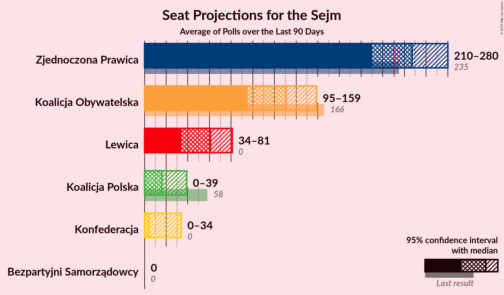

# Poll Average

<a href="#voting-intentions">Voting Intentions</a> | <a href="#seats">Seats</a> | <a href="#coalitions">Coalitions</a> | <a href="#technical-information">Technical Information</a>

## Summary

The table below lists the polls on which the average is based. They are the most recent polls (less than 90 days old) registered and analyzed so far.

| Period     | Polling firm/Commissioner(s) | PiS | PO | K | .N | PSL | SLD | W | R | Wi | MN |
|:----------:|:----------------------------:|:--:|:--:|:--:|:--:|:--:|:--:|:--:|:--:|:--:|:--:|
| 25 October 2015 | General Election | 37.6%   235 | 24.1%   138 | 8.8%   42 | 7.6%   28 | 5.1%   16 | 7.6%   0 | 4.8%   0 | 3.6%   0 | 0.0%   0 | 0.2%   1 |
| N/A | Poll Average | 40–50%   250–316 | 20–30%   118–177 | 2–7%   0–29 | 0–2%   0 | 2–7%   0–29 | 2–7%   0–28 | 1–5%   0 | 1–3%   0 | 3–8%   0–35 | N/A   N/A |
| [12–15 July 2019](2019-07-15-KantarMillwardBrown.html) | Kantar Millward Brown   TVN and TVN24 | 39–45%   248–287 | 24–30%   148–183 | 5–8%   0–36 | N/A   N/A | 2–4%   0 | 1–3%   0 | 2–4%   0 | 1–3%   0 | 4–7%   0–27 | N/A   N/A |
| [12–13 July 2019](2019-07-13-IBRiS.html) | IBRiS   Rzeczpospolita | 40–46%   256–295 | 24–29%   142–176 | 2–4%   0 | 0–1%   0 | 3–6%   0–22 | 5–7%   0–31 | 3–5%   0 | 1–2%   0 | 3–6%   0–14 | N/A   N/A |
| [4–11 July 2019](2019-07-11-CBOS.html) | CBOS | 41–47%   278–321 | 19–23%   117–154 | 3–5%   0–16 | 1–2%   0 | 5–8%   0–35 | 2–4%   0 | 2–4%   0 | 1–2%   0 | 3–5%   0–21 | N/A   N/A |
| [5–10 July 2019](2019-07-10-SocialChanges.html) | Social Changes | 42–48%   245–284 | 25–31%   138–172 | 2–4%   0 | N/A   N/A | 4–7%   0–22 | 5–8%   0–29 | N/A   N/A | N/A   N/A | 5–8%   0–31 | N/A   N/A |
| [19–20 June 2019](2019-06-20-Estymator.html) | Estymator   DoRzeczy.pl | 45–51%   275–316 | 20–25%   112–145 | 3–5%   0 | 1–3%   0 | 3–6%   0–19 | 3–6%   0–16 | 1–3%   0 | 1–3%   0 | 6–9%   23–39 | N/A   N/A |
| 25 October 2015 | General Election | 37.6%   235 | 24.1%   138 | 8.8%   42 | 7.6%   28 | 5.1%   16 | 7.6%   0 | 4.8%   0 | 3.6%   0 | 0.0%   0 | 0.2%   1 |

Only polls for which at least the sample size has been published are included in the table above.

**Legend:**
+ **Top half of each row:** Voting intentions (95% confidence interval)
+ **Bottom half of each row:** Seat projections for the Sejm (95% confidence interval)
+ **PiS:** Prawo i Sprawiedliwość
+ **PO:** Platforma Obywatelska
+ **K:** Kukiz’15
+ **.N:** .Nowoczesna
+ **PSL:** Polskie Stronnictwo Ludowe
+ **SLD:** Sojusz Lewicy Demokratycznej
+ **W:** KORWiN
+ **R:** Lewica Razem
+ **Wi:** Wiosna
+ **MN:** Mniejszość Niemiecka
+ **N/A (single party):** Party not included the published results
+ **N/A (entire row):** Calculation for this opinion poll not started yet

## Voting Intentions

### Confidence Intervals

| Party | Last Result | Median | 80% Confidence Interval | 90% Confidence Interval | 95% Confidence Interval | 99% Confidence Interval |
|:-----:|:-----------:|:------:|:-----------------------:|:-----------------------:|:-----------------------:|:-----------------------:|
| <a href="#prawo-i-sprawiedliwość">Prawo i Sprawiedliwość</a> | 37.6% | 44.2% | 41.3–48.1% |40.6–49.0% | 40.0–49.7% | 38.9–51.0% |
| <a href="#platforma-obywatelska">Platforma Obywatelska</a> | 24.1% | 25.6% | 20.8–28.5% |20.1–29.2% | 19.6–29.7% | 18.7–30.8% |
| <a href="#kukiz’15">Kukiz’15</a> | 8.8% | 3.7% | 2.8–6.0% |2.6–6.6% | 2.4–7.0% | 2.1–7.6% |
| <a href="#.nowoczesna">.Nowoczesna</a> | 7.6% | 1.0% | 0.4–1.9% |0.3–2.1% | 0.3–2.3% | 0.2–2.7% |
| <a href="#sojusz-lewicy-demokratycznej">Sojusz Lewicy Demokratycznej</a> | 7.6% | 4.5% | 2.0–6.5% |1.8–6.9% | 1.6–7.2% | 1.3–7.8% |
| <a href="#polskie-stronnictwo-ludowe">Polskie Stronnictwo Ludowe</a> | 5.1% | 4.6% | 3.0–6.2% |2.7–6.6% | 2.5–6.9% | 2.1–7.5% |
| <a href="#korwin">KORWiN</a> | 4.8% | 3.0% | 1.5–4.1% |1.3–4.4% | 1.2–4.6% | 1.0–5.1% |
| <a href="#lewica-razem">Lewica Razem</a> | 3.6% | 1.6% | 0.9–2.4% |0.8–2.6% | 0.7–2.8% | 0.5–3.2% |
| <a href="#mniejszość-niemiecka">Mniejszość Niemiecka</a> | 0.2% | N/A | N/A |N/A | N/A | N/A |
| <a href="#wiosna">Wiosna</a> | 0.0% | 5.2% | 3.7–7.5% |3.5–7.9% | 3.3–8.3% | 2.9–9.0% |

### Prawo i Sprawiedliwość

*For a full overview of the results for this party, see the [Prawo i Sprawiedliwość](party-prawoisprawiedliwość.html) page.*

| Voting Intentions | Probability | Accumulated | Special Marks |
|:-----------------:|:-----------:|:-----------:|:-------------:|
| 36.5–37.5% | 0% | 100% |  |
| 37.5–38.5% | 0.2% | 100% | Last Result |
| 38.5–39.5% | 1.1% | 99.7% |  |
| 39.5–40.5% | 3% | 98.7% |  |
| 40.5–41.5% | 7% | 95% |  |
| 41.5–42.5% | 12% | 88% |  |
| 42.5–43.5% | 15% | 76% |  |
| 43.5–44.5% | 16% | 60% | Median |
| 44.5–45.5% | 13% | 45% |  |
| 45.5–46.5% | 10% | 32% |  |
| 46.5–47.5% | 8% | 22% |  |
| 47.5–48.5% | 6% | 14% |  |
| 48.5–49.5% | 4% | 7% |  |
| 49.5–50.5% | 2% | 3% |  |
| 50.5–51.5% | 0.7% | 0.9% |  |
| 51.5–52.5% | 0.2% | 0.2% |  |
| 52.5–53.5% | 0% | 0% |  |

### Platforma Obywatelska

*For a full overview of the results for this party, see the [Platforma Obywatelska](party-platformaobywatelska.html) page.*

| Voting Intentions | Probability | Accumulated | Special Marks |
|:-----------------:|:-----------:|:-----------:|:-------------:|
| 16.5–17.5% | 0% | 100% |  |
| 17.5–18.5% | 0.3% | 100% |  |
| 18.5–19.5% | 2% | 99.6% |  |
| 19.5–20.5% | 6% | 98% |  |
| 20.5–21.5% | 9% | 92% |  |
| 21.5–22.5% | 10% | 83% |  |
| 22.5–23.5% | 8% | 73% |  |
| 23.5–24.5% | 6% | 65% | Last Result |
| 24.5–25.5% | 9% | 59% |  |
| 25.5–26.5% | 13% | 50% | Median |
| 26.5–27.5% | 15% | 37% |  |
| 27.5–28.5% | 12% | 22% |  |
| 28.5–29.5% | 7% | 10% |  |
| 29.5–30.5% | 2% | 3% |  |
| 30.5–31.5% | 0.6% | 0.7% |  |
| 31.5–32.5% | 0.1% | 0.1% |  |
| 32.5–33.5% | 0% | 0% |  |

### Kukiz’15

*For a full overview of the results for this party, see the [Kukiz’15](party-kukiz’15.html) page.*

| Voting Intentions | Probability | Accumulated | Special Marks |
|:-----------------:|:-----------:|:-----------:|:-------------:|
| 0.5–1.5% | 0% | 100% |  |
| 1.5–2.5% | 5% | 100% |  |
| 2.5–3.5% | 39% | 95% |  |
| 3.5–4.5% | 31% | 56% | Median |
| 4.5–5.5% | 10% | 25% |  |
| 5.5–6.5% | 10% | 15% |  |
| 6.5–7.5% | 4% | 5% |  |
| 7.5–8.5% | 0.6% | 0.6% |  |
| 8.5–9.5% | 0% | 0% | Last Result |

### .Nowoczesna

*For a full overview of the results for this party, see the [.Nowoczesna](party-nowoczesna.html) page.*

| Voting Intentions | Probability | Accumulated | Special Marks |
|:-----------------:|:-----------:|:-----------:|:-------------:|
| 0.0–0.5% | 19% | 100% |  |
| 0.5–1.5% | 58% | 81% | Median |
| 1.5–2.5% | 21% | 22% |  |
| 2.5–3.5% | 0.9% | 0.9% |  |
| 3.5–4.5% | 0% | 0% |  |
| 4.5–5.5% | 0% | 0% |  |
| 5.5–6.5% | 0% | 0% |  |
| 6.5–7.5% | 0% | 0% |  |
| 7.5–8.5% | 0% | 0% | Last Result |

### Sojusz Lewicy Demokratycznej

*For a full overview of the results for this party, see the [Sojusz Lewicy Demokratycznej](party-sojuszlewicydemokratycznej.html) page.*

| Voting Intentions | Probability | Accumulated | Special Marks |
|:-----------------:|:-----------:|:-----------:|:-------------:|
| 0.0–0.5% | 0% | 100% |  |
| 0.5–1.5% | 2% | 100% |  |
| 1.5–2.5% | 17% | 98% |  |
| 2.5–3.5% | 18% | 81% |  |
| 3.5–4.5% | 14% | 63% |  |
| 4.5–5.5% | 18% | 49% | Median |
| 5.5–6.5% | 22% | 31% |  |
| 6.5–7.5% | 8% | 9% |  |
| 7.5–8.5% | 0.9% | 1.0% | Last Result |
| 8.5–9.5% | 0% | 0% |  |

### Polskie Stronnictwo Ludowe

*For a full overview of the results for this party, see the [Polskie Stronnictwo Ludowe](party-polskiestronnictwoludowe.html) page.*

| Voting Intentions | Probability | Accumulated | Special Marks |
|:-----------------:|:-----------:|:-----------:|:-------------:|
| 0.5–1.5% | 0% | 100% |  |
| 1.5–2.5% | 3% | 100% |  |
| 2.5–3.5% | 16% | 97% |  |
| 3.5–4.5% | 30% | 80% |  |
| 4.5–5.5% | 29% | 51% | Last Result, Median |
| 5.5–6.5% | 16% | 22% |  |
| 6.5–7.5% | 5% | 5% |  |
| 7.5–8.5% | 0.5% | 0.5% |  |
| 8.5–9.5% | 0% | 0% |  |

### KORWiN

*For a full overview of the results for this party, see the [KORWiN](party-korwin.html) page.*

| Voting Intentions | Probability | Accumulated | Special Marks |
|:-----------------:|:-----------:|:-----------:|:-------------:|
| 0.0–0.5% | 0% | 100% |  |
| 0.5–1.5% | 10% | 100% |  |
| 1.5–2.5% | 22% | 90% |  |
| 2.5–3.5% | 42% | 68% | Median |
| 3.5–4.5% | 23% | 26% |  |
| 4.5–5.5% | 3% | 3% | Last Result |
| 5.5–6.5% | 0.1% | 0.1% |  |
| 6.5–7.5% | 0% | 0% |  |

### Lewica Razem

*For a full overview of the results for this party, see the [Lewica Razem](party-lewicarazem.html) page.*

| Voting Intentions | Probability | Accumulated | Special Marks |
|:-----------------:|:-----------:|:-----------:|:-------------:|
| 0.0–0.5% | 0.6% | 100% |  |
| 0.5–1.5% | 47% | 99.4% |  |
| 1.5–2.5% | 46% | 52% | Median |
| 2.5–3.5% | 6% | 6% |  |
| 3.5–4.5% | 0.1% | 0.1% | Last Result |
| 4.5–5.5% | 0% | 0% |  |

### Wiosna

*For a full overview of the results for this party, see the [Wiosna](party-wiosna.html) page.*

| Voting Intentions | Probability | Accumulated | Special Marks |
|:-----------------:|:-----------:|:-----------:|:-------------:|
| 0.0–0.5% | 0% | 100% | Last Result |
| 0.5–1.5% | 0% | 100% |  |
| 1.5–2.5% | 0% | 100% |  |
| 2.5–3.5% | 6% | 100% |  |
| 3.5–4.5% | 28% | 94% |  |
| 4.5–5.5% | 23% | 66% | Median |
| 5.5–6.5% | 18% | 42% |  |
| 6.5–7.5% | 16% | 25% |  |
| 7.5–8.5% | 8% | 9% |  |
| 8.5–9.5% | 1.5% | 2% |  |
| 9.5–10.5% | 0.1% | 0.1% |  |
| 10.5–11.5% | 0% | 0% |  |

## Seats

### Confidence Intervals

| Party | Last Result | Median | 80% Confidence Interval | 90% Confidence Interval | 95% Confidence Interval | 99% Confidence Interval |
|:-----:|:-----------:|:------:|:-----------------------:|:-----------------------:|:-----------------------:|:-----------------------:|
| <a href="#prawo-i-sprawiedliwość">Prawo i Sprawiedliwość</a> | 235 | 280 | 258–306 |254–312 | 250–316 | 243–321 |
| <a href="#platforma-obywatelska">Platforma Obywatelska</a> | 138 | 149 | 124–169 |121–173 | 118–177 | 112–184 |
| <a href="#kukiz’15">Kukiz’15</a> | 42 | 0 | 0–21 |0–26 | 0–29 | 0–36 |
| <a href="#.nowoczesna">.Nowoczesna</a> | 28 | 0 | 0 |0 | 0 | 0 |
| <a href="#sojusz-lewicy-demokratycznej">Sojusz Lewicy Demokratycznej</a> | 0 | 0 | 0–26 |0–28 | 0–28 | 0–32 |
| <a href="#polskie-stronnictwo-ludowe">Polskie Stronnictwo Ludowe</a> | 16 | 0 | 0–23 |0–27 | 0–29 | 0–35 |
| <a href="#korwin">KORWiN</a> | 0 | 0 | 0 |0 | 0 | 0–7 |
| <a href="#lewica-razem">Lewica Razem</a> | 0 | 0 | 0 |0 | 0 | 0 |
| <a href="#mniejszość-niemiecka">Mniejszość Niemiecka</a> | 1 | N/A | N/A |N/A | N/A | N/A |
| <a href="#wiosna">Wiosna</a> | 0 | 11 | 0–30 |0–33 | 0–35 | 0–39 |

### Prawo i Sprawiedliwość

*For a full overview of the results for this party, see the [Prawo i Sprawiedliwość](party-prawoisprawiedliwość.html) page.*

| Number of Seats | Probability | Accumulated | Special Marks |
|:---------------:|:-----------:|:-----------:|:-------------:|
| 234 | 0% | 100% |  |
| 235 | 0% | 99.9% | Last Result |
| 236 | 0% | 99.9% |  |
| 237 | 0% | 99.9% |  |
| 238 | 0% | 99.9% |  |
| 239 | 0.1% | 99.8% |  |
| 240 | 0.1% | 99.7% |  |
| 241 | 0.1% | 99.7% |  |
| 242 | 0.1% | 99.6% |  |
| 243 | 0.1% | 99.5% |  |
| 244 | 0.1% | 99.4% |  |
| 245 | 0.2% | 99.3% |  |
| 246 | 0.2% | 99.1% |  |
| 247 | 0.3% | 98.9% |  |
| 248 | 0.4% | 98.6% |  |
| 249 | 0.3% | 98% |  |
| 250 | 0.6% | 98% |  |
| 251 | 0.7% | 97% |  |
| 252 | 0.6% | 97% |  |
| 253 | 0.6% | 96% |  |
| 254 | 1.1% | 96% |  |
| 255 | 0.8% | 94% |  |
| 256 | 0.9% | 94% |  |
| 257 | 2% | 93% |  |
| 258 | 2% | 90% |  |
| 259 | 1.4% | 88% |  |
| 260 | 2% | 87% |  |
| 261 | 2% | 85% |  |
| 262 | 1.4% | 84% |  |
| 263 | 3% | 82% |  |
| 264 | 2% | 80% |  |
| 265 | 2% | 78% |  |
| 266 | 2% | 75% |  |
| 267 | 2% | 74% |  |
| 268 | 2% | 71% |  |
| 269 | 2% | 69% |  |
| 270 | 2% | 67% |  |
| 271 | 2% | 65% |  |
| 272 | 1.2% | 63% |  |
| 273 | 2% | 62% |  |
| 274 | 2% | 60% |  |
| 275 | 2% | 59% |  |
| 276 | 1.0% | 56% |  |
| 277 | 1.3% | 55% |  |
| 278 | 3% | 54% |  |
| 279 | 1.0% | 51% |  |
| 280 | 2% | 50% | Median |
| 281 | 2% | 49% |  |
| 282 | 2% | 47% |  |
| 283 | 2% | 45% |  |
| 284 | 2% | 44% |  |
| 285 | 1.3% | 41% |  |
| 286 | 2% | 40% |  |
| 287 | 2% | 38% |  |
| 288 | 1.3% | 36% |  |
| 289 | 2% | 35% |  |
| 290 | 1.5% | 33% |  |
| 291 | 2% | 32% |  |
| 292 | 4% | 30% |  |
| 293 | 2% | 26% |  |
| 294 | 1.1% | 24% |  |
| 295 | 2% | 23% |  |
| 296 | 0.6% | 21% |  |
| 297 | 0.8% | 21% |  |
| 298 | 0.9% | 20% |  |
| 299 | 0.6% | 19% |  |
| 300 | 0.6% | 18% |  |
| 301 | 2% | 18% |  |
| 302 | 1.0% | 16% |  |
| 303 | 0.5% | 15% |  |
| 304 | 0.5% | 14% |  |
| 305 | 3% | 14% |  |
| 306 | 2% | 11% |  |
| 307 | 2% | 10% |  |
| 308 | 0.1% | 8% |  |
| 309 | 1.3% | 8% |  |
| 310 | 0.8% | 7% |  |
| 311 | 0.3% | 6% |  |
| 312 | 0.7% | 5% |  |
| 313 | 1.3% | 5% |  |
| 314 | 0.1% | 3% |  |
| 315 | 0.6% | 3% |  |
| 316 | 1.2% | 3% |  |
| 317 | 0.2% | 2% |  |
| 318 | 0.3% | 1.4% |  |
| 319 | 0.1% | 1.1% |  |
| 320 | 0.2% | 1.0% |  |
| 321 | 0.6% | 0.9% |  |
| 322 | 0.1% | 0.3% |  |
| 323 | 0% | 0.2% |  |
| 324 | 0.1% | 0.2% |  |
| 325 | 0% | 0.1% |  |
| 326 | 0% | 0.1% |  |
| 327 | 0% | 0.1% |  |
| 328 | 0% | 0.1% |  |
| 329 | 0% | 0.1% |  |
| 330 | 0% | 0.1% |  |
| 331 | 0% | 0.1% |  |
| 332 | 0% | 0.1% |  |
| 333 | 0% | 0.1% |  |
| 334 | 0% | 0% |  |

### Platforma Obywatelska

*For a full overview of the results for this party, see the [Platforma Obywatelska](party-platformaobywatelska.html) page.*

| Number of Seats | Probability | Accumulated | Special Marks |
|:---------------:|:-----------:|:-----------:|:-------------:|
| 107 | 0% | 100% |  |
| 108 | 0.1% | 99.9% |  |
| 109 | 0% | 99.9% |  |
| 110 | 0.1% | 99.8% |  |
| 111 | 0.1% | 99.7% |  |
| 112 | 0.2% | 99.6% |  |
| 113 | 0.1% | 99.4% |  |
| 114 | 0.2% | 99.3% |  |
| 115 | 0.2% | 99.1% |  |
| 116 | 0.6% | 98.8% |  |
| 117 | 0.3% | 98% |  |
| 118 | 0.6% | 98% |  |
| 119 | 0.6% | 97% |  |
| 120 | 0.6% | 97% |  |
| 121 | 2% | 96% |  |
| 122 | 0.8% | 95% |  |
| 123 | 0.9% | 94% |  |
| 124 | 4% | 93% |  |
| 125 | 0.9% | 89% |  |
| 126 | 0.9% | 88% |  |
| 127 | 0.7% | 87% |  |
| 128 | 1.0% | 87% |  |
| 129 | 3% | 86% |  |
| 130 | 2% | 83% |  |
| 131 | 3% | 81% |  |
| 132 | 2% | 78% |  |
| 133 | 0.9% | 76% |  |
| 134 | 0.7% | 75% |  |
| 135 | 1.1% | 74% |  |
| 136 | 1.3% | 73% |  |
| 137 | 0.6% | 72% |  |
| 138 | 1.2% | 71% | Last Result |
| 139 | 1.4% | 70% |  |
| 140 | 0.8% | 69% |  |
| 141 | 2% | 68% |  |
| 142 | 2% | 66% |  |
| 143 | 0.9% | 64% |  |
| 144 | 1.0% | 63% |  |
| 145 | 2% | 62% |  |
| 146 | 2% | 60% |  |
| 147 | 3% | 58% |  |
| 148 | 4% | 56% |  |
| 149 | 3% | 52% | Median |
| 150 | 3% | 49% |  |
| 151 | 4% | 47% |  |
| 152 | 2% | 43% |  |
| 153 | 2% | 40% |  |
| 154 | 1.4% | 39% |  |
| 155 | 2% | 37% |  |
| 156 | 2% | 35% |  |
| 157 | 1.5% | 33% |  |
| 158 | 1.4% | 32% |  |
| 159 | 1.3% | 31% |  |
| 160 | 2% | 29% |  |
| 161 | 2% | 27% |  |
| 162 | 2% | 25% |  |
| 163 | 2% | 23% |  |
| 164 | 2% | 20% |  |
| 165 | 3% | 18% |  |
| 166 | 1.1% | 15% |  |
| 167 | 2% | 14% |  |
| 168 | 1.4% | 12% |  |
| 169 | 1.3% | 11% |  |
| 170 | 2% | 9% |  |
| 171 | 1.5% | 8% |  |
| 172 | 1.2% | 6% |  |
| 173 | 0.7% | 5% |  |
| 174 | 0.9% | 4% |  |
| 175 | 0.4% | 3% |  |
| 176 | 0.4% | 3% |  |
| 177 | 0.6% | 3% |  |
| 178 | 0.4% | 2% |  |
| 179 | 0.2% | 2% |  |
| 180 | 0.2% | 1.5% |  |
| 181 | 0.3% | 1.2% |  |
| 182 | 0.2% | 0.9% |  |
| 183 | 0.2% | 0.7% |  |
| 184 | 0.2% | 0.6% |  |
| 185 | 0.1% | 0.4% |  |
| 186 | 0.1% | 0.3% |  |
| 187 | 0.1% | 0.2% |  |
| 188 | 0% | 0.2% |  |
| 189 | 0% | 0.1% |  |
| 190 | 0% | 0.1% |  |
| 191 | 0% | 0.1% |  |
| 192 | 0% | 0.1% |  |
| 193 | 0% | 0.1% |  |
| 194 | 0% | 0.1% |  |
| 195 | 0% | 0% |  |

### Kukiz’15

*For a full overview of the results for this party, see the [Kukiz’15](party-kukiz’15.html) page.*

| Number of Seats | Probability | Accumulated | Special Marks |
|:---------------:|:-----------:|:-----------:|:-------------:|
| 0 | 80% | 100% | Median |
| 1 | 0% | 20% |  |
| 2 | 0% | 20% |  |
| 3 | 0% | 20% |  |
| 4 | 0% | 20% |  |
| 5 | 0% | 20% |  |
| 6 | 0% | 20% |  |
| 7 | 0.1% | 20% |  |
| 8 | 0.1% | 20% |  |
| 9 | 0.2% | 19% |  |
| 10 | 1.0% | 19% |  |
| 11 | 0.6% | 18% |  |
| 12 | 0.7% | 18% |  |
| 13 | 1.1% | 17% |  |
| 14 | 0.5% | 16% |  |
| 15 | 1.2% | 15% |  |
| 16 | 0.8% | 14% |  |
| 17 | 0.7% | 13% |  |
| 18 | 1.2% | 13% |  |
| 19 | 0.4% | 12% |  |
| 20 | 0.9% | 11% |  |
| 21 | 2% | 10% |  |
| 22 | 0.5% | 9% |  |
| 23 | 1.4% | 8% |  |
| 24 | 0.7% | 7% |  |
| 25 | 1.0% | 6% |  |
| 26 | 0.8% | 5% |  |
| 27 | 1.3% | 4% |  |
| 28 | 0.3% | 3% |  |
| 29 | 0.5% | 3% |  |
| 30 | 0.3% | 2% |  |
| 31 | 0.3% | 2% |  |
| 32 | 0.2% | 2% |  |
| 33 | 0.4% | 1.4% |  |
| 34 | 0.2% | 1.1% |  |
| 35 | 0.2% | 0.9% |  |
| 36 | 0.3% | 0.7% |  |
| 37 | 0.1% | 0.4% |  |
| 38 | 0% | 0.2% |  |
| 39 | 0.1% | 0.2% |  |
| 40 | 0% | 0.1% |  |
| 41 | 0% | 0% |  |
| 42 | 0% | 0% | Last Result |

### .Nowoczesna

*For a full overview of the results for this party, see the [.Nowoczesna](party-nowoczesna.html) page.*

| Number of Seats | Probability | Accumulated | Special Marks |
|:---------------:|:-----------:|:-----------:|:-------------:|
| 0 | 100% | 100% | Median |
| 1 | 0% | 0% |  |
| 2 | 0% | 0% |  |
| 3 | 0% | 0% |  |
| 4 | 0% | 0% |  |
| 5 | 0% | 0% |  |
| 6 | 0% | 0% |  |
| 7 | 0% | 0% |  |
| 8 | 0% | 0% |  |
| 9 | 0% | 0% |  |
| 10 | 0% | 0% |  |
| 11 | 0% | 0% |  |
| 12 | 0% | 0% |  |
| 13 | 0% | 0% |  |
| 14 | 0% | 0% |  |
| 15 | 0% | 0% |  |
| 16 | 0% | 0% |  |
| 17 | 0% | 0% |  |
| 18 | 0% | 0% |  |
| 19 | 0% | 0% |  |
| 20 | 0% | 0% |  |
| 21 | 0% | 0% |  |
| 22 | 0% | 0% |  |
| 23 | 0% | 0% |  |
| 24 | 0% | 0% |  |
| 25 | 0% | 0% |  |
| 26 | 0% | 0% |  |
| 27 | 0% | 0% |  |
| 28 | 0% | 0% | Last Result |

### Sojusz Lewicy Demokratycznej

*For a full overview of the results for this party, see the [Sojusz Lewicy Demokratycznej](party-sojuszlewicydemokratycznej.html) page.*

| Number of Seats | Probability | Accumulated | Special Marks |
|:---------------:|:-----------:|:-----------:|:-------------:|
| 0 | 58% | 100% | Last Result, Median |
| 1 | 0% | 42% |  |
| 2 | 0% | 42% |  |
| 3 | 0% | 42% |  |
| 4 | 0% | 42% |  |
| 5 | 0% | 42% |  |
| 6 | 0.1% | 42% |  |
| 7 | 0.4% | 42% |  |
| 8 | 0.9% | 42% |  |
| 9 | 4% | 41% |  |
| 10 | 1.3% | 37% |  |
| 11 | 3% | 36% |  |
| 12 | 2% | 33% |  |
| 13 | 1.2% | 30% |  |
| 14 | 2% | 29% |  |
| 15 | 2% | 27% |  |
| 16 | 2% | 25% |  |
| 17 | 2% | 23% |  |
| 18 | 1.5% | 21% |  |
| 19 | 0.9% | 20% |  |
| 20 | 1.3% | 19% |  |
| 21 | 0.8% | 18% |  |
| 22 | 2% | 17% |  |
| 23 | 1.4% | 14% |  |
| 24 | 0.7% | 13% |  |
| 25 | 1.2% | 12% |  |
| 26 | 2% | 11% |  |
| 27 | 3% | 9% |  |
| 28 | 4% | 7% |  |
| 29 | 1.4% | 2% |  |
| 30 | 0.2% | 1.0% |  |
| 31 | 0.2% | 0.8% |  |
| 32 | 0.3% | 0.6% |  |
| 33 | 0.1% | 0.3% |  |
| 34 | 0.1% | 0.2% |  |
| 35 | 0.1% | 0.2% |  |
| 36 | 0% | 0.1% |  |
| 37 | 0% | 0% |  |

### Polskie Stronnictwo Ludowe

*For a full overview of the results for this party, see the [Polskie Stronnictwo Ludowe](party-polskiestronnictwoludowe.html) page.*

| Number of Seats | Probability | Accumulated | Special Marks |
|:---------------:|:-----------:|:-----------:|:-------------:|
| 0 | 66% | 100% | Median |
| 1 | 0% | 34% |  |
| 2 | 0% | 34% |  |
| 3 | 0% | 34% |  |
| 4 | 0% | 34% |  |
| 5 | 0% | 34% |  |
| 6 | 0% | 34% |  |
| 7 | 0% | 34% |  |
| 8 | 0% | 34% |  |
| 9 | 0% | 34% |  |
| 10 | 0% | 34% |  |
| 11 | 0.3% | 34% |  |
| 12 | 2% | 34% |  |
| 13 | 2% | 32% |  |
| 14 | 1.1% | 30% |  |
| 15 | 0.9% | 29% |  |
| 16 | 3% | 28% | Last Result |
| 17 | 2% | 26% |  |
| 18 | 1.2% | 24% |  |
| 19 | 2% | 23% |  |
| 20 | 1.5% | 21% |  |
| 21 | 3% | 19% |  |
| 22 | 1.3% | 16% |  |
| 23 | 6% | 14% |  |
| 24 | 2% | 9% |  |
| 25 | 0.7% | 7% |  |
| 26 | 0.3% | 6% |  |
| 27 | 1.5% | 6% |  |
| 28 | 1.2% | 4% |  |
| 29 | 0.5% | 3% |  |
| 30 | 0.6% | 2% |  |
| 31 | 0.6% | 2% |  |
| 32 | 0.1% | 1.2% |  |
| 33 | 0.1% | 1.1% |  |
| 34 | 0.1% | 1.0% |  |
| 35 | 0.4% | 0.8% |  |
| 36 | 0.1% | 0.4% |  |
| 37 | 0.2% | 0.3% |  |
| 38 | 0% | 0.1% |  |
| 39 | 0% | 0.1% |  |
| 40 | 0% | 0% |  |

### KORWiN

*For a full overview of the results for this party, see the [KORWiN](party-korwin.html) page.*

| Number of Seats | Probability | Accumulated | Special Marks |
|:---------------:|:-----------:|:-----------:|:-------------:|
| 0 | 99.4% | 100% | Last Result, Median |
| 1 | 0% | 0.6% |  |
| 2 | 0% | 0.6% |  |
| 3 | 0% | 0.6% |  |
| 4 | 0% | 0.6% |  |
| 5 | 0% | 0.6% |  |
| 6 | 0.1% | 0.6% |  |
| 7 | 0.1% | 0.5% |  |
| 8 | 0% | 0.4% |  |
| 9 | 0.1% | 0.4% |  |
| 10 | 0.1% | 0.3% |  |
| 11 | 0% | 0.2% |  |
| 12 | 0% | 0.2% |  |
| 13 | 0% | 0.1% |  |
| 14 | 0.1% | 0.1% |  |
| 15 | 0% | 0% |  |

### Lewica Razem

*For a full overview of the results for this party, see the [Lewica Razem](party-lewicarazem.html) page.*

| Number of Seats | Probability | Accumulated | Special Marks |
|:---------------:|:-----------:|:-----------:|:-------------:|
| 0 | 100% | 100% | Last Result, Median |

### Wiosna

*For a full overview of the results for this party, see the [Wiosna](party-wiosna.html) page.*

| Number of Seats | Probability | Accumulated | Special Marks |
|:---------------:|:-----------:|:-----------:|:-------------:|
| 0 | 46% | 100% | Last Result |
| 1 | 0% | 54% |  |
| 2 | 0% | 54% |  |
| 3 | 0% | 54% |  |
| 4 | 0% | 54% |  |
| 5 | 0% | 54% |  |
| 6 | 0% | 54% |  |
| 7 | 0.3% | 54% |  |
| 8 | 0.5% | 53% |  |
| 9 | 0.7% | 53% |  |
| 10 | 1.1% | 52% |  |
| 11 | 4% | 51% | Median |
| 12 | 3% | 47% |  |
| 13 | 2% | 45% |  |
| 14 | 3% | 43% |  |
| 15 | 1.3% | 39% |  |
| 16 | 2% | 38% |  |
| 17 | 1.5% | 36% |  |
| 18 | 1.2% | 35% |  |
| 19 | 0.8% | 34% |  |
| 20 | 1.3% | 33% |  |
| 21 | 0.9% | 32% |  |
| 22 | 1.0% | 31% |  |
| 23 | 1.1% | 30% |  |
| 24 | 2% | 29% |  |
| 25 | 0.7% | 27% |  |
| 26 | 0.9% | 26% |  |
| 27 | 2% | 25% |  |
| 28 | 7% | 23% |  |
| 29 | 2% | 16% |  |
| 30 | 5% | 14% |  |
| 31 | 1.0% | 8% |  |
| 32 | 1.3% | 7% |  |
| 33 | 2% | 6% |  |
| 34 | 2% | 4% |  |
| 35 | 0.5% | 3% |  |
| 36 | 0.4% | 2% |  |
| 37 | 0.9% | 2% |  |
| 38 | 0.2% | 0.9% |  |
| 39 | 0.2% | 0.7% |  |
| 40 | 0.4% | 0.5% |  |
| 41 | 0% | 0.1% |  |
| 42 | 0.1% | 0.1% |  |
| 43 | 0% | 0% |  |

## Coalitions

### Confidence Intervals

| Coalition | Last Result | Median | Majority? | 80% Confidence Interval | 90% Confidence Interval | 95% Confidence Interval | 99% Confidence Interval |
|:---------:|:-----------:|:------:|:---------:|:-----------------------:|:-----------------------:|:-----------------------:|:-----------------------:|
| Prawo i Sprawiedliwość | 235 | 280 | 100% | 258–306 | 254–312 | 250–316 | 243–321 |
| Platforma Obywatelska – .Nowoczesna – Sojusz Lewicy Demokratycznej – Polskie Stronnictwo Ludowe – Lewica Razem | 182 | 166 | 0% | 135–188 | 126–193 | 121–198 | 116–205 |
| Platforma Obywatelska – .Nowoczesna – Sojusz Lewicy Demokratycznej – Polskie Stronnictwo Ludowe | 182 | 166 | 0% | 135–188 | 126–193 | 121–198 | 116–205 |
| Platforma Obywatelska – .Nowoczesna – Sojusz Lewicy Demokratycznej | 166 | 160 | 0% | 125–182 | 122–188 | 119–193 | 114–198 |
| Platforma Obywatelska – .Nowoczesna – Polskie Stronnictwo Ludowe | 182 | 157 | 0% | 130–173 | 124–178 | 121–181 | 114–187 |
| Platforma Obywatelska – .Nowoczesna | 166 | 149 | 0% | 124–169 | 121–173 | 118–177 | 112–184 |
| Platforma Obywatelska | 138 | 149 | 0% | 124–169 | 121–173 | 118–177 | 112–184 |

### Prawo i Sprawiedliwość

| Number of Seats | Probability | Accumulated | Special Marks |
|:---------------:|:-----------:|:-----------:|:-------------:|
| 234 | 0% | 100% |  |
| 235 | 0% | 99.9% | Last Result |
| 236 | 0% | 99.9% |  |
| 237 | 0% | 99.9% |  |
| 238 | 0% | 99.9% |  |
| 239 | 0.1% | 99.8% |  |
| 240 | 0.1% | 99.7% |  |
| 241 | 0.1% | 99.7% |  |
| 242 | 0.1% | 99.6% |  |
| 243 | 0.1% | 99.5% |  |
| 244 | 0.1% | 99.4% |  |
| 245 | 0.2% | 99.3% |  |
| 246 | 0.2% | 99.1% |  |
| 247 | 0.3% | 98.9% |  |
| 248 | 0.4% | 98.6% |  |
| 249 | 0.3% | 98% |  |
| 250 | 0.6% | 98% |  |
| 251 | 0.7% | 97% |  |
| 252 | 0.6% | 97% |  |
| 253 | 0.6% | 96% |  |
| 254 | 1.1% | 96% |  |
| 255 | 0.8% | 94% |  |
| 256 | 0.9% | 94% |  |
| 257 | 2% | 93% |  |
| 258 | 2% | 90% |  |
| 259 | 1.4% | 88% |  |
| 260 | 2% | 87% |  |
| 261 | 2% | 85% |  |
| 262 | 1.4% | 84% |  |
| 263 | 3% | 82% |  |
| 264 | 2% | 80% |  |
| 265 | 2% | 78% |  |
| 266 | 2% | 75% |  |
| 267 | 2% | 74% |  |
| 268 | 2% | 71% |  |
| 269 | 2% | 69% |  |
| 270 | 2% | 67% |  |
| 271 | 2% | 65% |  |
| 272 | 1.2% | 63% |  |
| 273 | 2% | 62% |  |
| 274 | 2% | 60% |  |
| 275 | 2% | 59% |  |
| 276 | 1.0% | 56% |  |
| 277 | 1.3% | 55% |  |
| 278 | 3% | 54% |  |
| 279 | 1.0% | 51% |  |
| 280 | 2% | 50% | Median |
| 281 | 2% | 49% |  |
| 282 | 2% | 47% |  |
| 283 | 2% | 45% |  |
| 284 | 2% | 44% |  |
| 285 | 1.3% | 41% |  |
| 286 | 2% | 40% |  |
| 287 | 2% | 38% |  |
| 288 | 1.3% | 36% |  |
| 289 | 2% | 35% |  |
| 290 | 1.5% | 33% |  |
| 291 | 2% | 32% |  |
| 292 | 4% | 30% |  |
| 293 | 2% | 26% |  |
| 294 | 1.1% | 24% |  |
| 295 | 2% | 23% |  |
| 296 | 0.6% | 21% |  |
| 297 | 0.8% | 21% |  |
| 298 | 0.9% | 20% |  |
| 299 | 0.6% | 19% |  |
| 300 | 0.6% | 18% |  |
| 301 | 2% | 18% |  |
| 302 | 1.0% | 16% |  |
| 303 | 0.5% | 15% |  |
| 304 | 0.5% | 14% |  |
| 305 | 3% | 14% |  |
| 306 | 2% | 11% |  |
| 307 | 2% | 10% |  |
| 308 | 0.1% | 8% |  |
| 309 | 1.3% | 8% |  |
| 310 | 0.8% | 7% |  |
| 311 | 0.3% | 6% |  |
| 312 | 0.7% | 5% |  |
| 313 | 1.3% | 5% |  |
| 314 | 0.1% | 3% |  |
| 315 | 0.6% | 3% |  |
| 316 | 1.2% | 3% |  |
| 317 | 0.2% | 2% |  |
| 318 | 0.3% | 1.4% |  |
| 319 | 0.1% | 1.1% |  |
| 320 | 0.2% | 1.0% |  |
| 321 | 0.6% | 0.9% |  |
| 322 | 0.1% | 0.3% |  |
| 323 | 0% | 0.2% |  |
| 324 | 0.1% | 0.2% |  |
| 325 | 0% | 0.1% |  |
| 326 | 0% | 0.1% |  |
| 327 | 0% | 0.1% |  |
| 328 | 0% | 0.1% |  |
| 329 | 0% | 0.1% |  |
| 330 | 0% | 0.1% |  |
| 331 | 0% | 0.1% |  |
| 332 | 0% | 0.1% |  |
| 333 | 0% | 0.1% |  |
| 334 | 0% | 0% |  |

### Platforma Obywatelska – .Nowoczesna – Sojusz Lewicy Demokratycznej – Polskie Stronnictwo Ludowe – Lewica Razem

| Number of Seats | Probability | Accumulated | Special Marks |
|:---------------:|:-----------:|:-----------:|:-------------:|
| 110 | 0.1% | 100% |  |
| 111 | 0% | 99.9% |  |
| 112 | 0.1% | 99.9% |  |
| 113 | 0% | 99.8% |  |
| 114 | 0.1% | 99.8% |  |
| 115 | 0.1% | 99.7% |  |
| 116 | 0.3% | 99.7% |  |
| 117 | 0.1% | 99.3% |  |
| 118 | 0.3% | 99.2% |  |
| 119 | 0.5% | 98.9% |  |
| 120 | 0% | 98% |  |
| 121 | 1.2% | 98% |  |
| 122 | 0.2% | 97% |  |
| 123 | 0.2% | 97% |  |
| 124 | 1.4% | 97% |  |
| 125 | 0.1% | 95% |  |
| 126 | 0.7% | 95% |  |
| 127 | 0.1% | 95% |  |
| 128 | 0.6% | 94% |  |
| 129 | 2% | 94% |  |
| 130 | 0.5% | 92% |  |
| 131 | 0.2% | 91% |  |
| 132 | 0.2% | 91% |  |
| 133 | 0.4% | 91% |  |
| 134 | 0.4% | 91% |  |
| 135 | 1.3% | 90% |  |
| 136 | 0.8% | 89% |  |
| 137 | 0.3% | 88% |  |
| 138 | 0.4% | 88% |  |
| 139 | 0.9% | 87% |  |
| 140 | 3% | 87% |  |
| 141 | 1.3% | 84% |  |
| 142 | 0.7% | 83% |  |
| 143 | 1.2% | 82% |  |
| 144 | 1.2% | 81% |  |
| 145 | 0.9% | 80% |  |
| 146 | 0.2% | 79% |  |
| 147 | 2% | 79% |  |
| 148 | 0.8% | 77% |  |
| 149 | 0.9% | 76% | Median |
| 150 | 0.8% | 75% |  |
| 151 | 2% | 74% |  |
| 152 | 0.9% | 72% |  |
| 153 | 2% | 71% |  |
| 154 | 0.8% | 69% |  |
| 155 | 2% | 68% |  |
| 156 | 1.4% | 67% |  |
| 157 | 0.8% | 65% |  |
| 158 | 1.0% | 64% |  |
| 159 | 1.1% | 63% |  |
| 160 | 2% | 62% |  |
| 161 | 1.5% | 60% |  |
| 162 | 2% | 59% |  |
| 163 | 2% | 56% |  |
| 164 | 2% | 54% |  |
| 165 | 2% | 52% |  |
| 166 | 1.4% | 50% |  |
| 167 | 2% | 49% |  |
| 168 | 3% | 47% |  |
| 169 | 3% | 44% |  |
| 170 | 2% | 41% |  |
| 171 | 3% | 39% |  |
| 172 | 2% | 36% |  |
| 173 | 1.2% | 34% |  |
| 174 | 3% | 33% |  |
| 175 | 2% | 30% |  |
| 176 | 2% | 28% |  |
| 177 | 2% | 26% |  |
| 178 | 2% | 24% |  |
| 179 | 2% | 23% |  |
| 180 | 1.3% | 21% |  |
| 181 | 1.3% | 19% |  |
| 182 | 2% | 18% | Last Result |
| 183 | 0.8% | 16% |  |
| 184 | 1.4% | 15% |  |
| 185 | 1.1% | 14% |  |
| 186 | 0.9% | 13% |  |
| 187 | 1.2% | 12% |  |
| 188 | 0.9% | 11% |  |
| 189 | 1.1% | 10% |  |
| 190 | 1.0% | 9% |  |
| 191 | 0.5% | 8% |  |
| 192 | 1.2% | 7% |  |
| 193 | 1.1% | 6% |  |
| 194 | 0.6% | 5% |  |
| 195 | 0.4% | 4% |  |
| 196 | 0.5% | 4% |  |
| 197 | 0.5% | 3% |  |
| 198 | 0.4% | 3% |  |
| 199 | 0.4% | 2% |  |
| 200 | 0.1% | 2% |  |
| 201 | 0.2% | 2% |  |
| 202 | 0.1% | 2% |  |
| 203 | 0.9% | 2% |  |
| 204 | 0.1% | 0.6% |  |
| 205 | 0.1% | 0.5% |  |
| 206 | 0.1% | 0.4% |  |
| 207 | 0% | 0.4% |  |
| 208 | 0.1% | 0.3% |  |
| 209 | 0.1% | 0.2% |  |
| 210 | 0.1% | 0.2% |  |
| 211 | 0% | 0.1% |  |
| 212 | 0.1% | 0.1% |  |
| 213 | 0% | 0.1% |  |
| 214 | 0% | 0% |  |

### Platforma Obywatelska – .Nowoczesna – Sojusz Lewicy Demokratycznej – Polskie Stronnictwo Ludowe

| Number of Seats | Probability | Accumulated | Special Marks |
|:---------------:|:-----------:|:-----------:|:-------------:|
| 110 | 0.1% | 100% |  |
| 111 | 0% | 99.9% |  |
| 112 | 0.1% | 99.9% |  |
| 113 | 0% | 99.8% |  |
| 114 | 0.1% | 99.8% |  |
| 115 | 0.1% | 99.7% |  |
| 116 | 0.3% | 99.7% |  |
| 117 | 0.1% | 99.3% |  |
| 118 | 0.3% | 99.2% |  |
| 119 | 0.5% | 98.9% |  |
| 120 | 0% | 98% |  |
| 121 | 1.2% | 98% |  |
| 122 | 0.2% | 97% |  |
| 123 | 0.2% | 97% |  |
| 124 | 1.4% | 97% |  |
| 125 | 0.1% | 95% |  |
| 126 | 0.7% | 95% |  |
| 127 | 0.1% | 95% |  |
| 128 | 0.6% | 94% |  |
| 129 | 2% | 94% |  |
| 130 | 0.5% | 92% |  |
| 131 | 0.2% | 91% |  |
| 132 | 0.2% | 91% |  |
| 133 | 0.4% | 91% |  |
| 134 | 0.4% | 91% |  |
| 135 | 1.3% | 90% |  |
| 136 | 0.8% | 89% |  |
| 137 | 0.3% | 88% |  |
| 138 | 0.4% | 88% |  |
| 139 | 0.9% | 87% |  |
| 140 | 3% | 87% |  |
| 141 | 1.3% | 84% |  |
| 142 | 0.7% | 83% |  |
| 143 | 1.2% | 82% |  |
| 144 | 1.2% | 81% |  |
| 145 | 0.9% | 80% |  |
| 146 | 0.2% | 79% |  |
| 147 | 2% | 79% |  |
| 148 | 0.8% | 77% |  |
| 149 | 0.9% | 76% | Median |
| 150 | 0.8% | 75% |  |
| 151 | 2% | 74% |  |
| 152 | 0.9% | 72% |  |
| 153 | 2% | 71% |  |
| 154 | 0.8% | 69% |  |
| 155 | 2% | 68% |  |
| 156 | 1.4% | 67% |  |
| 157 | 0.8% | 65% |  |
| 158 | 1.0% | 64% |  |
| 159 | 1.1% | 63% |  |
| 160 | 2% | 62% |  |
| 161 | 1.5% | 60% |  |
| 162 | 2% | 59% |  |
| 163 | 2% | 56% |  |
| 164 | 2% | 54% |  |
| 165 | 2% | 52% |  |
| 166 | 1.4% | 50% |  |
| 167 | 2% | 49% |  |
| 168 | 3% | 47% |  |
| 169 | 3% | 44% |  |
| 170 | 2% | 41% |  |
| 171 | 3% | 39% |  |
| 172 | 2% | 36% |  |
| 173 | 1.2% | 34% |  |
| 174 | 3% | 33% |  |
| 175 | 2% | 30% |  |
| 176 | 2% | 28% |  |
| 177 | 2% | 26% |  |
| 178 | 2% | 24% |  |
| 179 | 2% | 23% |  |
| 180 | 1.3% | 21% |  |
| 181 | 1.3% | 19% |  |
| 182 | 2% | 18% | Last Result |
| 183 | 0.8% | 16% |  |
| 184 | 1.4% | 15% |  |
| 185 | 1.1% | 14% |  |
| 186 | 0.9% | 13% |  |
| 187 | 1.2% | 12% |  |
| 188 | 0.9% | 11% |  |
| 189 | 1.1% | 10% |  |
| 190 | 1.0% | 9% |  |
| 191 | 0.5% | 8% |  |
| 192 | 1.2% | 7% |  |
| 193 | 1.1% | 6% |  |
| 194 | 0.6% | 5% |  |
| 195 | 0.4% | 4% |  |
| 196 | 0.5% | 4% |  |
| 197 | 0.5% | 3% |  |
| 198 | 0.4% | 3% |  |
| 199 | 0.4% | 2% |  |
| 200 | 0.1% | 2% |  |
| 201 | 0.2% | 2% |  |
| 202 | 0.1% | 2% |  |
| 203 | 0.9% | 2% |  |
| 204 | 0.1% | 0.6% |  |
| 205 | 0.1% | 0.5% |  |
| 206 | 0.1% | 0.4% |  |
| 207 | 0% | 0.4% |  |
| 208 | 0.1% | 0.3% |  |
| 209 | 0.1% | 0.2% |  |
| 210 | 0.1% | 0.2% |  |
| 211 | 0% | 0.1% |  |
| 212 | 0.1% | 0.1% |  |
| 213 | 0% | 0.1% |  |
| 214 | 0% | 0% |  |

### Platforma Obywatelska – .Nowoczesna – Sojusz Lewicy Demokratycznej

| Number of Seats | Probability | Accumulated | Special Marks |
|:---------------:|:-----------:|:-----------:|:-------------:|
| 108 | 0% | 100% |  |
| 109 | 0% | 99.9% |  |
| 110 | 0.1% | 99.9% |  |
| 111 | 0% | 99.8% |  |
| 112 | 0.1% | 99.8% |  |
| 113 | 0.1% | 99.7% |  |
| 114 | 0.2% | 99.6% |  |
| 115 | 0.2% | 99.4% |  |
| 116 | 0.5% | 99.2% |  |
| 117 | 0.3% | 98.7% |  |
| 118 | 0.6% | 98% |  |
| 119 | 0.6% | 98% |  |
| 120 | 0.6% | 97% |  |
| 121 | 2% | 97% |  |
| 122 | 0.7% | 95% |  |
| 123 | 0.9% | 94% |  |
| 124 | 3% | 93% |  |
| 125 | 0.7% | 90% |  |
| 126 | 0.8% | 90% |  |
| 127 | 0.4% | 89% |  |
| 128 | 0.9% | 88% |  |
| 129 | 2% | 87% |  |
| 130 | 3% | 85% |  |
| 131 | 0.7% | 82% |  |
| 132 | 2% | 82% |  |
| 133 | 0.8% | 80% |  |
| 134 | 0.7% | 79% |  |
| 135 | 2% | 78% |  |
| 136 | 1.2% | 77% |  |
| 137 | 0.5% | 76% |  |
| 138 | 1.1% | 75% |  |
| 139 | 1.3% | 74% |  |
| 140 | 3% | 73% |  |
| 141 | 2% | 70% |  |
| 142 | 2% | 68% |  |
| 143 | 0.6% | 67% |  |
| 144 | 0.4% | 66% |  |
| 145 | 0.8% | 66% |  |
| 146 | 0.7% | 65% |  |
| 147 | 1.2% | 64% |  |
| 148 | 0.9% | 63% |  |
| 149 | 0.8% | 62% | Median |
| 150 | 0.8% | 61% |  |
| 151 | 2% | 60% |  |
| 152 | 0.8% | 59% |  |
| 153 | 0.7% | 58% |  |
| 154 | 0.6% | 57% |  |
| 155 | 1.1% | 56% |  |
| 156 | 1.1% | 55% |  |
| 157 | 0.8% | 54% |  |
| 158 | 1.0% | 53% |  |
| 159 | 1.3% | 52% |  |
| 160 | 2% | 51% |  |
| 161 | 2% | 49% |  |
| 162 | 2% | 48% |  |
| 163 | 2% | 46% |  |
| 164 | 2% | 43% |  |
| 165 | 2% | 41% |  |
| 166 | 2% | 40% | Last Result |
| 167 | 2% | 38% |  |
| 168 | 3% | 36% |  |
| 169 | 2% | 33% |  |
| 170 | 2% | 31% |  |
| 171 | 3% | 29% |  |
| 172 | 2% | 26% |  |
| 173 | 1.1% | 24% |  |
| 174 | 2% | 23% |  |
| 175 | 1.3% | 21% |  |
| 176 | 2% | 20% |  |
| 177 | 2% | 18% |  |
| 178 | 2% | 17% |  |
| 179 | 2% | 15% |  |
| 180 | 0.9% | 13% |  |
| 181 | 1.2% | 12% |  |
| 182 | 2% | 11% |  |
| 183 | 0.7% | 9% |  |
| 184 | 0.6% | 9% |  |
| 185 | 0.7% | 8% |  |
| 186 | 0.7% | 7% |  |
| 187 | 2% | 7% |  |
| 188 | 0.6% | 5% |  |
| 189 | 0.7% | 5% |  |
| 190 | 0.5% | 4% |  |
| 191 | 0.2% | 3% |  |
| 192 | 0.6% | 3% |  |
| 193 | 1.0% | 3% |  |
| 194 | 0.2% | 2% |  |
| 195 | 0.3% | 1.4% |  |
| 196 | 0.2% | 1.1% |  |
| 197 | 0.3% | 0.9% |  |
| 198 | 0.3% | 0.6% |  |
| 199 | 0% | 0.3% |  |
| 200 | 0.1% | 0.2% |  |
| 201 | 0.1% | 0.2% |  |
| 202 | 0% | 0.1% |  |
| 203 | 0% | 0.1% |  |
| 204 | 0% | 0.1% |  |
| 205 | 0% | 0% |  |

### Platforma Obywatelska – .Nowoczesna – Polskie Stronnictwo Ludowe

| Number of Seats | Probability | Accumulated | Special Marks |
|:---------------:|:-----------:|:-----------:|:-------------:|
| 107 | 0% | 100% |  |
| 108 | 0% | 99.9% |  |
| 109 | 0% | 99.9% |  |
| 110 | 0.1% | 99.9% |  |
| 111 | 0.1% | 99.8% |  |
| 112 | 0.2% | 99.7% |  |
| 113 | 0% | 99.6% |  |
| 114 | 0.1% | 99.5% |  |
| 115 | 0.1% | 99.5% |  |
| 116 | 0.4% | 99.3% |  |
| 117 | 0.2% | 99.0% |  |
| 118 | 0.3% | 98.8% |  |
| 119 | 0.5% | 98.5% |  |
| 120 | 0.1% | 98% |  |
| 121 | 1.2% | 98% |  |
| 122 | 0.3% | 97% |  |
| 123 | 0.2% | 97% |  |
| 124 | 2% | 96% |  |
| 125 | 0.3% | 94% |  |
| 126 | 0.8% | 94% |  |
| 127 | 0.4% | 93% |  |
| 128 | 0.7% | 93% |  |
| 129 | 2% | 92% |  |
| 130 | 0.5% | 90% |  |
| 131 | 2% | 90% |  |
| 132 | 0.3% | 87% |  |
| 133 | 0.4% | 87% |  |
| 134 | 0.4% | 87% |  |
| 135 | 0.8% | 86% |  |
| 136 | 0.8% | 85% |  |
| 137 | 0.2% | 85% |  |
| 138 | 0.4% | 84% |  |
| 139 | 0.9% | 84% |  |
| 140 | 0.5% | 83% |  |
| 141 | 1.2% | 83% |  |
| 142 | 1.0% | 81% |  |
| 143 | 1.0% | 80% |  |
| 144 | 1.4% | 79% |  |
| 145 | 1.5% | 78% |  |
| 146 | 0.7% | 76% |  |
| 147 | 2% | 76% |  |
| 148 | 3% | 74% |  |
| 149 | 3% | 71% | Median |
| 150 | 2% | 68% |  |
| 151 | 4% | 66% |  |
| 152 | 2% | 63% |  |
| 153 | 3% | 61% |  |
| 154 | 1.4% | 58% |  |
| 155 | 3% | 56% |  |
| 156 | 2% | 54% |  |
| 157 | 2% | 52% |  |
| 158 | 2% | 50% |  |
| 159 | 1.4% | 48% |  |
| 160 | 3% | 46% |  |
| 161 | 3% | 44% |  |
| 162 | 3% | 41% |  |
| 163 | 4% | 38% |  |
| 164 | 3% | 34% |  |
| 165 | 3% | 32% |  |
| 166 | 2% | 28% |  |
| 167 | 3% | 27% |  |
| 168 | 3% | 24% |  |
| 169 | 3% | 21% |  |
| 170 | 2% | 18% |  |
| 171 | 2% | 16% |  |
| 172 | 2% | 13% |  |
| 173 | 1.3% | 11% |  |
| 174 | 2% | 10% |  |
| 175 | 0.8% | 8% |  |
| 176 | 0.9% | 8% |  |
| 177 | 1.1% | 7% |  |
| 178 | 0.9% | 5% |  |
| 179 | 0.4% | 5% |  |
| 180 | 0.5% | 4% |  |
| 181 | 1.5% | 4% |  |
| 182 | 0.5% | 2% | Last Result |
| 183 | 0.4% | 2% |  |
| 184 | 0.4% | 1.4% |  |
| 185 | 0.2% | 1.0% |  |
| 186 | 0.2% | 0.8% |  |
| 187 | 0.2% | 0.6% |  |
| 188 | 0.1% | 0.5% |  |
| 189 | 0.1% | 0.4% |  |
| 190 | 0.1% | 0.3% |  |
| 191 | 0% | 0.2% |  |
| 192 | 0% | 0.2% |  |
| 193 | 0% | 0.1% |  |
| 194 | 0% | 0.1% |  |
| 195 | 0% | 0.1% |  |
| 196 | 0% | 0.1% |  |
| 197 | 0% | 0.1% |  |
| 198 | 0% | 0% |  |

### Platforma Obywatelska – .Nowoczesna

| Number of Seats | Probability | Accumulated | Special Marks |
|:---------------:|:-----------:|:-----------:|:-------------:|
| 107 | 0% | 100% |  |
| 108 | 0.1% | 99.9% |  |
| 109 | 0% | 99.9% |  |
| 110 | 0.1% | 99.8% |  |
| 111 | 0.1% | 99.7% |  |
| 112 | 0.2% | 99.6% |  |
| 113 | 0.1% | 99.4% |  |
| 114 | 0.2% | 99.3% |  |
| 115 | 0.2% | 99.1% |  |
| 116 | 0.6% | 98.8% |  |
| 117 | 0.3% | 98% |  |
| 118 | 0.6% | 98% |  |
| 119 | 0.6% | 97% |  |
| 120 | 0.6% | 97% |  |
| 121 | 2% | 96% |  |
| 122 | 0.8% | 95% |  |
| 123 | 0.9% | 94% |  |
| 124 | 4% | 93% |  |
| 125 | 0.9% | 89% |  |
| 126 | 0.9% | 88% |  |
| 127 | 0.7% | 87% |  |
| 128 | 1.0% | 87% |  |
| 129 | 3% | 86% |  |
| 130 | 2% | 83% |  |
| 131 | 3% | 81% |  |
| 132 | 2% | 78% |  |
| 133 | 0.9% | 76% |  |
| 134 | 0.7% | 75% |  |
| 135 | 1.1% | 74% |  |
| 136 | 1.3% | 73% |  |
| 137 | 0.6% | 72% |  |
| 138 | 1.2% | 71% |  |
| 139 | 1.4% | 70% |  |
| 140 | 0.8% | 69% |  |
| 141 | 2% | 68% |  |
| 142 | 2% | 66% |  |
| 143 | 0.9% | 64% |  |
| 144 | 1.0% | 63% |  |
| 145 | 2% | 62% |  |
| 146 | 2% | 60% |  |
| 147 | 3% | 58% |  |
| 148 | 4% | 56% |  |
| 149 | 3% | 52% | Median |
| 150 | 3% | 49% |  |
| 151 | 4% | 47% |  |
| 152 | 2% | 43% |  |
| 153 | 2% | 40% |  |
| 154 | 1.4% | 39% |  |
| 155 | 2% | 37% |  |
| 156 | 2% | 35% |  |
| 157 | 1.5% | 33% |  |
| 158 | 1.4% | 32% |  |
| 159 | 1.3% | 31% |  |
| 160 | 2% | 29% |  |
| 161 | 2% | 27% |  |
| 162 | 2% | 25% |  |
| 163 | 2% | 23% |  |
| 164 | 2% | 20% |  |
| 165 | 3% | 18% |  |
| 166 | 1.1% | 15% | Last Result |
| 167 | 2% | 14% |  |
| 168 | 1.4% | 12% |  |
| 169 | 1.3% | 11% |  |
| 170 | 2% | 9% |  |
| 171 | 1.5% | 8% |  |
| 172 | 1.2% | 6% |  |
| 173 | 0.7% | 5% |  |
| 174 | 0.9% | 4% |  |
| 175 | 0.4% | 3% |  |
| 176 | 0.4% | 3% |  |
| 177 | 0.6% | 3% |  |
| 178 | 0.4% | 2% |  |
| 179 | 0.2% | 2% |  |
| 180 | 0.2% | 1.5% |  |
| 181 | 0.3% | 1.2% |  |
| 182 | 0.2% | 0.9% |  |
| 183 | 0.2% | 0.7% |  |
| 184 | 0.2% | 0.6% |  |
| 185 | 0.1% | 0.4% |  |
| 186 | 0.1% | 0.3% |  |
| 187 | 0.1% | 0.2% |  |
| 188 | 0% | 0.2% |  |
| 189 | 0% | 0.1% |  |
| 190 | 0% | 0.1% |  |
| 191 | 0% | 0.1% |  |
| 192 | 0% | 0.1% |  |
| 193 | 0% | 0.1% |  |
| 194 | 0% | 0.1% |  |
| 195 | 0% | 0% |  |

### Platforma Obywatelska

| Number of Seats | Probability | Accumulated | Special Marks |
|:---------------:|:-----------:|:-----------:|:-------------:|
| 107 | 0% | 100% |  |
| 108 | 0.1% | 99.9% |  |
| 109 | 0% | 99.9% |  |
| 110 | 0.1% | 99.8% |  |
| 111 | 0.1% | 99.7% |  |
| 112 | 0.2% | 99.6% |  |
| 113 | 0.1% | 99.4% |  |
| 114 | 0.2% | 99.3% |  |
| 115 | 0.2% | 99.1% |  |
| 116 | 0.6% | 98.8% |  |
| 117 | 0.3% | 98% |  |
| 118 | 0.6% | 98% |  |
| 119 | 0.6% | 97% |  |
| 120 | 0.6% | 97% |  |
| 121 | 2% | 96% |  |
| 122 | 0.8% | 95% |  |
| 123 | 0.9% | 94% |  |
| 124 | 4% | 93% |  |
| 125 | 0.9% | 89% |  |
| 126 | 0.9% | 88% |  |
| 127 | 0.7% | 87% |  |
| 128 | 1.0% | 87% |  |
| 129 | 3% | 86% |  |
| 130 | 2% | 83% |  |
| 131 | 3% | 81% |  |
| 132 | 2% | 78% |  |
| 133 | 0.9% | 76% |  |
| 134 | 0.7% | 75% |  |
| 135 | 1.1% | 74% |  |
| 136 | 1.3% | 73% |  |
| 137 | 0.6% | 72% |  |
| 138 | 1.2% | 71% | Last Result |
| 139 | 1.4% | 70% |  |
| 140 | 0.8% | 69% |  |
| 141 | 2% | 68% |  |
| 142 | 2% | 66% |  |
| 143 | 0.9% | 64% |  |
| 144 | 1.0% | 63% |  |
| 145 | 2% | 62% |  |
| 146 | 2% | 60% |  |
| 147 | 3% | 58% |  |
| 148 | 4% | 56% |  |
| 149 | 3% | 52% | Median |
| 150 | 3% | 49% |  |
| 151 | 4% | 47% |  |
| 152 | 2% | 43% |  |
| 153 | 2% | 40% |  |
| 154 | 1.4% | 39% |  |
| 155 | 2% | 37% |  |
| 156 | 2% | 35% |  |
| 157 | 1.5% | 33% |  |
| 158 | 1.4% | 32% |  |
| 159 | 1.3% | 31% |  |
| 160 | 2% | 29% |  |
| 161 | 2% | 27% |  |
| 162 | 2% | 25% |  |
| 163 | 2% | 23% |  |
| 164 | 2% | 20% |  |
| 165 | 3% | 18% |  |
| 166 | 1.1% | 15% |  |
| 167 | 2% | 14% |  |
| 168 | 1.4% | 12% |  |
| 169 | 1.3% | 11% |  |
| 170 | 2% | 9% |  |
| 171 | 1.5% | 8% |  |
| 172 | 1.2% | 6% |  |
| 173 | 0.7% | 5% |  |
| 174 | 0.9% | 4% |  |
| 175 | 0.4% | 3% |  |
| 176 | 0.4% | 3% |  |
| 177 | 0.6% | 3% |  |
| 178 | 0.4% | 2% |  |
| 179 | 0.2% | 2% |  |
| 180 | 0.2% | 1.5% |  |
| 181 | 0.3% | 1.2% |  |
| 182 | 0.2% | 0.9% |  |
| 183 | 0.2% | 0.7% |  |
| 184 | 0.2% | 0.6% |  |
| 185 | 0.1% | 0.4% |  |
| 186 | 0.1% | 0.3% |  |
| 187 | 0.1% | 0.2% |  |
| 188 | 0% | 0.2% |  |
| 189 | 0% | 0.1% |  |
| 190 | 0% | 0.1% |  |
| 191 | 0% | 0.1% |  |
| 192 | 0% | 0.1% |  |
| 193 | 0% | 0.1% |  |
| 194 | 0% | 0.1% |  |
| 195 | 0% | 0% |  |

## Technical Information

+ **Number of polls included in this average:** 5
+ **Lowest number of simulations done in a poll included in this average:** 524,288
+ **Total number of simulations done in the polls included in this average:** 4,194,304
+ **Error estimate:** 1.97%
