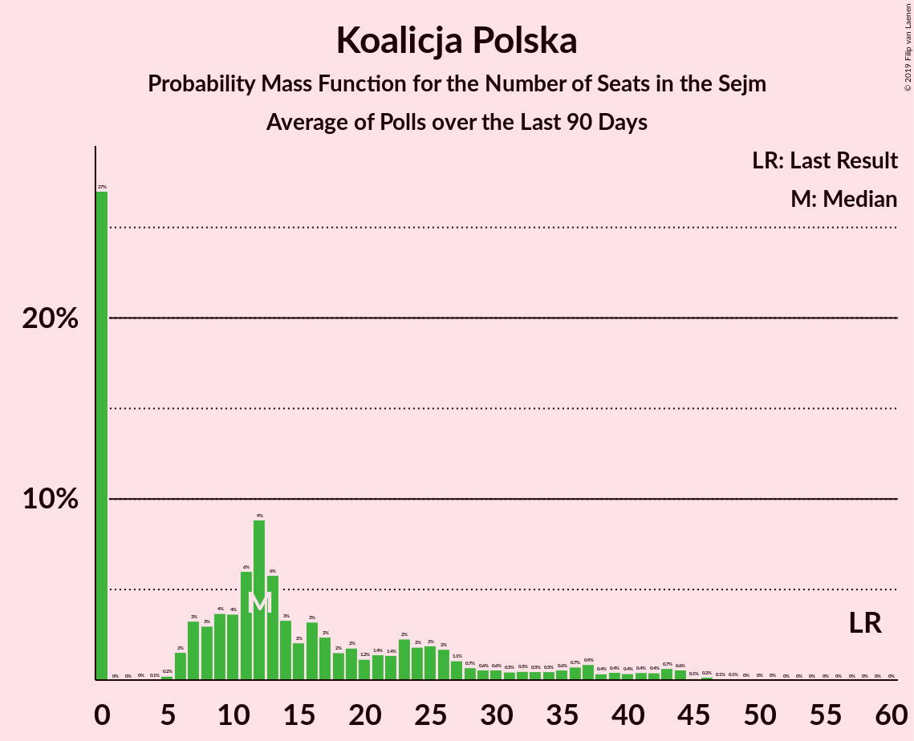

# Koalicja Polska

<a href="#voting-intentions">Voting Intentions</a> | <a href="#seats">Seats</a>

## Voting Intentions

Last result: **13.9%** (General Election of 25 October 2015)

### Confidence Intervals

| Period     | Polling firm/Commissioner(s) | Median | 80% Confidence Interval | 90% Confidence Interval | 95% Confidence Interval | 99% Confidence Interval |
|:----------:|:----------------:|:-----------:|:-----------------------:|:-----------------------:|:-----------------------:|:-----------------------:|
| N/A | [Poll Average](average.html) | 6.0% | 4.0–7.9% | 3.7–8.4% | 3.4–8.8% | 3.0–9.6% |
| [2 October 2019](2019-10-02-IBRiS.html) | IBRiS   Radio ZET | 5.8% | 5.0–6.8% | 4.8–7.1% | 4.6–7.4% | 4.2–7.9% |
| [25–26 September 2019](2019-09-26-KantarPublic.html) | Kantar Public   TVN | 5.0% | 4.2–6.0% | 4.0–6.2% | 3.8–6.5% | 3.4–7.0% |
| [20–25 September 2019](2019-09-25-SocialChanges.html) | Social Changes   wpolityce.pl | 6.8% | 5.9–8.0% | 5.7–8.3% | 5.4–8.6% | 5.0–9.1% |
| [24–25 September 2019](2019-09-25-InstytutBadańPollster.html) | Instytut Badań Pollster   Super Express | 7.0% | 6.1–8.1% | 5.8–8.4% | 5.6–8.7% | 5.2–9.2% |
| [23–25 September 2019](2019-09-25-CBMIndicator.html) | CBM Indicator   TVP | 6.1% | 5.2–7.2% | 5.0–7.5% | 4.8–7.8% | 4.4–8.3% |
| [20–21 September 2019](2019-09-21-IBRiS.html) | IBRiS   RMF | 6.0% | 5.2–7.0% | 4.9–7.3% | 4.7–7.6% | 4.4–8.1% |
| [17–19 September 2019](2019-09-19-Estymator.html) | Estymator   DoRzeczy.pl | 6.1% | 5.2–7.1% | 5.0–7.4% | 4.8–7.7% | 4.4–8.2% |
| [12–19 September 2019](2019-09-19-CBOS.html) | CBOS | 8.0% | 7.0–9.2% | 6.7–9.5% | 6.4–9.8% | 6.0–10.5% |
| [13–18 September 2019](2019-09-18-SocialChanges.html) | Social Changes   wpolityce.pl | 6.8% | 5.9–7.9% | 5.6–8.2% | 5.4–8.5% | 5.0–9.1% |
| [13–17 September 2019](2019-09-17-KantarMillwardBrown.html) | Kantar Millward Brown   Gazeta Wyborcza | 4.0% | 3.3–4.9% | 3.1–5.2% | 2.9–5.4% | 2.7–5.9% |
| [12–14 September 2019](2019-09-14-IBSP.html) | IBSP | 4.2% | 3.4–5.1% | 3.2–5.3% | 3.1–5.6% | 2.8–6.1% |
| [12–13 September 2019](2019-09-13-InstytutBadańPollster.html) | Instytut Badań Pollster   Super Express | 8.0% | 7.0–9.2% | 6.8–9.5% | 6.5–9.8% | 6.1–10.4% |
| [6–11 September 2019](2019-09-11-SocialChanges.html) | Social Changes   wpolityce.pl | 9.8% | 8.7–11.1% | 8.4–11.4% | 8.1–11.8% | 7.6–12.4% |
| [6–11 September 2019](2019-09-11-KantarPublic.html) | Kantar Public   TVN | 6.1% | 5.2–7.1% | 4.9–7.5% | 4.7–7.7% | 4.3–8.3% |
| [6–7 September 2019](2019-09-07-IBRiS.html) | IBRiS   Rzeczpospolita | 5.6% | 4.8–6.6% | 4.5–7.0% | 4.3–7.2% | 4.0–7.7% |
| [4–6 September 2019](2019-09-06-InstytutBadańPollster.html) | Instytut Badań Pollster   Super Express | 7.0% | 6.1–8.1% | 5.9–8.4% | 5.7–8.7% | 5.3–9.3% |
| [4–5 September 2019](2019-09-05-Estymator.html) | Estymator   DoRzeczy.pl | 6.0% | 5.2–7.1% | 4.9–7.4% | 4.7–7.7% | 4.3–8.2% |
| [30 August–4 September 2019](2019-09-04-SocialChanges.html) | Social Changes   wpolityce.pl | 8.5% | 7.5–9.7% | 7.2–10.1% | 7.0–10.4% | 6.5–11.0% |
| [24 August–4 September 2019](2019-09-04-IBRiS.html) | IBRiS   Onet | 5.7% | 5.4–6.1% | 5.3–6.2% | 5.2–6.3% | 5.1–6.4% |
| [23–29 August 2019](2019-08-29-DobraOpinia.html) | Dobra Opinia   PPG | 6.0% | 5.7–6.4% | 5.6–6.5% | 5.5–6.6% | 5.3–6.7% |
| [22–29 August 2019](2019-08-29-CBOS.html) | CBOS | 6.9% | 6.0–8.0% | 5.7–8.3% | 5.5–8.6% | 5.1–9.2% |
| [23–28 August 2019](2019-08-28-SocialChanges.html) | Social Changes   wpolityce.pl | 9.1% | 8.1–10.4% | 7.8–10.8% | 7.5–11.1% | 7.0–11.7% |
| [26–28 August 2019](2019-08-28-Ipsos.html) | Ipsos   OKO | 5.0% | 4.2–6.0% | 4.0–6.2% | 3.8–6.5% | 3.4–7.0% |
| [26 August 2019](2019-08-26-IBRiS.html) | IBRiS   Onet | 7.2% | 6.3–8.3% | 6.0–8.6% | 5.8–8.9% | 5.4–9.4% |
| [24–26 August 2019](2019-08-26-CBMIndicator.html) | CBM Indicator   TVP | 5.7% | 4.9–6.8% | 4.6–7.1% | 4.4–7.3% | 4.1–7.9% |
| [23–24 August 2019](2019-08-24-IBRiS.html) | IBRiS   RMF | 5.8% | 5.0–6.8% | 4.8–7.1% | 4.6–7.4% | 4.2–7.9% |
| [22 August 2019](2019-08-22-KantarPublic.html) | Kantar Public   TVN | 6.0% | 5.2–7.1% | 4.9–7.4% | 4.7–7.7% | 4.3–8.2% |
| [21–22 August 2019](2019-08-22-Estymator.html) | Estymator   DoRzeczy.pl | 6.8% | 5.9–7.9% | 5.6–8.2% | 5.4–8.5% | 5.0–9.0% |
| [16–21 August 2019](2019-08-21-SocialChanges.html) | Social Changes | 8.3% | 7.3–9.6% | 7.0–9.9% | 6.8–10.2% | 6.4–10.8% |
| [16–20 August 2019](2019-08-20-Ariadna.html) | Ariadna | 6.0% | 5.1–7.0% | 4.9–7.3% | 4.7–7.6% | 4.3–8.1% |
| [13 August 2019](2019-08-13-KantarPublic.html) | Kantar Public   TVN | 4.0% | 3.3–4.9% | 3.1–5.2% | 2.9–5.4% | 2.6–5.9% |
| [9–10 August 2019](2019-08-10-IBRiS.html) | IBRiS   Rzeczpospolita | 6.5% | 5.7–7.6% | 5.4–7.9% | 5.2–8.2% | 4.8–8.7% |
| [6–8 August 2019](2019-08-08-Estymator.html) | Estymator   DoRzeczy.pl | 5.3% | N/A | N/A | N/A | N/A |
| [2–7 August 2019](2019-08-07-SocialChanges.html) | Social Changes | 9.3% | N/A | N/A | N/A | N/A |
| [6–7 August 2019](2019-08-07-InstytutBadańPollster.html) | Instytut Badań Pollster   Super Express | 0.0% | N/A | N/A | N/A | N/A |
| [26–31 July 2019](2019-07-31-SocialChanges.html) | Social Changes | 9.2% | N/A | N/A | N/A | N/A |
| [26–27 July 2019](2019-07-27-IBRiS.html) | IBRiS   RMF | 0.0% | N/A | N/A | N/A | N/A |
| [19–24 July 2019](2019-07-24-SocialChanges.html) | Social Changes | 11.5% | N/A | N/A | N/A | N/A |
| [18–19 July 2019](2019-07-19-Estymator.html) | Estymator   DoRzeczy.pl | 0.0% | N/A | N/A | N/A | N/A |
| [12–17 July 2019](2019-07-17-SocialChanges.html) | Social Changes | 0.0% | N/A | N/A | N/A | N/A |
| [12–17 July 2019](2019-07-17-KantarPublic.html) | Kantar Public   Radio ZET | 0.0% | N/A | N/A | N/A | N/A |
| [12–15 July 2019](2019-07-15-KantarMillwardBrown.html) | Kantar Millward Brown   TVN and TVN24 | 0.0% | N/A | N/A | N/A | N/A |
| [12–13 July 2019](2019-07-13-IBRiS.html) | IBRiS   Rzeczpospolita | 0.0% | N/A | N/A | N/A | N/A |
| [4–11 July 2019](2019-07-11-CBOS.html) | CBOS | 0.0% | N/A | N/A | N/A | N/A |
| [5–10 July 2019](2019-07-10-SocialChanges.html) | Social Changes | 0.0% | N/A | N/A | N/A | N/A |
| [28–29 June 2019](2019-06-29-IBRiS.html) | IBRiS   RMF | 0.0% | N/A | N/A | N/A | N/A |
| [21–26 June 2019](2019-06-26-SocialChanges.html) | Social Changes | 0.0% | N/A | N/A | N/A | N/A |
| [19–20 June 2019](2019-06-20-Estymator.html) | Estymator   DoRzeczy.pl | 0.0% | N/A | N/A | N/A | N/A |
| [6–13 June 2019](2019-06-13-CBOS.html) | CBOS | 0.0% | N/A | N/A | N/A | N/A |
| [7–8 June 2019](2019-06-08-IBRiS.html) | IBRiS   Rzeczpospolita | 0.0% | N/A | N/A | N/A | N/A |
| [31 May–5 June 2019](2019-06-05-SocialChanges.html) | Social Changes | 0.0% | N/A | N/A | N/A | N/A |
| [24–29 May 2019](2019-05-29-SocialChanges.html) | Social Changes | 0.0% | N/A | N/A | N/A | N/A |
| [16–23 May 2019](2019-05-23-CBOS.html) | CBOS | 0.0% | N/A | N/A | N/A | N/A |
| [10–15 May 2019](2019-05-15-SocialChanges.html) | Social Changes | 0.0% | N/A | N/A | N/A | N/A |
| [10–15 May 2019](2019-05-15-KantarMillwardBrown.html) | Kantar Millward Brown   Gazeta Wyborcza | 0.0% | N/A | N/A | N/A | N/A |
| [1–4 May 2019](2019-05-04-PracowniaAnalizSpołeczno-Politycznych.html) | Pracownia Analiz Społeczno-Politycznych   Gazeta Bałtycka | 0.0% | N/A | N/A | N/A | N/A |
| [26–30 April 2019](2019-04-30-SocialChanges.html) | Social Changes | 0.0% | N/A | N/A | N/A | N/A |
| [26–29 April 2019](2019-04-29-InstytutBadańPollster.html) | Instytut Badań Pollster   Super Express | 0.0% | N/A | N/A | N/A | N/A |
| [19–24 April 2019](2019-04-24-SocialChanges.html) | Social Changes | 0.0% | N/A | N/A | N/A | N/A |
| [12–17 April 2019](2019-04-17-SocialChanges.html) | Social Changes | 0.0% | N/A | N/A | N/A | N/A |
| [25–27 March 2019](2019-03-27-InstytutBadańSprawNarodowościowych.html) | Instytut Badań Spraw Narodowościowych   Radio ZET | 0.0% | N/A | N/A | N/A | N/A |
| [20–22 March 2019](2019-03-22-CBMIndicator.html) | CBM Indicator   TVP1 | 0.0% | N/A | N/A | N/A | N/A |
| [20–21 March 2019](2019-03-21-Estymator.html) | Estymator   DoRzeczy.pl | 0.0% | N/A | N/A | N/A | N/A |
| [7–14 March 2019](2019-03-14-CBOS.html) | CBOS | 0.0% | N/A | N/A | N/A | N/A |
| [8–13 March 2019](2019-03-13-KantarPublic.html) | Kantar Public | 0.0% | N/A | N/A | N/A | N/A |
| [9–10 March 2019](2019-03-10-IBRiS.html) | IBRiS   Rzeczpospolita | 0.0% | N/A | N/A | N/A | N/A |
| [20–21 February 2019](2019-02-21-Estymator.html) | Estymator   DoRzeczy.pl | 0.0% | N/A | N/A | N/A | N/A |
| [14–16 February 2019](2019-02-16-IPSOS.html) | IPSOS   OKO.press | 0.0% | N/A | N/A | N/A | N/A |
| [7–14 February 2019](2019-02-14-CBOS.html) | CBOS | 0.0% | N/A | N/A | N/A | N/A |
| [8–13 February 2019](2019-02-13-KantarPublic.html) | Kantar Public | 0.0% | N/A | N/A | N/A | N/A |
| [8–11 February 2019](2019-02-11-OPBAriadna.html) | OPB Ariadna   WP | 0.0% | N/A | N/A | N/A | N/A |
| [7–8 February 2019](2019-02-08-IBRiS.html) | IBRiS   Rzeczpospolita | 0.0% | N/A | N/A | N/A | N/A |
| [5–7 February 2019](2019-02-07-Estymator.html) | Estymator   DoRzeczy.pl | 0.0% | N/A | N/A | N/A | N/A |
| [31 January–6 February 2019](2019-02-06-InstytutBadańSprawNarodowościowych.html) | Instytut Badań Spraw Narodowościowych   Radio ZET | 0.0% | N/A | N/A | N/A | N/A |
| [4–5 February 2019](2019-02-05-KantarMillwardBrown.html) | Kantar Millward Brown | 0.0% | N/A | N/A | N/A | N/A |
| [30 January 2019](2019-01-30-InstytutBadańPollster.html) | Instytut Badań Pollster   Super Express | 0.0% | N/A | N/A | N/A | N/A |
| [26–27 January 2019](2019-01-27-IBRiS.html) | IBRiS   Rzeczpospolita | 0.0% | N/A | N/A | N/A | N/A |
| [25–26 January 2019](2019-01-26-IBRiS.html) | IBRiS   Onet | 0.0% | N/A | N/A | N/A | N/A |
| [23–24 January 2019](2019-01-24-Estymator.html) | Estymator   DoRzeczy.pl | 0.0% | N/A | N/A | N/A | N/A |
| [10–17 January 2019](2019-01-17-CBOS.html) | CBOS | 0.0% | N/A | N/A | N/A | N/A |
| [11–16 January 2019](2019-01-16-KantarPublic.html) | Kantar Public | 0.0% | N/A | N/A | N/A | N/A |
| [15–16 January 2019](2019-01-16-KantarMillwardBrown.html) | Kantar Millward Brown   Gazeta Wyborcza | 0.0% | N/A | N/A | N/A | N/A |
| [10–11 January 2019](2019-01-11-InstytutBadańPollster.html) | Instytut Badań Pollster   Super Express | 0.0% | N/A | N/A | N/A | N/A |
| [4 January 2019](2019-01-04-IBRiS.html) | IBRiS   Rzeczpospolita | 0.0% | N/A | N/A | N/A | N/A |
| [13–14 December 2018](2018-12-14-InstytutBadańPollster.html) | Instytut Badań Pollster   Super Express | 0.0% | N/A | N/A | N/A | N/A |
| [12–13 December 2018](2018-12-13-Estymator.html) | Estymator   DoRzeczy.pl | 0.0% | N/A | N/A | N/A | N/A |
| [30 November–11 December 2018](2018-12-11-KantarPublic.html) | Kantar Public | 0.0% | N/A | N/A | N/A | N/A |
| [29 November–9 December 2018](2018-12-09-CBOS.html) | CBOS | 0.0% | N/A | N/A | N/A | N/A |
| [7–8 December 2018](2018-12-08-IBRiS.html) | IBRiS   Rzeczpospolita | 0.0% | N/A | N/A | N/A | N/A |
| [23–24 November 2018](2018-11-24-IBRiS.html) | IBRiS   Onet | 0.0% | N/A | N/A | N/A | N/A |
| [20–21 November 2018](2018-11-21-Estymator.html) | Estymator   DoRzeczy.pl | 0.0% | N/A | N/A | N/A | N/A |
| [19–20 November 2018](2018-11-20-KantarMillwardBrown.html) | Kantar Millward Brown   TVN and TVN24 | 0.0% | N/A | N/A | N/A | N/A |
| [9–15 November 2018](2018-11-15-KantarPublic.html) | Kantar Public | 0.0% | N/A | N/A | N/A | N/A |
| [8–15 November 2018](2018-11-15-CBOS.html) | CBOS | 0.0% | N/A | N/A | N/A | N/A |
| [13 November 2018](2018-11-13-IBRiS.html) | IBRiS   Rzeczpospolita | 0.0% | N/A | N/A | N/A | N/A |
| [8–9 November 2018](2018-11-09-IBRiS.html) | IBRiS   Rzeczpospolita | 0.0% | N/A | N/A | N/A | N/A |
| [29–30 October 2018](2018-10-30-Estymator.html) | Estymator   DoRzeczy.pl | 0.0% | N/A | N/A | N/A | N/A |
| [26–27 October 2018](2018-10-27-IBRiS.html) | IBRiS | 0.0% | N/A | N/A | N/A | N/A |
| [12–17 October 2018](2018-10-17-KantarPublic.html) | Kantar Public | 0.0% | N/A | N/A | N/A | N/A |
| [4–11 October 2018](2018-10-11-CBOS.html) | CBOS | 0.0% | N/A | N/A | N/A | N/A |
| [5–6 October 2018](2018-10-06-IBRiS.html) | IBRiS   Rzeczpospolita | 0.0% | N/A | N/A | N/A | N/A |
| [1 October 2018](2018-10-01-InstytutBadańPollster.html) | Instytut Badań Pollster   Super Express | 0.0% | N/A | N/A | N/A | N/A |
| [22–23 September 2018](2018-09-23-IBRiS.html) | IBRiS   Onet | 0.0% | N/A | N/A | N/A | N/A |
| [20–21 September 2018](2018-09-21-Estymator.html) | Estymator   DoRzeczy.pl | 0.0% | N/A | N/A | N/A | N/A |
| [14–17 September 2018](2018-09-17-KantarMillwardBrown.html) | Kantar Millward Brown   TVN and TVN24 | 0.0% | N/A | N/A | N/A | N/A |
| [6–13 September 2018](2018-09-13-CBOS.html) | CBOS | 0.0% | N/A | N/A | N/A | N/A |
| [7–12 September 2018](2018-09-12-KantarPublic.html) | Kantar Public | 0.0% | N/A | N/A | N/A | N/A |
| [25 August–1 September 2018](2018-09-01-IBRiS.html) | IBRiS   Rzeczpospolita | 0.0% | N/A | N/A | N/A | N/A |
| [22–23 August 2018](2018-08-23-Estymator.html) | Estymator   DoRzeczy.pl | 0.0% | N/A | N/A | N/A | N/A |
| [16–23 August 2018](2018-08-23-CBOS.html) | CBOS | 0.0% | N/A | N/A | N/A | N/A |
| [17–19 August 2018](2018-08-19-IPSOS.html) | IPSOS   OKO.press | 0.0% | N/A | N/A | N/A | N/A |
| [11 August 2018](2018-08-11-KantarPublic.html) | Kantar Public   Gazeta Prawna | 0.0% | N/A | N/A | N/A | N/A |
| [11 August 2018](2018-08-11-IBRiS.html) | IBRiS   Rzeczpospolita | 0.0% | N/A | N/A | N/A | N/A |
| [9–10 August 2018](2018-08-10-InstytutBadańPollster.html) | Instytut Badań Pollster   Super Express | 0.0% | N/A | N/A | N/A | N/A |
| [8–10 August 2018](2018-08-10-CBMIndicator.html) | CBM Indicator   TVP1 | 0.0% | N/A | N/A | N/A | N/A |
| [8–9 August 2018](2018-08-09-Estymator.html) | Estymator   DoRzeczy.pl | 0.0% | N/A | N/A | N/A | N/A |
| [27 July 2018](2018-07-27-IBRiS.html) | IBRiS | 0.0% | N/A | N/A | N/A | N/A |
| [11–12 July 2018](2018-07-12-InstytutBadańPollster.html) | Instytut Badań Pollster   Super Express | 0.0% | N/A | N/A | N/A | N/A |
| [6–11 July 2018](2018-07-11-KantarPublic.html) | Kantar Public | 0.0% | N/A | N/A | N/A | N/A |
| [8–9 July 2018](2018-07-09-IBRiS.html) | IBRiS   Rzeczpospolita | 0.0% | N/A | N/A | N/A | N/A |
| [4–5 July 2018](2018-07-05-InstytutBadańPollster.html) | Instytut Badań Pollster   TVP1 | 0.0% | N/A | N/A | N/A | N/A |
| [28 June–5 July 2018](2018-07-05-CBOS.html) | CBOS | 0.0% | N/A | N/A | N/A | N/A |
| [27–28 June 2018](2018-06-28-Estymator.html) | Estymator   DoRzeczy.pl | 0.0% | N/A | N/A | N/A | N/A |
| [21–22 June 2018](2018-06-22-IBRiS.html) | IBRiS   Onet | 0.0% | N/A | N/A | N/A | N/A |
| [18 June 2018](2018-06-18-InstytutBadańPollster.html) | Instytut Badań Pollster   Super Express | 0.0% | N/A | N/A | N/A | N/A |
| [9–17 June 2018](2018-06-17-KantarPublic.html) | Kantar Public | 0.0% | N/A | N/A | N/A | N/A |
| [13–14 June 2018](2018-06-14-Estymator.html) | Estymator   DoRzeczy.pl | 0.0% | N/A | N/A | N/A | N/A |
| [7–14 June 2018](2018-06-14-CBOS.html) | CBOS | 0.0% | N/A | N/A | N/A | N/A |
| [7–8 June 2018](2018-06-08-IBRiS.html) | IBRiS   Rzeczpospolita | 0.0% | N/A | N/A | N/A | N/A |
| [6–7 June 2018](2018-06-07-InstytutBadańPollster.html) | Instytut Badań Pollster   TVP1 | 0.0% | N/A | N/A | N/A | N/A |
| [28–29 May 2018](2018-05-29-KantarMillwardBrown.html) | Kantar Millward Brown   TVN and TVN24 | 0.0% | N/A | N/A | N/A | N/A |
| [24–25 May 2018](2018-05-25-IBRiS.html) | IBRiS   Onet | 0.0% | N/A | N/A | N/A | N/A |
| [23–24 May 2018](2018-05-24-Estymator.html) | Estymator   DoRzeczy.pl | 0.0% | N/A | N/A | N/A | N/A |
| [10–17 May 2018](2018-05-17-CBOS.html) | CBOS | 0.0% | N/A | N/A | N/A | N/A |
| [11–16 May 2018](2018-05-16-KantarPublic.html) | Kantar Public | 0.0% | N/A | N/A | N/A | N/A |
| [14 May 2018](2018-05-14-Estymator.html) | Estymator   DoRzeczy.pl | 0.0% | N/A | N/A | N/A | N/A |
| [10–11 May 2018](2018-05-11-InstytutBadańPollster.html) | Instytut Badań Pollster   TVP1 | 0.0% | N/A | N/A | N/A | N/A |
| [10–11 May 2018](2018-05-11-IBRiS.html) | IBRiS   Rzeczpospolita | 0.0% | N/A | N/A | N/A | N/A |
| [27–29 April 2018](2018-04-29-InstytutBadańPollster.html) | Instytut Badań Pollster   Nowa TV, se.pl and Super Express | 0.0% | N/A | N/A | N/A | N/A |
| [25–27 April 2018](2018-04-27-InstytutBadańPollster.html) | Instytut Badań Pollster   Nowa TV, se.pl and Super Express | 0.0% | N/A | N/A | N/A | N/A |
| [25–26 April 2018](2018-04-26-KantarMillwardBrown.html) | Kantar Millward Brown   TVN and TVN24 | 0.0% | N/A | N/A | N/A | N/A |
| [25–26 April 2018](2018-04-26-Estymator.html) | Estymator   DoRzeczy.pl | 0.0% | N/A | N/A | N/A | N/A |
| [19 April 2018](2018-04-19-IBRiS.html) | IBRiS   Onet | 0.0% | N/A | N/A | N/A | N/A |
| [12–13 April 2018](2018-04-13-IPSOS.html) | IPSOS   OKO.press | 0.0% | N/A | N/A | N/A | N/A |
| [5–12 April 2018](2018-04-12-CBOS.html) | CBOS | 0.0% | N/A | N/A | N/A | N/A |
| [9–10 April 2018](2018-04-10-KantarPublic.html) | Kantar Public | 0.0% | N/A | N/A | N/A | N/A |
| [6–7 April 2018](2018-04-07-InstytutBadańPollster.html) | Instytut Badań Pollster   TVP1 | 0.0% | N/A | N/A | N/A | N/A |
| [4–5 April 2018](2018-04-05-InstytutBadańPollster.html) | Instytut Badań Pollster   Nowa TV, se.pl and Super Express | 0.0% | N/A | N/A | N/A | N/A |
| [4–5 April 2018](2018-04-05-Estymator.html) | Estymator   DoRzeczy.pl | 0.0% | N/A | N/A | N/A | N/A |
| [4 April 2018](2018-04-04-IBRiS.html) | IBRiS   Rzeczpospolita | 0.0% | N/A | N/A | N/A | N/A |
| [29–30 March 2018](2018-03-30-InstytutBadańPollster.html) | Instytut Badań Pollster   TVP1 | 0.0% | N/A | N/A | N/A | N/A |
| [26–27 March 2018](2018-03-27-KantarMillwardBrown.html) | Kantar Millward Brown   TVN and TVN24 | 0.0% | N/A | N/A | N/A | N/A |
| [21–22 March 2018](2018-03-22-Estymator.html) | Estymator   DoRzeczy.pl | 0.0% | N/A | N/A | N/A | N/A |
| [17 March 2018](2018-03-17-IBRiS.html) | IBRiS   Onet | 0.0% | N/A | N/A | N/A | N/A |
| [9–14 March 2018](2018-03-14-KantarPublic.html) | Kantar Public | 0.0% | N/A | N/A | N/A | N/A |
| [1–8 March 2018](2018-03-08-CBOS.html) | CBOS | 0.0% | N/A | N/A | N/A | N/A |
| [1–2 March 2018](2018-03-02-IBRiS.html) | IBRiS   Rzeczpospolita | 0.0% | N/A | N/A | N/A | N/A |
| [26 February 2018](2018-02-26-IBRiS.html) | IBRiS | 0.0% | N/A | N/A | N/A | N/A |
| [22 February 2018](2018-02-22-InstytutBadańPollster.html) | Instytut Badań Pollster   Nowa TV, se.pl and Super Express | 0.0% | N/A | N/A | N/A | N/A |
| [21–22 February 2018](2018-02-22-Estymator.html) | Estymator   DoRzeczy.pl | 0.0% | N/A | N/A | N/A | N/A |
| [16–21 February 2018](2018-02-21-KantarPublic.html) | Kantar Public | 0.0% | N/A | N/A | N/A | N/A |
| [19–20 February 2018](2018-02-20-KantarMillwardBrown.html) | Kantar Millward Brown   TVN and TVN24 | 0.0% | N/A | N/A | N/A | N/A |
| [20 February 2018](2018-02-20-IBRiS.html) | IBRiS   Onet | 0.0% | N/A | N/A | N/A | N/A |
| [1–8 February 2018](2018-02-08-CBOS.html) | CBOS | 0.0% | N/A | N/A | N/A | N/A |
| [5 February 2018](2018-02-05-IBRiS.html) | IBRiS   Rzeczpospolita | 0.0% | N/A | N/A | N/A | N/A |

### Probability Mass Function

The following table shows the probability mass function per percentage block of voting intentions for the [poll average](average.html) for Koalicja Polska.

| Voting Intentions | Probability | Accumulated | Special Marks |
|:-----------------:|:-----------:|:-----------:|:-------------:|
| 1.5–2.5% | 0% | 100% |  |
| 2.5–3.5% | 4% | 100% |  |
| 3.5–4.5% | 16% | 96% |  |
| 4.5–5.5% | 19% | 80% |  |
| 5.5–6.5% | 26% | 61% | Median |
| 6.5–7.5% | 21% | 35% |  |
| 7.5–8.5% | 11% | 14% |  |
| 8.5–9.5% | 3% | 4% |  |
| 9.5–10.5% | 0.5% | 0.6% |  |
| 10.5–11.5% | 0% | 0% |  |
| 11.5–12.5% | 0% | 0% |  |
| 12.5–13.5% | 0% | 0% |  |
| 13.5–14.5% | 0% | 0% | Last Result |

## Seats

Last result: **58** seats (General Election of 25 October 2015)

### Confidence Intervals

| Period     | Polling firm/Commissioner(s) | Median | 80% Confidence Interval | 90% Confidence Interval | 95% Confidence Interval | 99% Confidence Interval |
|:----------:|:----------------:|:------:|:-----------------------:|:-----------------------:|:-----------------------:|:-----------------------:|
| N/A | [Poll Average](average.html) | 12 | 0–30 | 0–37 | 0–42 | 0–46 |
| [2 October 2019](2019-10-02-IBRiS.html) | IBRiS   Radio ZET | 12 | 0–23 | 0–25 | 0–26 | 0–30 |
| [25–26 September 2019](2019-09-26-KantarPublic.html) | Kantar Public   TVN | 8 | 0–14 | 0–17 | 0–20 | 0–25 |
| [20–25 September 2019](2019-09-25-SocialChanges.html) | Social Changes   wpolityce.pl | 17 | 10–26 | 8–27 | 7–29 | 4–34 |
| [24–25 September 2019](2019-09-25-InstytutBadańPollster.html) | Instytut Badań Pollster   Super Express | 21 | 12–28 | 11–30 | 8–32 | 7–37 |
| [23–25 September 2019](2019-09-25-CBMIndicator.html) | CBM Indicator   TVP | 14 | 8–24 | 0–26 | 0–28 | 0–32 |
| [20–21 September 2019](2019-09-21-IBRiS.html) | IBRiS   RMF | 13 | 7–24 | 0–25 | 0–26 | 0–30 |
| [17–19 September 2019](2019-09-19-Estymator.html) | Estymator   DoRzeczy.pl | 11 | 6–19 | 0–23 | 0–24 | 0–28 |
| [12–19 September 2019](2019-09-19-CBOS.html) | CBOS | 37 | 27–44 | 25–45 | 23–47 | 17–50 |
| [13–18 September 2019](2019-09-18-SocialChanges.html) | Social Changes   wpolityce.pl | 16 | 9–25 | 7–27 | 6–28 | 0–34 |
| [13–17 September 2019](2019-09-17-KantarMillwardBrown.html) | Kantar Millward Brown   Gazeta Wyborcza | 0 | 0 | 0–7 | 0–8 | 0–13 |
| [12–14 September 2019](2019-09-14-IBSP.html) | IBSP | 0 | 0–6 | 0–7 | 0–9 | 0–12 |
| [12–13 September 2019](2019-09-13-InstytutBadańPollster.html) | Instytut Badań Pollster   Super Express | 27 | 19–36 | 16–39 | 15–41 | 12–43 |
| [6–11 September 2019](2019-09-11-SocialChanges.html) | Social Changes   wpolityce.pl | 39 | 30–44 | 28–46 | 26–47 | 23–51 |
| [6–11 September 2019](2019-09-11-KantarPublic.html) | Kantar Public   TVN | 19 | 11–28 | 0–30 | 0–33 | 0–39 |
| [6–7 September 2019](2019-09-07-IBRiS.html) | IBRiS   Rzeczpospolita | 13 | 0–24 | 0–25 | 0–26 | 0–32 |
| [4–6 September 2019](2019-09-06-InstytutBadańPollster.html) | Instytut Badań Pollster   Super Express | 19 | 12–27 | 11–30 | 9–31 | 6–36 |
| [4–5 September 2019](2019-09-05-Estymator.html) | Estymator   DoRzeczy.pl | 12 | 6–20 | 0–23 | 0–25 | 0–28 |
| [30 August–4 September 2019](2019-09-04-SocialChanges.html) | Social Changes   wpolityce.pl | 29 | 22–38 | 19–41 | 16–42 | 12–45 |
| [24 August–4 September 2019](2019-09-04-IBRiS.html) | IBRiS   Onet | 12 | 10–16 | 9–18 | 9–19 | 8–23 |
| [23–29 August 2019](2019-08-29-DobraOpinia.html) | Dobra Opinia   PPG | 12 | 10–14 | 9–14 | 8–14 | 8–16 |
| [22–29 August 2019](2019-08-29-CBOS.html) | CBOS | 20 | 11–27 | 9–30 | 8–32 | 6–36 |
| [23–28 August 2019](2019-08-28-SocialChanges.html) | Social Changes   wpolityce.pl | 34 | 26–43 | 24–45 | 22–46 | 18–49 |
| [26–28 August 2019](2019-08-28-Ipsos.html) | Ipsos   OKO | 7 | 0–12 | 0–15 | 0–18 | 0–23 |
| [26 August 2019](2019-08-26-IBRiS.html) | IBRiS   Onet | 24 | 16–33 | 12–35 | 12–37 | 9–42 |
| [24–26 August 2019](2019-08-26-CBMIndicator.html) | CBM Indicator   TVP | 12 | 0–22 | 0–24 | 0–26 | 0–30 |
| [23–24 August 2019](2019-08-24-IBRiS.html) | IBRiS   RMF | 12 | 0–23 | 0–25 | 0–27 | 0–30 |
| [22 August 2019](2019-08-22-KantarPublic.html) | Kantar Public   TVN | 14 | 9–24 | 0–26 | 0–27 | 0–33 |
| [21–22 August 2019](2019-08-22-Estymator.html) | Estymator   DoRzeczy.pl | 18 | 11–26 | 9–28 | 8–30 | 0–35 |
| [16–21 August 2019](2019-08-21-SocialChanges.html) | Social Changes | 28 | 21–38 | 17–40 | 15–42 | 12–44 |
| [16–20 August 2019](2019-08-20-Ariadna.html) | Ariadna | 13 | 7–25 | 0–26 | 0–27 | 0–30 |
| [13 August 2019](2019-08-13-KantarPublic.html) | Kantar Public   TVN | 0 | 0 | 0–9 | 0–10 | 0–13 |
| [9–10 August 2019](2019-08-10-IBRiS.html) | IBRiS   Rzeczpospolita | 20 | 12–28 | 11–30 | 9–32 | 0–37 |
| [6–8 August 2019](2019-08-08-Estymator.html) | Estymator   DoRzeczy.pl |  |  |  |  |  |
| [2–7 August 2019](2019-08-07-SocialChanges.html) | Social Changes |  |  |  |  |  |
| [6–7 August 2019](2019-08-07-InstytutBadańPollster.html) | Instytut Badań Pollster   Super Express |  |  |  |  |  |
| [26–31 July 2019](2019-07-31-SocialChanges.html) | Social Changes |  |  |  |  |  |
| [26–27 July 2019](2019-07-27-IBRiS.html) | IBRiS   RMF |  |  |  |  |  |
| [19–24 July 2019](2019-07-24-SocialChanges.html) | Social Changes |  |  |  |  |  |
| [18–19 July 2019](2019-07-19-Estymator.html) | Estymator   DoRzeczy.pl |  |  |  |  |  |
| [12–17 July 2019](2019-07-17-SocialChanges.html) | Social Changes |  |  |  |  |  |
| [12–17 July 2019](2019-07-17-KantarPublic.html) | Kantar Public   Radio ZET |  |  |  |  |  |
| [12–15 July 2019](2019-07-15-KantarMillwardBrown.html) | Kantar Millward Brown   TVN and TVN24 |  |  |  |  |  |
| [12–13 July 2019](2019-07-13-IBRiS.html) | IBRiS   Rzeczpospolita |  |  |  |  |  |
| [4–11 July 2019](2019-07-11-CBOS.html) | CBOS |  |  |  |  |  |
| [5–10 July 2019](2019-07-10-SocialChanges.html) | Social Changes |  |  |  |  |  |
| [28–29 June 2019](2019-06-29-IBRiS.html) | IBRiS   RMF |  |  |  |  |  |
| [21–26 June 2019](2019-06-26-SocialChanges.html) | Social Changes |  |  |  |  |  |
| [19–20 June 2019](2019-06-20-Estymator.html) | Estymator   DoRzeczy.pl |  |  |  |  |  |
| [6–13 June 2019](2019-06-13-CBOS.html) | CBOS |  |  |  |  |  |
| [7–8 June 2019](2019-06-08-IBRiS.html) | IBRiS   Rzeczpospolita |  |  |  |  |  |
| [31 May–5 June 2019](2019-06-05-SocialChanges.html) | Social Changes |  |  |  |  |  |
| [24–29 May 2019](2019-05-29-SocialChanges.html) | Social Changes |  |  |  |  |  |
| [16–23 May 2019](2019-05-23-CBOS.html) | CBOS |  |  |  |  |  |
| [10–15 May 2019](2019-05-15-SocialChanges.html) | Social Changes |  |  |  |  |  |
| [10–15 May 2019](2019-05-15-KantarMillwardBrown.html) | Kantar Millward Brown   Gazeta Wyborcza |  |  |  |  |  |
| [1–4 May 2019](2019-05-04-PracowniaAnalizSpołeczno-Politycznych.html) | Pracownia Analiz Społeczno-Politycznych   Gazeta Bałtycka |  |  |  |  |  |
| [26–30 April 2019](2019-04-30-SocialChanges.html) | Social Changes |  |  |  |  |  |
| [26–29 April 2019](2019-04-29-InstytutBadańPollster.html) | Instytut Badań Pollster   Super Express |  |  |  |  |  |
| [19–24 April 2019](2019-04-24-SocialChanges.html) | Social Changes |  |  |  |  |  |
| [12–17 April 2019](2019-04-17-SocialChanges.html) | Social Changes |  |  |  |  |  |
| [25–27 March 2019](2019-03-27-InstytutBadańSprawNarodowościowych.html) | Instytut Badań Spraw Narodowościowych   Radio ZET |  |  |  |  |  |
| [20–22 March 2019](2019-03-22-CBMIndicator.html) | CBM Indicator   TVP1 |  |  |  |  |  |
| [20–21 March 2019](2019-03-21-Estymator.html) | Estymator   DoRzeczy.pl |  |  |  |  |  |
| [7–14 March 2019](2019-03-14-CBOS.html) | CBOS |  |  |  |  |  |
| [8–13 March 2019](2019-03-13-KantarPublic.html) | Kantar Public |  |  |  |  |  |
| [9–10 March 2019](2019-03-10-IBRiS.html) | IBRiS   Rzeczpospolita |  |  |  |  |  |
| [20–21 February 2019](2019-02-21-Estymator.html) | Estymator   DoRzeczy.pl |  |  |  |  |  |
| [14–16 February 2019](2019-02-16-IPSOS.html) | IPSOS   OKO.press |  |  |  |  |  |
| [7–14 February 2019](2019-02-14-CBOS.html) | CBOS |  |  |  |  |  |
| [8–13 February 2019](2019-02-13-KantarPublic.html) | Kantar Public |  |  |  |  |  |
| [8–11 February 2019](2019-02-11-OPBAriadna.html) | OPB Ariadna   WP |  |  |  |  |  |
| [7–8 February 2019](2019-02-08-IBRiS.html) | IBRiS   Rzeczpospolita |  |  |  |  |  |
| [5–7 February 2019](2019-02-07-Estymator.html) | Estymator   DoRzeczy.pl |  |  |  |  |  |
| [31 January–6 February 2019](2019-02-06-InstytutBadańSprawNarodowościowych.html) | Instytut Badań Spraw Narodowościowych   Radio ZET |  |  |  |  |  |
| [4–5 February 2019](2019-02-05-KantarMillwardBrown.html) | Kantar Millward Brown |  |  |  |  |  |
| [30 January 2019](2019-01-30-InstytutBadańPollster.html) | Instytut Badań Pollster   Super Express |  |  |  |  |  |
| [26–27 January 2019](2019-01-27-IBRiS.html) | IBRiS   Rzeczpospolita |  |  |  |  |  |
| [25–26 January 2019](2019-01-26-IBRiS.html) | IBRiS   Onet |  |  |  |  |  |
| [23–24 January 2019](2019-01-24-Estymator.html) | Estymator   DoRzeczy.pl |  |  |  |  |  |
| [10–17 January 2019](2019-01-17-CBOS.html) | CBOS |  |  |  |  |  |
| [11–16 January 2019](2019-01-16-KantarPublic.html) | Kantar Public |  |  |  |  |  |
| [15–16 January 2019](2019-01-16-KantarMillwardBrown.html) | Kantar Millward Brown   Gazeta Wyborcza |  |  |  |  |  |
| [10–11 January 2019](2019-01-11-InstytutBadańPollster.html) | Instytut Badań Pollster   Super Express |  |  |  |  |  |
| [4 January 2019](2019-01-04-IBRiS.html) | IBRiS   Rzeczpospolita |  |  |  |  |  |
| [13–14 December 2018](2018-12-14-InstytutBadańPollster.html) | Instytut Badań Pollster   Super Express |  |  |  |  |  |
| [12–13 December 2018](2018-12-13-Estymator.html) | Estymator   DoRzeczy.pl |  |  |  |  |  |
| [30 November–11 December 2018](2018-12-11-KantarPublic.html) | Kantar Public |  |  |  |  |  |
| [29 November–9 December 2018](2018-12-09-CBOS.html) | CBOS |  |  |  |  |  |
| [7–8 December 2018](2018-12-08-IBRiS.html) | IBRiS   Rzeczpospolita |  |  |  |  |  |
| [23–24 November 2018](2018-11-24-IBRiS.html) | IBRiS   Onet |  |  |  |  |  |
| [20–21 November 2018](2018-11-21-Estymator.html) | Estymator   DoRzeczy.pl |  |  |  |  |  |
| [19–20 November 2018](2018-11-20-KantarMillwardBrown.html) | Kantar Millward Brown   TVN and TVN24 |  |  |  |  |  |
| [9–15 November 2018](2018-11-15-KantarPublic.html) | Kantar Public |  |  |  |  |  |
| [8–15 November 2018](2018-11-15-CBOS.html) | CBOS |  |  |  |  |  |
| [13 November 2018](2018-11-13-IBRiS.html) | IBRiS   Rzeczpospolita |  |  |  |  |  |
| [8–9 November 2018](2018-11-09-IBRiS.html) | IBRiS   Rzeczpospolita |  |  |  |  |  |
| [29–30 October 2018](2018-10-30-Estymator.html) | Estymator   DoRzeczy.pl |  |  |  |  |  |
| [26–27 October 2018](2018-10-27-IBRiS.html) | IBRiS |  |  |  |  |  |
| [12–17 October 2018](2018-10-17-KantarPublic.html) | Kantar Public |  |  |  |  |  |
| [4–11 October 2018](2018-10-11-CBOS.html) | CBOS |  |  |  |  |  |
| [5–6 October 2018](2018-10-06-IBRiS.html) | IBRiS   Rzeczpospolita |  |  |  |  |  |
| [1 October 2018](2018-10-01-InstytutBadańPollster.html) | Instytut Badań Pollster   Super Express |  |  |  |  |  |
| [22–23 September 2018](2018-09-23-IBRiS.html) | IBRiS   Onet |  |  |  |  |  |
| [20–21 September 2018](2018-09-21-Estymator.html) | Estymator   DoRzeczy.pl |  |  |  |  |  |
| [14–17 September 2018](2018-09-17-KantarMillwardBrown.html) | Kantar Millward Brown   TVN and TVN24 |  |  |  |  |  |
| [6–13 September 2018](2018-09-13-CBOS.html) | CBOS |  |  |  |  |  |
| [7–12 September 2018](2018-09-12-KantarPublic.html) | Kantar Public |  |  |  |  |  |
| [25 August–1 September 2018](2018-09-01-IBRiS.html) | IBRiS   Rzeczpospolita |  |  |  |  |  |
| [22–23 August 2018](2018-08-23-Estymator.html) | Estymator   DoRzeczy.pl |  |  |  |  |  |
| [16–23 August 2018](2018-08-23-CBOS.html) | CBOS |  |  |  |  |  |
| [17–19 August 2018](2018-08-19-IPSOS.html) | IPSOS   OKO.press |  |  |  |  |  |
| [11 August 2018](2018-08-11-KantarPublic.html) | Kantar Public   Gazeta Prawna |  |  |  |  |  |
| [11 August 2018](2018-08-11-IBRiS.html) | IBRiS   Rzeczpospolita |  |  |  |  |  |
| [9–10 August 2018](2018-08-10-InstytutBadańPollster.html) | Instytut Badań Pollster   Super Express |  |  |  |  |  |
| [8–10 August 2018](2018-08-10-CBMIndicator.html) | CBM Indicator   TVP1 |  |  |  |  |  |
| [8–9 August 2018](2018-08-09-Estymator.html) | Estymator   DoRzeczy.pl |  |  |  |  |  |
| [27 July 2018](2018-07-27-IBRiS.html) | IBRiS |  |  |  |  |  |
| [11–12 July 2018](2018-07-12-InstytutBadańPollster.html) | Instytut Badań Pollster   Super Express |  |  |  |  |  |
| [6–11 July 2018](2018-07-11-KantarPublic.html) | Kantar Public |  |  |  |  |  |
| [8–9 July 2018](2018-07-09-IBRiS.html) | IBRiS   Rzeczpospolita |  |  |  |  |  |
| [4–5 July 2018](2018-07-05-InstytutBadańPollster.html) | Instytut Badań Pollster   TVP1 |  |  |  |  |  |
| [28 June–5 July 2018](2018-07-05-CBOS.html) | CBOS |  |  |  |  |  |
| [27–28 June 2018](2018-06-28-Estymator.html) | Estymator   DoRzeczy.pl |  |  |  |  |  |
| [21–22 June 2018](2018-06-22-IBRiS.html) | IBRiS   Onet |  |  |  |  |  |
| [18 June 2018](2018-06-18-InstytutBadańPollster.html) | Instytut Badań Pollster   Super Express |  |  |  |  |  |
| [9–17 June 2018](2018-06-17-KantarPublic.html) | Kantar Public |  |  |  |  |  |
| [13–14 June 2018](2018-06-14-Estymator.html) | Estymator   DoRzeczy.pl |  |  |  |  |  |
| [7–14 June 2018](2018-06-14-CBOS.html) | CBOS |  |  |  |  |  |
| [7–8 June 2018](2018-06-08-IBRiS.html) | IBRiS   Rzeczpospolita |  |  |  |  |  |
| [6–7 June 2018](2018-06-07-InstytutBadańPollster.html) | Instytut Badań Pollster   TVP1 |  |  |  |  |  |
| [28–29 May 2018](2018-05-29-KantarMillwardBrown.html) | Kantar Millward Brown   TVN and TVN24 |  |  |  |  |  |
| [24–25 May 2018](2018-05-25-IBRiS.html) | IBRiS   Onet |  |  |  |  |  |
| [23–24 May 2018](2018-05-24-Estymator.html) | Estymator   DoRzeczy.pl |  |  |  |  |  |
| [10–17 May 2018](2018-05-17-CBOS.html) | CBOS |  |  |  |  |  |
| [11–16 May 2018](2018-05-16-KantarPublic.html) | Kantar Public |  |  |  |  |  |
| [14 May 2018](2018-05-14-Estymator.html) | Estymator   DoRzeczy.pl |  |  |  |  |  |
| [10–11 May 2018](2018-05-11-InstytutBadańPollster.html) | Instytut Badań Pollster   TVP1 |  |  |  |  |  |
| [10–11 May 2018](2018-05-11-IBRiS.html) | IBRiS   Rzeczpospolita |  |  |  |  |  |
| [27–29 April 2018](2018-04-29-InstytutBadańPollster.html) | Instytut Badań Pollster   Nowa TV, se.pl and Super Express |  |  |  |  |  |
| [25–27 April 2018](2018-04-27-InstytutBadańPollster.html) | Instytut Badań Pollster   Nowa TV, se.pl and Super Express |  |  |  |  |  |
| [25–26 April 2018](2018-04-26-KantarMillwardBrown.html) | Kantar Millward Brown   TVN and TVN24 |  |  |  |  |  |
| [25–26 April 2018](2018-04-26-Estymator.html) | Estymator   DoRzeczy.pl |  |  |  |  |  |
| [19 April 2018](2018-04-19-IBRiS.html) | IBRiS   Onet |  |  |  |  |  |
| [12–13 April 2018](2018-04-13-IPSOS.html) | IPSOS   OKO.press |  |  |  |  |  |
| [5–12 April 2018](2018-04-12-CBOS.html) | CBOS |  |  |  |  |  |
| [9–10 April 2018](2018-04-10-KantarPublic.html) | Kantar Public |  |  |  |  |  |
| [6–7 April 2018](2018-04-07-InstytutBadańPollster.html) | Instytut Badań Pollster   TVP1 |  |  |  |  |  |
| [4–5 April 2018](2018-04-05-InstytutBadańPollster.html) | Instytut Badań Pollster   Nowa TV, se.pl and Super Express |  |  |  |  |  |
| [4–5 April 2018](2018-04-05-Estymator.html) | Estymator   DoRzeczy.pl |  |  |  |  |  |
| [4 April 2018](2018-04-04-IBRiS.html) | IBRiS   Rzeczpospolita |  |  |  |  |  |
| [29–30 March 2018](2018-03-30-InstytutBadańPollster.html) | Instytut Badań Pollster   TVP1 |  |  |  |  |  |
| [26–27 March 2018](2018-03-27-KantarMillwardBrown.html) | Kantar Millward Brown   TVN and TVN24 |  |  |  |  |  |
| [21–22 March 2018](2018-03-22-Estymator.html) | Estymator   DoRzeczy.pl |  |  |  |  |  |
| [17 March 2018](2018-03-17-IBRiS.html) | IBRiS   Onet |  |  |  |  |  |
| [9–14 March 2018](2018-03-14-KantarPublic.html) | Kantar Public |  |  |  |  |  |
| [1–8 March 2018](2018-03-08-CBOS.html) | CBOS |  |  |  |  |  |
| [1–2 March 2018](2018-03-02-IBRiS.html) | IBRiS   Rzeczpospolita |  |  |  |  |  |
| [26 February 2018](2018-02-26-IBRiS.html) | IBRiS |  |  |  |  |  |
| [22 February 2018](2018-02-22-InstytutBadańPollster.html) | Instytut Badań Pollster   Nowa TV, se.pl and Super Express |  |  |  |  |  |
| [21–22 February 2018](2018-02-22-Estymator.html) | Estymator   DoRzeczy.pl |  |  |  |  |  |
| [16–21 February 2018](2018-02-21-KantarPublic.html) | Kantar Public |  |  |  |  |  |
| [19–20 February 2018](2018-02-20-KantarMillwardBrown.html) | Kantar Millward Brown   TVN and TVN24 |  |  |  |  |  |
| [20 February 2018](2018-02-20-IBRiS.html) | IBRiS   Onet |  |  |  |  |  |
| [1–8 February 2018](2018-02-08-CBOS.html) | CBOS |  |  |  |  |  |
| [5 February 2018](2018-02-05-IBRiS.html) | IBRiS   Rzeczpospolita |  |  |  |  |  |

### Probability Mass Function

The following table shows the probability mass function per seat for the [poll average](average.html) for Koalicja Polska.

| Number of Seats | Probability | Accumulated | Special Marks |
|:---------------:|:-----------:|:-----------:|:-------------:|
| 0 | 28% | 100% |  |
| 1 | 0% | 72% |  |
| 2 | 0% | 72% |  |
| 3 | 0% | 72% |  |
| 4 | 0.1% | 72% |  |
| 5 | 0.3% | 72% |  |
| 6 | 2% | 72% |  |
| 7 | 3% | 70% |  |
| 8 | 3% | 67% |  |
| 9 | 3% | 64% |  |
| 10 | 3% | 61% |  |
| 11 | 4% | 58% |  |
| 12 | 8% | 54% | Median |
| 13 | 3% | 45% |  |
| 14 | 2% | 42% |  |
| 15 | 2% | 40% |  |
| 16 | 4% | 38% |  |
| 17 | 3% | 34% |  |
| 18 | 2% | 31% |  |
| 19 | 2% | 29% |  |
| 20 | 1.3% | 27% |  |
| 21 | 2% | 26% |  |
| 22 | 2% | 24% |  |
| 23 | 3% | 22% |  |
| 24 | 2% | 20% |  |
| 25 | 2% | 17% |  |
| 26 | 2% | 16% |  |
| 27 | 1.5% | 13% |  |
| 28 | 0.9% | 12% |  |
| 29 | 0.7% | 11% |  |
| 30 | 0.7% | 10% |  |
| 31 | 0.6% | 10% |  |
| 32 | 0.6% | 9% |  |
| 33 | 0.6% | 8% |  |
| 34 | 0.6% | 8% |  |
| 35 | 0.7% | 7% |  |
| 36 | 0.9% | 7% |  |
| 37 | 1.1% | 6% |  |
| 38 | 0.4% | 5% |  |
| 39 | 0.5% | 4% |  |
| 40 | 0.5% | 4% |  |
| 41 | 0.5% | 3% |  |
| 42 | 0.5% | 3% |  |
| 43 | 0.8% | 2% |  |
| 44 | 0.7% | 1.3% |  |
| 45 | 0.1% | 0.6% |  |
| 46 | 0.2% | 0.5% |  |
| 47 | 0.1% | 0.3% |  |
| 48 | 0.1% | 0.2% |  |
| 49 | 0.1% | 0.1% |  |
| 50 | 0% | 0.1% |  |
| 51 | 0% | 0% |  |
| 52 | 0% | 0% |  |
| 53 | 0% | 0% |  |
| 54 | 0% | 0% |  |
| 55 | 0% | 0% |  |
| 56 | 0% | 0% |  |
| 57 | 0% | 0% |  |
| 58 | 0% | 0% | Last Result |

