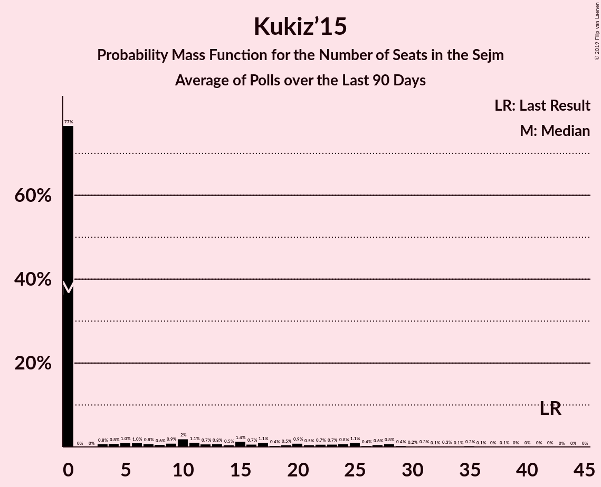

# Kukiz’15

<a href="#voting-intentions">Voting Intentions</a> | <a href="#seats">Seats</a>

## Voting Intentions

Last result: **8.8%** (General Election of 25 October 2015)

### Confidence Intervals

| Period     | Polling firm/Commissioner(s) | Median | 80% Confidence Interval | 90% Confidence Interval | 95% Confidence Interval | 99% Confidence Interval |
|:----------:|:----------------:|:-----------:|:-----------------------:|:-----------------------:|:-----------------------:|:-----------------------:|
| N/A | [Poll Average](average.html) | 4.1% | 2.8–5.9% | 2.5–6.4% | 2.3–6.8% | 2.0–7.5% |
| [6–8 August 2019](2019-08-08-Estymator.html) | Estymator   DoRzeczy.pl | 2.8% | 2.3–3.6% | 2.1–3.9% | 2.0–4.1% | 1.7–4.5% |
| [2–7 August 2019](2019-08-07-SocialChanges.html) | Social Changes | 3.0% | 2.4–3.8% | 2.3–4.1% | 2.1–4.3% | 1.9–4.7% |
| [6–7 August 2019](2019-08-07-InstytutBadańPollster.html) | Instytut Badań Pollster   Super Express | 5.0% | 4.2–6.0% | 4.0–6.2% | 3.8–6.5% | 3.5–7.0% |
| [26–31 July 2019](2019-07-31-SocialChanges.html) | Social Changes | 3.2% | 2.6–4.0% | 2.4–4.2% | 2.2–4.4% | 2.0–4.9% |
| [26–27 July 2019](2019-07-27-IBRiS.html) | IBRiS   RMF | 4.1% | 3.4–5.0% | 3.2–5.2% | 3.1–5.4% | 2.8–5.9% |
| [19–24 July 2019](2019-07-24-SocialChanges.html) | Social Changes | 3.0% | 2.4–3.8% | 2.3–4.0% | 2.1–4.2% | 1.9–4.6% |
| [18–19 July 2019](2019-07-19-Estymator.html) | Estymator   DoRzeczy.pl | 4.8% | 4.0–5.7% | 3.8–6.0% | 3.6–6.3% | 3.3–6.8% |
| [12–17 July 2019](2019-07-17-SocialChanges.html) | Social Changes | 3.1% | 2.5–3.9% | 2.3–4.1% | 2.2–4.4% | 1.9–4.8% |
| [12–17 July 2019](2019-07-17-KantarPublic.html) | Kantar Public   Radio ZET | 4.0% | 3.3–4.9% | 3.1–5.2% | 2.9–5.4% | 2.6–5.9% |
| [12–15 July 2019](2019-07-15-KantarMillwardBrown.html) | Kantar Millward Brown   TVN and TVN24 | 6.0% | 5.1–7.1% | 4.9–7.4% | 4.7–7.6% | 4.3–8.2% |
| [12–13 July 2019](2019-07-13-IBRiS.html) | IBRiS   Rzeczpospolita | 3.1% | 2.5–3.9% | 2.3–4.1% | 2.2–4.3% | 2.0–4.7% |
| [4–11 July 2019](2019-07-11-CBOS.html) | CBOS | 4.0% | 3.4–4.9% | 3.2–5.1% | 3.0–5.3% | 2.7–5.8% |
| [5–10 July 2019](2019-07-10-SocialChanges.html) | Social Changes | 3.1% | 2.5–3.9% | 2.4–4.2% | 2.2–4.4% | 2.0–4.8% |
| [28–29 June 2019](2019-06-29-IBRiS.html) | IBRiS   RMF | 5.4% | 4.6–6.3% | 4.4–6.6% | 4.2–6.9% | 3.8–7.4% |
| [21–26 June 2019](2019-06-26-SocialChanges.html) | Social Changes | 4.5% | 3.8–5.4% | 3.6–5.7% | 3.4–5.9% | 3.1–6.4% |
| [19–20 June 2019](2019-06-20-Estymator.html) | Estymator   DoRzeczy.pl | 3.5% | 2.8–4.3% | 2.7–4.6% | 2.5–4.8% | 2.2–5.3% |
| [6–13 June 2019](2019-06-13-CBOS.html) | CBOS | 4.5% | 3.8–5.4% | 3.6–5.6% | 3.4–5.9% | 3.1–6.3% |
| [7–8 June 2019](2019-06-08-IBRiS.html) | IBRiS   Rzeczpospolita | 3.4% | 2.8–4.2% | 2.6–4.4% | 2.4–4.6% | 2.2–5.0% |
| [31 May–5 June 2019](2019-06-05-SocialChanges.html) | Social Changes | 9.3% | 8.2–10.5% | 7.9–10.9% | 7.7–11.2% | 7.2–11.8% |
| [24–29 May 2019](2019-05-29-SocialChanges.html) | Social Changes | 8.9% | 7.9–10.2% | 7.6–10.5% | 7.3–10.8% | 6.9–11.5% |
| [16–23 May 2019](2019-05-23-CBOS.html) | CBOS | 6.0% | 5.2–7.0% | 4.9–7.3% | 4.7–7.5% | 4.4–8.0% |
| [10–15 May 2019](2019-05-15-SocialChanges.html) | Social Changes | 8.1% | 7.1–9.2% | 6.8–9.6% | 6.6–9.8% | 6.2–10.4% |
| [10–15 May 2019](2019-05-15-KantarMillwardBrown.html) | Kantar Millward Brown   Gazeta Wyborcza | 4.0% | 3.3–5.0% | 3.1–5.2% | 3.0–5.5% | 2.7–6.0% |
| [1–4 May 2019](2019-05-04-PracowniaAnalizSpołeczno-Politycznych.html) | Pracownia Analiz Społeczno-Politycznych   Gazeta Bałtycka | 9.0% | 8.0–10.2% | 7.7–10.6% | 7.4–10.9% | 7.0–11.5% |
| [26–30 April 2019](2019-04-30-SocialChanges.html) | Social Changes | 8.1% | 7.1–9.3% | 6.8–9.6% | 6.6–9.9% | 6.1–10.5% |
| [26–29 April 2019](2019-04-29-InstytutBadańPollster.html) | Instytut Badań Pollster   Super Express | 7.0% | 6.1–8.1% | 5.8–8.4% | 5.6–8.7% | 5.2–9.3% |
| [19–24 April 2019](2019-04-24-SocialChanges.html) | Social Changes | 7.9% | 6.9–9.1% | 6.6–9.4% | 6.4–9.7% | 6.0–10.3% |
| [12–17 April 2019](2019-04-17-SocialChanges.html) | Social Changes | 9.0% | 8.0–10.2% | 7.7–10.5% | 7.5–10.8% | 7.0–11.4% |
| [25–27 March 2019](2019-03-27-InstytutBadańSprawNarodowościowych.html) | Instytut Badań Spraw Narodowościowych   Radio ZET | 4.8% | 4.0–5.7% | 3.8–6.0% | 3.6–6.3% | 3.3–6.8% |
| [20–22 March 2019](2019-03-22-CBMIndicator.html) | CBM Indicator   TVP1 | 6.0% | 5.1–7.1% | 4.9–7.4% | 4.7–7.7% | 4.3–8.2% |
| [20–21 March 2019](2019-03-21-Estymator.html) | Estymator   DoRzeczy.pl | 6.3% | 5.4–7.4% | 5.1–7.7% | 4.9–8.0% | 4.5–8.5% |
| [7–14 March 2019](2019-03-14-CBOS.html) | CBOS | 5.0% | 4.2–5.9% | 4.0–6.2% | 3.8–6.5% | 3.5–7.0% |
| [8–13 March 2019](2019-03-13-KantarPublic.html) | Kantar Public | 4.0% | 3.3–4.9% | 3.1–5.2% | 2.9–5.4% | 2.6–5.9% |
| [9–10 March 2019](2019-03-10-IBRiS.html) | IBRiS   Rzeczpospolita | 7.0% | 6.1–8.1% | 5.9–8.4% | 5.6–8.7% | 5.2–9.2% |
| [20–21 February 2019](2019-02-21-Estymator.html) | Estymator   DoRzeczy.pl | 7.6% | 6.6–8.8% | 6.4–9.1% | 6.1–9.4% | 5.7–10.0% |
| [14–16 February 2019](2019-02-16-IPSOS.html) | IPSOS   OKO.press | 7.4% | 6.4–8.5% | 6.1–8.9% | 5.9–9.2% | 5.5–9.8% |
| [7–14 February 2019](2019-02-14-CBOS.html) | CBOS | 5.0% | 4.2–6.0% | 4.0–6.3% | 3.8–6.5% | 3.5–7.0% |
| [8–13 February 2019](2019-02-13-KantarPublic.html) | Kantar Public | 6.0% | 5.1–7.1% | 4.8–7.4% | 4.6–7.6% | 4.3–8.2% |
| [8–11 February 2019](2019-02-11-OPBAriadna.html) | OPB Ariadna   WP | 6.0% | 5.2–7.1% | 4.9–7.4% | 4.7–7.6% | 4.4–8.2% |
| [7–8 February 2019](2019-02-08-IBRiS.html) | IBRiS   Rzeczpospolita | 4.7% | 4.0–5.7% | 3.8–5.9% | 3.6–6.2% | 3.3–6.6% |
| [5–7 February 2019](2019-02-07-Estymator.html) | Estymator   DoRzeczy.pl | 7.4% | 6.4–8.6% | 6.2–8.9% | 6.0–9.2% | 5.5–9.8% |
| [31 January–6 February 2019](2019-02-06-InstytutBadańSprawNarodowościowych.html) | Instytut Badań Spraw Narodowościowych   Radio ZET | 5.8% | 5.0–6.9% | 4.7–7.2% | 4.5–7.4% | 4.1–8.0% |
| [4–5 February 2019](2019-02-05-KantarMillwardBrown.html) | Kantar Millward Brown | 7.0% | 6.0–8.1% | 5.8–8.4% | 5.5–8.7% | 5.1–9.3% |
| [30 January 2019](2019-01-30-InstytutBadańPollster.html) | Instytut Badań Pollster   Super Express | 6.0% | 5.1–7.0% | 4.9–7.3% | 4.7–7.6% | 4.3–8.1% |
| [26–27 January 2019](2019-01-27-IBRiS.html) | IBRiS   Rzeczpospolita | 5.1% | 4.3–6.1% | 4.1–6.3% | 3.9–6.6% | 3.6–7.0% |
| [25–26 January 2019](2019-01-26-IBRiS.html) | IBRiS   Onet | 3.8% | 3.2–4.7% | 3.0–4.9% | 2.8–5.1% | 2.5–5.6% |
| [23–24 January 2019](2019-01-24-Estymator.html) | Estymator   DoRzeczy.pl | 8.6% | 7.5–9.8% | 7.2–10.2% | 7.0–10.5% | 6.5–11.1% |
| [10–17 January 2019](2019-01-17-CBOS.html) | CBOS | 7.0% | 6.1–8.2% | 5.8–8.5% | 5.6–8.8% | 5.1–9.4% |
| [11–16 January 2019](2019-01-16-KantarPublic.html) | Kantar Public | 7.0% | 6.1–8.2% | 5.8–8.5% | 5.6–8.8% | 5.1–9.3% |
| [15–16 January 2019](2019-01-16-KantarMillwardBrown.html) | Kantar Millward Brown   Gazeta Wyborcza | 4.6% | 3.8–5.6% | 3.6–5.8% | 3.5–6.1% | 3.1–6.6% |
| [10–11 January 2019](2019-01-11-InstytutBadańPollster.html) | Instytut Badań Pollster   Super Express | 7.0% | 6.1–8.1% | 5.9–8.4% | 5.7–8.7% | 5.2–9.2% |
| [4 January 2019](2019-01-04-IBRiS.html) | IBRiS   Rzeczpospolita | 5.5% | 4.7–6.4% | 4.5–6.7% | 4.3–7.0% | 3.9–7.5% |
| [13–14 December 2018](2018-12-14-InstytutBadańPollster.html) | Instytut Badań Pollster   Super Express | 7.0% | 6.1–8.1% | 5.9–8.4% | 5.7–8.7% | 5.2–9.2% |
| [12–13 December 2018](2018-12-13-Estymator.html) | Estymator   DoRzeczy.pl | 9.0% | 8.0–10.3% | 7.7–10.6% | 7.4–10.9% | 6.9–11.6% |
| [30 November–11 December 2018](2018-12-11-KantarPublic.html) | Kantar Public | 6.0% | 5.2–7.1% | 4.9–7.4% | 4.7–7.7% | 4.3–8.2% |
| [29 November–9 December 2018](2018-12-09-CBOS.html) | CBOS | 5.0% | 4.2–6.0% | 4.0–6.3% | 3.8–6.6% | 3.5–7.1% |
| [7–8 December 2018](2018-12-08-IBRiS.html) | IBRiS   Rzeczpospolita | 5.7% | 4.9–6.8% | 4.6–7.1% | 4.4–7.3% | 4.1–7.9% |
| [23–24 November 2018](2018-11-24-IBRiS.html) | IBRiS   Onet | 5.2% | 4.4–6.1% | 4.2–6.4% | 4.0–6.7% | 3.7–7.1% |
| [20–21 November 2018](2018-11-21-Estymator.html) | Estymator   DoRzeczy.pl | 11.6% | 10.4–13.0% | 10.0–13.4% | 9.8–13.7% | 9.2–14.4% |
| [19–20 November 2018](2018-11-20-KantarMillwardBrown.html) | Kantar Millward Brown   TVN and TVN24 | 7.0% | 6.1–8.1% | 5.8–8.5% | 5.6–8.7% | 5.1–9.3% |
| [9–15 November 2018](2018-11-15-KantarPublic.html) | Kantar Public | 9.0% | 7.9–10.2% | 7.6–10.6% | 7.4–10.9% | 6.9–11.5% |
| [8–15 November 2018](2018-11-15-CBOS.html) | CBOS | 6.0% | 5.2–7.0% | 4.9–7.3% | 4.7–7.6% | 4.3–8.1% |
| [13 November 2018](2018-11-13-IBRiS.html) | IBRiS   Rzeczpospolita | 5.6% | 4.8–6.6% | 4.6–6.9% | 4.4–7.2% | 4.1–7.7% |
| [8–9 November 2018](2018-11-09-IBRiS.html) | IBRiS   Rzeczpospolita | 4.8% | 4.1–5.8% | 3.9–6.0% | 3.7–6.3% | 3.4–6.7% |
| [29–30 October 2018](2018-10-30-Estymator.html) | Estymator   DoRzeczy.pl | 7.3% | 6.3–8.4% | 6.1–8.8% | 5.8–9.1% | 5.4–9.6% |
| [26–27 October 2018](2018-10-27-IBRiS.html) | IBRiS | 4.7% | 3.9–5.7% | 3.7–6.0% | 3.6–6.2% | 3.2–6.7% |
| [12–17 October 2018](2018-10-17-KantarPublic.html) | Kantar Public | 8.0% | 7.0–9.2% | 6.7–9.5% | 6.5–9.8% | 6.1–10.4% |
| [4–11 October 2018](2018-10-11-CBOS.html) | CBOS | 8.0% | 7.0–9.1% | 6.8–9.4% | 6.5–9.7% | 6.1–10.3% |
| [5–6 October 2018](2018-10-06-IBRiS.html) | IBRiS   Rzeczpospolita | 10.1% | 9.0–11.4% | 8.6–11.8% | 8.4–12.1% | 7.9–12.8% |
| [1 October 2018](2018-10-01-InstytutBadańPollster.html) | Instytut Badań Pollster   Super Express | 9.0% | 8.0–10.3% | 7.7–10.6% | 7.4–10.9% | 7.0–11.6% |
| [22–23 September 2018](2018-09-23-IBRiS.html) | IBRiS   Onet | 10.0% | 8.9–11.3% | 8.6–11.6% | 8.4–11.9% | 7.9–12.5% |
| [20–21 September 2018](2018-09-21-Estymator.html) | Estymator   DoRzeczy.pl | 6.9% | 5.9–8.0% | 5.7–8.3% | 5.5–8.6% | 5.0–9.2% |
| [14–17 September 2018](2018-09-17-KantarMillwardBrown.html) | Kantar Millward Brown   TVN and TVN24 | 4.0% | 3.3–4.9% | 3.1–5.2% | 2.9–5.4% | 2.6–5.9% |
| [6–13 September 2018](2018-09-13-CBOS.html) | CBOS | 7.0% | 6.0–8.1% | 5.8–8.4% | 5.6–8.7% | 5.2–9.2% |
| [7–12 September 2018](2018-09-12-KantarPublic.html) | Kantar Public | 6.0% | 5.1–7.0% | 4.9–7.3% | 4.7–7.6% | 4.3–8.1% |
| [25 August–1 September 2018](2018-09-01-IBRiS.html) | IBRiS   Rzeczpospolita | 7.0% | 6.1–8.2% | 5.8–8.5% | 5.6–8.8% | 5.2–9.3% |
| [22–23 August 2018](2018-08-23-Estymator.html) | Estymator   DoRzeczy.pl | 7.1% | 6.2–8.3% | 5.9–8.6% | 5.7–8.9% | 5.3–9.5% |
| [16–23 August 2018](2018-08-23-CBOS.html) | CBOS | 7.0% | 6.1–8.1% | 5.9–8.4% | 5.6–8.7% | 5.2–9.2% |
| [17–19 August 2018](2018-08-19-IPSOS.html) | IPSOS   OKO.press | 8.0% | 7.0–9.2% | 6.7–9.5% | 6.5–9.8% | 6.0–10.4% |
| [11 August 2018](2018-08-11-KantarPublic.html) | Kantar Public   Gazeta Prawna | 7.0% | 6.1–8.1% | 5.8–8.5% | 5.6–8.7% | 5.2–9.3% |
| [11 August 2018](2018-08-11-IBRiS.html) | IBRiS   Rzeczpospolita | 6.4% | 5.5–7.5% | 5.3–7.8% | 5.0–8.1% | 4.6–8.7% |
| [9–10 August 2018](2018-08-10-InstytutBadańPollster.html) | Instytut Badań Pollster   Super Express | 11.0% | 9.8–12.4% | 9.5–12.7% | 9.3–13.1% | 8.7–13.7% |
| [8–10 August 2018](2018-08-10-CBMIndicator.html) | CBM Indicator   TVP1 | 6.3% | 5.4–7.4% | 5.2–7.7% | 5.0–8.0% | 4.6–8.6% |
| [8–9 August 2018](2018-08-09-Estymator.html) | Estymator   DoRzeczy.pl | 8.2% | 7.1–9.4% | 6.9–9.7% | 6.6–10.0% | 6.2–10.6% |
| [27 July 2018](2018-07-27-IBRiS.html) | IBRiS | 6.6% | 5.7–7.7% | 5.4–8.0% | 5.2–8.3% | 4.8–8.9% |
| [11–12 July 2018](2018-07-12-InstytutBadańPollster.html) | Instytut Badań Pollster   Super Express | 9.0% | 7.9–10.2% | 7.7–10.5% | 7.4–10.8% | 6.9–11.4% |
| [6–11 July 2018](2018-07-11-KantarPublic.html) | Kantar Public | 9.0% | 8.0–10.3% | 7.7–10.6% | 7.4–10.9% | 7.0–11.5% |
| [8–9 July 2018](2018-07-09-IBRiS.html) | IBRiS   Rzeczpospolita | 5.7% | 4.9–6.7% | 4.7–7.0% | 4.5–7.3% | 4.1–7.8% |
| [4–5 July 2018](2018-07-05-InstytutBadańPollster.html) | Instytut Badań Pollster   TVP1 | 8.0% | 7.0–9.1% | 6.7–9.5% | 6.5–9.8% | 6.0–10.3% |
| [28 June–5 July 2018](2018-07-05-CBOS.html) | CBOS | 8.0% | 7.0–9.2% | 6.7–9.6% | 6.5–9.9% | 6.0–10.5% |
| [27–28 June 2018](2018-06-28-Estymator.html) | Estymator   DoRzeczy.pl | 8.9% | 7.8–10.1% | 7.5–10.5% | 7.3–10.8% | 6.8–11.4% |
| [21–22 June 2018](2018-06-22-IBRiS.html) | IBRiS   Onet | 7.5% | 6.6–8.7% | 6.3–9.0% | 6.1–9.3% | 5.7–9.8% |
| [18 June 2018](2018-06-18-InstytutBadańPollster.html) | Instytut Badań Pollster   Super Express | 6.9% | 6.0–8.1% | 5.8–8.4% | 5.5–8.7% | 5.1–9.2% |
| [9–17 June 2018](2018-06-17-KantarPublic.html) | Kantar Public | 6.0% | 5.1–7.0% | 4.9–7.3% | 4.7–7.6% | 4.3–8.1% |
| [13–14 June 2018](2018-06-14-Estymator.html) | Estymator   DoRzeczy.pl | 8.3% | 7.3–9.5% | 7.0–9.9% | 6.8–10.2% | 6.3–10.8% |
| [7–14 June 2018](2018-06-14-CBOS.html) | CBOS | 8.0% | 7.0–9.2% | 6.7–9.5% | 6.5–9.8% | 6.0–10.4% |
| [7–8 June 2018](2018-06-08-IBRiS.html) | IBRiS   Rzeczpospolita | 6.2% | 5.3–7.2% | 5.1–7.5% | 4.9–7.8% | 4.5–8.3% |
| [6–7 June 2018](2018-06-07-InstytutBadańPollster.html) | Instytut Badań Pollster   TVP1 | 8.0% | 7.0–9.2% | 6.8–9.5% | 6.5–9.8% | 6.1–10.4% |
| [28–29 May 2018](2018-05-29-KantarMillwardBrown.html) | Kantar Millward Brown   TVN and TVN24 | 6.0% | 5.1–7.1% | 4.9–7.4% | 4.7–7.7% | 4.3–8.2% |
| [24–25 May 2018](2018-05-25-IBRiS.html) | IBRiS   Onet | 5.2% | 4.4–6.1% | 4.2–6.4% | 4.0–6.7% | 3.7–7.1% |
| [23–24 May 2018](2018-05-24-Estymator.html) | Estymator   DoRzeczy.pl | 10.4% | 9.3–11.8% | 9.0–12.1% | 8.7–12.5% | 8.2–13.1% |
| [10–17 May 2018](2018-05-17-CBOS.html) | CBOS | 10.0% | 8.9–11.2% | 8.7–11.6% | 8.4–11.9% | 7.9–12.5% |
| [11–16 May 2018](2018-05-16-KantarPublic.html) | Kantar Public | 5.0% | 4.3–6.0% | 4.0–6.3% | 3.9–6.6% | 3.5–7.1% |
| [14 May 2018](2018-05-14-Estymator.html) | Estymator   DoRzeczy.pl | 9.8% | 8.7–11.1% | 8.4–11.5% | 8.1–11.8% | 7.6–12.4% |
| [10–11 May 2018](2018-05-11-InstytutBadańPollster.html) | Instytut Badań Pollster   TVP1 | 7.9% | 7.0–9.1% | 6.7–9.4% | 6.5–9.7% | 6.0–10.3% |
| [10–11 May 2018](2018-05-11-IBRiS.html) | IBRiS   Rzeczpospolita | 6.3% | 5.4–7.3% | 5.2–7.6% | 5.0–7.9% | 4.6–8.4% |
| [27–29 April 2018](2018-04-29-InstytutBadańPollster.html) | Instytut Badań Pollster   Nowa TV, se.pl and Super Express | 9.0% | 8.0–10.2% | 7.7–10.5% | 7.4–10.9% | 7.0–11.4% |
| [25–27 April 2018](2018-04-27-InstytutBadańPollster.html) | Instytut Badań Pollster   Nowa TV, se.pl and Super Express | 10.9% | 9.8–12.3% | 9.5–12.7% | 9.2–13.0% | 8.7–13.7% |
| [25–26 April 2018](2018-04-26-KantarMillwardBrown.html) | Kantar Millward Brown   TVN and TVN24 | 5.0% | 4.2–6.0% | 4.0–6.3% | 3.8–6.5% | 3.4–7.0% |
| [25–26 April 2018](2018-04-26-Estymator.html) | Estymator   DoRzeczy.pl | 13.1% | 11.8–14.6% | 11.5–15.0% | 11.2–15.3% | 10.6–16.0% |
| [19 April 2018](2018-04-19-IBRiS.html) | IBRiS   Onet | 9.8% | 8.7–11.1% | 8.4–11.4% | 8.2–11.7% | 7.7–12.3% |
| [12–13 April 2018](2018-04-13-IPSOS.html) | IPSOS   OKO.press | 11.0% | 9.9–12.4% | 9.5–12.8% | 9.3–13.1% | 8.7–13.8% |
| [5–12 April 2018](2018-04-12-CBOS.html) | CBOS | 5.0% | 4.3–5.9% | 4.1–6.2% | 3.9–6.4% | 3.6–6.9% |
| [9–10 April 2018](2018-04-10-KantarPublic.html) | Kantar Public | 6.0% | 5.1–7.1% | 4.9–7.4% | 4.7–7.7% | 4.3–8.2% |
| [6–7 April 2018](2018-04-07-InstytutBadańPollster.html) | Instytut Badań Pollster   TVP1 | 8.0% | 7.0–9.2% | 6.7–9.6% | 6.5–9.8% | 6.1–10.5% |
| [4–5 April 2018](2018-04-05-InstytutBadańPollster.html) | Instytut Badań Pollster   Nowa TV, se.pl and Super Express | 10.0% | 8.9–11.3% | 8.5–11.6% | 8.3–12.0% | 7.8–12.6% |
| [4–5 April 2018](2018-04-05-Estymator.html) | Estymator   DoRzeczy.pl | 8.9% | 8.0–10.1% | 7.7–10.4% | 7.5–10.7% | 7.0–11.2% |
| [4 April 2018](2018-04-04-IBRiS.html) | IBRiS   Rzeczpospolita | 8.5% | 7.5–9.7% | 7.3–10.1% | 7.0–10.3% | 6.6–10.9% |
| [29–30 March 2018](2018-03-30-InstytutBadańPollster.html) | Instytut Badań Pollster   TVP1 | 11.0% | 9.9–12.3% | 9.5–12.7% | 9.3–13.0% | 8.7–13.7% |
| [26–27 March 2018](2018-03-27-KantarMillwardBrown.html) | Kantar Millward Brown   TVN and TVN24 | 10.0% | 8.9–11.3% | 8.6–11.7% | 8.3–12.0% | 7.8–12.7% |
| [21–22 March 2018](2018-03-22-Estymator.html) | Estymator   DoRzeczy.pl | 7.9% | 6.9–9.1% | 6.6–9.4% | 6.4–9.8% | 6.0–10.3% |
| [17 March 2018](2018-03-17-IBRiS.html) | IBRiS   Onet | 6.3% | 5.4–7.4% | 5.2–7.7% | 5.0–8.0% | 4.6–8.6% |
| [9–14 March 2018](2018-03-14-KantarPublic.html) | Kantar Public | 5.1% | 4.3–6.1% | 4.1–6.3% | 3.9–6.6% | 3.5–7.1% |
| [1–8 March 2018](2018-03-08-CBOS.html) | CBOS | 6.0% | 5.2–7.1% | 5.0–7.4% | 4.8–7.6% | 4.4–8.2% |
| [1–2 March 2018](2018-03-02-IBRiS.html) | IBRiS   Rzeczpospolita | 6.8% | 5.9–7.9% | 5.6–8.3% | 5.4–8.5% | 5.0–9.1% |
| [26 February 2018](2018-02-26-IBRiS.html) | IBRiS | 6.6% | 5.8–7.7% | 5.5–8.0% | 5.3–8.3% | 4.9–8.8% |
| [22 February 2018](2018-02-22-InstytutBadańPollster.html) | Instytut Badań Pollster   Nowa TV, se.pl and Super Express | 6.9% | 6.0–8.1% | 5.8–8.4% | 5.5–8.7% | 5.1–9.2% |
| [21–22 February 2018](2018-02-22-Estymator.html) | Estymator   DoRzeczy.pl | 7.3% | 6.4–8.5% | 6.1–8.8% | 5.9–9.1% | 5.5–9.7% |
| [16–21 February 2018](2018-02-21-KantarPublic.html) | Kantar Public | 7.0% | 6.1–8.1% | 5.8–8.4% | 5.6–8.7% | 5.2–9.3% |
| [19–20 February 2018](2018-02-20-KantarMillwardBrown.html) | Kantar Millward Brown   TVN and TVN24 | 6.0% | 5.1–7.1% | 4.9–7.4% | 4.7–7.6% | 4.3–8.2% |
| [20 February 2018](2018-02-20-IBRiS.html) | IBRiS   Onet | 5.5% | 4.8–6.5% | 4.5–6.8% | 4.3–7.1% | 4.0–7.6% |
| [1–8 February 2018](2018-02-08-CBOS.html) | CBOS | 7.2% | 6.3–8.3% | 6.0–8.6% | 5.8–8.9% | 5.4–9.5% |
| [5 February 2018](2018-02-05-IBRiS.html) | IBRiS   Rzeczpospolita | 5.7% | 4.9–6.8% | 4.6–7.1% | 4.4–7.3% | 4.1–7.9% |

### Probability Mass Function

The following table shows the probability mass function per percentage block of voting intentions for the [poll average](average.html) for Kukiz’15.

| Voting Intentions | Probability | Accumulated | Special Marks |
|:-----------------:|:-----------:|:-----------:|:-------------:|
| 0.5–1.5% | 0% | 100% |  |
| 1.5–2.5% | 6% | 100% |  |
| 2.5–3.5% | 26% | 94% |  |
| 3.5–4.5% | 33% | 69% | Median |
| 4.5–5.5% | 20% | 35% |  |
| 5.5–6.5% | 11% | 15% |  |
| 6.5–7.5% | 3% | 4% |  |
| 7.5–8.5% | 0.4% | 0.5% |  |
| 8.5–9.5% | 0% | 0% | Last Result |

## Seats

Last result: **42** seats (General Election of 25 October 2015)

### Confidence Intervals

| Period     | Polling firm/Commissioner(s) | Median | 80% Confidence Interval | 90% Confidence Interval | 95% Confidence Interval | 99% Confidence Interval |
|:----------:|:----------------:|:------:|:-----------------------:|:-----------------------:|:-----------------------:|:-----------------------:|
| N/A | [Poll Average](average.html) | 0 | 0–17 | 0–24 | 0–28 | 0–35 |
| [6–8 August 2019](2019-08-08-Estymator.html) | Estymator   DoRzeczy.pl | 0 | 0 | 0 | 0 | 0 |
| [2–7 August 2019](2019-08-07-SocialChanges.html) | Social Changes | 0 | 0 | 0 | 0 | 0 |
| [6–7 August 2019](2019-08-07-InstytutBadańPollster.html) | Instytut Badań Pollster   Super Express | 3 | 0–10 | 0–12 | 0–14 | 0–19 |
| [26–31 July 2019](2019-07-31-SocialChanges.html) | Social Changes | 0 | 0 | 0 | 0 | 0 |
| [26–27 July 2019](2019-07-27-IBRiS.html) | IBRiS   RMF | 0 | 0 | 0–9 | 0–11 | 0–15 |
| [19–24 July 2019](2019-07-24-SocialChanges.html) | Social Changes | 0 | 0 | 0 | 0 | 0 |
| [18–19 July 2019](2019-07-19-Estymator.html) | Estymator   DoRzeczy.pl | 0 | 0–12 | 0–16 | 0–18 | 0–22 |
| [12–17 July 2019](2019-07-17-SocialChanges.html) | Social Changes | 0 | 0 | 0 | 0 | 0 |
| [12–17 July 2019](2019-07-17-KantarPublic.html) | Kantar Public   Radio ZET | 0 | 0 | 0–12 | 0–15 | 0–23 |
| [12–15 July 2019](2019-07-15-KantarMillwardBrown.html) | Kantar Millward Brown   TVN and TVN24 | 21 | 9–31 | 0–34 | 0–35 | 0–40 |
| [12–13 July 2019](2019-07-13-IBRiS.html) | IBRiS   Rzeczpospolita | 0 | 0 | 0 | 0 | 0 |
| [4–11 July 2019](2019-07-11-CBOS.html) | CBOS | 0 | 0 | 0 | 0–15 | 0–19 |
| [5–10 July 2019](2019-07-10-SocialChanges.html) | Social Changes | 0 | 0 | 0 | 0 | 0 |
| [28–29 June 2019](2019-06-29-IBRiS.html) | IBRiS   RMF | 15 | 0–27 | 0–31 | 0–32 | 0–36 |
| [21–26 June 2019](2019-06-26-SocialChanges.html) | Social Changes | 0 | 0–10 | 0–13 | 0–16 | 0–20 |
| [19–20 June 2019](2019-06-20-Estymator.html) | Estymator   DoRzeczy.pl | 0 | 0 | 0 | 0 | 0–5 |
| [6–13 June 2019](2019-06-13-CBOS.html) | CBOS | 0 | 0–8 | 0–9 | 0–10 | 0–14 |
| [7–8 June 2019](2019-06-08-IBRiS.html) | IBRiS   Rzeczpospolita | 0 | 0 | 0 | 0 | 0 |
| [31 May–5 June 2019](2019-06-05-SocialChanges.html) | Social Changes | 44 | 39–48 | 39–48 | 37–50 | 27–50 |
| [24–29 May 2019](2019-05-29-SocialChanges.html) | Social Changes | 42 | 35–48 | 33–48 | 27–49 | 23–52 |
| [16–23 May 2019](2019-05-23-CBOS.html) | CBOS | 16 | 12–25 | 12–30 | 0–33 | 0–40 |
| [10–15 May 2019](2019-05-15-SocialChanges.html) | Social Changes | 34 | 26–44 | 26–47 | 23–47 | 18–49 |
| [10–15 May 2019](2019-05-15-KantarMillwardBrown.html) | Kantar Millward Brown   Gazeta Wyborcza | 0 | 0 | 0–16 | 0–19 | 0–27 |
| [1–4 May 2019](2019-05-04-PracowniaAnalizSpołeczno-Politycznych.html) | Pracownia Analiz Społeczno-Politycznych   Gazeta Bałtycka | 43 | 35–48 | 32–50 | 30–51 | 26–54 |
| [26–30 April 2019](2019-04-30-SocialChanges.html) | Social Changes | 37 | 30–45 | 27–48 | 24–48 | 17–51 |
| [26–29 April 2019](2019-04-29-InstytutBadańPollster.html) | Instytut Badań Pollster   Super Express | 34 | 21–39 | 11–39 | 9–42 | 0–43 |
| [19–24 April 2019](2019-04-24-SocialChanges.html) | Social Changes | 34 | 26–42 | 23–42 | 19–45 | 13–48 |
| [12–17 April 2019](2019-04-17-SocialChanges.html) | Social Changes | 44 | 37–50 | 36–50 | 33–51 | 30–55 |
| [25–27 March 2019](2019-03-27-InstytutBadańSprawNarodowościowych.html) | Instytut Badań Spraw Narodowościowych   Radio ZET | 0 | 0–9 | 0–11 | 0–16 | 0–21 |
| [20–22 March 2019](2019-03-22-CBMIndicator.html) | CBM Indicator   TVP1 | 16 | 8–24 | 0–28 | 0–33 | 0–36 |
| [20–21 March 2019](2019-03-21-Estymator.html) | Estymator   DoRzeczy.pl | 20 | 9–24 | 7–29 | 0–33 | 0–38 |
| [7–14 March 2019](2019-03-14-CBOS.html) | CBOS | 20 | 0–26 | 0–26 | 0–27 | 0–37 |
| [8–13 March 2019](2019-03-13-KantarPublic.html) | Kantar Public | 0 | 0–21 | 0–22 | 0–22 | 0–33 |
| [9–10 March 2019](2019-03-10-IBRiS.html) | IBRiS   Rzeczpospolita | 27 | 18–37 | 14–40 | 12–42 | 8–44 |
| [20–21 February 2019](2019-02-21-Estymator.html) | Estymator   DoRzeczy.pl | 32 | 19–39 | 16–41 | 13–43 | 9–45 |
| [14–16 February 2019](2019-02-16-IPSOS.html) | IPSOS   OKO.press | 34 | 24–43 | 21–44 | 17–44 | 11–47 |
| [7–14 February 2019](2019-02-14-CBOS.html) | CBOS | 0 | 0–27 | 0–27 | 0–27 | 0–38 |
| [8–13 February 2019](2019-02-13-KantarPublic.html) | Kantar Public | 32 | 0–34 | 0–38 | 0–39 | 0–44 |
| [8–11 February 2019](2019-02-11-OPBAriadna.html) | OPB Ariadna   WP | 17 | 9–31 | 0–32 | 0–35 | 0–40 |
| [7–8 February 2019](2019-02-08-IBRiS.html) | IBRiS   Rzeczpospolita | 0 | 0–11 | 0–13 | 0–16 | 0–21 |
| [5–7 February 2019](2019-02-07-Estymator.html) | Estymator   DoRzeczy.pl | 26 | 19–37 | 13–42 | 13–43 | 10–44 |
| [31 January–6 February 2019](2019-02-06-InstytutBadańSprawNarodowościowych.html) | Instytut Badań Spraw Narodowościowych   Radio ZET | 9 | 0–22 | 0–25 | 0–28 | 0–35 |
| [4–5 February 2019](2019-02-05-KantarMillwardBrown.html) | Kantar Millward Brown | 35 | 23–43 | 19–43 | 16–44 | 13–47 |
| [30 January 2019](2019-01-30-InstytutBadańPollster.html) | Instytut Badań Pollster   Super Express | 16 | 5–28 | 0–32 | 0–36 | 0–38 |
| [26–27 January 2019](2019-01-27-IBRiS.html) | IBRiS   Rzeczpospolita | 0 | 0–17 | 0–21 | 0–24 | 0–30 |
| [25–26 January 2019](2019-01-26-IBRiS.html) | IBRiS   Onet | 0 | 0 | 0–10 | 0–10 | 0–10 |
| [23–24 January 2019](2019-01-24-Estymator.html) | Estymator   DoRzeczy.pl | 31 | 26–41 | 21–43 | 20–44 | 16–47 |
| [10–17 January 2019](2019-01-17-CBOS.html) | CBOS | 37 | 28–43 | 24–44 | 22–45 | 16–50 |
| [11–16 January 2019](2019-01-16-KantarPublic.html) | Kantar Public | 35 | 25–45 | 19–46 | 19–46 | 15–50 |
| [15–16 January 2019](2019-01-16-KantarMillwardBrown.html) | Kantar Millward Brown   Gazeta Wyborcza | 0 | 0–31 | 0–34 | 0–35 | 0–40 |
| [10–11 January 2019](2019-01-11-InstytutBadańPollster.html) | Instytut Badań Pollster   Super Express | 23 | 16–34 | 12–36 | 11–38 | 8–41 |
| [4 January 2019](2019-01-04-IBRiS.html) | IBRiS   Rzeczpospolita | 12 | 0–24 | 0–27 | 0–32 | 0–36 |
| [13–14 December 2018](2018-12-14-InstytutBadańPollster.html) | Instytut Badań Pollster   Super Express | 30 | 16–35 | 14–36 | 11–37 | 6–42 |
| [12–13 December 2018](2018-12-13-Estymator.html) | Estymator   DoRzeczy.pl | 38 | 29–44 | 22–45 | 21–45 | 18–49 |
| [30 November–11 December 2018](2018-12-11-KantarPublic.html) | Kantar Public | 23 | 11–34 | 0–36 | 0–39 | 0–43 |
| [29 November–9 December 2018](2018-12-09-CBOS.html) | CBOS | 11 | 0–19 | 0–23 | 0–25 | 0–31 |
| [7–8 December 2018](2018-12-08-IBRiS.html) | IBRiS   Rzeczpospolita | 12 | 0–28 | 0–28 | 0–29 | 0–34 |
| [23–24 November 2018](2018-11-24-IBRiS.html) | IBRiS   Onet | 8 | 0–17 | 0–21 | 0–23 | 0–29 |
| [20–21 November 2018](2018-11-21-Estymator.html) | Estymator   DoRzeczy.pl | 49 | 44–55 | 43–59 | 41–61 | 37–67 |
| [19–20 November 2018](2018-11-20-KantarMillwardBrown.html) | Kantar Millward Brown   TVN and TVN24 | 36 | 27–45 | 24–46 | 22–47 | 17–49 |
| [9–15 November 2018](2018-11-15-KantarPublic.html) | Kantar Public | 46 | 41–52 | 37–53 | 35–58 | 31–62 |
| [8–15 November 2018](2018-11-15-CBOS.html) | CBOS | 20 | 9–32 | 0–36 | 0–37 | 0–40 |
| [13 November 2018](2018-11-13-IBRiS.html) | IBRiS   Rzeczpospolita | 10 | 0–24 | 0–26 | 0–29 | 0–32 |
| [8–9 November 2018](2018-11-09-IBRiS.html) | IBRiS   Rzeczpospolita | 0 | 0–16 | 0–20 | 0–22 | 0–28 |
| [29–30 October 2018](2018-10-30-Estymator.html) | Estymator   DoRzeczy.pl | 23 | 13–33 | 12–35 | 10–38 | 6–42 |
| [26–27 October 2018](2018-10-27-IBRiS.html) | IBRiS | 0 | 0–12 | 0–13 | 0–18 | 0–23 |
| [12–17 October 2018](2018-10-17-KantarPublic.html) | Kantar Public | 41 | 29–48 | 27–49 | 26–50 | 20–53 |
| [4–11 October 2018](2018-10-11-CBOS.html) | CBOS | 43 | 37–48 | 36–51 | 35–54 | 30–58 |
| [5–6 October 2018](2018-10-06-IBRiS.html) | IBRiS   Rzeczpospolita | 45 | 41–52 | 37–52 | 35–54 | 32–62 |
| [1 October 2018](2018-10-01-InstytutBadańPollster.html) | Instytut Badań Pollster   Super Express | 39 | 31–44 | 28–46 | 26–47 | 21–49 |
| [22–23 September 2018](2018-09-23-IBRiS.html) | IBRiS   Onet | 49 | 45–56 | 42–59 | 41–61 | 39–64 |
| [20–21 September 2018](2018-09-21-Estymator.html) | Estymator   DoRzeczy.pl | 19 | 11–31 | 8–34 | 7–36 | 4–40 |
| [14–17 September 2018](2018-09-17-KantarMillwardBrown.html) | Kantar Millward Brown   TVN and TVN24 | 0 | 0 | 0–13 | 0–17 | 0–19 |
| [6–13 September 2018](2018-09-13-CBOS.html) | CBOS | 35 | 23–42 | 22–43 | 22–46 | 17–52 |
| [7–12 September 2018](2018-09-12-KantarPublic.html) | Kantar Public | 25 | 14–33 | 10–34 | 0–35 | 0–40 |
| [25 August–1 September 2018](2018-09-01-IBRiS.html) | IBRiS   Rzeczpospolita | 26 | 18–38 | 16–40 | 12–40 | 8–43 |
| [22–23 August 2018](2018-08-23-Estymator.html) | Estymator   DoRzeczy.pl | 19 | 13–33 | 12–35 | 9–38 | 5–41 |
| [16–23 August 2018](2018-08-23-CBOS.html) | CBOS | 34 | 22–41 | 21–42 | 19–43 | 0–47 |
| [17–19 August 2018](2018-08-19-IPSOS.html) | IPSOS   OKO.press | 39 | 31–47 | 29–48 | 22–49 | 19–51 |
| [11 August 2018](2018-08-11-KantarPublic.html) | Kantar Public   Gazeta Prawna | 35 | 22–42 | 15–44 | 15–45 | 10–46 |
| [11 August 2018](2018-08-11-IBRiS.html) | IBRiS   Rzeczpospolita | 20 | 15–33 | 14–34 | 10–35 | 0–40 |
| [9–10 August 2018](2018-08-10-InstytutBadańPollster.html) | Instytut Badań Pollster   Super Express | 47 | 44–56 | 43–58 | 41–62 | 37–65 |
| [8–10 August 2018](2018-08-10-CBMIndicator.html) | CBM Indicator   TVP1 | 22 | 10–33 | 7–34 | 5–34 | 0–37 |
| [8–9 August 2018](2018-08-09-Estymator.html) | Estymator   DoRzeczy.pl | 31 | 22–42 | 19–42 | 17–43 | 12–45 |
| [27 July 2018](2018-07-27-IBRiS.html) | IBRiS | 29 | 14–39 | 12–39 | 9–41 | 0–43 |
| [11–12 July 2018](2018-07-12-InstytutBadańPollster.html) | Instytut Badań Pollster   Super Express | 38 | 33–45 | 26–45 | 24–47 | 24–52 |
| [6–11 July 2018](2018-07-11-KantarPublic.html) | Kantar Public | 47 | 44–52 | 43–55 | 42–61 | 38–66 |
| [8–9 July 2018](2018-07-09-IBRiS.html) | IBRiS   Rzeczpospolita | 12 | 0–23 | 0–26 | 0–30 | 0–36 |
| [4–5 July 2018](2018-07-05-InstytutBadańPollster.html) | Instytut Badań Pollster   TVP1 | 33 | 23–42 | 19–43 | 17–44 | 13–46 |
| [28 June–5 July 2018](2018-07-05-CBOS.html) | CBOS | 43 | 36–47 | 35–50 | 34–51 | 27–55 |
| [27–28 June 2018](2018-06-28-Estymator.html) | Estymator   DoRzeczy.pl | 39 | 28–45 | 25–47 | 25–48 | 20–53 |
| [21–22 June 2018](2018-06-22-IBRiS.html) | IBRiS   Onet | 37 | 19–41 | 18–42 | 18–43 | 14–47 |
| [18 June 2018](2018-06-18-InstytutBadańPollster.html) | Instytut Badań Pollster   Super Express | 25 | 11–33 | 10–36 | 10–39 | 0–42 |
| [9–17 June 2018](2018-06-17-KantarPublic.html) | Kantar Public | 25 | 0–37 | 0–38 | 0–40 | 0–43 |
| [13–14 June 2018](2018-06-14-Estymator.html) | Estymator   DoRzeczy.pl | 35 | 22–43 | 22–44 | 19–45 | 15–47 |
| [7–14 June 2018](2018-06-14-CBOS.html) | CBOS | 41 | 36–45 | 34–50 | 33–53 | 30–58 |
| [7–8 June 2018](2018-06-08-IBRiS.html) | IBRiS   Rzeczpospolita | 23 | 12–33 | 10–36 | 0–36 | 0–41 |
| [6–7 June 2018](2018-06-07-InstytutBadańPollster.html) | Instytut Badań Pollster   TVP1 | 34 | 28–41 | 24–44 | 20–45 | 13–47 |
| [28–29 May 2018](2018-05-29-KantarMillwardBrown.html) | Kantar Millward Brown   TVN and TVN24 | 25 | 10–32 | 0–36 | 0–37 | 0–42 |
| [24–25 May 2018](2018-05-25-IBRiS.html) | IBRiS   Onet | 11 | 0–21 | 0–23 | 0–27 | 0–32 |
| [23–24 May 2018](2018-05-24-Estymator.html) | Estymator   DoRzeczy.pl | 45 | 40–52 | 39–54 | 37–55 | 33–60 |
| [10–17 May 2018](2018-05-17-CBOS.html) | CBOS | 53 | 45–58 | 45–59 | 43–63 | 40–68 |
| [11–16 May 2018](2018-05-16-KantarPublic.html) | Kantar Public | 0 | 0–27 | 0–32 | 0–33 | 0–36 |
| [14 May 2018](2018-05-14-Estymator.html) | Estymator   DoRzeczy.pl | 40 | 31–46 | 28–47 | 26–48 | 26–52 |
| [10–11 May 2018](2018-05-11-InstytutBadańPollster.html) | Instytut Badań Pollster   TVP1 | 36 | 24–43 | 22–43 | 22–43 | 15–47 |
| [10–11 May 2018](2018-05-11-IBRiS.html) | IBRiS   Rzeczpospolita | 16 | 11–28 | 8–32 | 0–34 | 0–37 |
| [27–29 April 2018](2018-04-29-InstytutBadańPollster.html) | Instytut Badań Pollster   Nowa TV, se.pl and Super Express | 40 | 33–46 | 33–48 | 28–49 | 26–51 |
| [25–27 April 2018](2018-04-27-InstytutBadańPollster.html) | Instytut Badań Pollster   Nowa TV, se.pl and Super Express | 49 | 45–55 | 42–56 | 42–62 | 39–70 |
| [25–26 April 2018](2018-04-26-KantarMillwardBrown.html) | Kantar Millward Brown   TVN and TVN24 | 10 | 0–22 | 0–28 | 0–32 | 0–33 |
| [25–26 April 2018](2018-04-26-Estymator.html) | Estymator   DoRzeczy.pl | 61 | 52–62 | 49–66 | 47–73 | 44–73 |
| [19 April 2018](2018-04-19-IBRiS.html) | IBRiS   Onet | 47 | 41–51 | 40–53 | 39–54 | 34–60 |
| [12–13 April 2018](2018-04-13-IPSOS.html) | IPSOS   OKO.press | 52 | 48–63 | 46–65 | 44–68 | 42–75 |
| [5–12 April 2018](2018-04-12-CBOS.html) | CBOS | 15 | 0–24 | 0–27 | 0–31 | 0–35 |
| [9–10 April 2018](2018-04-10-KantarPublic.html) | Kantar Public | 26 | 11–36 | 0–38 | 0–42 | 0–44 |
| [6–7 April 2018](2018-04-07-InstytutBadańPollster.html) | Instytut Badań Pollster   TVP1 | 36 | 24–41 | 22–42 | 22–43 | 16–48 |
| [4–5 April 2018](2018-04-05-InstytutBadańPollster.html) | Instytut Badań Pollster   Nowa TV, se.pl and Super Express | 45 | 40–48 | 39–52 | 38–57 | 30–59 |
| [4–5 April 2018](2018-04-05-Estymator.html) | Estymator   DoRzeczy.pl | 39 | 30–44 | 27–45 | 25–47 | 21–49 |
| [4 April 2018](2018-04-04-IBRiS.html) | IBRiS   Rzeczpospolita | 43 | 34–48 | 31–50 | 31–50 | 25–52 |
| [29–30 March 2018](2018-03-30-InstytutBadańPollster.html) | Instytut Badań Pollster   TVP1 | 48 | 43–55 | 42–58 | 42–61 | 41–62 |
| [26–27 March 2018](2018-03-27-KantarMillwardBrown.html) | Kantar Millward Brown   TVN and TVN24 | 51 | 46–61 | 44–64 | 43–68 | 40–74 |
| [21–22 March 2018](2018-03-22-Estymator.html) | Estymator   DoRzeczy.pl | 32 | 20–39 | 17–41 | 14–42 | 11–44 |
| [17 March 2018](2018-03-17-IBRiS.html) | IBRiS   Onet | 20 | 10–34 | 9–36 | 0–40 | 0–41 |
| [9–14 March 2018](2018-03-14-KantarPublic.html) | Kantar Public | 17 | 0–28 | 0–30 | 0–33 | 0–37 |
| [1–8 March 2018](2018-03-08-CBOS.html) | CBOS | 24 | 17–38 | 13–39 | 0–39 | 0–43 |
| [1–2 March 2018](2018-03-02-IBRiS.html) | IBRiS   Rzeczpospolita | 29 | 14–36 | 12–38 | 10–41 | 8–42 |
| [26 February 2018](2018-02-26-IBRiS.html) | IBRiS | 26 | 16–35 | 15–36 | 13–40 | 7–43 |
| [22 February 2018](2018-02-22-InstytutBadańPollster.html) | Instytut Badań Pollster   Nowa TV, se.pl and Super Express | 28 | 16–37 | 14–38 | 10–39 | 4–42 |
| [21–22 February 2018](2018-02-22-Estymator.html) | Estymator   DoRzeczy.pl | 32 | 21–35 | 18–37 | 12–39 | 7–41 |
| [16–21 February 2018](2018-02-21-KantarPublic.html) | Kantar Public | 33 | 27–43 | 24–44 | 20–46 | 15–50 |
| [19–20 February 2018](2018-02-20-KantarMillwardBrown.html) | Kantar Millward Brown   TVN and TVN24 | 28 | 18–38 | 15–42 | 0–42 | 0–44 |
| [20 February 2018](2018-02-20-IBRiS.html) | IBRiS   Onet | 12 | 0–22 | 0–24 | 0–29 | 0–35 |
| [1–8 February 2018](2018-02-08-CBOS.html) | CBOS | 34 | 25–42 | 25–45 | 24–46 | 19–52 |
| [5 February 2018](2018-02-05-IBRiS.html) | IBRiS   Rzeczpospolita | 14 | 0–27 | 0–29 | 0–33 | 0–36 |

### Probability Mass Function

The following table shows the probability mass function per seat for the [poll average](average.html) for Kukiz’15.

| Number of Seats | Probability | Accumulated | Special Marks |
|:---------------:|:-----------:|:-----------:|:-------------:|
| 0 | 77% | 100% | Median |
| 1 | 0% | 23% |  |
| 2 | 0% | 23% |  |
| 3 | 0.5% | 23% |  |
| 4 | 1.1% | 23% |  |
| 5 | 1.4% | 22% |  |
| 6 | 1.1% | 20% |  |
| 7 | 0.7% | 19% |  |
| 8 | 0.8% | 19% |  |
| 9 | 0.7% | 18% |  |
| 10 | 2% | 17% |  |
| 11 | 1.2% | 15% |  |
| 12 | 0.7% | 14% |  |
| 13 | 0.8% | 14% |  |
| 14 | 0.5% | 13% |  |
| 15 | 1.4% | 12% |  |
| 16 | 0.7% | 11% |  |
| 17 | 1.1% | 10% |  |
| 18 | 0.4% | 9% |  |
| 19 | 0.5% | 9% |  |
| 20 | 0.9% | 8% |  |
| 21 | 0.5% | 7% |  |
| 22 | 0.7% | 7% |  |
| 23 | 0.7% | 6% |  |
| 24 | 0.8% | 6% |  |
| 25 | 1.1% | 5% |  |
| 26 | 0.4% | 4% |  |
| 27 | 0.6% | 3% |  |
| 28 | 0.8% | 3% |  |
| 29 | 0.4% | 2% |  |
| 30 | 0.2% | 2% |  |
| 31 | 0.3% | 1.4% |  |
| 32 | 0.1% | 1.2% |  |
| 33 | 0.3% | 1.0% |  |
| 34 | 0.1% | 0.8% |  |
| 35 | 0.3% | 0.7% |  |
| 36 | 0.1% | 0.3% |  |
| 37 | 0% | 0.2% |  |
| 38 | 0.1% | 0.2% |  |
| 39 | 0% | 0.1% |  |
| 40 | 0% | 0.1% |  |
| 41 | 0% | 0% |  |
| 42 | 0% | 0% | Last Result |

