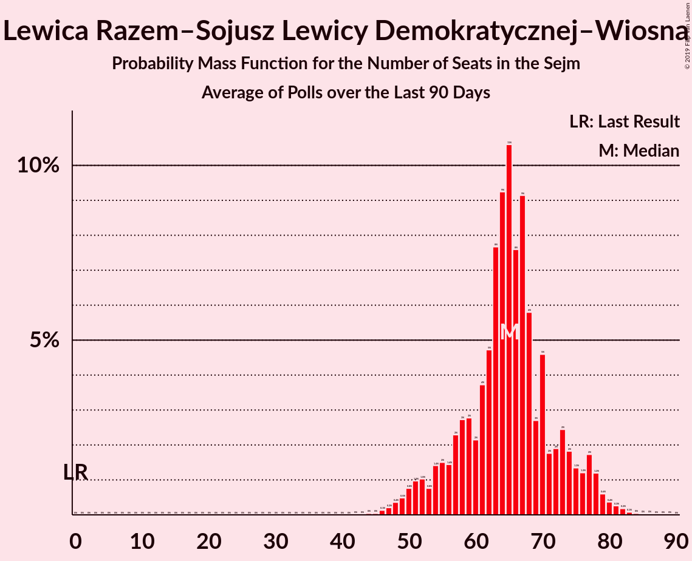

# Lewica Razem–Sojusz Lewicy Demokratycznej–Wiosna

<a href="#voting-intentions">Voting Intentions</a> | <a href="#seats">Seats</a>

## Voting Intentions

Last result: **11.7%** (General Election of 25 October 2015)

### Confidence Intervals

| Period     | Polling firm/Commissioner(s) | Median | 80% Confidence Interval | 90% Confidence Interval | 95% Confidence Interval | 99% Confidence Interval |
|:----------:|:----------------:|:-----------:|:-----------------------:|:-----------------------:|:-----------------------:|:-----------------------:|
| N/A | [Poll Average](average.html) | 12.8% | 10.5–15.3% | 10.1–15.8% | 9.7–16.3% | 9.2–17.1% |
| [6–8 August 2019](2019-08-08-Estymator.html) | Estymator   DoRzeczy.pl | 11.3% | 10.1–12.7% | 9.8–13.0% | 9.5–13.4% | 8.9–14.1% |
| [2–7 August 2019](2019-08-07-SocialChanges.html) | Social Changes | 14.6% | 13.3–16.1% | 12.9–16.6% | 12.6–16.9% | 12.0–17.7% |
| [6–7 August 2019](2019-08-07-InstytutBadańPollster.html) | Instytut Badań Pollster   Super Express | 14.0% | 12.7–15.5% | 12.4–15.9% | 12.1–16.2% | 11.5–17.0% |
| [26–31 July 2019](2019-07-31-SocialChanges.html) | Social Changes | 13.2% | 11.9–14.7% | 11.6–15.1% | 11.3–15.5% | 10.7–16.2% |
| [26–27 July 2019](2019-07-27-IBRiS.html) | IBRiS   RMF | 11.2% | 10.0–12.5% | 9.7–12.9% | 9.4–13.2% | 8.9–13.8% |
| [19–24 July 2019](2019-07-24-SocialChanges.html) | Social Changes | 14.3% | 13.0–15.7% | 12.6–16.2% | 12.3–16.5% | 11.7–17.3% |
| [18–19 July 2019](2019-07-19-Estymator.html) | Estymator   DoRzeczy.pl | 0.0% | N/A | N/A | N/A | N/A |
| [12–17 July 2019](2019-07-17-SocialChanges.html) | Social Changes | 0.0% | N/A | N/A | N/A | N/A |
| [12–17 July 2019](2019-07-17-KantarPublic.html) | Kantar Public   Radio ZET | 0.0% | N/A | N/A | N/A | N/A |
| [12–15 July 2019](2019-07-15-KantarMillwardBrown.html) | Kantar Millward Brown   TVN and TVN24 | 0.0% | N/A | N/A | N/A | N/A |
| [12–13 July 2019](2019-07-13-IBRiS.html) | IBRiS   Rzeczpospolita | 0.0% | N/A | N/A | N/A | N/A |
| [4–11 July 2019](2019-07-11-CBOS.html) | CBOS | 0.0% | N/A | N/A | N/A | N/A |
| [5–10 July 2019](2019-07-10-SocialChanges.html) | Social Changes | 0.0% | N/A | N/A | N/A | N/A |
| [28–29 June 2019](2019-06-29-IBRiS.html) | IBRiS   RMF | 0.0% | N/A | N/A | N/A | N/A |
| [21–26 June 2019](2019-06-26-SocialChanges.html) | Social Changes | 0.0% | N/A | N/A | N/A | N/A |
| [19–20 June 2019](2019-06-20-Estymator.html) | Estymator   DoRzeczy.pl | 0.0% | N/A | N/A | N/A | N/A |
| [6–13 June 2019](2019-06-13-CBOS.html) | CBOS | 0.0% | N/A | N/A | N/A | N/A |
| [7–8 June 2019](2019-06-08-IBRiS.html) | IBRiS   Rzeczpospolita | 0.0% | N/A | N/A | N/A | N/A |
| [31 May–5 June 2019](2019-06-05-SocialChanges.html) | Social Changes | 0.0% | N/A | N/A | N/A | N/A |
| [24–29 May 2019](2019-05-29-SocialChanges.html) | Social Changes | 0.0% | N/A | N/A | N/A | N/A |
| [16–23 May 2019](2019-05-23-CBOS.html) | CBOS | 0.0% | N/A | N/A | N/A | N/A |
| [10–15 May 2019](2019-05-15-SocialChanges.html) | Social Changes | 0.0% | N/A | N/A | N/A | N/A |
| [10–15 May 2019](2019-05-15-KantarMillwardBrown.html) | Kantar Millward Brown   Gazeta Wyborcza | 0.0% | N/A | N/A | N/A | N/A |
| [1–4 May 2019](2019-05-04-PracowniaAnalizSpołeczno-Politycznych.html) | Pracownia Analiz Społeczno-Politycznych   Gazeta Bałtycka | 0.0% | N/A | N/A | N/A | N/A |
| [26–30 April 2019](2019-04-30-SocialChanges.html) | Social Changes | 0.0% | N/A | N/A | N/A | N/A |
| [26–29 April 2019](2019-04-29-InstytutBadańPollster.html) | Instytut Badań Pollster   Super Express | 0.0% | N/A | N/A | N/A | N/A |
| [19–24 April 2019](2019-04-24-SocialChanges.html) | Social Changes | 0.0% | N/A | N/A | N/A | N/A |
| [12–17 April 2019](2019-04-17-SocialChanges.html) | Social Changes | 0.0% | N/A | N/A | N/A | N/A |
| [25–27 March 2019](2019-03-27-InstytutBadańSprawNarodowościowych.html) | Instytut Badań Spraw Narodowościowych   Radio ZET | 0.0% | N/A | N/A | N/A | N/A |
| [20–22 March 2019](2019-03-22-CBMIndicator.html) | CBM Indicator   TVP1 | 0.0% | N/A | N/A | N/A | N/A |
| [20–21 March 2019](2019-03-21-Estymator.html) | Estymator   DoRzeczy.pl | 0.0% | N/A | N/A | N/A | N/A |
| [7–14 March 2019](2019-03-14-CBOS.html) | CBOS | 0.0% | N/A | N/A | N/A | N/A |
| [8–13 March 2019](2019-03-13-KantarPublic.html) | Kantar Public | 0.0% | N/A | N/A | N/A | N/A |
| [9–10 March 2019](2019-03-10-IBRiS.html) | IBRiS   Rzeczpospolita | 0.0% | N/A | N/A | N/A | N/A |
| [20–21 February 2019](2019-02-21-Estymator.html) | Estymator   DoRzeczy.pl | 0.0% | N/A | N/A | N/A | N/A |
| [14–16 February 2019](2019-02-16-IPSOS.html) | IPSOS   OKO.press | 0.0% | N/A | N/A | N/A | N/A |
| [7–14 February 2019](2019-02-14-CBOS.html) | CBOS | 0.0% | N/A | N/A | N/A | N/A |
| [8–13 February 2019](2019-02-13-KantarPublic.html) | Kantar Public | 0.0% | N/A | N/A | N/A | N/A |
| [8–11 February 2019](2019-02-11-OPBAriadna.html) | OPB Ariadna   WP | 0.0% | N/A | N/A | N/A | N/A |
| [7–8 February 2019](2019-02-08-IBRiS.html) | IBRiS   Rzeczpospolita | 0.0% | N/A | N/A | N/A | N/A |
| [5–7 February 2019](2019-02-07-Estymator.html) | Estymator   DoRzeczy.pl | 0.0% | N/A | N/A | N/A | N/A |
| [31 January–6 February 2019](2019-02-06-InstytutBadańSprawNarodowościowych.html) | Instytut Badań Spraw Narodowościowych   Radio ZET | 0.0% | N/A | N/A | N/A | N/A |
| [4–5 February 2019](2019-02-05-KantarMillwardBrown.html) | Kantar Millward Brown | 0.0% | N/A | N/A | N/A | N/A |
| [30 January 2019](2019-01-30-InstytutBadańPollster.html) | Instytut Badań Pollster   Super Express | 0.0% | N/A | N/A | N/A | N/A |
| [26–27 January 2019](2019-01-27-IBRiS.html) | IBRiS   Rzeczpospolita | 0.0% | N/A | N/A | N/A | N/A |
| [25–26 January 2019](2019-01-26-IBRiS.html) | IBRiS   Onet | 0.0% | N/A | N/A | N/A | N/A |
| [23–24 January 2019](2019-01-24-Estymator.html) | Estymator   DoRzeczy.pl | 0.0% | N/A | N/A | N/A | N/A |
| [10–17 January 2019](2019-01-17-CBOS.html) | CBOS | 0.0% | N/A | N/A | N/A | N/A |
| [11–16 January 2019](2019-01-16-KantarPublic.html) | Kantar Public | 0.0% | N/A | N/A | N/A | N/A |
| [15–16 January 2019](2019-01-16-KantarMillwardBrown.html) | Kantar Millward Brown   Gazeta Wyborcza | 0.0% | N/A | N/A | N/A | N/A |
| [10–11 January 2019](2019-01-11-InstytutBadańPollster.html) | Instytut Badań Pollster   Super Express | 0.0% | N/A | N/A | N/A | N/A |
| [4 January 2019](2019-01-04-IBRiS.html) | IBRiS   Rzeczpospolita | 0.0% | N/A | N/A | N/A | N/A |
| [13–14 December 2018](2018-12-14-InstytutBadańPollster.html) | Instytut Badań Pollster   Super Express | 0.0% | N/A | N/A | N/A | N/A |
| [12–13 December 2018](2018-12-13-Estymator.html) | Estymator   DoRzeczy.pl | 0.0% | N/A | N/A | N/A | N/A |
| [30 November–11 December 2018](2018-12-11-KantarPublic.html) | Kantar Public | 0.0% | N/A | N/A | N/A | N/A |
| [29 November–9 December 2018](2018-12-09-CBOS.html) | CBOS | 0.0% | N/A | N/A | N/A | N/A |
| [7–8 December 2018](2018-12-08-IBRiS.html) | IBRiS   Rzeczpospolita | 0.0% | N/A | N/A | N/A | N/A |
| [23–24 November 2018](2018-11-24-IBRiS.html) | IBRiS   Onet | 0.0% | N/A | N/A | N/A | N/A |
| [20–21 November 2018](2018-11-21-Estymator.html) | Estymator   DoRzeczy.pl | 0.0% | N/A | N/A | N/A | N/A |
| [19–20 November 2018](2018-11-20-KantarMillwardBrown.html) | Kantar Millward Brown   TVN and TVN24 | 0.0% | N/A | N/A | N/A | N/A |
| [9–15 November 2018](2018-11-15-KantarPublic.html) | Kantar Public | 0.0% | N/A | N/A | N/A | N/A |
| [8–15 November 2018](2018-11-15-CBOS.html) | CBOS | 0.0% | N/A | N/A | N/A | N/A |
| [13 November 2018](2018-11-13-IBRiS.html) | IBRiS   Rzeczpospolita | 0.0% | N/A | N/A | N/A | N/A |
| [8–9 November 2018](2018-11-09-IBRiS.html) | IBRiS   Rzeczpospolita | 0.0% | N/A | N/A | N/A | N/A |
| [29–30 October 2018](2018-10-30-Estymator.html) | Estymator   DoRzeczy.pl | 0.0% | N/A | N/A | N/A | N/A |
| [26–27 October 2018](2018-10-27-IBRiS.html) | IBRiS | 0.0% | N/A | N/A | N/A | N/A |
| [12–17 October 2018](2018-10-17-KantarPublic.html) | Kantar Public | 0.0% | N/A | N/A | N/A | N/A |
| [4–11 October 2018](2018-10-11-CBOS.html) | CBOS | 0.0% | N/A | N/A | N/A | N/A |
| [5–6 October 2018](2018-10-06-IBRiS.html) | IBRiS   Rzeczpospolita | 0.0% | N/A | N/A | N/A | N/A |
| [1 October 2018](2018-10-01-InstytutBadańPollster.html) | Instytut Badań Pollster   Super Express | 0.0% | N/A | N/A | N/A | N/A |
| [22–23 September 2018](2018-09-23-IBRiS.html) | IBRiS   Onet | 0.0% | N/A | N/A | N/A | N/A |
| [20–21 September 2018](2018-09-21-Estymator.html) | Estymator   DoRzeczy.pl | 0.0% | N/A | N/A | N/A | N/A |
| [14–17 September 2018](2018-09-17-KantarMillwardBrown.html) | Kantar Millward Brown   TVN and TVN24 | 0.0% | N/A | N/A | N/A | N/A |
| [6–13 September 2018](2018-09-13-CBOS.html) | CBOS | 0.0% | N/A | N/A | N/A | N/A |
| [7–12 September 2018](2018-09-12-KantarPublic.html) | Kantar Public | 0.0% | N/A | N/A | N/A | N/A |
| [25 August–1 September 2018](2018-09-01-IBRiS.html) | IBRiS   Rzeczpospolita | 0.0% | N/A | N/A | N/A | N/A |
| [22–23 August 2018](2018-08-23-Estymator.html) | Estymator   DoRzeczy.pl | 0.0% | N/A | N/A | N/A | N/A |
| [16–23 August 2018](2018-08-23-CBOS.html) | CBOS | 0.0% | N/A | N/A | N/A | N/A |
| [17–19 August 2018](2018-08-19-IPSOS.html) | IPSOS   OKO.press | 0.0% | N/A | N/A | N/A | N/A |
| [11 August 2018](2018-08-11-KantarPublic.html) | Kantar Public   Gazeta Prawna | 0.0% | N/A | N/A | N/A | N/A |
| [11 August 2018](2018-08-11-IBRiS.html) | IBRiS   Rzeczpospolita | 0.0% | N/A | N/A | N/A | N/A |
| [9–10 August 2018](2018-08-10-InstytutBadańPollster.html) | Instytut Badań Pollster   Super Express | 0.0% | N/A | N/A | N/A | N/A |
| [8–10 August 2018](2018-08-10-CBMIndicator.html) | CBM Indicator   TVP1 | 0.0% | N/A | N/A | N/A | N/A |
| [8–9 August 2018](2018-08-09-Estymator.html) | Estymator   DoRzeczy.pl | 0.0% | N/A | N/A | N/A | N/A |
| [27 July 2018](2018-07-27-IBRiS.html) | IBRiS | 0.0% | N/A | N/A | N/A | N/A |
| [11–12 July 2018](2018-07-12-InstytutBadańPollster.html) | Instytut Badań Pollster   Super Express | 0.0% | N/A | N/A | N/A | N/A |
| [6–11 July 2018](2018-07-11-KantarPublic.html) | Kantar Public | 0.0% | N/A | N/A | N/A | N/A |
| [8–9 July 2018](2018-07-09-IBRiS.html) | IBRiS   Rzeczpospolita | 0.0% | N/A | N/A | N/A | N/A |
| [4–5 July 2018](2018-07-05-InstytutBadańPollster.html) | Instytut Badań Pollster   TVP1 | 0.0% | N/A | N/A | N/A | N/A |
| [28 June–5 July 2018](2018-07-05-CBOS.html) | CBOS | 0.0% | N/A | N/A | N/A | N/A |
| [27–28 June 2018](2018-06-28-Estymator.html) | Estymator   DoRzeczy.pl | 0.0% | N/A | N/A | N/A | N/A |
| [21–22 June 2018](2018-06-22-IBRiS.html) | IBRiS   Onet | 0.0% | N/A | N/A | N/A | N/A |
| [18 June 2018](2018-06-18-InstytutBadańPollster.html) | Instytut Badań Pollster   Super Express | 0.0% | N/A | N/A | N/A | N/A |
| [9–17 June 2018](2018-06-17-KantarPublic.html) | Kantar Public | 0.0% | N/A | N/A | N/A | N/A |
| [13–14 June 2018](2018-06-14-Estymator.html) | Estymator   DoRzeczy.pl | 0.0% | N/A | N/A | N/A | N/A |
| [7–14 June 2018](2018-06-14-CBOS.html) | CBOS | 0.0% | N/A | N/A | N/A | N/A |
| [7–8 June 2018](2018-06-08-IBRiS.html) | IBRiS   Rzeczpospolita | 0.0% | N/A | N/A | N/A | N/A |
| [6–7 June 2018](2018-06-07-InstytutBadańPollster.html) | Instytut Badań Pollster   TVP1 | 0.0% | N/A | N/A | N/A | N/A |
| [28–29 May 2018](2018-05-29-KantarMillwardBrown.html) | Kantar Millward Brown   TVN and TVN24 | 0.0% | N/A | N/A | N/A | N/A |
| [24–25 May 2018](2018-05-25-IBRiS.html) | IBRiS   Onet | 0.0% | N/A | N/A | N/A | N/A |
| [23–24 May 2018](2018-05-24-Estymator.html) | Estymator   DoRzeczy.pl | 0.0% | N/A | N/A | N/A | N/A |
| [10–17 May 2018](2018-05-17-CBOS.html) | CBOS | 0.0% | N/A | N/A | N/A | N/A |
| [11–16 May 2018](2018-05-16-KantarPublic.html) | Kantar Public | 0.0% | N/A | N/A | N/A | N/A |
| [14 May 2018](2018-05-14-Estymator.html) | Estymator   DoRzeczy.pl | 0.0% | N/A | N/A | N/A | N/A |
| [10–11 May 2018](2018-05-11-InstytutBadańPollster.html) | Instytut Badań Pollster   TVP1 | 0.0% | N/A | N/A | N/A | N/A |
| [10–11 May 2018](2018-05-11-IBRiS.html) | IBRiS   Rzeczpospolita | 0.0% | N/A | N/A | N/A | N/A |
| [27–29 April 2018](2018-04-29-InstytutBadańPollster.html) | Instytut Badań Pollster   Nowa TV, se.pl and Super Express | 0.0% | N/A | N/A | N/A | N/A |
| [25–27 April 2018](2018-04-27-InstytutBadańPollster.html) | Instytut Badań Pollster   Nowa TV, se.pl and Super Express | 0.0% | N/A | N/A | N/A | N/A |
| [25–26 April 2018](2018-04-26-KantarMillwardBrown.html) | Kantar Millward Brown   TVN and TVN24 | 0.0% | N/A | N/A | N/A | N/A |
| [25–26 April 2018](2018-04-26-Estymator.html) | Estymator   DoRzeczy.pl | 0.0% | N/A | N/A | N/A | N/A |
| [19 April 2018](2018-04-19-IBRiS.html) | IBRiS   Onet | 0.0% | N/A | N/A | N/A | N/A |
| [12–13 April 2018](2018-04-13-IPSOS.html) | IPSOS   OKO.press | 0.0% | N/A | N/A | N/A | N/A |
| [5–12 April 2018](2018-04-12-CBOS.html) | CBOS | 0.0% | N/A | N/A | N/A | N/A |
| [9–10 April 2018](2018-04-10-KantarPublic.html) | Kantar Public | 0.0% | N/A | N/A | N/A | N/A |
| [6–7 April 2018](2018-04-07-InstytutBadańPollster.html) | Instytut Badań Pollster   TVP1 | 0.0% | N/A | N/A | N/A | N/A |
| [4–5 April 2018](2018-04-05-InstytutBadańPollster.html) | Instytut Badań Pollster   Nowa TV, se.pl and Super Express | 0.0% | N/A | N/A | N/A | N/A |
| [4–5 April 2018](2018-04-05-Estymator.html) | Estymator   DoRzeczy.pl | 0.0% | N/A | N/A | N/A | N/A |
| [4 April 2018](2018-04-04-IBRiS.html) | IBRiS   Rzeczpospolita | 0.0% | N/A | N/A | N/A | N/A |
| [29–30 March 2018](2018-03-30-InstytutBadańPollster.html) | Instytut Badań Pollster   TVP1 | 0.0% | N/A | N/A | N/A | N/A |
| [26–27 March 2018](2018-03-27-KantarMillwardBrown.html) | Kantar Millward Brown   TVN and TVN24 | 0.0% | N/A | N/A | N/A | N/A |
| [21–22 March 2018](2018-03-22-Estymator.html) | Estymator   DoRzeczy.pl | 0.0% | N/A | N/A | N/A | N/A |
| [17 March 2018](2018-03-17-IBRiS.html) | IBRiS   Onet | 0.0% | N/A | N/A | N/A | N/A |
| [9–14 March 2018](2018-03-14-KantarPublic.html) | Kantar Public | 0.0% | N/A | N/A | N/A | N/A |
| [1–8 March 2018](2018-03-08-CBOS.html) | CBOS | 0.0% | N/A | N/A | N/A | N/A |
| [1–2 March 2018](2018-03-02-IBRiS.html) | IBRiS   Rzeczpospolita | 0.0% | N/A | N/A | N/A | N/A |
| [26 February 2018](2018-02-26-IBRiS.html) | IBRiS | 0.0% | N/A | N/A | N/A | N/A |
| [22 February 2018](2018-02-22-InstytutBadańPollster.html) | Instytut Badań Pollster   Nowa TV, se.pl and Super Express | 0.0% | N/A | N/A | N/A | N/A |
| [21–22 February 2018](2018-02-22-Estymator.html) | Estymator   DoRzeczy.pl | 0.0% | N/A | N/A | N/A | N/A |
| [16–21 February 2018](2018-02-21-KantarPublic.html) | Kantar Public | 0.0% | N/A | N/A | N/A | N/A |
| [19–20 February 2018](2018-02-20-KantarMillwardBrown.html) | Kantar Millward Brown   TVN and TVN24 | 0.0% | N/A | N/A | N/A | N/A |
| [20 February 2018](2018-02-20-IBRiS.html) | IBRiS   Onet | 0.0% | N/A | N/A | N/A | N/A |
| [1–8 February 2018](2018-02-08-CBOS.html) | CBOS | 0.0% | N/A | N/A | N/A | N/A |
| [5 February 2018](2018-02-05-IBRiS.html) | IBRiS   Rzeczpospolita | 0.0% | N/A | N/A | N/A | N/A |

### Probability Mass Function

The following table shows the probability mass function per percentage block of voting intentions for the [poll average](average.html) for Lewica Razem–Sojusz Lewicy Demokratycznej–Wiosna.

| Voting Intentions | Probability | Accumulated | Special Marks |
|:-----------------:|:-----------:|:-----------:|:-------------:|
| 7.5–8.5% | 0.1% | 100% |  |
| 8.5–9.5% | 2% | 99.9% |  |
| 9.5–10.5% | 10% | 98% |  |
| 10.5–11.5% | 20% | 89% |  |
| 11.5–12.5% | 16% | 69% | Last Result |
| 12.5–13.5% | 14% | 53% | Median |
| 13.5–14.5% | 17% | 39% |  |
| 14.5–15.5% | 14% | 22% |  |
| 15.5–16.5% | 6% | 8% |  |
| 16.5–17.5% | 1.4% | 2% |  |
| 17.5–18.5% | 0.2% | 0.2% |  |
| 18.5–19.5% | 0% | 0% |  |

## Seats

Last result: **0** seats (General Election of 25 October 2015)

### Confidence Intervals

| Period     | Polling firm/Commissioner(s) | Median | 80% Confidence Interval | 90% Confidence Interval | 95% Confidence Interval | 99% Confidence Interval |
|:----------:|:----------------:|:------:|:-----------------------:|:-----------------------:|:-----------------------:|:-----------------------:|
| N/A | [Poll Average](average.html) | 60 | 44–69 | 41–72 | 39–75 | 35–80 |
| [6–8 August 2019](2019-08-08-Estymator.html) | Estymator   DoRzeczy.pl | 45 | 39–54 | 37–57 | 35–60 | 32–64 |
| [2–7 August 2019](2019-08-07-SocialChanges.html) | Social Changes | 65 | 57–71 | 53–75 | 50–77 | 47–82 |
| [6–7 August 2019](2019-08-07-InstytutBadańPollster.html) | Instytut Badań Pollster   Super Express | 65 | 57–73 | 54–76 | 51–78 | 48–81 |
| [26–31 July 2019](2019-07-31-SocialChanges.html) | Social Changes | 58 | 48–65 | 46–67 | 44–68 | 41–73 |
| [26–27 July 2019](2019-07-27-IBRiS.html) | IBRiS   RMF | 54 | 45–65 | 43–66 | 43–67 | 40–73 |
| [19–24 July 2019](2019-07-24-SocialChanges.html) | Social Changes | 65 | 56–71 | 52–74 | 51–76 | 48–79 |
| [18–19 July 2019](2019-07-19-Estymator.html) | Estymator   DoRzeczy.pl |  |  |  |  |  |
| [12–17 July 2019](2019-07-17-SocialChanges.html) | Social Changes |  |  |  |  |  |
| [12–17 July 2019](2019-07-17-KantarPublic.html) | Kantar Public   Radio ZET |  |  |  |  |  |
| [12–15 July 2019](2019-07-15-KantarMillwardBrown.html) | Kantar Millward Brown   TVN and TVN24 |  |  |  |  |  |
| [12–13 July 2019](2019-07-13-IBRiS.html) | IBRiS   Rzeczpospolita |  |  |  |  |  |
| [4–11 July 2019](2019-07-11-CBOS.html) | CBOS |  |  |  |  |  |
| [5–10 July 2019](2019-07-10-SocialChanges.html) | Social Changes |  |  |  |  |  |
| [28–29 June 2019](2019-06-29-IBRiS.html) | IBRiS   RMF |  |  |  |  |  |
| [21–26 June 2019](2019-06-26-SocialChanges.html) | Social Changes |  |  |  |  |  |
| [19–20 June 2019](2019-06-20-Estymator.html) | Estymator   DoRzeczy.pl |  |  |  |  |  |
| [6–13 June 2019](2019-06-13-CBOS.html) | CBOS |  |  |  |  |  |
| [7–8 June 2019](2019-06-08-IBRiS.html) | IBRiS   Rzeczpospolita |  |  |  |  |  |
| [31 May–5 June 2019](2019-06-05-SocialChanges.html) | Social Changes |  |  |  |  |  |
| [24–29 May 2019](2019-05-29-SocialChanges.html) | Social Changes |  |  |  |  |  |
| [16–23 May 2019](2019-05-23-CBOS.html) | CBOS |  |  |  |  |  |
| [10–15 May 2019](2019-05-15-SocialChanges.html) | Social Changes |  |  |  |  |  |
| [10–15 May 2019](2019-05-15-KantarMillwardBrown.html) | Kantar Millward Brown   Gazeta Wyborcza |  |  |  |  |  |
| [1–4 May 2019](2019-05-04-PracowniaAnalizSpołeczno-Politycznych.html) | Pracownia Analiz Społeczno-Politycznych   Gazeta Bałtycka |  |  |  |  |  |
| [26–30 April 2019](2019-04-30-SocialChanges.html) | Social Changes |  |  |  |  |  |
| [26–29 April 2019](2019-04-29-InstytutBadańPollster.html) | Instytut Badań Pollster   Super Express |  |  |  |  |  |
| [19–24 April 2019](2019-04-24-SocialChanges.html) | Social Changes |  |  |  |  |  |
| [12–17 April 2019](2019-04-17-SocialChanges.html) | Social Changes |  |  |  |  |  |
| [25–27 March 2019](2019-03-27-InstytutBadańSprawNarodowościowych.html) | Instytut Badań Spraw Narodowościowych   Radio ZET |  |  |  |  |  |
| [20–22 March 2019](2019-03-22-CBMIndicator.html) | CBM Indicator   TVP1 |  |  |  |  |  |
| [20–21 March 2019](2019-03-21-Estymator.html) | Estymator   DoRzeczy.pl |  |  |  |  |  |
| [7–14 March 2019](2019-03-14-CBOS.html) | CBOS |  |  |  |  |  |
| [8–13 March 2019](2019-03-13-KantarPublic.html) | Kantar Public |  |  |  |  |  |
| [9–10 March 2019](2019-03-10-IBRiS.html) | IBRiS   Rzeczpospolita |  |  |  |  |  |
| [20–21 February 2019](2019-02-21-Estymator.html) | Estymator   DoRzeczy.pl |  |  |  |  |  |
| [14–16 February 2019](2019-02-16-IPSOS.html) | IPSOS   OKO.press |  |  |  |  |  |
| [7–14 February 2019](2019-02-14-CBOS.html) | CBOS |  |  |  |  |  |
| [8–13 February 2019](2019-02-13-KantarPublic.html) | Kantar Public |  |  |  |  |  |
| [8–11 February 2019](2019-02-11-OPBAriadna.html) | OPB Ariadna   WP |  |  |  |  |  |
| [7–8 February 2019](2019-02-08-IBRiS.html) | IBRiS   Rzeczpospolita |  |  |  |  |  |
| [5–7 February 2019](2019-02-07-Estymator.html) | Estymator   DoRzeczy.pl |  |  |  |  |  |
| [31 January–6 February 2019](2019-02-06-InstytutBadańSprawNarodowościowych.html) | Instytut Badań Spraw Narodowościowych   Radio ZET |  |  |  |  |  |
| [4–5 February 2019](2019-02-05-KantarMillwardBrown.html) | Kantar Millward Brown |  |  |  |  |  |
| [30 January 2019](2019-01-30-InstytutBadańPollster.html) | Instytut Badań Pollster   Super Express |  |  |  |  |  |
| [26–27 January 2019](2019-01-27-IBRiS.html) | IBRiS   Rzeczpospolita |  |  |  |  |  |
| [25–26 January 2019](2019-01-26-IBRiS.html) | IBRiS   Onet |  |  |  |  |  |
| [23–24 January 2019](2019-01-24-Estymator.html) | Estymator   DoRzeczy.pl |  |  |  |  |  |
| [10–17 January 2019](2019-01-17-CBOS.html) | CBOS |  |  |  |  |  |
| [11–16 January 2019](2019-01-16-KantarPublic.html) | Kantar Public |  |  |  |  |  |
| [15–16 January 2019](2019-01-16-KantarMillwardBrown.html) | Kantar Millward Brown   Gazeta Wyborcza |  |  |  |  |  |
| [10–11 January 2019](2019-01-11-InstytutBadańPollster.html) | Instytut Badań Pollster   Super Express |  |  |  |  |  |
| [4 January 2019](2019-01-04-IBRiS.html) | IBRiS   Rzeczpospolita |  |  |  |  |  |
| [13–14 December 2018](2018-12-14-InstytutBadańPollster.html) | Instytut Badań Pollster   Super Express |  |  |  |  |  |
| [12–13 December 2018](2018-12-13-Estymator.html) | Estymator   DoRzeczy.pl |  |  |  |  |  |
| [30 November–11 December 2018](2018-12-11-KantarPublic.html) | Kantar Public |  |  |  |  |  |
| [29 November–9 December 2018](2018-12-09-CBOS.html) | CBOS |  |  |  |  |  |
| [7–8 December 2018](2018-12-08-IBRiS.html) | IBRiS   Rzeczpospolita |  |  |  |  |  |
| [23–24 November 2018](2018-11-24-IBRiS.html) | IBRiS   Onet |  |  |  |  |  |
| [20–21 November 2018](2018-11-21-Estymator.html) | Estymator   DoRzeczy.pl |  |  |  |  |  |
| [19–20 November 2018](2018-11-20-KantarMillwardBrown.html) | Kantar Millward Brown   TVN and TVN24 |  |  |  |  |  |
| [9–15 November 2018](2018-11-15-KantarPublic.html) | Kantar Public |  |  |  |  |  |
| [8–15 November 2018](2018-11-15-CBOS.html) | CBOS |  |  |  |  |  |
| [13 November 2018](2018-11-13-IBRiS.html) | IBRiS   Rzeczpospolita |  |  |  |  |  |
| [8–9 November 2018](2018-11-09-IBRiS.html) | IBRiS   Rzeczpospolita |  |  |  |  |  |
| [29–30 October 2018](2018-10-30-Estymator.html) | Estymator   DoRzeczy.pl |  |  |  |  |  |
| [26–27 October 2018](2018-10-27-IBRiS.html) | IBRiS |  |  |  |  |  |
| [12–17 October 2018](2018-10-17-KantarPublic.html) | Kantar Public |  |  |  |  |  |
| [4–11 October 2018](2018-10-11-CBOS.html) | CBOS |  |  |  |  |  |
| [5–6 October 2018](2018-10-06-IBRiS.html) | IBRiS   Rzeczpospolita |  |  |  |  |  |
| [1 October 2018](2018-10-01-InstytutBadańPollster.html) | Instytut Badań Pollster   Super Express |  |  |  |  |  |
| [22–23 September 2018](2018-09-23-IBRiS.html) | IBRiS   Onet |  |  |  |  |  |
| [20–21 September 2018](2018-09-21-Estymator.html) | Estymator   DoRzeczy.pl |  |  |  |  |  |
| [14–17 September 2018](2018-09-17-KantarMillwardBrown.html) | Kantar Millward Brown   TVN and TVN24 |  |  |  |  |  |
| [6–13 September 2018](2018-09-13-CBOS.html) | CBOS |  |  |  |  |  |
| [7–12 September 2018](2018-09-12-KantarPublic.html) | Kantar Public |  |  |  |  |  |
| [25 August–1 September 2018](2018-09-01-IBRiS.html) | IBRiS   Rzeczpospolita |  |  |  |  |  |
| [22–23 August 2018](2018-08-23-Estymator.html) | Estymator   DoRzeczy.pl |  |  |  |  |  |
| [16–23 August 2018](2018-08-23-CBOS.html) | CBOS |  |  |  |  |  |
| [17–19 August 2018](2018-08-19-IPSOS.html) | IPSOS   OKO.press |  |  |  |  |  |
| [11 August 2018](2018-08-11-KantarPublic.html) | Kantar Public   Gazeta Prawna |  |  |  |  |  |
| [11 August 2018](2018-08-11-IBRiS.html) | IBRiS   Rzeczpospolita |  |  |  |  |  |
| [9–10 August 2018](2018-08-10-InstytutBadańPollster.html) | Instytut Badań Pollster   Super Express |  |  |  |  |  |
| [8–10 August 2018](2018-08-10-CBMIndicator.html) | CBM Indicator   TVP1 |  |  |  |  |  |
| [8–9 August 2018](2018-08-09-Estymator.html) | Estymator   DoRzeczy.pl |  |  |  |  |  |
| [27 July 2018](2018-07-27-IBRiS.html) | IBRiS |  |  |  |  |  |
| [11–12 July 2018](2018-07-12-InstytutBadańPollster.html) | Instytut Badań Pollster   Super Express |  |  |  |  |  |
| [6–11 July 2018](2018-07-11-KantarPublic.html) | Kantar Public |  |  |  |  |  |
| [8–9 July 2018](2018-07-09-IBRiS.html) | IBRiS   Rzeczpospolita |  |  |  |  |  |
| [4–5 July 2018](2018-07-05-InstytutBadańPollster.html) | Instytut Badań Pollster   TVP1 |  |  |  |  |  |
| [28 June–5 July 2018](2018-07-05-CBOS.html) | CBOS |  |  |  |  |  |
| [27–28 June 2018](2018-06-28-Estymator.html) | Estymator   DoRzeczy.pl |  |  |  |  |  |
| [21–22 June 2018](2018-06-22-IBRiS.html) | IBRiS   Onet |  |  |  |  |  |
| [18 June 2018](2018-06-18-InstytutBadańPollster.html) | Instytut Badań Pollster   Super Express |  |  |  |  |  |
| [9–17 June 2018](2018-06-17-KantarPublic.html) | Kantar Public |  |  |  |  |  |
| [13–14 June 2018](2018-06-14-Estymator.html) | Estymator   DoRzeczy.pl |  |  |  |  |  |
| [7–14 June 2018](2018-06-14-CBOS.html) | CBOS |  |  |  |  |  |
| [7–8 June 2018](2018-06-08-IBRiS.html) | IBRiS   Rzeczpospolita |  |  |  |  |  |
| [6–7 June 2018](2018-06-07-InstytutBadańPollster.html) | Instytut Badań Pollster   TVP1 |  |  |  |  |  |
| [28–29 May 2018](2018-05-29-KantarMillwardBrown.html) | Kantar Millward Brown   TVN and TVN24 |  |  |  |  |  |
| [24–25 May 2018](2018-05-25-IBRiS.html) | IBRiS   Onet |  |  |  |  |  |
| [23–24 May 2018](2018-05-24-Estymator.html) | Estymator   DoRzeczy.pl |  |  |  |  |  |
| [10–17 May 2018](2018-05-17-CBOS.html) | CBOS |  |  |  |  |  |
| [11–16 May 2018](2018-05-16-KantarPublic.html) | Kantar Public |  |  |  |  |  |
| [14 May 2018](2018-05-14-Estymator.html) | Estymator   DoRzeczy.pl |  |  |  |  |  |
| [10–11 May 2018](2018-05-11-InstytutBadańPollster.html) | Instytut Badań Pollster   TVP1 |  |  |  |  |  |
| [10–11 May 2018](2018-05-11-IBRiS.html) | IBRiS   Rzeczpospolita |  |  |  |  |  |
| [27–29 April 2018](2018-04-29-InstytutBadańPollster.html) | Instytut Badań Pollster   Nowa TV, se.pl and Super Express |  |  |  |  |  |
| [25–27 April 2018](2018-04-27-InstytutBadańPollster.html) | Instytut Badań Pollster   Nowa TV, se.pl and Super Express |  |  |  |  |  |
| [25–26 April 2018](2018-04-26-KantarMillwardBrown.html) | Kantar Millward Brown   TVN and TVN24 |  |  |  |  |  |
| [25–26 April 2018](2018-04-26-Estymator.html) | Estymator   DoRzeczy.pl |  |  |  |  |  |
| [19 April 2018](2018-04-19-IBRiS.html) | IBRiS   Onet |  |  |  |  |  |
| [12–13 April 2018](2018-04-13-IPSOS.html) | IPSOS   OKO.press |  |  |  |  |  |
| [5–12 April 2018](2018-04-12-CBOS.html) | CBOS |  |  |  |  |  |
| [9–10 April 2018](2018-04-10-KantarPublic.html) | Kantar Public |  |  |  |  |  |
| [6–7 April 2018](2018-04-07-InstytutBadańPollster.html) | Instytut Badań Pollster   TVP1 |  |  |  |  |  |
| [4–5 April 2018](2018-04-05-InstytutBadańPollster.html) | Instytut Badań Pollster   Nowa TV, se.pl and Super Express |  |  |  |  |  |
| [4–5 April 2018](2018-04-05-Estymator.html) | Estymator   DoRzeczy.pl |  |  |  |  |  |
| [4 April 2018](2018-04-04-IBRiS.html) | IBRiS   Rzeczpospolita |  |  |  |  |  |
| [29–30 March 2018](2018-03-30-InstytutBadańPollster.html) | Instytut Badań Pollster   TVP1 |  |  |  |  |  |
| [26–27 March 2018](2018-03-27-KantarMillwardBrown.html) | Kantar Millward Brown   TVN and TVN24 |  |  |  |  |  |
| [21–22 March 2018](2018-03-22-Estymator.html) | Estymator   DoRzeczy.pl |  |  |  |  |  |
| [17 March 2018](2018-03-17-IBRiS.html) | IBRiS   Onet |  |  |  |  |  |
| [9–14 March 2018](2018-03-14-KantarPublic.html) | Kantar Public |  |  |  |  |  |
| [1–8 March 2018](2018-03-08-CBOS.html) | CBOS |  |  |  |  |  |
| [1–2 March 2018](2018-03-02-IBRiS.html) | IBRiS   Rzeczpospolita |  |  |  |  |  |
| [26 February 2018](2018-02-26-IBRiS.html) | IBRiS |  |  |  |  |  |
| [22 February 2018](2018-02-22-InstytutBadańPollster.html) | Instytut Badań Pollster   Nowa TV, se.pl and Super Express |  |  |  |  |  |
| [21–22 February 2018](2018-02-22-Estymator.html) | Estymator   DoRzeczy.pl |  |  |  |  |  |
| [16–21 February 2018](2018-02-21-KantarPublic.html) | Kantar Public |  |  |  |  |  |
| [19–20 February 2018](2018-02-20-KantarMillwardBrown.html) | Kantar Millward Brown   TVN and TVN24 |  |  |  |  |  |
| [20 February 2018](2018-02-20-IBRiS.html) | IBRiS   Onet |  |  |  |  |  |
| [1–8 February 2018](2018-02-08-CBOS.html) | CBOS |  |  |  |  |  |
| [5 February 2018](2018-02-05-IBRiS.html) | IBRiS   Rzeczpospolita |  |  |  |  |  |

### Probability Mass Function

The following table shows the probability mass function per seat for the [poll average](average.html) for Lewica Razem–Sojusz Lewicy Demokratycznej–Wiosna.

| Number of Seats | Probability | Accumulated | Special Marks |
|:---------------:|:-----------:|:-----------:|:-------------:|
| 0 | 0% | 100% | Last Result |
| 1 | 0% | 100% |  |
| 2 | 0% | 100% |  |
| 3 | 0% | 100% |  |
| 4 | 0% | 100% |  |
| 5 | 0% | 100% |  |
| 6 | 0% | 100% |  |
| 7 | 0% | 100% |  |
| 8 | 0% | 100% |  |
| 9 | 0% | 100% |  |
| 10 | 0% | 100% |  |
| 11 | 0% | 100% |  |
| 12 | 0% | 100% |  |
| 13 | 0% | 100% |  |
| 14 | 0% | 100% |  |
| 15 | 0% | 100% |  |
| 16 | 0% | 100% |  |
| 17 | 0% | 100% |  |
| 18 | 0% | 100% |  |
| 19 | 0% | 100% |  |
| 20 | 0% | 100% |  |
| 21 | 0% | 100% |  |
| 22 | 0% | 100% |  |
| 23 | 0% | 100% |  |
| 24 | 0% | 100% |  |
| 25 | 0% | 100% |  |
| 26 | 0% | 100% |  |
| 27 | 0% | 100% |  |
| 28 | 0% | 100% |  |
| 29 | 0% | 100% |  |
| 30 | 0% | 100% |  |
| 31 | 0% | 100% |  |
| 32 | 0.1% | 99.9% |  |
| 33 | 0.1% | 99.8% |  |
| 34 | 0.2% | 99.7% |  |
| 35 | 0.4% | 99.5% |  |
| 36 | 0.4% | 99.2% |  |
| 37 | 0.4% | 98.8% |  |
| 38 | 0.5% | 98% |  |
| 39 | 0.5% | 98% |  |
| 40 | 0.7% | 97% |  |
| 41 | 2% | 97% |  |
| 42 | 2% | 95% |  |
| 43 | 2% | 93% |  |
| 44 | 6% | 91% |  |
| 45 | 1.4% | 85% |  |
| 46 | 3% | 84% |  |
| 47 | 3% | 81% |  |
| 48 | 3% | 79% |  |
| 49 | 3% | 75% |  |
| 50 | 3% | 73% |  |
| 51 | 3% | 70% |  |
| 52 | 2% | 67% |  |
| 53 | 2% | 65% |  |
| 54 | 2% | 63% |  |
| 55 | 2% | 61% |  |
| 56 | 3% | 59% |  |
| 57 | 2% | 56% |  |
| 58 | 2% | 55% |  |
| 59 | 2% | 52% |  |
| 60 | 2% | 51% | Median |
| 61 | 3% | 49% |  |
| 62 | 4% | 45% |  |
| 63 | 5% | 42% |  |
| 64 | 6% | 36% |  |
| 65 | 8% | 30% |  |
| 66 | 4% | 22% |  |
| 67 | 4% | 18% |  |
| 68 | 3% | 14% |  |
| 69 | 1.4% | 10% |  |
| 70 | 2% | 9% |  |
| 71 | 1.2% | 7% |  |
| 72 | 0.9% | 6% |  |
| 73 | 1.0% | 5% |  |
| 74 | 0.9% | 4% |  |
| 75 | 0.6% | 3% |  |
| 76 | 0.6% | 2% |  |
| 77 | 0.6% | 2% |  |
| 78 | 0.5% | 1.3% |  |
| 79 | 0.3% | 0.8% |  |
| 80 | 0.2% | 0.5% |  |
| 81 | 0.1% | 0.3% |  |
| 82 | 0.1% | 0.2% |  |
| 83 | 0% | 0.1% |  |
| 84 | 0% | 0.1% |  |
| 85 | 0% | 0.1% |  |
| 86 | 0% | 0% |  |

