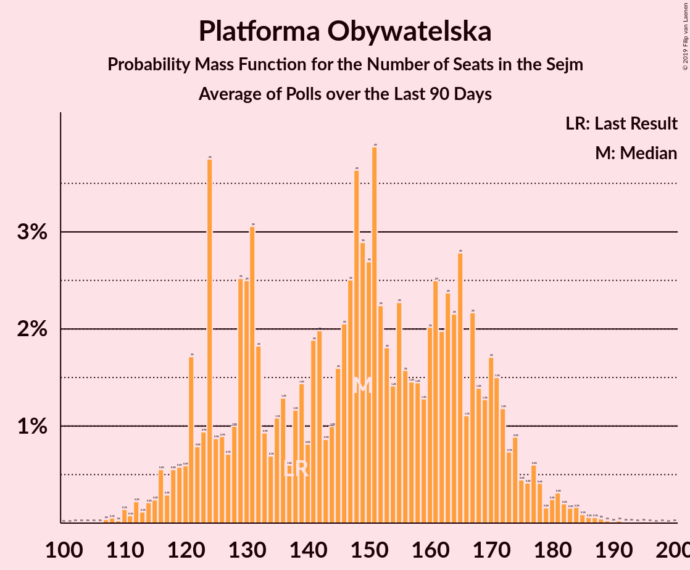

# Platforma Obywatelska

<a href="#voting-intentions">Voting Intentions</a> | <a href="#seats">Seats</a>

## Voting Intentions

Last result: **24.1%** (General Election of 25 October 2015)

### Confidence Intervals

| Period     | Polling firm/Commissioner(s) | Median | 80% Confidence Interval | 90% Confidence Interval | 95% Confidence Interval | 99% Confidence Interval |
|:----------:|:----------------:|:-----------:|:-----------------------:|:-----------------------:|:-----------------------:|:-----------------------:|
| N/A | [Poll Average](average.html) | 22.8% | 19.5–27.9% | 18.9–28.8% | 18.4–29.5% | 17.6–30.6% |
| [5–10 July 2019](2019-07-10-SocialChanges.html) | Social Changes | 27.8% | 26.0–29.6% | 25.5–30.2% | 25.1–30.6% | 24.3–31.5% |
| [28–29 June 2019](2019-06-29-IBRiS.html) | IBRiS   RMF | 19.9% | 18.4–21.5% | 18.0–22.0% | 17.6–22.4% | 17.0–23.2% |
| [21–26 June 2019](2019-06-26-SocialChanges.html) | Social Changes | 23.9% | 22.3–25.7% | 21.8–26.2% | 21.4–26.6% | 20.7–27.5% |
| [19–20 June 2019](2019-06-20-Estymator.html) | Estymator   DoRzeczy.pl | 22.7% | 21.0–24.4% | 20.6–24.9% | 20.2–25.4% | 19.4–26.2% |
| [6–13 June 2019](2019-06-13-CBOS.html) | CBOS | 24.7% | 23.1–26.4% | 22.6–26.9% | 22.2–27.3% | 21.5–28.1% |
| [7–8 June 2019](2019-06-08-IBRiS.html) | IBRiS   Rzeczpospolita | 19.1% | N/A | N/A | N/A | N/A |
| [31 May–5 June 2019](2019-06-05-SocialChanges.html) | Social Changes | 22.4% | N/A | N/A | N/A | N/A |
| [24–29 May 2019](2019-05-29-SocialChanges.html) | Social Changes | 22.9% | N/A | N/A | N/A | N/A |
| [16–23 May 2019](2019-05-23-CBOS.html) | CBOS | 20.0% | N/A | N/A | N/A | N/A |
| [10–15 May 2019](2019-05-15-SocialChanges.html) | Social Changes | 21.6% | N/A | N/A | N/A | N/A |
| [10–15 May 2019](2019-05-15-KantarMillwardBrown.html) | Kantar Millward Brown   Gazeta Wyborcza | 21.0% | 19.4–22.8% | 18.9–23.2% | 18.5–23.7% | 17.8–24.5% |
| [1–4 May 2019](2019-05-04-PracowniaAnalizSpołeczno-Politycznych.html) | Pracownia Analiz Społeczno-Politycznych   Gazeta Bałtycka | 28.0% | N/A | N/A | N/A | N/A |
| [26–30 April 2019](2019-04-30-SocialChanges.html) | Social Changes | 22.2% | N/A | N/A | N/A | N/A |
| [26–29 April 2019](2019-04-29-InstytutBadańPollster.html) | Instytut Badań Pollster   Super Express | 26.0% | N/A | N/A | N/A | N/A |
| [19–24 April 2019](2019-04-24-SocialChanges.html) | Social Changes | 22.8% | N/A | N/A | N/A | N/A |
| [12–17 April 2019](2019-04-17-SocialChanges.html) | Social Changes | 22.0% | N/A | N/A | N/A | N/A |
| [25–27 March 2019](2019-03-27-InstytutBadańSprawNarodowościowych.html) | Instytut Badań Spraw Narodowościowych   Radio ZET | 32.6% | N/A | N/A | N/A | N/A |
| [20–22 March 2019](2019-03-22-CBMIndicator.html) | CBM Indicator   TVP1 | 25.7% | N/A | N/A | N/A | N/A |
| [20–21 March 2019](2019-03-21-Estymator.html) | Estymator   DoRzeczy.pl | 26.7% | N/A | N/A | N/A | N/A |
| [7–14 March 2019](2019-03-14-CBOS.html) | CBOS | 20.0% | N/A | N/A | N/A | N/A |
| [8–13 March 2019](2019-03-13-KantarPublic.html) | Kantar Public | 21.0% | N/A | N/A | N/A | N/A |
| [9–10 March 2019](2019-03-10-IBRiS.html) | IBRiS   Rzeczpospolita | 21.0% | N/A | N/A | N/A | N/A |
| [27–28 February 2019](2019-02-28-IBRiS.html) | IBRiS   SWG | NaN% | N/A | N/A | N/A | N/A |
| [20–21 February 2019](2019-02-21-Estymator.html) | Estymator   DoRzeczy.pl | 26.2% | N/A | N/A | N/A | N/A |
| [14–16 February 2019](2019-02-16-IPSOS.html) | IPSOS   OKO.press | 24.0% | N/A | N/A | N/A | N/A |
| [7–14 February 2019](2019-02-14-CBOS.html) | CBOS | 15.0% | N/A | N/A | N/A | N/A |
| [8–13 February 2019](2019-02-13-KantarPublic.html) | Kantar Public | 20.0% | N/A | N/A | N/A | N/A |
| [8–11 February 2019](2019-02-11-OPBAriadna.html) | OPB Ariadna   WP | 19.9% | N/A | N/A | N/A | N/A |
| [7–8 February 2019](2019-02-08-IBRiS.html) | IBRiS   Rzeczpospolita | 21.8% | N/A | N/A | N/A | N/A |
| [5–7 February 2019](2019-02-07-Estymator.html) | Estymator   DoRzeczy.pl | 28.2% | N/A | N/A | N/A | N/A |
| [31 January–6 February 2019](2019-02-06-InstytutBadańSprawNarodowościowych.html) | Instytut Badań Spraw Narodowościowych   Radio ZET | 32.2% | N/A | N/A | N/A | N/A |
| [4–5 February 2019](2019-02-05-KantarMillwardBrown.html) | Kantar Millward Brown | 20.0% | N/A | N/A | N/A | N/A |
| [30 January 2019](2019-01-30-InstytutBadańPollster.html) | Instytut Badań Pollster   Super Express | 24.0% | N/A | N/A | N/A | N/A |
| [26–27 January 2019](2019-01-27-IBRiS.html) | IBRiS   Rzeczpospolita | 29.2% | N/A | N/A | N/A | N/A |
| [25–26 January 2019](2019-01-26-IBRiS.html) | IBRiS   Onet | 29.6% | N/A | N/A | N/A | N/A |
| [23–24 January 2019](2019-01-24-Estymator.html) | Estymator   DoRzeczy.pl | 31.1% | N/A | N/A | N/A | N/A |
| [10–17 January 2019](2019-01-17-CBOS.html) | CBOS | 22.0% | N/A | N/A | N/A | N/A |
| [11–16 January 2019](2019-01-16-KantarPublic.html) | Kantar Public | 26.0% | N/A | N/A | N/A | N/A |
| [15–16 January 2019](2019-01-16-KantarMillwardBrown.html) | Kantar Millward Brown   Gazeta Wyborcza | 23.2% | N/A | N/A | N/A | N/A |
| [10–11 January 2019](2019-01-11-InstytutBadańPollster.html) | Instytut Badań Pollster   Super Express | 29.0% | N/A | N/A | N/A | N/A |
| [4 January 2019](2019-01-04-IBRiS.html) | IBRiS   Rzeczpospolita | 26.3% | N/A | N/A | N/A | N/A |
| [13–14 December 2018](2018-12-14-InstytutBadańPollster.html) | Instytut Badań Pollster   Super Express | 29.0% | N/A | N/A | N/A | N/A |
| [12–13 December 2018](2018-12-13-Estymator.html) | Estymator   DoRzeczy.pl | 32.1% | N/A | N/A | N/A | N/A |
| [30 November–11 December 2018](2018-12-11-KantarPublic.html) | Kantar Public | 27.0% | N/A | N/A | N/A | N/A |
| [29 November–9 December 2018](2018-12-09-CBOS.html) | CBOS | 24.0% | N/A | N/A | N/A | N/A |
| [7–8 December 2018](2018-12-08-IBRiS.html) | IBRiS   Rzeczpospolita | 31.3% | N/A | N/A | N/A | N/A |
| [23–24 November 2018](2018-11-24-IBRiS.html) | IBRiS   Onet | 30.2% | N/A | N/A | N/A | N/A |
| [20–21 November 2018](2018-11-21-Estymator.html) | Estymator   DoRzeczy.pl | 30.4% | N/A | N/A | N/A | N/A |
| [19–20 November 2018](2018-11-20-KantarMillwardBrown.html) | Kantar Millward Brown   TVN and TVN24 | 26.0% | N/A | N/A | N/A | N/A |
| [9–15 November 2018](2018-11-15-KantarPublic.html) | Kantar Public | 24.0% | N/A | N/A | N/A | N/A |
| [8–15 November 2018](2018-11-15-CBOS.html) | CBOS | 21.0% | N/A | N/A | N/A | N/A |
| [13 November 2018](2018-11-13-IBRiS.html) | IBRiS   Rzeczpospolita | 29.6% | N/A | N/A | N/A | N/A |
| [8–9 November 2018](2018-11-09-IBRiS.html) | IBRiS   Rzeczpospolita | 28.3% | N/A | N/A | N/A | N/A |
| [29–30 October 2018](2018-10-30-Estymator.html) | Estymator   DoRzeczy.pl | 30.0% | N/A | N/A | N/A | N/A |
| [26–27 October 2018](2018-10-27-IBRiS.html) | IBRiS | 27.2% | N/A | N/A | N/A | N/A |
| [12–17 October 2018](2018-10-17-KantarPublic.html) | Kantar Public | 24.0% | N/A | N/A | N/A | N/A |
| [4–11 October 2018](2018-10-11-CBOS.html) | CBOS | 19.0% | N/A | N/A | N/A | N/A |
| [5–6 October 2018](2018-10-06-IBRiS.html) | IBRiS   Rzeczpospolita | 30.0% | N/A | N/A | N/A | N/A |
| [1 October 2018](2018-10-01-InstytutBadańPollster.html) | Instytut Badań Pollster   Super Express | 31.0% | N/A | N/A | N/A | N/A |
| [22–23 September 2018](2018-09-23-IBRiS.html) | IBRiS   Onet | 23.1% | N/A | N/A | N/A | N/A |
| [20–21 September 2018](2018-09-21-Estymator.html) | Estymator   DoRzeczy.pl | 23.9% | N/A | N/A | N/A | N/A |
| [14–17 September 2018](2018-09-17-KantarMillwardBrown.html) | Kantar Millward Brown   TVN and TVN24 | 21.0% | N/A | N/A | N/A | N/A |
| [6–13 September 2018](2018-09-13-CBOS.html) | CBOS | 18.0% | N/A | N/A | N/A | N/A |
| [7–12 September 2018](2018-09-12-KantarPublic.html) | Kantar Public | 20.0% | N/A | N/A | N/A | N/A |
| [25 August–1 September 2018](2018-09-01-IBRiS.html) | IBRiS   Rzeczpospolita | 27.1% | N/A | N/A | N/A | N/A |
| [22–23 August 2018](2018-08-23-Estymator.html) | Estymator   DoRzeczy.pl | 24.8% | N/A | N/A | N/A | N/A |
| [16–23 August 2018](2018-08-23-CBOS.html) | CBOS | 19.0% | N/A | N/A | N/A | N/A |
| [17–19 August 2018](2018-08-19-IPSOS.html) | IPSOS   OKO.press | 20.0% | N/A | N/A | N/A | N/A |
| [11 August 2018](2018-08-11-KantarPublic.html) | Kantar Public   Gazeta Prawna | 26.0% | N/A | N/A | N/A | N/A |
| [11 August 2018](2018-08-11-IBRiS.html) | IBRiS   Rzeczpospolita | 24.8% | N/A | N/A | N/A | N/A |
| [9–10 August 2018](2018-08-10-InstytutBadańPollster.html) | Instytut Badań Pollster   Super Express | 27.9% | N/A | N/A | N/A | N/A |
| [8–10 August 2018](2018-08-10-CBMIndicator.html) | CBM Indicator   TVP1 | 24.6% | N/A | N/A | N/A | N/A |
| [8–9 August 2018](2018-08-09-Estymator.html) | Estymator   DoRzeczy.pl | 25.9% | N/A | N/A | N/A | N/A |
| [27 July 2018](2018-07-27-IBRiS.html) | IBRiS | 25.2% | N/A | N/A | N/A | N/A |
| [11–12 July 2018](2018-07-12-InstytutBadańPollster.html) | Instytut Badań Pollster   Super Express | 27.0% | N/A | N/A | N/A | N/A |
| [6–11 July 2018](2018-07-11-KantarPublic.html) | Kantar Public | 23.0% | N/A | N/A | N/A | N/A |
| [8–9 July 2018](2018-07-09-IBRiS.html) | IBRiS   Rzeczpospolita | 26.3% | N/A | N/A | N/A | N/A |
| [4–5 July 2018](2018-07-05-InstytutBadańPollster.html) | Instytut Badań Pollster   TVP1 | 26.0% | N/A | N/A | N/A | N/A |
| [28 June–5 July 2018](2018-07-05-CBOS.html) | CBOS | 15.9% | N/A | N/A | N/A | N/A |
| [27–28 June 2018](2018-06-28-Estymator.html) | Estymator   DoRzeczy.pl | 25.2% | N/A | N/A | N/A | N/A |
| [21–22 June 2018](2018-06-22-IBRiS.html) | IBRiS   Onet | 24.6% | N/A | N/A | N/A | N/A |
| [18 June 2018](2018-06-18-InstytutBadańPollster.html) | Instytut Badań Pollster   Super Express | 27.0% | N/A | N/A | N/A | N/A |
| [9–17 June 2018](2018-06-17-KantarPublic.html) | Kantar Public | 20.0% | N/A | N/A | N/A | N/A |
| [13–14 June 2018](2018-06-14-Estymator.html) | Estymator   DoRzeczy.pl | 27.9% | N/A | N/A | N/A | N/A |
| [7–14 June 2018](2018-06-14-CBOS.html) | CBOS | 17.0% | N/A | N/A | N/A | N/A |
| [7–8 June 2018](2018-06-08-IBRiS.html) | IBRiS   Rzeczpospolita | 26.4% | N/A | N/A | N/A | N/A |
| [6–7 June 2018](2018-06-07-InstytutBadańPollster.html) | Instytut Badań Pollster   TVP1 | 28.0% | N/A | N/A | N/A | N/A |
| [28–29 May 2018](2018-05-29-KantarMillwardBrown.html) | Kantar Millward Brown   TVN and TVN24 | 28.0% | N/A | N/A | N/A | N/A |
| [24–25 May 2018](2018-05-25-IBRiS.html) | IBRiS   Onet | 27.6% | N/A | N/A | N/A | N/A |
| [23–24 May 2018](2018-05-24-Estymator.html) | Estymator   DoRzeczy.pl | 27.1% | N/A | N/A | N/A | N/A |
| [10–17 May 2018](2018-05-17-CBOS.html) | CBOS | 19.0% | N/A | N/A | N/A | N/A |
| [11–16 May 2018](2018-05-16-KantarPublic.html) | Kantar Public | 22.0% | N/A | N/A | N/A | N/A |
| [14 May 2018](2018-05-14-Estymator.html) | Estymator   DoRzeczy.pl | 28.3% | N/A | N/A | N/A | N/A |
| [10–11 May 2018](2018-05-11-InstytutBadańPollster.html) | Instytut Badań Pollster   TVP1 | 20.0% | N/A | N/A | N/A | N/A |
| [10–11 May 2018](2018-05-11-IBRiS.html) | IBRiS   Rzeczpospolita | 27.3% | N/A | N/A | N/A | N/A |
| [27–29 April 2018](2018-04-29-InstytutBadańPollster.html) | Instytut Badań Pollster   Nowa TV, se.pl and Super Express | 23.9% | N/A | N/A | N/A | N/A |
| [25–27 April 2018](2018-04-27-InstytutBadańPollster.html) | Instytut Badań Pollster   Nowa TV, se.pl and Super Express | 23.0% | N/A | N/A | N/A | N/A |
| [25–26 April 2018](2018-04-26-KantarMillwardBrown.html) | Kantar Millward Brown   TVN and TVN24 | 25.0% | N/A | N/A | N/A | N/A |
| [25–26 April 2018](2018-04-26-Estymator.html) | Estymator   DoRzeczy.pl | 27.3% | N/A | N/A | N/A | N/A |
| [19 April 2018](2018-04-19-IBRiS.html) | IBRiS   Onet | 24.3% | N/A | N/A | N/A | N/A |
| [12–13 April 2018](2018-04-13-IPSOS.html) | IPSOS   OKO.press | 21.0% | N/A | N/A | N/A | N/A |
| [5–12 April 2018](2018-04-12-CBOS.html) | CBOS | 16.0% | N/A | N/A | N/A | N/A |
| [9–10 April 2018](2018-04-10-KantarPublic.html) | Kantar Public | 23.0% | N/A | N/A | N/A | N/A |
| [6–7 April 2018](2018-04-07-InstytutBadańPollster.html) | Instytut Badań Pollster   TVP1 | 23.0% | N/A | N/A | N/A | N/A |
| [4–5 April 2018](2018-04-05-InstytutBadańPollster.html) | Instytut Badań Pollster   Nowa TV, se.pl and Super Express | 20.9% | N/A | N/A | N/A | N/A |
| [4–5 April 2018](2018-04-05-Estymator.html) | Estymator   DoRzeczy.pl | 28.3% | N/A | N/A | N/A | N/A |
| [4 April 2018](2018-04-04-IBRiS.html) | IBRiS   Rzeczpospolita | 23.5% | N/A | N/A | N/A | N/A |
| [29–30 March 2018](2018-03-30-InstytutBadańPollster.html) | Instytut Badań Pollster   TVP1 | 21.9% | N/A | N/A | N/A | N/A |
| [26–27 March 2018](2018-03-27-KantarMillwardBrown.html) | Kantar Millward Brown   TVN and TVN24 | 22.0% | N/A | N/A | N/A | N/A |
| [21–22 March 2018](2018-03-22-Estymator.html) | Estymator   DoRzeczy.pl | 25.6% | N/A | N/A | N/A | N/A |
| [17 March 2018](2018-03-17-IBRiS.html) | IBRiS   Onet | 24.0% | N/A | N/A | N/A | N/A |
| [9–14 March 2018](2018-03-14-KantarPublic.html) | Kantar Public | 22.5% | N/A | N/A | N/A | N/A |
| [1–8 March 2018](2018-03-08-CBOS.html) | CBOS | 14.0% | N/A | N/A | N/A | N/A |
| [1–2 March 2018](2018-03-02-IBRiS.html) | IBRiS   Rzeczpospolita | 22.5% | N/A | N/A | N/A | N/A |
| [26 February 2018](2018-02-26-IBRiS.html) | IBRiS | 22.4% | N/A | N/A | N/A | N/A |
| [22 February 2018](2018-02-22-InstytutBadańPollster.html) | Instytut Badań Pollster   Nowa TV, se.pl and Super Express | 19.0% | N/A | N/A | N/A | N/A |
| [21–22 February 2018](2018-02-22-Estymator.html) | Estymator   DoRzeczy.pl | 22.9% | N/A | N/A | N/A | N/A |
| [16–21 February 2018](2018-02-21-KantarPublic.html) | Kantar Public | 20.0% | N/A | N/A | N/A | N/A |
| [19–20 February 2018](2018-02-20-KantarMillwardBrown.html) | Kantar Millward Brown   TVN and TVN24 | 16.0% | N/A | N/A | N/A | N/A |
| [20 February 2018](2018-02-20-IBRiS.html) | IBRiS   Onet | 19.6% | N/A | N/A | N/A | N/A |
| [1–8 February 2018](2018-02-08-CBOS.html) | CBOS | 17.3% | N/A | N/A | N/A | N/A |
| [5 February 2018](2018-02-05-IBRiS.html) | IBRiS   Rzeczpospolita | 20.1% | N/A | N/A | N/A | N/A |

### Probability Mass Function

The following table shows the probability mass function per percentage block of voting intentions for the [poll average](average.html) for Platforma Obywatelska.

| Voting Intentions | Probability | Accumulated | Special Marks |
|:-----------------:|:-----------:|:-----------:|:-------------:|
| 15.5–16.5% | 0% | 100% |  |
| 16.5–17.5% | 0.4% | 100% |  |
| 17.5–18.5% | 2% | 99.6% |  |
| 18.5–19.5% | 7% | 97% |  |
| 19.5–20.5% | 12% | 90% |  |
| 20.5–21.5% | 13% | 78% |  |
| 21.5–22.5% | 12% | 65% |  |
| 22.5–23.5% | 11% | 53% | Median |
| 23.5–24.5% | 10% | 42% | Last Result |
| 24.5–25.5% | 8% | 32% |  |
| 25.5–26.5% | 7% | 25% |  |
| 26.5–27.5% | 6% | 18% |  |
| 27.5–28.5% | 6% | 12% |  |
| 28.5–29.5% | 4% | 6% |  |
| 29.5–30.5% | 2% | 2% |  |
| 30.5–31.5% | 0.5% | 0.6% |  |
| 31.5–32.5% | 0.1% | 0.1% |  |
| 32.5–33.5% | 0% | 0% |  |

## Seats

Last result: **138** seats (General Election of 25 October 2015)

### Confidence Intervals

| Period     | Polling firm/Commissioner(s) | Median | 80% Confidence Interval | 90% Confidence Interval | 95% Confidence Interval | 99% Confidence Interval |
|:----------:|:----------------:|:------:|:-----------------------:|:-----------------------:|:-----------------------:|:-----------------------:|
| N/A | [Poll Average](average.html) | 136 | 120–153 | 117–159 | 113–163 | 104–172 |
| [5–10 July 2019](2019-07-10-SocialChanges.html) | Social Changes | 152 | 144–164 | 141–168 | 138–172 | 132–178 |
| [28–29 June 2019](2019-06-29-IBRiS.html) | IBRiS   RMF | 128 | 115–146 | 108–147 | 105–148 | 99–150 |
| [21–26 June 2019](2019-06-26-SocialChanges.html) | Social Changes | 142 | 130–154 | 128–158 | 127–162 | 122–167 |
| [19–20 June 2019](2019-06-20-Estymator.html) | Estymator   DoRzeczy.pl | 129 | 119–141 | 116–142 | 112–145 | 108–149 |
| [6–13 June 2019](2019-06-13-CBOS.html) | CBOS | 139 | 127–143 | 122–145 | 120–148 | 114–153 |
| [7–8 June 2019](2019-06-08-IBRiS.html) | IBRiS   Rzeczpospolita |  |  |  |  |  |
| [31 May–5 June 2019](2019-06-05-SocialChanges.html) | Social Changes |  |  |  |  |  |
| [24–29 May 2019](2019-05-29-SocialChanges.html) | Social Changes |  |  |  |  |  |
| [16–23 May 2019](2019-05-23-CBOS.html) | CBOS |  |  |  |  |  |
| [10–15 May 2019](2019-05-15-SocialChanges.html) | Social Changes |  |  |  |  |  |
| [10–15 May 2019](2019-05-15-KantarMillwardBrown.html) | Kantar Millward Brown   Gazeta Wyborcza | 137 | 120–152 | 116–153 | 114–160 | 109–167 |
| [1–4 May 2019](2019-05-04-PracowniaAnalizSpołeczno-Politycznych.html) | Pracownia Analiz Społeczno-Politycznych   Gazeta Bałtycka |  |  |  |  |  |
| [26–30 April 2019](2019-04-30-SocialChanges.html) | Social Changes |  |  |  |  |  |
| [26–29 April 2019](2019-04-29-InstytutBadańPollster.html) | Instytut Badań Pollster   Super Express |  |  |  |  |  |
| [19–24 April 2019](2019-04-24-SocialChanges.html) | Social Changes |  |  |  |  |  |
| [12–17 April 2019](2019-04-17-SocialChanges.html) | Social Changes |  |  |  |  |  |
| [25–27 March 2019](2019-03-27-InstytutBadańSprawNarodowościowych.html) | Instytut Badań Spraw Narodowościowych   Radio ZET |  |  |  |  |  |
| [20–22 March 2019](2019-03-22-CBMIndicator.html) | CBM Indicator   TVP1 |  |  |  |  |  |
| [20–21 March 2019](2019-03-21-Estymator.html) | Estymator   DoRzeczy.pl |  |  |  |  |  |
| [7–14 March 2019](2019-03-14-CBOS.html) | CBOS |  |  |  |  |  |
| [8–13 March 2019](2019-03-13-KantarPublic.html) | Kantar Public |  |  |  |  |  |
| [9–10 March 2019](2019-03-10-IBRiS.html) | IBRiS   Rzeczpospolita |  |  |  |  |  |
| [27–28 February 2019](2019-02-28-IBRiS.html) | IBRiS   SWG |  |  |  |  |  |
| [20–21 February 2019](2019-02-21-Estymator.html) | Estymator   DoRzeczy.pl |  |  |  |  |  |
| [14–16 February 2019](2019-02-16-IPSOS.html) | IPSOS   OKO.press |  |  |  |  |  |
| [7–14 February 2019](2019-02-14-CBOS.html) | CBOS |  |  |  |  |  |
| [8–13 February 2019](2019-02-13-KantarPublic.html) | Kantar Public |  |  |  |  |  |
| [8–11 February 2019](2019-02-11-OPBAriadna.html) | OPB Ariadna   WP |  |  |  |  |  |
| [7–8 February 2019](2019-02-08-IBRiS.html) | IBRiS   Rzeczpospolita |  |  |  |  |  |
| [5–7 February 2019](2019-02-07-Estymator.html) | Estymator   DoRzeczy.pl |  |  |  |  |  |
| [31 January–6 February 2019](2019-02-06-InstytutBadańSprawNarodowościowych.html) | Instytut Badań Spraw Narodowościowych   Radio ZET |  |  |  |  |  |
| [4–5 February 2019](2019-02-05-KantarMillwardBrown.html) | Kantar Millward Brown |  |  |  |  |  |
| [30 January 2019](2019-01-30-InstytutBadańPollster.html) | Instytut Badań Pollster   Super Express |  |  |  |  |  |
| [26–27 January 2019](2019-01-27-IBRiS.html) | IBRiS   Rzeczpospolita |  |  |  |  |  |
| [25–26 January 2019](2019-01-26-IBRiS.html) | IBRiS   Onet |  |  |  |  |  |
| [23–24 January 2019](2019-01-24-Estymator.html) | Estymator   DoRzeczy.pl |  |  |  |  |  |
| [10–17 January 2019](2019-01-17-CBOS.html) | CBOS |  |  |  |  |  |
| [11–16 January 2019](2019-01-16-KantarPublic.html) | Kantar Public |  |  |  |  |  |
| [15–16 January 2019](2019-01-16-KantarMillwardBrown.html) | Kantar Millward Brown   Gazeta Wyborcza |  |  |  |  |  |
| [10–11 January 2019](2019-01-11-InstytutBadańPollster.html) | Instytut Badań Pollster   Super Express |  |  |  |  |  |
| [4 January 2019](2019-01-04-IBRiS.html) | IBRiS   Rzeczpospolita |  |  |  |  |  |
| [13–14 December 2018](2018-12-14-InstytutBadańPollster.html) | Instytut Badań Pollster   Super Express |  |  |  |  |  |
| [12–13 December 2018](2018-12-13-Estymator.html) | Estymator   DoRzeczy.pl |  |  |  |  |  |
| [30 November–11 December 2018](2018-12-11-KantarPublic.html) | Kantar Public |  |  |  |  |  |
| [29 November–9 December 2018](2018-12-09-CBOS.html) | CBOS |  |  |  |  |  |
| [7–8 December 2018](2018-12-08-IBRiS.html) | IBRiS   Rzeczpospolita |  |  |  |  |  |
| [23–24 November 2018](2018-11-24-IBRiS.html) | IBRiS   Onet |  |  |  |  |  |
| [20–21 November 2018](2018-11-21-Estymator.html) | Estymator   DoRzeczy.pl |  |  |  |  |  |
| [19–20 November 2018](2018-11-20-KantarMillwardBrown.html) | Kantar Millward Brown   TVN and TVN24 |  |  |  |  |  |
| [9–15 November 2018](2018-11-15-KantarPublic.html) | Kantar Public |  |  |  |  |  |
| [8–15 November 2018](2018-11-15-CBOS.html) | CBOS |  |  |  |  |  |
| [13 November 2018](2018-11-13-IBRiS.html) | IBRiS   Rzeczpospolita |  |  |  |  |  |
| [8–9 November 2018](2018-11-09-IBRiS.html) | IBRiS   Rzeczpospolita |  |  |  |  |  |
| [29–30 October 2018](2018-10-30-Estymator.html) | Estymator   DoRzeczy.pl |  |  |  |  |  |
| [26–27 October 2018](2018-10-27-IBRiS.html) | IBRiS |  |  |  |  |  |
| [12–17 October 2018](2018-10-17-KantarPublic.html) | Kantar Public |  |  |  |  |  |
| [4–11 October 2018](2018-10-11-CBOS.html) | CBOS |  |  |  |  |  |
| [5–6 October 2018](2018-10-06-IBRiS.html) | IBRiS   Rzeczpospolita |  |  |  |  |  |
| [1 October 2018](2018-10-01-InstytutBadańPollster.html) | Instytut Badań Pollster   Super Express |  |  |  |  |  |
| [22–23 September 2018](2018-09-23-IBRiS.html) | IBRiS   Onet |  |  |  |  |  |
| [20–21 September 2018](2018-09-21-Estymator.html) | Estymator   DoRzeczy.pl |  |  |  |  |  |
| [14–17 September 2018](2018-09-17-KantarMillwardBrown.html) | Kantar Millward Brown   TVN and TVN24 |  |  |  |  |  |
| [6–13 September 2018](2018-09-13-CBOS.html) | CBOS |  |  |  |  |  |
| [7–12 September 2018](2018-09-12-KantarPublic.html) | Kantar Public |  |  |  |  |  |
| [25 August–1 September 2018](2018-09-01-IBRiS.html) | IBRiS   Rzeczpospolita |  |  |  |  |  |
| [22–23 August 2018](2018-08-23-Estymator.html) | Estymator   DoRzeczy.pl |  |  |  |  |  |
| [16–23 August 2018](2018-08-23-CBOS.html) | CBOS |  |  |  |  |  |
| [17–19 August 2018](2018-08-19-IPSOS.html) | IPSOS   OKO.press |  |  |  |  |  |
| [11 August 2018](2018-08-11-KantarPublic.html) | Kantar Public   Gazeta Prawna |  |  |  |  |  |
| [11 August 2018](2018-08-11-IBRiS.html) | IBRiS   Rzeczpospolita |  |  |  |  |  |
| [9–10 August 2018](2018-08-10-InstytutBadańPollster.html) | Instytut Badań Pollster   Super Express |  |  |  |  |  |
| [8–10 August 2018](2018-08-10-CBMIndicator.html) | CBM Indicator   TVP1 |  |  |  |  |  |
| [8–9 August 2018](2018-08-09-Estymator.html) | Estymator   DoRzeczy.pl |  |  |  |  |  |
| [27 July 2018](2018-07-27-IBRiS.html) | IBRiS |  |  |  |  |  |
| [11–12 July 2018](2018-07-12-InstytutBadańPollster.html) | Instytut Badań Pollster   Super Express |  |  |  |  |  |
| [6–11 July 2018](2018-07-11-KantarPublic.html) | Kantar Public |  |  |  |  |  |
| [8–9 July 2018](2018-07-09-IBRiS.html) | IBRiS   Rzeczpospolita |  |  |  |  |  |
| [4–5 July 2018](2018-07-05-InstytutBadańPollster.html) | Instytut Badań Pollster   TVP1 |  |  |  |  |  |
| [28 June–5 July 2018](2018-07-05-CBOS.html) | CBOS |  |  |  |  |  |
| [27–28 June 2018](2018-06-28-Estymator.html) | Estymator   DoRzeczy.pl |  |  |  |  |  |
| [21–22 June 2018](2018-06-22-IBRiS.html) | IBRiS   Onet |  |  |  |  |  |
| [18 June 2018](2018-06-18-InstytutBadańPollster.html) | Instytut Badań Pollster   Super Express |  |  |  |  |  |
| [9–17 June 2018](2018-06-17-KantarPublic.html) | Kantar Public |  |  |  |  |  |
| [13–14 June 2018](2018-06-14-Estymator.html) | Estymator   DoRzeczy.pl |  |  |  |  |  |
| [7–14 June 2018](2018-06-14-CBOS.html) | CBOS |  |  |  |  |  |
| [7–8 June 2018](2018-06-08-IBRiS.html) | IBRiS   Rzeczpospolita |  |  |  |  |  |
| [6–7 June 2018](2018-06-07-InstytutBadańPollster.html) | Instytut Badań Pollster   TVP1 |  |  |  |  |  |
| [28–29 May 2018](2018-05-29-KantarMillwardBrown.html) | Kantar Millward Brown   TVN and TVN24 |  |  |  |  |  |
| [24–25 May 2018](2018-05-25-IBRiS.html) | IBRiS   Onet |  |  |  |  |  |
| [23–24 May 2018](2018-05-24-Estymator.html) | Estymator   DoRzeczy.pl |  |  |  |  |  |
| [10–17 May 2018](2018-05-17-CBOS.html) | CBOS |  |  |  |  |  |
| [11–16 May 2018](2018-05-16-KantarPublic.html) | Kantar Public |  |  |  |  |  |
| [14 May 2018](2018-05-14-Estymator.html) | Estymator   DoRzeczy.pl |  |  |  |  |  |
| [10–11 May 2018](2018-05-11-InstytutBadańPollster.html) | Instytut Badań Pollster   TVP1 |  |  |  |  |  |
| [10–11 May 2018](2018-05-11-IBRiS.html) | IBRiS   Rzeczpospolita |  |  |  |  |  |
| [27–29 April 2018](2018-04-29-InstytutBadańPollster.html) | Instytut Badań Pollster   Nowa TV, se.pl and Super Express |  |  |  |  |  |
| [25–27 April 2018](2018-04-27-InstytutBadańPollster.html) | Instytut Badań Pollster   Nowa TV, se.pl and Super Express |  |  |  |  |  |
| [25–26 April 2018](2018-04-26-KantarMillwardBrown.html) | Kantar Millward Brown   TVN and TVN24 |  |  |  |  |  |
| [25–26 April 2018](2018-04-26-Estymator.html) | Estymator   DoRzeczy.pl |  |  |  |  |  |
| [19 April 2018](2018-04-19-IBRiS.html) | IBRiS   Onet |  |  |  |  |  |
| [12–13 April 2018](2018-04-13-IPSOS.html) | IPSOS   OKO.press |  |  |  |  |  |
| [5–12 April 2018](2018-04-12-CBOS.html) | CBOS |  |  |  |  |  |
| [9–10 April 2018](2018-04-10-KantarPublic.html) | Kantar Public |  |  |  |  |  |
| [6–7 April 2018](2018-04-07-InstytutBadańPollster.html) | Instytut Badań Pollster   TVP1 |  |  |  |  |  |
| [4–5 April 2018](2018-04-05-InstytutBadańPollster.html) | Instytut Badań Pollster   Nowa TV, se.pl and Super Express |  |  |  |  |  |
| [4–5 April 2018](2018-04-05-Estymator.html) | Estymator   DoRzeczy.pl |  |  |  |  |  |
| [4 April 2018](2018-04-04-IBRiS.html) | IBRiS   Rzeczpospolita |  |  |  |  |  |
| [29–30 March 2018](2018-03-30-InstytutBadańPollster.html) | Instytut Badań Pollster   TVP1 |  |  |  |  |  |
| [26–27 March 2018](2018-03-27-KantarMillwardBrown.html) | Kantar Millward Brown   TVN and TVN24 |  |  |  |  |  |
| [21–22 March 2018](2018-03-22-Estymator.html) | Estymator   DoRzeczy.pl |  |  |  |  |  |
| [17 March 2018](2018-03-17-IBRiS.html) | IBRiS   Onet |  |  |  |  |  |
| [9–14 March 2018](2018-03-14-KantarPublic.html) | Kantar Public |  |  |  |  |  |
| [1–8 March 2018](2018-03-08-CBOS.html) | CBOS |  |  |  |  |  |
| [1–2 March 2018](2018-03-02-IBRiS.html) | IBRiS   Rzeczpospolita |  |  |  |  |  |
| [26 February 2018](2018-02-26-IBRiS.html) | IBRiS |  |  |  |  |  |
| [22 February 2018](2018-02-22-InstytutBadańPollster.html) | Instytut Badań Pollster   Nowa TV, se.pl and Super Express |  |  |  |  |  |
| [21–22 February 2018](2018-02-22-Estymator.html) | Estymator   DoRzeczy.pl |  |  |  |  |  |
| [16–21 February 2018](2018-02-21-KantarPublic.html) | Kantar Public |  |  |  |  |  |
| [19–20 February 2018](2018-02-20-KantarMillwardBrown.html) | Kantar Millward Brown   TVN and TVN24 |  |  |  |  |  |
| [20 February 2018](2018-02-20-IBRiS.html) | IBRiS   Onet |  |  |  |  |  |
| [1–8 February 2018](2018-02-08-CBOS.html) | CBOS |  |  |  |  |  |
| [5 February 2018](2018-02-05-IBRiS.html) | IBRiS   Rzeczpospolita |  |  |  |  |  |

### Probability Mass Function

The following table shows the probability mass function per seat for the [poll average](average.html) for Platforma Obywatelska.

| Number of Seats | Probability | Accumulated | Special Marks |
|:---------------:|:-----------:|:-----------:|:-------------:|
| 96 | 0% | 100% |  |
| 97 | 0% | 99.9% |  |
| 98 | 0% | 99.9% |  |
| 99 | 0% | 99.9% |  |
| 100 | 0% | 99.9% |  |
| 101 | 0.1% | 99.9% |  |
| 102 | 0.1% | 99.7% |  |
| 103 | 0% | 99.6% |  |
| 104 | 0.1% | 99.6% |  |
| 105 | 0.1% | 99.5% |  |
| 106 | 0.3% | 99.4% |  |
| 107 | 0.2% | 99.1% |  |
| 108 | 0.3% | 98.9% |  |
| 109 | 0.2% | 98.7% |  |
| 110 | 0.3% | 98% |  |
| 111 | 0.1% | 98% |  |
| 112 | 0.4% | 98% |  |
| 113 | 0.3% | 98% |  |
| 114 | 0.7% | 97% |  |
| 115 | 0.7% | 97% |  |
| 116 | 0.8% | 96% |  |
| 117 | 0.8% | 95% |  |
| 118 | 1.1% | 94% |  |
| 119 | 1.2% | 93% |  |
| 120 | 2% | 92% |  |
| 121 | 3% | 90% |  |
| 122 | 1.1% | 87% |  |
| 123 | 2% | 86% |  |
| 124 | 4% | 84% |  |
| 125 | 1.5% | 81% |  |
| 126 | 2% | 79% |  |
| 127 | 2% | 78% |  |
| 128 | 3% | 75% |  |
| 129 | 4% | 72% |  |
| 130 | 2% | 69% |  |
| 131 | 5% | 67% |  |
| 132 | 3% | 62% |  |
| 133 | 1.3% | 59% |  |
| 134 | 2% | 58% |  |
| 135 | 3% | 55% |  |
| 136 | 4% | 52% | Median |
| 137 | 2% | 49% |  |
| 138 | 0.6% | 46% | Last Result |
| 139 | 5% | 46% |  |
| 140 | 3% | 41% |  |
| 141 | 2% | 38% |  |
| 142 | 3% | 36% |  |
| 143 | 2% | 33% |  |
| 144 | 2% | 31% |  |
| 145 | 3% | 29% |  |
| 146 | 2% | 27% |  |
| 147 | 3% | 25% |  |
| 148 | 3% | 22% |  |
| 149 | 2% | 19% |  |
| 150 | 2% | 17% |  |
| 151 | 1.4% | 15% |  |
| 152 | 3% | 13% |  |
| 153 | 2% | 11% |  |
| 154 | 1.0% | 9% |  |
| 155 | 0.9% | 8% |  |
| 156 | 0.6% | 7% |  |
| 157 | 0.8% | 6% |  |
| 158 | 0.6% | 6% |  |
| 159 | 0.6% | 5% |  |
| 160 | 0.7% | 4% |  |
| 161 | 0.4% | 4% |  |
| 162 | 0.3% | 3% |  |
| 163 | 0.4% | 3% |  |
| 164 | 0.5% | 2% |  |
| 165 | 0.3% | 2% |  |
| 166 | 0.3% | 2% |  |
| 167 | 0.2% | 1.4% |  |
| 168 | 0.2% | 1.2% |  |
| 169 | 0.2% | 1.0% |  |
| 170 | 0.1% | 0.8% |  |
| 171 | 0.1% | 0.6% |  |
| 172 | 0.1% | 0.5% |  |
| 173 | 0.1% | 0.4% |  |
| 174 | 0.1% | 0.3% |  |
| 175 | 0% | 0.2% |  |
| 176 | 0% | 0.2% |  |
| 177 | 0% | 0.1% |  |
| 178 | 0% | 0.1% |  |
| 179 | 0% | 0.1% |  |
| 180 | 0% | 0.1% |  |
| 181 | 0% | 0.1% |  |
| 182 | 0% | 0% |  |

