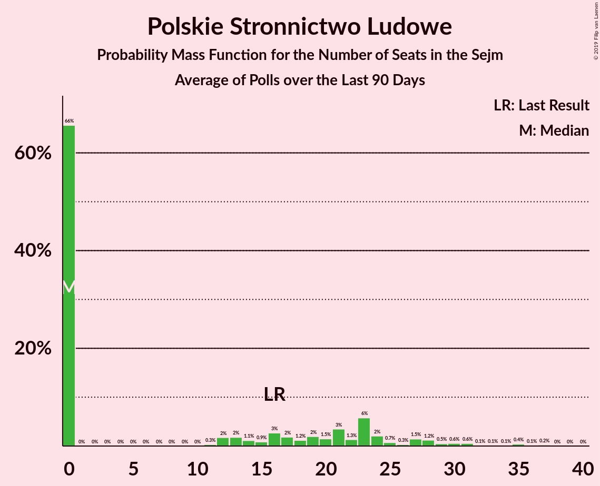

# Polskie Stronnictwo Ludowe

<a href="#voting-intentions">Voting Intentions</a> | <a href="#seats">Seats</a>

## Voting Intentions

Last result: **5.1%** (General Election of 25 October 2015)

### Confidence Intervals

| Period     | Polling firm/Commissioner(s) | Median | 80% Confidence Interval | 90% Confidence Interval | 95% Confidence Interval | 99% Confidence Interval |
|:----------:|:----------------:|:-----------:|:-----------------------:|:-----------------------:|:-----------------------:|:-----------------------:|
| N/A | [Poll Average](average.html) | 4.2% | 2.9–5.6% | 2.6–5.9% | 2.4–6.2% | 2.1–6.7% |
| [5–10 July 2019](2019-07-10-SocialChanges.html) | Social Changes | 5.0% | 4.2–6.0% | 4.0–6.3% | 3.8–6.5% | 3.5–7.0% |
| [28–29 June 2019](2019-06-29-IBRiS.html) | IBRiS   RMF | 3.0% | 2.4–3.8% | 2.3–4.0% | 2.1–4.2% | 1.9–4.6% |
| [21–26 June 2019](2019-06-26-SocialChanges.html) | Social Changes | 4.2% | 3.5–5.1% | 3.3–5.4% | 3.2–5.6% | 2.9–6.1% |
| [19–20 June 2019](2019-06-20-Estymator.html) | Estymator   DoRzeczy.pl | 4.3% | 3.6–5.2% | 3.4–5.5% | 3.2–5.7% | 2.9–6.2% |
| [6–13 June 2019](2019-06-13-CBOS.html) | CBOS | 3.3% | 2.7–4.1% | 2.5–4.3% | 2.4–4.5% | 2.1–5.0% |
| [7–8 June 2019](2019-06-08-IBRiS.html) | IBRiS   Rzeczpospolita | 5.1% | N/A | N/A | N/A | N/A |
| [31 May–5 June 2019](2019-06-05-SocialChanges.html) | Social Changes | 5.0% | N/A | N/A | N/A | N/A |
| [24–29 May 2019](2019-05-29-SocialChanges.html) | Social Changes | 5.5% | N/A | N/A | N/A | N/A |
| [16–23 May 2019](2019-05-23-CBOS.html) | CBOS | 4.0% | N/A | N/A | N/A | N/A |
| [10–15 May 2019](2019-05-15-SocialChanges.html) | Social Changes | 4.5% | N/A | N/A | N/A | N/A |
| [10–15 May 2019](2019-05-15-KantarMillwardBrown.html) | Kantar Millward Brown   Gazeta Wyborcza | 5.0% | 4.2–6.0% | 3.9–6.3% | 3.8–6.5% | 3.4–7.0% |
| [1–4 May 2019](2019-05-04-PracowniaAnalizSpołeczno-Politycznych.html) | Pracownia Analiz Społeczno-Politycznych   Gazeta Bałtycka | 5.5% | N/A | N/A | N/A | N/A |
| [26–30 April 2019](2019-04-30-SocialChanges.html) | Social Changes | 5.5% | N/A | N/A | N/A | N/A |
| [26–29 April 2019](2019-04-29-InstytutBadańPollster.html) | Instytut Badań Pollster   Super Express | 4.0% | N/A | N/A | N/A | N/A |
| [19–24 April 2019](2019-04-24-SocialChanges.html) | Social Changes | 5.9% | N/A | N/A | N/A | N/A |
| [12–17 April 2019](2019-04-17-SocialChanges.html) | Social Changes | 5.0% | N/A | N/A | N/A | N/A |
| [25–27 March 2019](2019-03-27-InstytutBadańSprawNarodowościowych.html) | Instytut Badań Spraw Narodowościowych   Radio ZET | 3.5% | N/A | N/A | N/A | N/A |
| [20–22 March 2019](2019-03-22-CBMIndicator.html) | CBM Indicator   TVP1 | 5.2% | N/A | N/A | N/A | N/A |
| [20–21 March 2019](2019-03-21-Estymator.html) | Estymator   DoRzeczy.pl | 5.3% | N/A | N/A | N/A | N/A |
| [7–14 March 2019](2019-03-14-CBOS.html) | CBOS | 4.0% | N/A | N/A | N/A | N/A |
| [8–13 March 2019](2019-03-13-KantarPublic.html) | Kantar Public | 5.0% | N/A | N/A | N/A | N/A |
| [9–10 March 2019](2019-03-10-IBRiS.html) | IBRiS   Rzeczpospolita | 6.0% | N/A | N/A | N/A | N/A |
| [27–28 February 2019](2019-02-28-IBRiS.html) | IBRiS   SWG | NaN% | N/A | N/A | N/A | N/A |
| [20–21 February 2019](2019-02-21-Estymator.html) | Estymator   DoRzeczy.pl | 5.6% | N/A | N/A | N/A | N/A |
| [14–16 February 2019](2019-02-16-IPSOS.html) | IPSOS   OKO.press | 3.6% | N/A | N/A | N/A | N/A |
| [7–14 February 2019](2019-02-14-CBOS.html) | CBOS | 5.0% | N/A | N/A | N/A | N/A |
| [8–13 February 2019](2019-02-13-KantarPublic.html) | Kantar Public | 4.0% | N/A | N/A | N/A | N/A |
| [8–11 February 2019](2019-02-11-OPBAriadna.html) | OPB Ariadna   WP | 7.0% | N/A | N/A | N/A | N/A |
| [7–8 February 2019](2019-02-08-IBRiS.html) | IBRiS   Rzeczpospolita | 4.8% | N/A | N/A | N/A | N/A |
| [5–7 February 2019](2019-02-07-Estymator.html) | Estymator   DoRzeczy.pl | 5.9% | N/A | N/A | N/A | N/A |
| [31 January–6 February 2019](2019-02-06-InstytutBadańSprawNarodowościowych.html) | Instytut Badań Spraw Narodowościowych   Radio ZET | 3.3% | N/A | N/A | N/A | N/A |
| [4–5 February 2019](2019-02-05-KantarMillwardBrown.html) | Kantar Millward Brown | 5.0% | N/A | N/A | N/A | N/A |
| [30 January 2019](2019-01-30-InstytutBadańPollster.html) | Instytut Badań Pollster   Super Express | 7.0% | N/A | N/A | N/A | N/A |
| [26–27 January 2019](2019-01-27-IBRiS.html) | IBRiS   Rzeczpospolita | 6.5% | N/A | N/A | N/A | N/A |
| [25–26 January 2019](2019-01-26-IBRiS.html) | IBRiS   Onet | 4.1% | N/A | N/A | N/A | N/A |
| [23–24 January 2019](2019-01-24-Estymator.html) | Estymator   DoRzeczy.pl | 6.8% | N/A | N/A | N/A | N/A |
| [10–17 January 2019](2019-01-17-CBOS.html) | CBOS | 5.0% | N/A | N/A | N/A | N/A |
| [11–16 January 2019](2019-01-16-KantarPublic.html) | Kantar Public | 5.0% | N/A | N/A | N/A | N/A |
| [15–16 January 2019](2019-01-16-KantarMillwardBrown.html) | Kantar Millward Brown   Gazeta Wyborcza | 4.6% | N/A | N/A | N/A | N/A |
| [10–11 January 2019](2019-01-11-InstytutBadańPollster.html) | Instytut Badań Pollster   Super Express | 7.0% | N/A | N/A | N/A | N/A |
| [4 January 2019](2019-01-04-IBRiS.html) | IBRiS   Rzeczpospolita | 6.7% | N/A | N/A | N/A | N/A |
| [13–14 December 2018](2018-12-14-InstytutBadańPollster.html) | Instytut Badań Pollster   Super Express | 5.0% | N/A | N/A | N/A | N/A |
| [12–13 December 2018](2018-12-13-Estymator.html) | Estymator   DoRzeczy.pl | 6.4% | N/A | N/A | N/A | N/A |
| [30 November–11 December 2018](2018-12-11-KantarPublic.html) | Kantar Public | 4.0% | N/A | N/A | N/A | N/A |
| [29 November–9 December 2018](2018-12-09-CBOS.html) | CBOS | 7.0% | N/A | N/A | N/A | N/A |
| [7–8 December 2018](2018-12-08-IBRiS.html) | IBRiS   Rzeczpospolita | 5.1% | N/A | N/A | N/A | N/A |
| [23–24 November 2018](2018-11-24-IBRiS.html) | IBRiS   Onet | 4.5% | N/A | N/A | N/A | N/A |
| [20–21 November 2018](2018-11-21-Estymator.html) | Estymator   DoRzeczy.pl | 4.7% | N/A | N/A | N/A | N/A |
| [19–20 November 2018](2018-11-20-KantarMillwardBrown.html) | Kantar Millward Brown   TVN and TVN24 | 4.0% | N/A | N/A | N/A | N/A |
| [9–15 November 2018](2018-11-15-KantarPublic.html) | Kantar Public | 5.0% | N/A | N/A | N/A | N/A |
| [8–15 November 2018](2018-11-15-CBOS.html) | CBOS | 7.0% | N/A | N/A | N/A | N/A |
| [13 November 2018](2018-11-13-IBRiS.html) | IBRiS   Rzeczpospolita | 4.0% | N/A | N/A | N/A | N/A |
| [8–9 November 2018](2018-11-09-IBRiS.html) | IBRiS   Rzeczpospolita | 4.2% | N/A | N/A | N/A | N/A |
| [29–30 October 2018](2018-10-30-Estymator.html) | Estymator   DoRzeczy.pl | 6.0% | N/A | N/A | N/A | N/A |
| [26–27 October 2018](2018-10-27-IBRiS.html) | IBRiS | 5.7% | N/A | N/A | N/A | N/A |
| [12–17 October 2018](2018-10-17-KantarPublic.html) | Kantar Public | 8.0% | N/A | N/A | N/A | N/A |
| [4–11 October 2018](2018-10-11-CBOS.html) | CBOS | 5.0% | N/A | N/A | N/A | N/A |
| [5–6 October 2018](2018-10-06-IBRiS.html) | IBRiS   Rzeczpospolita | 5.2% | N/A | N/A | N/A | N/A |
| [1 October 2018](2018-10-01-InstytutBadańPollster.html) | Instytut Badań Pollster   Super Express | 6.0% | N/A | N/A | N/A | N/A |
| [22–23 September 2018](2018-09-23-IBRiS.html) | IBRiS   Onet | 6.3% | N/A | N/A | N/A | N/A |
| [20–21 September 2018](2018-09-21-Estymator.html) | Estymator   DoRzeczy.pl | 7.4% | N/A | N/A | N/A | N/A |
| [14–17 September 2018](2018-09-17-KantarMillwardBrown.html) | Kantar Millward Brown   TVN and TVN24 | 4.0% | N/A | N/A | N/A | N/A |
| [6–13 September 2018](2018-09-13-CBOS.html) | CBOS | 4.0% | N/A | N/A | N/A | N/A |
| [7–12 September 2018](2018-09-12-KantarPublic.html) | Kantar Public | 4.0% | N/A | N/A | N/A | N/A |
| [25 August–1 September 2018](2018-09-01-IBRiS.html) | IBRiS   Rzeczpospolita | 5.0% | N/A | N/A | N/A | N/A |
| [22–23 August 2018](2018-08-23-Estymator.html) | Estymator   DoRzeczy.pl | 6.6% | N/A | N/A | N/A | N/A |
| [16–23 August 2018](2018-08-23-CBOS.html) | CBOS | 5.0% | N/A | N/A | N/A | N/A |
| [17–19 August 2018](2018-08-19-IPSOS.html) | IPSOS   OKO.press | 6.0% | N/A | N/A | N/A | N/A |
| [11 August 2018](2018-08-11-KantarPublic.html) | Kantar Public   Gazeta Prawna | 4.0% | N/A | N/A | N/A | N/A |
| [11 August 2018](2018-08-11-IBRiS.html) | IBRiS   Rzeczpospolita | 5.4% | N/A | N/A | N/A | N/A |
| [9–10 August 2018](2018-08-10-InstytutBadańPollster.html) | Instytut Badań Pollster   Super Express | 4.0% | N/A | N/A | N/A | N/A |
| [8–10 August 2018](2018-08-10-CBMIndicator.html) | CBM Indicator   TVP1 | 4.6% | N/A | N/A | N/A | N/A |
| [8–9 August 2018](2018-08-09-Estymator.html) | Estymator   DoRzeczy.pl | 6.3% | N/A | N/A | N/A | N/A |
| [27 July 2018](2018-07-27-IBRiS.html) | IBRiS | 5.7% | N/A | N/A | N/A | N/A |
| [11–12 July 2018](2018-07-12-InstytutBadańPollster.html) | Instytut Badań Pollster   Super Express | 5.9% | N/A | N/A | N/A | N/A |
| [6–11 July 2018](2018-07-11-KantarPublic.html) | Kantar Public | 4.0% | N/A | N/A | N/A | N/A |
| [8–9 July 2018](2018-07-09-IBRiS.html) | IBRiS   Rzeczpospolita | 5.3% | N/A | N/A | N/A | N/A |
| [4–5 July 2018](2018-07-05-InstytutBadańPollster.html) | Instytut Badań Pollster   TVP1 | 5.0% | N/A | N/A | N/A | N/A |
| [28 June–5 July 2018](2018-07-05-CBOS.html) | CBOS | 3.0% | N/A | N/A | N/A | N/A |
| [27–28 June 2018](2018-06-28-Estymator.html) | Estymator   DoRzeczy.pl | 5.5% | N/A | N/A | N/A | N/A |
| [21–22 June 2018](2018-06-22-IBRiS.html) | IBRiS   Onet | 5.7% | N/A | N/A | N/A | N/A |
| [18 June 2018](2018-06-18-InstytutBadańPollster.html) | Instytut Badań Pollster   Super Express | 5.0% | N/A | N/A | N/A | N/A |
| [9–17 June 2018](2018-06-17-KantarPublic.html) | Kantar Public | 3.0% | N/A | N/A | N/A | N/A |
| [13–14 June 2018](2018-06-14-Estymator.html) | Estymator   DoRzeczy.pl | 5.4% | N/A | N/A | N/A | N/A |
| [7–14 June 2018](2018-06-14-CBOS.html) | CBOS | 4.0% | N/A | N/A | N/A | N/A |
| [7–8 June 2018](2018-06-08-IBRiS.html) | IBRiS   Rzeczpospolita | 6.3% | N/A | N/A | N/A | N/A |
| [6–7 June 2018](2018-06-07-InstytutBadańPollster.html) | Instytut Badań Pollster   TVP1 | 5.0% | N/A | N/A | N/A | N/A |
| [28–29 May 2018](2018-05-29-KantarMillwardBrown.html) | Kantar Millward Brown   TVN and TVN24 | 4.0% | N/A | N/A | N/A | N/A |
| [24–25 May 2018](2018-05-25-IBRiS.html) | IBRiS   Onet | 5.3% | N/A | N/A | N/A | N/A |
| [23–24 May 2018](2018-05-24-Estymator.html) | Estymator   DoRzeczy.pl | 6.2% | N/A | N/A | N/A | N/A |
| [10–17 May 2018](2018-05-17-CBOS.html) | CBOS | 5.0% | N/A | N/A | N/A | N/A |
| [11–16 May 2018](2018-05-16-KantarPublic.html) | Kantar Public | 4.0% | N/A | N/A | N/A | N/A |
| [14 May 2018](2018-05-14-Estymator.html) | Estymator   DoRzeczy.pl | 5.7% | N/A | N/A | N/A | N/A |
| [10–11 May 2018](2018-05-11-InstytutBadańPollster.html) | Instytut Badań Pollster   TVP1 | 5.0% | N/A | N/A | N/A | N/A |
| [10–11 May 2018](2018-05-11-IBRiS.html) | IBRiS   Rzeczpospolita | 5.3% | N/A | N/A | N/A | N/A |
| [27–29 April 2018](2018-04-29-InstytutBadańPollster.html) | Instytut Badań Pollster   Nowa TV, se.pl and Super Express | 5.0% | N/A | N/A | N/A | N/A |
| [25–27 April 2018](2018-04-27-InstytutBadańPollster.html) | Instytut Badań Pollster   Nowa TV, se.pl and Super Express | 4.0% | N/A | N/A | N/A | N/A |
| [25–26 April 2018](2018-04-26-KantarMillwardBrown.html) | Kantar Millward Brown   TVN and TVN24 | 5.0% | N/A | N/A | N/A | N/A |
| [25–26 April 2018](2018-04-26-Estymator.html) | Estymator   DoRzeczy.pl | 6.2% | N/A | N/A | N/A | N/A |
| [19 April 2018](2018-04-19-IBRiS.html) | IBRiS   Onet | 6.6% | N/A | N/A | N/A | N/A |
| [12–13 April 2018](2018-04-13-IPSOS.html) | IPSOS   OKO.press | 4.0% | N/A | N/A | N/A | N/A |
| [5–12 April 2018](2018-04-12-CBOS.html) | CBOS | 3.0% | N/A | N/A | N/A | N/A |
| [9–10 April 2018](2018-04-10-KantarPublic.html) | Kantar Public | 3.0% | N/A | N/A | N/A | N/A |
| [6–7 April 2018](2018-04-07-InstytutBadańPollster.html) | Instytut Badań Pollster   TVP1 | 5.0% | N/A | N/A | N/A | N/A |
| [4–5 April 2018](2018-04-05-InstytutBadańPollster.html) | Instytut Badań Pollster   Nowa TV, se.pl and Super Express | 5.0% | N/A | N/A | N/A | N/A |
| [4–5 April 2018](2018-04-05-Estymator.html) | Estymator   DoRzeczy.pl | 6.0% | N/A | N/A | N/A | N/A |
| [4 April 2018](2018-04-04-IBRiS.html) | IBRiS   Rzeczpospolita | 5.9% | N/A | N/A | N/A | N/A |
| [29–30 March 2018](2018-03-30-InstytutBadańPollster.html) | Instytut Badań Pollster   TVP1 | 6.0% | N/A | N/A | N/A | N/A |
| [26–27 March 2018](2018-03-27-KantarMillwardBrown.html) | Kantar Millward Brown   TVN and TVN24 | 5.0% | N/A | N/A | N/A | N/A |
| [21–22 March 2018](2018-03-22-Estymator.html) | Estymator   DoRzeczy.pl | 5.0% | N/A | N/A | N/A | N/A |
| [17 March 2018](2018-03-17-IBRiS.html) | IBRiS   Onet | 4.4% | N/A | N/A | N/A | N/A |
| [9–14 March 2018](2018-03-14-KantarPublic.html) | Kantar Public | 2.0% | N/A | N/A | N/A | N/A |
| [1–8 March 2018](2018-03-08-CBOS.html) | CBOS | 5.0% | N/A | N/A | N/A | N/A |
| [1–2 March 2018](2018-03-02-IBRiS.html) | IBRiS   Rzeczpospolita | 5.2% | N/A | N/A | N/A | N/A |
| [26 February 2018](2018-02-26-IBRiS.html) | IBRiS | 6.1% | N/A | N/A | N/A | N/A |
| [22 February 2018](2018-02-22-InstytutBadańPollster.html) | Instytut Badań Pollster   Nowa TV, se.pl and Super Express | 5.0% | N/A | N/A | N/A | N/A |
| [21–22 February 2018](2018-02-22-Estymator.html) | Estymator   DoRzeczy.pl | 5.2% | N/A | N/A | N/A | N/A |
| [16–21 February 2018](2018-02-21-KantarPublic.html) | Kantar Public | 5.0% | N/A | N/A | N/A | N/A |
| [19–20 February 2018](2018-02-20-KantarMillwardBrown.html) | Kantar Millward Brown   TVN and TVN24 | 5.0% | N/A | N/A | N/A | N/A |
| [20 February 2018](2018-02-20-IBRiS.html) | IBRiS   Onet | 6.6% | N/A | N/A | N/A | N/A |
| [1–8 February 2018](2018-02-08-CBOS.html) | CBOS | 4.1% | N/A | N/A | N/A | N/A |
| [5 February 2018](2018-02-05-IBRiS.html) | IBRiS   Rzeczpospolita | 6.0% | N/A | N/A | N/A | N/A |

### Probability Mass Function

The following table shows the probability mass function per percentage block of voting intentions for the [poll average](average.html) for Polskie Stronnictwo Ludowe.

| Voting Intentions | Probability | Accumulated | Special Marks |
|:-----------------:|:-----------:|:-----------:|:-------------:|
| 0.5–1.5% | 0% | 100% |  |
| 1.5–2.5% | 4% | 100% |  |
| 2.5–3.5% | 27% | 96% |  |
| 3.5–4.5% | 30% | 69% | Median |
| 4.5–5.5% | 28% | 38% | Last Result |
| 5.5–6.5% | 9% | 10% |  |
| 6.5–7.5% | 0.9% | 0.9% |  |
| 7.5–8.5% | 0% | 0% |  |

## Seats

Last result: **16** seats (General Election of 25 October 2015)

### Confidence Intervals

| Period     | Polling firm/Commissioner(s) | Median | 80% Confidence Interval | 90% Confidence Interval | 95% Confidence Interval | 99% Confidence Interval |
|:----------:|:----------------:|:------:|:-----------------------:|:-----------------------:|:-----------------------:|:-----------------------:|
| N/A | [Poll Average](average.html) | 0 | 0–20 | 0–24 | 0–25 | 0–31 |
| [5–10 July 2019](2019-07-10-SocialChanges.html) | Social Changes | 11 | 0–19 | 0–21 | 0–22 | 0–25 |
| [28–29 June 2019](2019-06-29-IBRiS.html) | IBRiS   RMF | 0 | 0 | 0 | 0 | 0 |
| [21–26 June 2019](2019-06-26-SocialChanges.html) | Social Changes | 0 | 0–15 | 0–20 | 0–22 | 0–23 |
| [19–20 June 2019](2019-06-20-Estymator.html) | Estymator   DoRzeczy.pl | 0 | 0–16 | 0–18 | 0–19 | 0–21 |
| [6–13 June 2019](2019-06-13-CBOS.html) | CBOS | 0 | 0 | 0 | 0 | 0–11 |
| [7–8 June 2019](2019-06-08-IBRiS.html) | IBRiS   Rzeczpospolita |  |  |  |  |  |
| [31 May–5 June 2019](2019-06-05-SocialChanges.html) | Social Changes |  |  |  |  |  |
| [24–29 May 2019](2019-05-29-SocialChanges.html) | Social Changes |  |  |  |  |  |
| [16–23 May 2019](2019-05-23-CBOS.html) | CBOS |  |  |  |  |  |
| [10–15 May 2019](2019-05-15-SocialChanges.html) | Social Changes |  |  |  |  |  |
| [10–15 May 2019](2019-05-15-KantarMillwardBrown.html) | Kantar Millward Brown   Gazeta Wyborcza | 17 | 0–26 | 0–29 | 0–31 | 0–31 |
| [1–4 May 2019](2019-05-04-PracowniaAnalizSpołeczno-Politycznych.html) | Pracownia Analiz Społeczno-Politycznych   Gazeta Bałtycka |  |  |  |  |  |
| [26–30 April 2019](2019-04-30-SocialChanges.html) | Social Changes |  |  |  |  |  |
| [26–29 April 2019](2019-04-29-InstytutBadańPollster.html) | Instytut Badań Pollster   Super Express |  |  |  |  |  |
| [19–24 April 2019](2019-04-24-SocialChanges.html) | Social Changes |  |  |  |  |  |
| [12–17 April 2019](2019-04-17-SocialChanges.html) | Social Changes |  |  |  |  |  |
| [25–27 March 2019](2019-03-27-InstytutBadańSprawNarodowościowych.html) | Instytut Badań Spraw Narodowościowych   Radio ZET |  |  |  |  |  |
| [20–22 March 2019](2019-03-22-CBMIndicator.html) | CBM Indicator   TVP1 |  |  |  |  |  |
| [20–21 March 2019](2019-03-21-Estymator.html) | Estymator   DoRzeczy.pl |  |  |  |  |  |
| [7–14 March 2019](2019-03-14-CBOS.html) | CBOS |  |  |  |  |  |
| [8–13 March 2019](2019-03-13-KantarPublic.html) | Kantar Public |  |  |  |  |  |
| [9–10 March 2019](2019-03-10-IBRiS.html) | IBRiS   Rzeczpospolita |  |  |  |  |  |
| [27–28 February 2019](2019-02-28-IBRiS.html) | IBRiS   SWG |  |  |  |  |  |
| [20–21 February 2019](2019-02-21-Estymator.html) | Estymator   DoRzeczy.pl |  |  |  |  |  |
| [14–16 February 2019](2019-02-16-IPSOS.html) | IPSOS   OKO.press |  |  |  |  |  |
| [7–14 February 2019](2019-02-14-CBOS.html) | CBOS |  |  |  |  |  |
| [8–13 February 2019](2019-02-13-KantarPublic.html) | Kantar Public |  |  |  |  |  |
| [8–11 February 2019](2019-02-11-OPBAriadna.html) | OPB Ariadna   WP |  |  |  |  |  |
| [7–8 February 2019](2019-02-08-IBRiS.html) | IBRiS   Rzeczpospolita |  |  |  |  |  |
| [5–7 February 2019](2019-02-07-Estymator.html) | Estymator   DoRzeczy.pl |  |  |  |  |  |
| [31 January–6 February 2019](2019-02-06-InstytutBadańSprawNarodowościowych.html) | Instytut Badań Spraw Narodowościowych   Radio ZET |  |  |  |  |  |
| [4–5 February 2019](2019-02-05-KantarMillwardBrown.html) | Kantar Millward Brown |  |  |  |  |  |
| [30 January 2019](2019-01-30-InstytutBadańPollster.html) | Instytut Badań Pollster   Super Express |  |  |  |  |  |
| [26–27 January 2019](2019-01-27-IBRiS.html) | IBRiS   Rzeczpospolita |  |  |  |  |  |
| [25–26 January 2019](2019-01-26-IBRiS.html) | IBRiS   Onet |  |  |  |  |  |
| [23–24 January 2019](2019-01-24-Estymator.html) | Estymator   DoRzeczy.pl |  |  |  |  |  |
| [10–17 January 2019](2019-01-17-CBOS.html) | CBOS |  |  |  |  |  |
| [11–16 January 2019](2019-01-16-KantarPublic.html) | Kantar Public |  |  |  |  |  |
| [15–16 January 2019](2019-01-16-KantarMillwardBrown.html) | Kantar Millward Brown   Gazeta Wyborcza |  |  |  |  |  |
| [10–11 January 2019](2019-01-11-InstytutBadańPollster.html) | Instytut Badań Pollster   Super Express |  |  |  |  |  |
| [4 January 2019](2019-01-04-IBRiS.html) | IBRiS   Rzeczpospolita |  |  |  |  |  |
| [13–14 December 2018](2018-12-14-InstytutBadańPollster.html) | Instytut Badań Pollster   Super Express |  |  |  |  |  |
| [12–13 December 2018](2018-12-13-Estymator.html) | Estymator   DoRzeczy.pl |  |  |  |  |  |
| [30 November–11 December 2018](2018-12-11-KantarPublic.html) | Kantar Public |  |  |  |  |  |
| [29 November–9 December 2018](2018-12-09-CBOS.html) | CBOS |  |  |  |  |  |
| [7–8 December 2018](2018-12-08-IBRiS.html) | IBRiS   Rzeczpospolita |  |  |  |  |  |
| [23–24 November 2018](2018-11-24-IBRiS.html) | IBRiS   Onet |  |  |  |  |  |
| [20–21 November 2018](2018-11-21-Estymator.html) | Estymator   DoRzeczy.pl |  |  |  |  |  |
| [19–20 November 2018](2018-11-20-KantarMillwardBrown.html) | Kantar Millward Brown   TVN and TVN24 |  |  |  |  |  |
| [9–15 November 2018](2018-11-15-KantarPublic.html) | Kantar Public |  |  |  |  |  |
| [8–15 November 2018](2018-11-15-CBOS.html) | CBOS |  |  |  |  |  |
| [13 November 2018](2018-11-13-IBRiS.html) | IBRiS   Rzeczpospolita |  |  |  |  |  |
| [8–9 November 2018](2018-11-09-IBRiS.html) | IBRiS   Rzeczpospolita |  |  |  |  |  |
| [29–30 October 2018](2018-10-30-Estymator.html) | Estymator   DoRzeczy.pl |  |  |  |  |  |
| [26–27 October 2018](2018-10-27-IBRiS.html) | IBRiS |  |  |  |  |  |
| [12–17 October 2018](2018-10-17-KantarPublic.html) | Kantar Public |  |  |  |  |  |
| [4–11 October 2018](2018-10-11-CBOS.html) | CBOS |  |  |  |  |  |
| [5–6 October 2018](2018-10-06-IBRiS.html) | IBRiS   Rzeczpospolita |  |  |  |  |  |
| [1 October 2018](2018-10-01-InstytutBadańPollster.html) | Instytut Badań Pollster   Super Express |  |  |  |  |  |
| [22–23 September 2018](2018-09-23-IBRiS.html) | IBRiS   Onet |  |  |  |  |  |
| [20–21 September 2018](2018-09-21-Estymator.html) | Estymator   DoRzeczy.pl |  |  |  |  |  |
| [14–17 September 2018](2018-09-17-KantarMillwardBrown.html) | Kantar Millward Brown   TVN and TVN24 |  |  |  |  |  |
| [6–13 September 2018](2018-09-13-CBOS.html) | CBOS |  |  |  |  |  |
| [7–12 September 2018](2018-09-12-KantarPublic.html) | Kantar Public |  |  |  |  |  |
| [25 August–1 September 2018](2018-09-01-IBRiS.html) | IBRiS   Rzeczpospolita |  |  |  |  |  |
| [22–23 August 2018](2018-08-23-Estymator.html) | Estymator   DoRzeczy.pl |  |  |  |  |  |
| [16–23 August 2018](2018-08-23-CBOS.html) | CBOS |  |  |  |  |  |
| [17–19 August 2018](2018-08-19-IPSOS.html) | IPSOS   OKO.press |  |  |  |  |  |
| [11 August 2018](2018-08-11-KantarPublic.html) | Kantar Public   Gazeta Prawna |  |  |  |  |  |
| [11 August 2018](2018-08-11-IBRiS.html) | IBRiS   Rzeczpospolita |  |  |  |  |  |
| [9–10 August 2018](2018-08-10-InstytutBadańPollster.html) | Instytut Badań Pollster   Super Express |  |  |  |  |  |
| [8–10 August 2018](2018-08-10-CBMIndicator.html) | CBM Indicator   TVP1 |  |  |  |  |  |
| [8–9 August 2018](2018-08-09-Estymator.html) | Estymator   DoRzeczy.pl |  |  |  |  |  |
| [27 July 2018](2018-07-27-IBRiS.html) | IBRiS |  |  |  |  |  |
| [11–12 July 2018](2018-07-12-InstytutBadańPollster.html) | Instytut Badań Pollster   Super Express |  |  |  |  |  |
| [6–11 July 2018](2018-07-11-KantarPublic.html) | Kantar Public |  |  |  |  |  |
| [8–9 July 2018](2018-07-09-IBRiS.html) | IBRiS   Rzeczpospolita |  |  |  |  |  |
| [4–5 July 2018](2018-07-05-InstytutBadańPollster.html) | Instytut Badań Pollster   TVP1 |  |  |  |  |  |
| [28 June–5 July 2018](2018-07-05-CBOS.html) | CBOS |  |  |  |  |  |
| [27–28 June 2018](2018-06-28-Estymator.html) | Estymator   DoRzeczy.pl |  |  |  |  |  |
| [21–22 June 2018](2018-06-22-IBRiS.html) | IBRiS   Onet |  |  |  |  |  |
| [18 June 2018](2018-06-18-InstytutBadańPollster.html) | Instytut Badań Pollster   Super Express |  |  |  |  |  |
| [9–17 June 2018](2018-06-17-KantarPublic.html) | Kantar Public |  |  |  |  |  |
| [13–14 June 2018](2018-06-14-Estymator.html) | Estymator   DoRzeczy.pl |  |  |  |  |  |
| [7–14 June 2018](2018-06-14-CBOS.html) | CBOS |  |  |  |  |  |
| [7–8 June 2018](2018-06-08-IBRiS.html) | IBRiS   Rzeczpospolita |  |  |  |  |  |
| [6–7 June 2018](2018-06-07-InstytutBadańPollster.html) | Instytut Badań Pollster   TVP1 |  |  |  |  |  |
| [28–29 May 2018](2018-05-29-KantarMillwardBrown.html) | Kantar Millward Brown   TVN and TVN24 |  |  |  |  |  |
| [24–25 May 2018](2018-05-25-IBRiS.html) | IBRiS   Onet |  |  |  |  |  |
| [23–24 May 2018](2018-05-24-Estymator.html) | Estymator   DoRzeczy.pl |  |  |  |  |  |
| [10–17 May 2018](2018-05-17-CBOS.html) | CBOS |  |  |  |  |  |
| [11–16 May 2018](2018-05-16-KantarPublic.html) | Kantar Public |  |  |  |  |  |
| [14 May 2018](2018-05-14-Estymator.html) | Estymator   DoRzeczy.pl |  |  |  |  |  |
| [10–11 May 2018](2018-05-11-InstytutBadańPollster.html) | Instytut Badań Pollster   TVP1 |  |  |  |  |  |
| [10–11 May 2018](2018-05-11-IBRiS.html) | IBRiS   Rzeczpospolita |  |  |  |  |  |
| [27–29 April 2018](2018-04-29-InstytutBadańPollster.html) | Instytut Badań Pollster   Nowa TV, se.pl and Super Express |  |  |  |  |  |
| [25–27 April 2018](2018-04-27-InstytutBadańPollster.html) | Instytut Badań Pollster   Nowa TV, se.pl and Super Express |  |  |  |  |  |
| [25–26 April 2018](2018-04-26-KantarMillwardBrown.html) | Kantar Millward Brown   TVN and TVN24 |  |  |  |  |  |
| [25–26 April 2018](2018-04-26-Estymator.html) | Estymator   DoRzeczy.pl |  |  |  |  |  |
| [19 April 2018](2018-04-19-IBRiS.html) | IBRiS   Onet |  |  |  |  |  |
| [12–13 April 2018](2018-04-13-IPSOS.html) | IPSOS   OKO.press |  |  |  |  |  |
| [5–12 April 2018](2018-04-12-CBOS.html) | CBOS |  |  |  |  |  |
| [9–10 April 2018](2018-04-10-KantarPublic.html) | Kantar Public |  |  |  |  |  |
| [6–7 April 2018](2018-04-07-InstytutBadańPollster.html) | Instytut Badań Pollster   TVP1 |  |  |  |  |  |
| [4–5 April 2018](2018-04-05-InstytutBadańPollster.html) | Instytut Badań Pollster   Nowa TV, se.pl and Super Express |  |  |  |  |  |
| [4–5 April 2018](2018-04-05-Estymator.html) | Estymator   DoRzeczy.pl |  |  |  |  |  |
| [4 April 2018](2018-04-04-IBRiS.html) | IBRiS   Rzeczpospolita |  |  |  |  |  |
| [29–30 March 2018](2018-03-30-InstytutBadańPollster.html) | Instytut Badań Pollster   TVP1 |  |  |  |  |  |
| [26–27 March 2018](2018-03-27-KantarMillwardBrown.html) | Kantar Millward Brown   TVN and TVN24 |  |  |  |  |  |
| [21–22 March 2018](2018-03-22-Estymator.html) | Estymator   DoRzeczy.pl |  |  |  |  |  |
| [17 March 2018](2018-03-17-IBRiS.html) | IBRiS   Onet |  |  |  |  |  |
| [9–14 March 2018](2018-03-14-KantarPublic.html) | Kantar Public |  |  |  |  |  |
| [1–8 March 2018](2018-03-08-CBOS.html) | CBOS |  |  |  |  |  |
| [1–2 March 2018](2018-03-02-IBRiS.html) | IBRiS   Rzeczpospolita |  |  |  |  |  |
| [26 February 2018](2018-02-26-IBRiS.html) | IBRiS |  |  |  |  |  |
| [22 February 2018](2018-02-22-InstytutBadańPollster.html) | Instytut Badań Pollster   Nowa TV, se.pl and Super Express |  |  |  |  |  |
| [21–22 February 2018](2018-02-22-Estymator.html) | Estymator   DoRzeczy.pl |  |  |  |  |  |
| [16–21 February 2018](2018-02-21-KantarPublic.html) | Kantar Public |  |  |  |  |  |
| [19–20 February 2018](2018-02-20-KantarMillwardBrown.html) | Kantar Millward Brown   TVN and TVN24 |  |  |  |  |  |
| [20 February 2018](2018-02-20-IBRiS.html) | IBRiS   Onet |  |  |  |  |  |
| [1–8 February 2018](2018-02-08-CBOS.html) | CBOS |  |  |  |  |  |
| [5 February 2018](2018-02-05-IBRiS.html) | IBRiS   Rzeczpospolita |  |  |  |  |  |

### Probability Mass Function

The following table shows the probability mass function per seat for the [poll average](average.html) for Polskie Stronnictwo Ludowe.

| Number of Seats | Probability | Accumulated | Special Marks |
|:---------------:|:-----------:|:-----------:|:-------------:|
| 0 | 77% | 100% | Median |
| 1 | 0% | 23% |  |
| 2 | 0% | 23% |  |
| 3 | 0% | 23% |  |
| 4 | 0% | 23% |  |
| 5 | 0% | 23% |  |
| 6 | 0% | 23% |  |
| 7 | 0% | 23% |  |
| 8 | 0% | 23% |  |
| 9 | 0% | 23% |  |
| 10 | 0% | 23% |  |
| 11 | 0.4% | 23% |  |
| 12 | 2% | 23% |  |
| 13 | 2% | 21% |  |
| 14 | 1.1% | 19% |  |
| 15 | 0.8% | 18% |  |
| 16 | 1.5% | 17% | Last Result |
| 17 | 2% | 16% |  |
| 18 | 2% | 14% |  |
| 19 | 2% | 12% |  |
| 20 | 2% | 10% |  |
| 21 | 0.9% | 8% |  |
| 22 | 2% | 7% |  |
| 23 | 0.8% | 6% |  |
| 24 | 2% | 5% |  |
| 25 | 0.8% | 3% |  |
| 26 | 0.4% | 2% |  |
| 27 | 0.3% | 2% |  |
| 28 | 0.2% | 2% |  |
| 29 | 0.4% | 1.3% |  |
| 30 | 0.3% | 0.9% |  |
| 31 | 0.4% | 0.5% |  |
| 32 | 0% | 0.1% |  |
| 33 | 0% | 0% |  |

