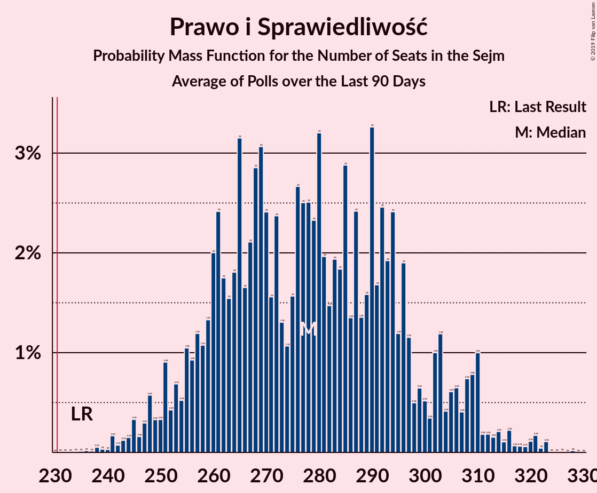

# Prawo i Sprawiedliwość

<a href="#voting-intentions">Voting Intentions</a> | <a href="#seats">Seats</a>

## Voting Intentions

Last result: **37.6%** (General Election of 25 October 2015)

### Confidence Intervals

| Period     | Polling firm/Commissioner(s) | Median | 80% Confidence Interval | 90% Confidence Interval | 95% Confidence Interval | 99% Confidence Interval |
|:----------:|:----------------:|:-----------:|:-----------------------:|:-----------------------:|:-----------------------:|:-----------------------:|
| N/A | [Poll Average](average.html) | 45.2% | 39.1–49.8% | 38.4–50.6% | 37.8–51.2% | 36.7–52.3% |
| [5–10 July 2019](2019-07-10-SocialChanges.html) | Social Changes | 45.3% | 43.3–47.3% | 42.8–47.9% | 42.3–48.4% | 41.3–49.3% |
| [28–29 June 2019](2019-06-29-IBRiS.html) | IBRiS   RMF | 40.3% | 38.4–42.2% | 37.9–42.7% | 37.4–43.2% | 36.5–44.1% |
| [21–26 June 2019](2019-06-26-SocialChanges.html) | Social Changes | 44.0% | 42.0–46.0% | 41.5–46.5% | 41.0–47.0% | 40.0–48.0% |
| [19–20 June 2019](2019-06-20-Estymator.html) | Estymator   DoRzeczy.pl | 47.9% | 45.9–49.9% | 45.3–50.5% | 44.8–51.0% | 43.9–52.0% |
| [6–13 June 2019](2019-06-13-CBOS.html) | CBOS | 49.3% | 47.4–51.3% | 46.9–51.8% | 46.4–52.3% | 45.5–53.2% |
| [7–8 June 2019](2019-06-08-IBRiS.html) | IBRiS   Rzeczpospolita | 40.8% | N/A | N/A | N/A | N/A |
| [31 May–5 June 2019](2019-06-05-SocialChanges.html) | Social Changes | 41.5% | N/A | N/A | N/A | N/A |
| [24–29 May 2019](2019-05-29-SocialChanges.html) | Social Changes | 40.6% | N/A | N/A | N/A | N/A |
| [16–23 May 2019](2019-05-23-CBOS.html) | CBOS | 46.0% | N/A | N/A | N/A | N/A |
| [10–15 May 2019](2019-05-15-SocialChanges.html) | Social Changes | 35.9% | N/A | N/A | N/A | N/A |
| [10–15 May 2019](2019-05-15-KantarMillwardBrown.html) | Kantar Millward Brown   Gazeta Wyborcza | 40.0% | 38.0–42.1% | 37.5–42.6% | 37.0–43.1% | 36.0–44.1% |
| [1–4 May 2019](2019-05-04-PracowniaAnalizSpołeczno-Politycznych.html) | Pracownia Analiz Społeczno-Politycznych   Gazeta Bałtycka | 36.0% | N/A | N/A | N/A | N/A |
| [26–30 April 2019](2019-04-30-SocialChanges.html) | Social Changes | 35.1% | N/A | N/A | N/A | N/A |
| [26–29 April 2019](2019-04-29-InstytutBadańPollster.html) | Instytut Badań Pollster   Super Express | 39.0% | N/A | N/A | N/A | N/A |
| [19–24 April 2019](2019-04-24-SocialChanges.html) | Social Changes | 38.6% | N/A | N/A | N/A | N/A |
| [12–17 April 2019](2019-04-17-SocialChanges.html) | Social Changes | 37.0% | N/A | N/A | N/A | N/A |
| [25–27 March 2019](2019-03-27-InstytutBadańSprawNarodowościowych.html) | Instytut Badań Spraw Narodowościowych   Radio ZET | 37.7% | N/A | N/A | N/A | N/A |
| [20–22 March 2019](2019-03-22-CBMIndicator.html) | CBM Indicator   TVP1 | 40.9% | N/A | N/A | N/A | N/A |
| [20–21 March 2019](2019-03-21-Estymator.html) | Estymator   DoRzeczy.pl | 42.6% | N/A | N/A | N/A | N/A |
| [7–14 March 2019](2019-03-14-CBOS.html) | CBOS | 44.0% | N/A | N/A | N/A | N/A |
| [8–13 March 2019](2019-03-13-KantarPublic.html) | Kantar Public | 38.0% | N/A | N/A | N/A | N/A |
| [9–10 March 2019](2019-03-10-IBRiS.html) | IBRiS   Rzeczpospolita | 40.0% | N/A | N/A | N/A | N/A |
| [27–28 February 2019](2019-02-28-IBRiS.html) | IBRiS   SWG | NaN% | N/A | N/A | N/A | N/A |
| [20–21 February 2019](2019-02-21-Estymator.html) | Estymator   DoRzeczy.pl | 41.1% | N/A | N/A | N/A | N/A |
| [14–16 February 2019](2019-02-16-IPSOS.html) | IPSOS   OKO.press | 35.1% | N/A | N/A | N/A | N/A |
| [7–14 February 2019](2019-02-14-CBOS.html) | CBOS | 40.0% | N/A | N/A | N/A | N/A |
| [8–13 February 2019](2019-02-13-KantarPublic.html) | Kantar Public | 34.0% | N/A | N/A | N/A | N/A |
| [8–11 February 2019](2019-02-11-OPBAriadna.html) | OPB Ariadna   WP | 34.9% | N/A | N/A | N/A | N/A |
| [7–8 February 2019](2019-02-08-IBRiS.html) | IBRiS   Rzeczpospolita | 37.1% | N/A | N/A | N/A | N/A |
| [5–7 February 2019](2019-02-07-Estymator.html) | Estymator   DoRzeczy.pl | 39.7% | N/A | N/A | N/A | N/A |
| [31 January–6 February 2019](2019-02-06-InstytutBadańSprawNarodowościowych.html) | Instytut Badań Spraw Narodowościowych   Radio ZET | 35.1% | N/A | N/A | N/A | N/A |
| [4–5 February 2019](2019-02-05-KantarMillwardBrown.html) | Kantar Millward Brown | 29.0% | N/A | N/A | N/A | N/A |
| [30 January 2019](2019-01-30-InstytutBadańPollster.html) | Instytut Badań Pollster   Super Express | 37.0% | N/A | N/A | N/A | N/A |
| [26–27 January 2019](2019-01-27-IBRiS.html) | IBRiS   Rzeczpospolita | 35.0% | N/A | N/A | N/A | N/A |
| [25–26 January 2019](2019-01-26-IBRiS.html) | IBRiS   Onet | 36.2% | N/A | N/A | N/A | N/A |
| [23–24 January 2019](2019-01-24-Estymator.html) | Estymator   DoRzeczy.pl | 42.4% | N/A | N/A | N/A | N/A |
| [10–17 January 2019](2019-01-17-CBOS.html) | CBOS | 39.0% | N/A | N/A | N/A | N/A |
| [11–16 January 2019](2019-01-16-KantarPublic.html) | Kantar Public | 34.0% | N/A | N/A | N/A | N/A |
| [15–16 January 2019](2019-01-16-KantarMillwardBrown.html) | Kantar Millward Brown   Gazeta Wyborcza | 27.8% | N/A | N/A | N/A | N/A |
| [10–11 January 2019](2019-01-11-InstytutBadańPollster.html) | Instytut Badań Pollster   Super Express | 40.0% | N/A | N/A | N/A | N/A |
| [4 January 2019](2019-01-04-IBRiS.html) | IBRiS   Rzeczpospolita | 39.1% | N/A | N/A | N/A | N/A |
| [13–14 December 2018](2018-12-14-InstytutBadańPollster.html) | Instytut Badań Pollster   Super Express | 42.0% | N/A | N/A | N/A | N/A |
| [12–13 December 2018](2018-12-13-Estymator.html) | Estymator   DoRzeczy.pl | 41.9% | N/A | N/A | N/A | N/A |
| [30 November–11 December 2018](2018-12-11-KantarPublic.html) | Kantar Public | 34.0% | N/A | N/A | N/A | N/A |
| [29 November–9 December 2018](2018-12-09-CBOS.html) | CBOS | 41.0% | N/A | N/A | N/A | N/A |
| [7–8 December 2018](2018-12-08-IBRiS.html) | IBRiS   Rzeczpospolita | 37.2% | N/A | N/A | N/A | N/A |
| [23–24 November 2018](2018-11-24-IBRiS.html) | IBRiS   Onet | 38.2% | N/A | N/A | N/A | N/A |
| [20–21 November 2018](2018-11-21-Estymator.html) | Estymator   DoRzeczy.pl | 40.7% | N/A | N/A | N/A | N/A |
| [19–20 November 2018](2018-11-20-KantarMillwardBrown.html) | Kantar Millward Brown   TVN and TVN24 | 33.0% | N/A | N/A | N/A | N/A |
| [9–15 November 2018](2018-11-15-KantarPublic.html) | Kantar Public | 34.0% | N/A | N/A | N/A | N/A |
| [8–15 November 2018](2018-11-15-CBOS.html) | CBOS | 42.0% | N/A | N/A | N/A | N/A |
| [13 November 2018](2018-11-13-IBRiS.html) | IBRiS   Rzeczpospolita | 40.1% | N/A | N/A | N/A | N/A |
| [8–9 November 2018](2018-11-09-IBRiS.html) | IBRiS   Rzeczpospolita | 37.3% | N/A | N/A | N/A | N/A |
| [29–30 October 2018](2018-10-30-Estymator.html) | Estymator   DoRzeczy.pl | 42.4% | N/A | N/A | N/A | N/A |
| [26–27 October 2018](2018-10-27-IBRiS.html) | IBRiS | 40.9% | N/A | N/A | N/A | N/A |
| [12–17 October 2018](2018-10-17-KantarPublic.html) | Kantar Public | 31.0% | N/A | N/A | N/A | N/A |
| [4–11 October 2018](2018-10-11-CBOS.html) | CBOS | 40.0% | N/A | N/A | N/A | N/A |
| [5–6 October 2018](2018-10-06-IBRiS.html) | IBRiS   Rzeczpospolita | 37.2% | N/A | N/A | N/A | N/A |
| [1 October 2018](2018-10-01-InstytutBadańPollster.html) | Instytut Badań Pollster   Super Express | 41.0% | N/A | N/A | N/A | N/A |
| [22–23 September 2018](2018-09-23-IBRiS.html) | IBRiS   Onet | 33.2% | N/A | N/A | N/A | N/A |
| [20–21 September 2018](2018-09-21-Estymator.html) | Estymator   DoRzeczy.pl | 45.0% | N/A | N/A | N/A | N/A |
| [14–17 September 2018](2018-09-17-KantarMillwardBrown.html) | Kantar Millward Brown   TVN and TVN24 | 38.0% | N/A | N/A | N/A | N/A |
| [6–13 September 2018](2018-09-13-CBOS.html) | CBOS | 43.0% | N/A | N/A | N/A | N/A |
| [7–12 September 2018](2018-09-12-KantarPublic.html) | Kantar Public | 42.0% | N/A | N/A | N/A | N/A |
| [25 August–1 September 2018](2018-09-01-IBRiS.html) | IBRiS   Rzeczpospolita | 36.6% | N/A | N/A | N/A | N/A |
| [22–23 August 2018](2018-08-23-Estymator.html) | Estymator   DoRzeczy.pl | 44.2% | N/A | N/A | N/A | N/A |
| [16–23 August 2018](2018-08-23-CBOS.html) | CBOS | 44.0% | N/A | N/A | N/A | N/A |
| [17–19 August 2018](2018-08-19-IPSOS.html) | IPSOS   OKO.press | 41.0% | N/A | N/A | N/A | N/A |
| [11 August 2018](2018-08-11-KantarPublic.html) | Kantar Public   Gazeta Prawna | 36.0% | N/A | N/A | N/A | N/A |
| [11 August 2018](2018-08-11-IBRiS.html) | IBRiS   Rzeczpospolita | 38.3% | N/A | N/A | N/A | N/A |
| [9–10 August 2018](2018-08-10-InstytutBadańPollster.html) | Instytut Badań Pollster   Super Express | 37.9% | N/A | N/A | N/A | N/A |
| [8–10 August 2018](2018-08-10-CBMIndicator.html) | CBM Indicator   TVP1 | 42.0% | N/A | N/A | N/A | N/A |
| [8–9 August 2018](2018-08-09-Estymator.html) | Estymator   DoRzeczy.pl | 41.8% | N/A | N/A | N/A | N/A |
| [27 July 2018](2018-07-27-IBRiS.html) | IBRiS | 33.9% | N/A | N/A | N/A | N/A |
| [11–12 July 2018](2018-07-12-InstytutBadańPollster.html) | Instytut Badań Pollster   Super Express | 39.9% | N/A | N/A | N/A | N/A |
| [6–11 July 2018](2018-07-11-KantarPublic.html) | Kantar Public | 34.0% | N/A | N/A | N/A | N/A |
| [8–9 July 2018](2018-07-09-IBRiS.html) | IBRiS   Rzeczpospolita | 37.4% | N/A | N/A | N/A | N/A |
| [4–5 July 2018](2018-07-05-InstytutBadańPollster.html) | Instytut Badań Pollster   TVP1 | 42.0% | N/A | N/A | N/A | N/A |
| [28 June–5 July 2018](2018-07-05-CBOS.html) | CBOS | 39.9% | N/A | N/A | N/A | N/A |
| [27–28 June 2018](2018-06-28-Estymator.html) | Estymator   DoRzeczy.pl | 42.3% | N/A | N/A | N/A | N/A |
| [21–22 June 2018](2018-06-22-IBRiS.html) | IBRiS   Onet | 37.8% | N/A | N/A | N/A | N/A |
| [18 June 2018](2018-06-18-InstytutBadańPollster.html) | Instytut Badań Pollster   Super Express | 40.9% | N/A | N/A | N/A | N/A |
| [9–17 June 2018](2018-06-17-KantarPublic.html) | Kantar Public | 41.0% | N/A | N/A | N/A | N/A |
| [13–14 June 2018](2018-06-14-Estymator.html) | Estymator   DoRzeczy.pl | 40.7% | N/A | N/A | N/A | N/A |
| [7–14 June 2018](2018-06-14-CBOS.html) | CBOS | 43.0% | N/A | N/A | N/A | N/A |
| [7–8 June 2018](2018-06-08-IBRiS.html) | IBRiS   Rzeczpospolita | 32.7% | N/A | N/A | N/A | N/A |
| [6–7 June 2018](2018-06-07-InstytutBadańPollster.html) | Instytut Badań Pollster   TVP1 | 39.9% | N/A | N/A | N/A | N/A |
| [28–29 May 2018](2018-05-29-KantarMillwardBrown.html) | Kantar Millward Brown   TVN and TVN24 | 36.0% | N/A | N/A | N/A | N/A |
| [24–25 May 2018](2018-05-25-IBRiS.html) | IBRiS   Onet | 33.3% | N/A | N/A | N/A | N/A |
| [23–24 May 2018](2018-05-24-Estymator.html) | Estymator   DoRzeczy.pl | 38.9% | N/A | N/A | N/A | N/A |
| [10–17 May 2018](2018-05-17-CBOS.html) | CBOS | 40.0% | N/A | N/A | N/A | N/A |
| [11–16 May 2018](2018-05-16-KantarPublic.html) | Kantar Public | 36.0% | N/A | N/A | N/A | N/A |
| [14 May 2018](2018-05-14-Estymator.html) | Estymator   DoRzeczy.pl | 40.8% | N/A | N/A | N/A | N/A |
| [10–11 May 2018](2018-05-11-InstytutBadańPollster.html) | Instytut Badań Pollster   TVP1 | 42.9% | N/A | N/A | N/A | N/A |
| [10–11 May 2018](2018-05-11-IBRiS.html) | IBRiS   Rzeczpospolita | 37.6% | N/A | N/A | N/A | N/A |
| [27–29 April 2018](2018-04-29-InstytutBadańPollster.html) | Instytut Badań Pollster   Nowa TV, se.pl and Super Express | 41.9% | N/A | N/A | N/A | N/A |
| [25–27 April 2018](2018-04-27-InstytutBadańPollster.html) | Instytut Badań Pollster   Nowa TV, se.pl and Super Express | 41.9% | N/A | N/A | N/A | N/A |
| [25–26 April 2018](2018-04-26-KantarMillwardBrown.html) | Kantar Millward Brown   TVN and TVN24 | 33.0% | N/A | N/A | N/A | N/A |
| [25–26 April 2018](2018-04-26-Estymator.html) | Estymator   DoRzeczy.pl | 38.2% | N/A | N/A | N/A | N/A |
| [19 April 2018](2018-04-19-IBRiS.html) | IBRiS   Onet | 34.5% | N/A | N/A | N/A | N/A |
| [12–13 April 2018](2018-04-13-IPSOS.html) | IPSOS   OKO.press | 39.0% | N/A | N/A | N/A | N/A |
| [5–12 April 2018](2018-04-12-CBOS.html) | CBOS | 46.0% | N/A | N/A | N/A | N/A |
| [9–10 April 2018](2018-04-10-KantarPublic.html) | Kantar Public | 36.0% | N/A | N/A | N/A | N/A |
| [6–7 April 2018](2018-04-07-InstytutBadańPollster.html) | Instytut Badań Pollster   TVP1 | 40.9% | N/A | N/A | N/A | N/A |
| [4–5 April 2018](2018-04-05-InstytutBadańPollster.html) | Instytut Badań Pollster   Nowa TV, se.pl and Super Express | 39.9% | N/A | N/A | N/A | N/A |
| [4–5 April 2018](2018-04-05-Estymator.html) | Estymator   DoRzeczy.pl | 39.4% | N/A | N/A | N/A | N/A |
| [4 April 2018](2018-04-04-IBRiS.html) | IBRiS   Rzeczpospolita | 31.8% | N/A | N/A | N/A | N/A |
| [29–30 March 2018](2018-03-30-InstytutBadańPollster.html) | Instytut Badań Pollster   TVP1 | 38.9% | N/A | N/A | N/A | N/A |
| [26–27 March 2018](2018-03-27-KantarMillwardBrown.html) | Kantar Millward Brown   TVN and TVN24 | 28.0% | N/A | N/A | N/A | N/A |
| [21–22 March 2018](2018-03-22-Estymator.html) | Estymator   DoRzeczy.pl | 46.7% | N/A | N/A | N/A | N/A |
| [17 March 2018](2018-03-17-IBRiS.html) | IBRiS   Onet | 37.1% | N/A | N/A | N/A | N/A |
| [9–14 March 2018](2018-03-14-KantarPublic.html) | Kantar Public | 37.8% | N/A | N/A | N/A | N/A |
| [1–8 March 2018](2018-03-08-CBOS.html) | CBOS | 44.0% | N/A | N/A | N/A | N/A |
| [1–2 March 2018](2018-03-02-IBRiS.html) | IBRiS   Rzeczpospolita | 39.4% | N/A | N/A | N/A | N/A |
| [26 February 2018](2018-02-26-IBRiS.html) | IBRiS | 40.5% | N/A | N/A | N/A | N/A |
| [22 February 2018](2018-02-22-InstytutBadańPollster.html) | Instytut Badań Pollster   Nowa TV, se.pl and Super Express | 46.9% | N/A | N/A | N/A | N/A |
| [21–22 February 2018](2018-02-22-Estymator.html) | Estymator   DoRzeczy.pl | 50.2% | N/A | N/A | N/A | N/A |
| [16–21 February 2018](2018-02-21-KantarPublic.html) | Kantar Public | 37.0% | N/A | N/A | N/A | N/A |
| [19–20 February 2018](2018-02-20-KantarMillwardBrown.html) | Kantar Millward Brown   TVN and TVN24 | 40.0% | N/A | N/A | N/A | N/A |
| [20 February 2018](2018-02-20-IBRiS.html) | IBRiS   Onet | 39.7% | N/A | N/A | N/A | N/A |
| [1–8 February 2018](2018-02-08-CBOS.html) | CBOS | 43.9% | N/A | N/A | N/A | N/A |
| [5 February 2018](2018-02-05-IBRiS.html) | IBRiS   Rzeczpospolita | 42.9% | N/A | N/A | N/A | N/A |

### Probability Mass Function

The following table shows the probability mass function per percentage block of voting intentions for the [poll average](average.html) for Prawo i Sprawiedliwość.

| Voting Intentions | Probability | Accumulated | Special Marks |
|:-----------------:|:-----------:|:-----------:|:-------------:|
| 34.5–35.5% | 0% | 100% |  |
| 35.5–36.5% | 0.3% | 100% |  |
| 36.5–37.5% | 1.4% | 99.6% |  |
| 37.5–38.5% | 4% | 98% | Last Result |
| 38.5–39.5% | 8% | 94% |  |
| 39.5–40.5% | 10% | 86% |  |
| 40.5–41.5% | 9% | 76% |  |
| 41.5–42.5% | 6% | 67% |  |
| 42.5–43.5% | 4% | 62% |  |
| 43.5–44.5% | 4% | 58% |  |
| 44.5–45.5% | 6% | 53% | Median |
| 45.5–46.5% | 8% | 47% |  |
| 46.5–47.5% | 9% | 40% |  |
| 47.5–48.5% | 10% | 31% |  |
| 48.5–49.5% | 9% | 21% |  |
| 49.5–50.5% | 7% | 12% |  |
| 50.5–51.5% | 3% | 5% |  |
| 51.5–52.5% | 1.2% | 2% |  |
| 52.5–53.5% | 0.3% | 0.3% |  |
| 53.5–54.5% | 0% | 0.1% |  |
| 54.5–55.5% | 0% | 0% |  |

## Seats

Last result: **235** seats (General Election of 25 October 2015)

### Confidence Intervals

| Period     | Polling firm/Commissioner(s) | Median | 80% Confidence Interval | 90% Confidence Interval | 95% Confidence Interval | 99% Confidence Interval |
|:----------:|:----------------:|:------:|:-----------------------:|:-----------------------:|:-----------------------:|:-----------------------:|
| N/A | [Poll Average](average.html) | 282 | 259–300 | 254–306 | 250–311 | 243–317 |
| [5–10 July 2019](2019-07-10-SocialChanges.html) | Social Changes | 264 | 251–278 | 248–281 | 245–284 | 238–291 |
| [28–29 June 2019](2019-06-29-IBRiS.html) | IBRiS   RMF | 274 | 260–288 | 256–294 | 254–299 | 247–314 |
| [21–26 June 2019](2019-06-26-SocialChanges.html) | Social Changes | 281 | 262–289 | 259–292 | 255–294 | 248–300 |
| [19–20 June 2019](2019-06-20-Estymator.html) | Estymator   DoRzeczy.pl | 293 | 283–310 | 280–312 | 275–316 | 269–320 |
| [6–13 June 2019](2019-06-13-CBOS.html) | CBOS | 291 | 283–300 | 280–304 | 277–311 | 269–314 |
| [7–8 June 2019](2019-06-08-IBRiS.html) | IBRiS   Rzeczpospolita |  |  |  |  |  |
| [31 May–5 June 2019](2019-06-05-SocialChanges.html) | Social Changes |  |  |  |  |  |
| [24–29 May 2019](2019-05-29-SocialChanges.html) | Social Changes |  |  |  |  |  |
| [16–23 May 2019](2019-05-23-CBOS.html) | CBOS |  |  |  |  |  |
| [10–15 May 2019](2019-05-15-SocialChanges.html) | Social Changes |  |  |  |  |  |
| [10–15 May 2019](2019-05-15-KantarMillwardBrown.html) | Kantar Millward Brown   Gazeta Wyborcza | 276 | 255–292 | 252–294 | 247–303 | 243–317 |
| [1–4 May 2019](2019-05-04-PracowniaAnalizSpołeczno-Politycznych.html) | Pracownia Analiz Społeczno-Politycznych   Gazeta Bałtycka |  |  |  |  |  |
| [26–30 April 2019](2019-04-30-SocialChanges.html) | Social Changes |  |  |  |  |  |
| [26–29 April 2019](2019-04-29-InstytutBadańPollster.html) | Instytut Badań Pollster   Super Express |  |  |  |  |  |
| [19–24 April 2019](2019-04-24-SocialChanges.html) | Social Changes |  |  |  |  |  |
| [12–17 April 2019](2019-04-17-SocialChanges.html) | Social Changes |  |  |  |  |  |
| [25–27 March 2019](2019-03-27-InstytutBadańSprawNarodowościowych.html) | Instytut Badań Spraw Narodowościowych   Radio ZET |  |  |  |  |  |
| [20–22 March 2019](2019-03-22-CBMIndicator.html) | CBM Indicator   TVP1 |  |  |  |  |  |
| [20–21 March 2019](2019-03-21-Estymator.html) | Estymator   DoRzeczy.pl |  |  |  |  |  |
| [7–14 March 2019](2019-03-14-CBOS.html) | CBOS |  |  |  |  |  |
| [8–13 March 2019](2019-03-13-KantarPublic.html) | Kantar Public |  |  |  |  |  |
| [9–10 March 2019](2019-03-10-IBRiS.html) | IBRiS   Rzeczpospolita |  |  |  |  |  |
| [27–28 February 2019](2019-02-28-IBRiS.html) | IBRiS   SWG |  |  |  |  |  |
| [20–21 February 2019](2019-02-21-Estymator.html) | Estymator   DoRzeczy.pl |  |  |  |  |  |
| [14–16 February 2019](2019-02-16-IPSOS.html) | IPSOS   OKO.press |  |  |  |  |  |
| [7–14 February 2019](2019-02-14-CBOS.html) | CBOS |  |  |  |  |  |
| [8–13 February 2019](2019-02-13-KantarPublic.html) | Kantar Public |  |  |  |  |  |
| [8–11 February 2019](2019-02-11-OPBAriadna.html) | OPB Ariadna   WP |  |  |  |  |  |
| [7–8 February 2019](2019-02-08-IBRiS.html) | IBRiS   Rzeczpospolita |  |  |  |  |  |
| [5–7 February 2019](2019-02-07-Estymator.html) | Estymator   DoRzeczy.pl |  |  |  |  |  |
| [31 January–6 February 2019](2019-02-06-InstytutBadańSprawNarodowościowych.html) | Instytut Badań Spraw Narodowościowych   Radio ZET |  |  |  |  |  |
| [4–5 February 2019](2019-02-05-KantarMillwardBrown.html) | Kantar Millward Brown |  |  |  |  |  |
| [30 January 2019](2019-01-30-InstytutBadańPollster.html) | Instytut Badań Pollster   Super Express |  |  |  |  |  |
| [26–27 January 2019](2019-01-27-IBRiS.html) | IBRiS   Rzeczpospolita |  |  |  |  |  |
| [25–26 January 2019](2019-01-26-IBRiS.html) | IBRiS   Onet |  |  |  |  |  |
| [23–24 January 2019](2019-01-24-Estymator.html) | Estymator   DoRzeczy.pl |  |  |  |  |  |
| [10–17 January 2019](2019-01-17-CBOS.html) | CBOS |  |  |  |  |  |
| [11–16 January 2019](2019-01-16-KantarPublic.html) | Kantar Public |  |  |  |  |  |
| [15–16 January 2019](2019-01-16-KantarMillwardBrown.html) | Kantar Millward Brown   Gazeta Wyborcza |  |  |  |  |  |
| [10–11 January 2019](2019-01-11-InstytutBadańPollster.html) | Instytut Badań Pollster   Super Express |  |  |  |  |  |
| [4 January 2019](2019-01-04-IBRiS.html) | IBRiS   Rzeczpospolita |  |  |  |  |  |
| [13–14 December 2018](2018-12-14-InstytutBadańPollster.html) | Instytut Badań Pollster   Super Express |  |  |  |  |  |
| [12–13 December 2018](2018-12-13-Estymator.html) | Estymator   DoRzeczy.pl |  |  |  |  |  |
| [30 November–11 December 2018](2018-12-11-KantarPublic.html) | Kantar Public |  |  |  |  |  |
| [29 November–9 December 2018](2018-12-09-CBOS.html) | CBOS |  |  |  |  |  |
| [7–8 December 2018](2018-12-08-IBRiS.html) | IBRiS   Rzeczpospolita |  |  |  |  |  |
| [23–24 November 2018](2018-11-24-IBRiS.html) | IBRiS   Onet |  |  |  |  |  |
| [20–21 November 2018](2018-11-21-Estymator.html) | Estymator   DoRzeczy.pl |  |  |  |  |  |
| [19–20 November 2018](2018-11-20-KantarMillwardBrown.html) | Kantar Millward Brown   TVN and TVN24 |  |  |  |  |  |
| [9–15 November 2018](2018-11-15-KantarPublic.html) | Kantar Public |  |  |  |  |  |
| [8–15 November 2018](2018-11-15-CBOS.html) | CBOS |  |  |  |  |  |
| [13 November 2018](2018-11-13-IBRiS.html) | IBRiS   Rzeczpospolita |  |  |  |  |  |
| [8–9 November 2018](2018-11-09-IBRiS.html) | IBRiS   Rzeczpospolita |  |  |  |  |  |
| [29–30 October 2018](2018-10-30-Estymator.html) | Estymator   DoRzeczy.pl |  |  |  |  |  |
| [26–27 October 2018](2018-10-27-IBRiS.html) | IBRiS |  |  |  |  |  |
| [12–17 October 2018](2018-10-17-KantarPublic.html) | Kantar Public |  |  |  |  |  |
| [4–11 October 2018](2018-10-11-CBOS.html) | CBOS |  |  |  |  |  |
| [5–6 October 2018](2018-10-06-IBRiS.html) | IBRiS   Rzeczpospolita |  |  |  |  |  |
| [1 October 2018](2018-10-01-InstytutBadańPollster.html) | Instytut Badań Pollster   Super Express |  |  |  |  |  |
| [22–23 September 2018](2018-09-23-IBRiS.html) | IBRiS   Onet |  |  |  |  |  |
| [20–21 September 2018](2018-09-21-Estymator.html) | Estymator   DoRzeczy.pl |  |  |  |  |  |
| [14–17 September 2018](2018-09-17-KantarMillwardBrown.html) | Kantar Millward Brown   TVN and TVN24 |  |  |  |  |  |
| [6–13 September 2018](2018-09-13-CBOS.html) | CBOS |  |  |  |  |  |
| [7–12 September 2018](2018-09-12-KantarPublic.html) | Kantar Public |  |  |  |  |  |
| [25 August–1 September 2018](2018-09-01-IBRiS.html) | IBRiS   Rzeczpospolita |  |  |  |  |  |
| [22–23 August 2018](2018-08-23-Estymator.html) | Estymator   DoRzeczy.pl |  |  |  |  |  |
| [16–23 August 2018](2018-08-23-CBOS.html) | CBOS |  |  |  |  |  |
| [17–19 August 2018](2018-08-19-IPSOS.html) | IPSOS   OKO.press |  |  |  |  |  |
| [11 August 2018](2018-08-11-KantarPublic.html) | Kantar Public   Gazeta Prawna |  |  |  |  |  |
| [11 August 2018](2018-08-11-IBRiS.html) | IBRiS   Rzeczpospolita |  |  |  |  |  |
| [9–10 August 2018](2018-08-10-InstytutBadańPollster.html) | Instytut Badań Pollster   Super Express |  |  |  |  |  |
| [8–10 August 2018](2018-08-10-CBMIndicator.html) | CBM Indicator   TVP1 |  |  |  |  |  |
| [8–9 August 2018](2018-08-09-Estymator.html) | Estymator   DoRzeczy.pl |  |  |  |  |  |
| [27 July 2018](2018-07-27-IBRiS.html) | IBRiS |  |  |  |  |  |
| [11–12 July 2018](2018-07-12-InstytutBadańPollster.html) | Instytut Badań Pollster   Super Express |  |  |  |  |  |
| [6–11 July 2018](2018-07-11-KantarPublic.html) | Kantar Public |  |  |  |  |  |
| [8–9 July 2018](2018-07-09-IBRiS.html) | IBRiS   Rzeczpospolita |  |  |  |  |  |
| [4–5 July 2018](2018-07-05-InstytutBadańPollster.html) | Instytut Badań Pollster   TVP1 |  |  |  |  |  |
| [28 June–5 July 2018](2018-07-05-CBOS.html) | CBOS |  |  |  |  |  |
| [27–28 June 2018](2018-06-28-Estymator.html) | Estymator   DoRzeczy.pl |  |  |  |  |  |
| [21–22 June 2018](2018-06-22-IBRiS.html) | IBRiS   Onet |  |  |  |  |  |
| [18 June 2018](2018-06-18-InstytutBadańPollster.html) | Instytut Badań Pollster   Super Express |  |  |  |  |  |
| [9–17 June 2018](2018-06-17-KantarPublic.html) | Kantar Public |  |  |  |  |  |
| [13–14 June 2018](2018-06-14-Estymator.html) | Estymator   DoRzeczy.pl |  |  |  |  |  |
| [7–14 June 2018](2018-06-14-CBOS.html) | CBOS |  |  |  |  |  |
| [7–8 June 2018](2018-06-08-IBRiS.html) | IBRiS   Rzeczpospolita |  |  |  |  |  |
| [6–7 June 2018](2018-06-07-InstytutBadańPollster.html) | Instytut Badań Pollster   TVP1 |  |  |  |  |  |
| [28–29 May 2018](2018-05-29-KantarMillwardBrown.html) | Kantar Millward Brown   TVN and TVN24 |  |  |  |  |  |
| [24–25 May 2018](2018-05-25-IBRiS.html) | IBRiS   Onet |  |  |  |  |  |
| [23–24 May 2018](2018-05-24-Estymator.html) | Estymator   DoRzeczy.pl |  |  |  |  |  |
| [10–17 May 2018](2018-05-17-CBOS.html) | CBOS |  |  |  |  |  |
| [11–16 May 2018](2018-05-16-KantarPublic.html) | Kantar Public |  |  |  |  |  |
| [14 May 2018](2018-05-14-Estymator.html) | Estymator   DoRzeczy.pl |  |  |  |  |  |
| [10–11 May 2018](2018-05-11-InstytutBadańPollster.html) | Instytut Badań Pollster   TVP1 |  |  |  |  |  |
| [10–11 May 2018](2018-05-11-IBRiS.html) | IBRiS   Rzeczpospolita |  |  |  |  |  |
| [27–29 April 2018](2018-04-29-InstytutBadańPollster.html) | Instytut Badań Pollster   Nowa TV, se.pl and Super Express |  |  |  |  |  |
| [25–27 April 2018](2018-04-27-InstytutBadańPollster.html) | Instytut Badań Pollster   Nowa TV, se.pl and Super Express |  |  |  |  |  |
| [25–26 April 2018](2018-04-26-KantarMillwardBrown.html) | Kantar Millward Brown   TVN and TVN24 |  |  |  |  |  |
| [25–26 April 2018](2018-04-26-Estymator.html) | Estymator   DoRzeczy.pl |  |  |  |  |  |
| [19 April 2018](2018-04-19-IBRiS.html) | IBRiS   Onet |  |  |  |  |  |
| [12–13 April 2018](2018-04-13-IPSOS.html) | IPSOS   OKO.press |  |  |  |  |  |
| [5–12 April 2018](2018-04-12-CBOS.html) | CBOS |  |  |  |  |  |
| [9–10 April 2018](2018-04-10-KantarPublic.html) | Kantar Public |  |  |  |  |  |
| [6–7 April 2018](2018-04-07-InstytutBadańPollster.html) | Instytut Badań Pollster   TVP1 |  |  |  |  |  |
| [4–5 April 2018](2018-04-05-InstytutBadańPollster.html) | Instytut Badań Pollster   Nowa TV, se.pl and Super Express |  |  |  |  |  |
| [4–5 April 2018](2018-04-05-Estymator.html) | Estymator   DoRzeczy.pl |  |  |  |  |  |
| [4 April 2018](2018-04-04-IBRiS.html) | IBRiS   Rzeczpospolita |  |  |  |  |  |
| [29–30 March 2018](2018-03-30-InstytutBadańPollster.html) | Instytut Badań Pollster   TVP1 |  |  |  |  |  |
| [26–27 March 2018](2018-03-27-KantarMillwardBrown.html) | Kantar Millward Brown   TVN and TVN24 |  |  |  |  |  |
| [21–22 March 2018](2018-03-22-Estymator.html) | Estymator   DoRzeczy.pl |  |  |  |  |  |
| [17 March 2018](2018-03-17-IBRiS.html) | IBRiS   Onet |  |  |  |  |  |
| [9–14 March 2018](2018-03-14-KantarPublic.html) | Kantar Public |  |  |  |  |  |
| [1–8 March 2018](2018-03-08-CBOS.html) | CBOS |  |  |  |  |  |
| [1–2 March 2018](2018-03-02-IBRiS.html) | IBRiS   Rzeczpospolita |  |  |  |  |  |
| [26 February 2018](2018-02-26-IBRiS.html) | IBRiS |  |  |  |  |  |
| [22 February 2018](2018-02-22-InstytutBadańPollster.html) | Instytut Badań Pollster   Nowa TV, se.pl and Super Express |  |  |  |  |  |
| [21–22 February 2018](2018-02-22-Estymator.html) | Estymator   DoRzeczy.pl |  |  |  |  |  |
| [16–21 February 2018](2018-02-21-KantarPublic.html) | Kantar Public |  |  |  |  |  |
| [19–20 February 2018](2018-02-20-KantarMillwardBrown.html) | Kantar Millward Brown   TVN and TVN24 |  |  |  |  |  |
| [20 February 2018](2018-02-20-IBRiS.html) | IBRiS   Onet |  |  |  |  |  |
| [1–8 February 2018](2018-02-08-CBOS.html) | CBOS |  |  |  |  |  |
| [5 February 2018](2018-02-05-IBRiS.html) | IBRiS   Rzeczpospolita |  |  |  |  |  |

### Probability Mass Function

The following table shows the probability mass function per seat for the [poll average](average.html) for Prawo i Sprawiedliwość.

| Number of Seats | Probability | Accumulated | Special Marks |
|:---------------:|:-----------:|:-----------:|:-------------:|
| 235 | 0% | 100% | Last Result |
| 236 | 0% | 99.9% |  |
| 237 | 0% | 99.9% |  |
| 238 | 0% | 99.9% |  |
| 239 | 0% | 99.9% |  |
| 240 | 0.1% | 99.8% |  |
| 241 | 0.1% | 99.7% |  |
| 242 | 0.1% | 99.7% |  |
| 243 | 0.3% | 99.6% |  |
| 244 | 0.2% | 99.3% |  |
| 245 | 0.2% | 99.1% |  |
| 246 | 0.2% | 99.0% |  |
| 247 | 0.4% | 98.8% |  |
| 248 | 0.3% | 98% |  |
| 249 | 0.4% | 98% |  |
| 250 | 0.7% | 98% |  |
| 251 | 0.5% | 97% |  |
| 252 | 0.5% | 97% |  |
| 253 | 0.6% | 96% |  |
| 254 | 1.0% | 95% |  |
| 255 | 1.2% | 94% |  |
| 256 | 1.2% | 93% |  |
| 257 | 1.0% | 92% |  |
| 258 | 0.7% | 91% |  |
| 259 | 1.3% | 90% |  |
| 260 | 1.0% | 89% |  |
| 261 | 4% | 88% |  |
| 262 | 2% | 84% |  |
| 263 | 1.2% | 83% |  |
| 264 | 2% | 82% |  |
| 265 | 2% | 80% |  |
| 266 | 2% | 78% |  |
| 267 | 2% | 76% |  |
| 268 | 2% | 73% |  |
| 269 | 1.3% | 72% |  |
| 270 | 2% | 70% |  |
| 271 | 2% | 68% |  |
| 272 | 0.7% | 67% |  |
| 273 | 2% | 66% |  |
| 274 | 1.3% | 64% |  |
| 275 | 2% | 63% |  |
| 276 | 1.3% | 61% |  |
| 277 | 0.9% | 60% |  |
| 278 | 1.2% | 59% |  |
| 279 | 1.4% | 58% |  |
| 280 | 4% | 56% |  |
| 281 | 2% | 52% |  |
| 282 | 2% | 50% | Median |
| 283 | 2% | 48% |  |
| 284 | 3% | 46% |  |
| 285 | 2% | 43% |  |
| 286 | 3% | 41% |  |
| 287 | 2% | 39% |  |
| 288 | 4% | 36% |  |
| 289 | 1.5% | 32% |  |
| 290 | 2% | 31% |  |
| 291 | 2% | 29% |  |
| 292 | 5% | 26% |  |
| 293 | 5% | 21% |  |
| 294 | 2% | 16% |  |
| 295 | 0.9% | 14% |  |
| 296 | 0.8% | 13% |  |
| 297 | 0.5% | 13% |  |
| 298 | 0.5% | 12% |  |
| 299 | 1.0% | 12% |  |
| 300 | 0.7% | 11% |  |
| 301 | 2% | 10% |  |
| 302 | 1.1% | 8% |  |
| 303 | 0.2% | 7% |  |
| 304 | 0.2% | 7% |  |
| 305 | 2% | 7% |  |
| 306 | 1.3% | 5% |  |
| 307 | 0.4% | 4% |  |
| 308 | 0.2% | 4% |  |
| 309 | 0.1% | 3% |  |
| 310 | 0.6% | 3% |  |
| 311 | 0.5% | 3% |  |
| 312 | 0.6% | 2% |  |
| 313 | 0.2% | 1.5% |  |
| 314 | 0.4% | 1.3% |  |
| 315 | 0.1% | 0.9% |  |
| 316 | 0.3% | 0.8% |  |
| 317 | 0.2% | 0.5% |  |
| 318 | 0.1% | 0.3% |  |
| 319 | 0.1% | 0.3% |  |
| 320 | 0.1% | 0.2% |  |
| 321 | 0% | 0.1% |  |
| 322 | 0% | 0.1% |  |
| 323 | 0% | 0.1% |  |
| 324 | 0% | 0% |  |

