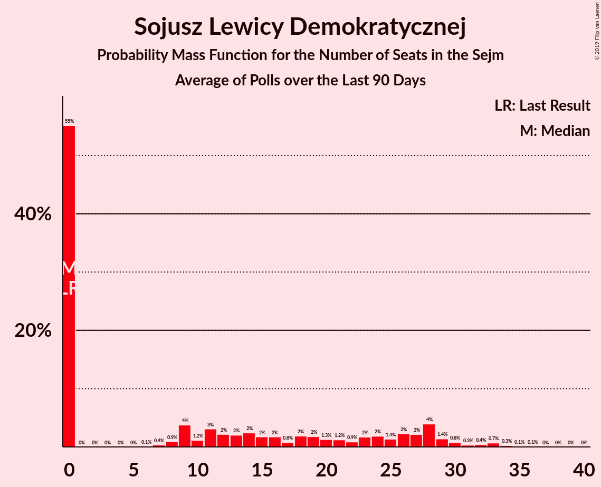

# Sojusz Lewicy Demokratycznej

<a href="#voting-intentions">Voting Intentions</a> | <a href="#seats">Seats</a>

## Voting Intentions

Last result: **7.6%** (General Election of 25 October 2015)

### Confidence Intervals

| Period     | Polling firm/Commissioner(s) | Median | 80% Confidence Interval | 90% Confidence Interval | 95% Confidence Interval | 99% Confidence Interval |
|:----------:|:----------------:|:-----------:|:-----------------------:|:-----------------------:|:-----------------------:|:-----------------------:|
| N/A | [Poll Average](average.html) | 2.8% | 1.8–3.7% | 1.6–3.9% | 1.5–4.1% | 1.2–4.5% |
| [6–8 August 2019](2019-08-08-Estymator.html) | Estymator   DoRzeczy.pl | 0.0% | N/A | N/A | N/A | N/A |
| [2–7 August 2019](2019-08-07-SocialChanges.html) | Social Changes | 0.0% | N/A | N/A | N/A | N/A |
| [6–7 August 2019](2019-08-07-InstytutBadańPollster.html) | Instytut Badań Pollster   Super Express | 0.0% | N/A | N/A | N/A | N/A |
| [26–31 July 2019](2019-07-31-SocialChanges.html) | Social Changes | 0.0% | N/A | N/A | N/A | N/A |
| [26–27 July 2019](2019-07-27-IBRiS.html) | IBRiS   RMF | 0.0% | N/A | N/A | N/A | N/A |
| [19–24 July 2019](2019-07-24-SocialChanges.html) | Social Changes | 0.0% | N/A | N/A | N/A | N/A |
| [18–19 July 2019](2019-07-19-Estymator.html) | Estymator   DoRzeczy.pl | 4.5% | 3.7–5.4% | 3.5–5.7% | 3.4–5.9% | 3.0–6.4% |
| [12–17 July 2019](2019-07-17-SocialChanges.html) | Social Changes | 5.3% | 4.5–6.3% | 4.2–6.6% | 4.1–6.8% | 3.7–7.4% |
| [12–17 July 2019](2019-07-17-KantarPublic.html) | Kantar Public   Radio ZET | 3.0% | 2.4–3.8% | 2.2–4.0% | 2.1–4.3% | 1.8–4.7% |
| [12–15 July 2019](2019-07-15-KantarMillwardBrown.html) | Kantar Millward Brown   TVN and TVN24 | 2.0% | 1.5–2.7% | 1.4–2.9% | 1.3–3.1% | 1.1–3.4% |
| [12–13 July 2019](2019-07-13-IBRiS.html) | IBRiS   Rzeczpospolita | 5.9% | 5.1–6.9% | 4.8–7.2% | 4.7–7.5% | 4.3–8.0% |
| [4–11 July 2019](2019-07-11-CBOS.html) | CBOS | 3.0% | 2.5–3.8% | 2.3–4.0% | 2.2–4.2% | 1.9–4.6% |
| [5–10 July 2019](2019-07-10-SocialChanges.html) | Social Changes | 6.0% | 5.1–7.0% | 4.9–7.3% | 4.7–7.6% | 4.3–8.1% |
| [28–29 June 2019](2019-06-29-IBRiS.html) | IBRiS   RMF | 5.4% | 4.6–6.3% | 4.4–6.6% | 4.2–6.9% | 3.8–7.4% |
| [21–26 June 2019](2019-06-26-SocialChanges.html) | Social Changes | 4.3% | 3.6–5.2% | 3.4–5.5% | 3.2–5.7% | 2.9–6.2% |
| [19–20 June 2019](2019-06-20-Estymator.html) | Estymator   DoRzeczy.pl | 4.5% | 3.7–5.4% | 3.5–5.7% | 3.4–5.9% | 3.0–6.4% |
| [6–13 June 2019](2019-06-13-CBOS.html) | CBOS | 2.2% | 1.8–2.9% | 1.6–3.1% | 1.5–3.3% | 1.3–3.7% |
| [7–8 June 2019](2019-06-08-IBRiS.html) | IBRiS   Rzeczpospolita | 6.0% | 5.2–7.0% | 4.9–7.3% | 4.7–7.6% | 4.4–8.1% |
| [31 May–5 June 2019](2019-06-05-SocialChanges.html) | Social Changes | 3.0% | 2.4–3.8% | 2.3–4.0% | 2.1–4.2% | 1.9–4.6% |
| [24–29 May 2019](2019-05-29-SocialChanges.html) | Social Changes | 4.0% | 3.4–4.9% | 3.2–5.2% | 3.0–5.4% | 2.7–5.9% |
| [16–23 May 2019](2019-05-23-CBOS.html) | CBOS | 2.0% | 1.6–2.7% | 1.4–2.9% | 1.3–3.0% | 1.2–3.4% |
| [10–15 May 2019](2019-05-15-SocialChanges.html) | Social Changes | 5.7% | 4.9–6.7% | 4.7–7.0% | 4.5–7.3% | 4.1–7.8% |
| [10–15 May 2019](2019-05-15-KantarMillwardBrown.html) | Kantar Millward Brown   Gazeta Wyborcza | 5.0% | 4.2–6.0% | 3.9–6.3% | 3.8–6.5% | 3.4–7.0% |
| [1–4 May 2019](2019-05-04-PracowniaAnalizSpołeczno-Politycznych.html) | Pracownia Analiz Społeczno-Politycznych   Gazeta Bałtycka | 7.0% | 6.1–8.1% | 5.8–8.5% | 5.6–8.7% | 5.2–9.3% |
| [26–30 April 2019](2019-04-30-SocialChanges.html) | Social Changes | 5.1% | 4.4–6.1% | 4.1–6.4% | 4.0–6.7% | 3.6–7.2% |
| [26–29 April 2019](2019-04-29-InstytutBadańPollster.html) | Instytut Badań Pollster   Super Express | 4.0% | 3.3–4.9% | 3.1–5.1% | 2.9–5.4% | 2.7–5.8% |
| [19–24 April 2019](2019-04-24-SocialChanges.html) | Social Changes | 5.0% | 4.2–5.9% | 4.0–6.2% | 3.8–6.4% | 3.5–6.9% |
| [12–17 April 2019](2019-04-17-SocialChanges.html) | Social Changes | 5.0% | 4.3–6.0% | 4.1–6.3% | 3.9–6.5% | 3.6–7.0% |
| [25–27 March 2019](2019-03-27-InstytutBadańSprawNarodowościowych.html) | Instytut Badań Spraw Narodowościowych   Radio ZET | 4.2% | 3.5–5.1% | 3.3–5.4% | 3.1–5.6% | 2.8–6.1% |
| [20–22 March 2019](2019-03-22-CBMIndicator.html) | CBM Indicator   TVP1 | 5.1% | 4.3–6.1% | 4.1–6.4% | 3.9–6.6% | 3.6–7.2% |
| [20–21 March 2019](2019-03-21-Estymator.html) | Estymator   DoRzeczy.pl | 4.8% | 4.0–5.8% | 3.8–6.0% | 3.6–6.3% | 3.3–6.8% |
| [7–14 March 2019](2019-03-14-CBOS.html) | CBOS | 3.0% | 2.4–3.8% | 2.2–4.0% | 2.1–4.2% | 1.8–4.6% |
| [8–13 March 2019](2019-03-13-KantarPublic.html) | Kantar Public | 4.0% | 3.3–4.9% | 3.1–5.2% | 2.9–5.4% | 2.6–5.9% |
| [9–10 March 2019](2019-03-10-IBRiS.html) | IBRiS   Rzeczpospolita | 7.0% | 6.1–8.1% | 5.9–8.4% | 5.6–8.7% | 5.2–9.2% |
| [20–21 February 2019](2019-02-21-Estymator.html) | Estymator   DoRzeczy.pl | 3.9% | 3.3–4.9% | 3.1–5.1% | 2.9–5.3% | 2.6–5.8% |
| [14–16 February 2019](2019-02-16-IPSOS.html) | IPSOS   OKO.press | 3.2% | 2.6–4.0% | 2.4–4.3% | 2.3–4.5% | 2.0–4.9% |
| [7–14 February 2019](2019-02-14-CBOS.html) | CBOS | 2.0% | 1.5–2.7% | 1.4–2.9% | 1.3–3.0% | 1.1–3.4% |
| [8–13 February 2019](2019-02-13-KantarPublic.html) | Kantar Public | 5.0% | 4.2–6.1% | 4.0–6.3% | 3.8–6.6% | 3.5–7.1% |
| [8–11 February 2019](2019-02-11-OPBAriadna.html) | OPB Ariadna   WP | 4.0% | 3.3–4.8% | 3.1–5.1% | 2.9–5.3% | 2.6–5.8% |
| [7–8 February 2019](2019-02-08-IBRiS.html) | IBRiS   Rzeczpospolita | 5.2% | 4.4–6.1% | 4.2–6.4% | 4.0–6.7% | 3.7–7.1% |
| [5–7 February 2019](2019-02-07-Estymator.html) | Estymator   DoRzeczy.pl | 4.6% | 3.9–5.6% | 3.7–5.9% | 3.5–6.1% | 3.2–6.6% |
| [31 January–6 February 2019](2019-02-06-InstytutBadańSprawNarodowościowych.html) | Instytut Badań Spraw Narodowościowych   Radio ZET | 4.0% | 3.3–4.9% | 3.1–5.2% | 2.9–5.4% | 2.7–5.9% |
| [4–5 February 2019](2019-02-05-KantarMillwardBrown.html) | Kantar Millward Brown | 6.0% | 5.1–7.1% | 4.9–7.4% | 4.7–7.6% | 4.3–8.2% |
| [30 January 2019](2019-01-30-InstytutBadańPollster.html) | Instytut Badań Pollster   Super Express | 4.0% | 3.3–4.9% | 3.1–5.2% | 3.0–5.4% | 2.7–5.9% |
| [26–27 January 2019](2019-01-27-IBRiS.html) | IBRiS   Rzeczpospolita | 5.7% | 4.9–6.7% | 4.7–7.0% | 4.5–7.3% | 4.1–7.8% |
| [25–26 January 2019](2019-01-26-IBRiS.html) | IBRiS   Onet | 6.1% | 5.3–7.1% | 5.0–7.4% | 4.8–7.7% | 4.5–8.2% |
| [23–24 January 2019](2019-01-24-Estymator.html) | Estymator   DoRzeczy.pl | 4.8% | 4.0–5.8% | 3.8–6.1% | 3.6–6.3% | 3.3–6.8% |
| [10–17 January 2019](2019-01-17-CBOS.html) | CBOS | 4.0% | 3.3–4.9% | 3.1–5.1% | 2.9–5.4% | 2.6–5.8% |
| [11–16 January 2019](2019-01-16-KantarPublic.html) | Kantar Public | 5.0% | 4.2–6.0% | 4.0–6.3% | 3.8–6.5% | 3.4–7.0% |
| [15–16 January 2019](2019-01-16-KantarMillwardBrown.html) | Kantar Millward Brown   Gazeta Wyborcza | 2.8% | 2.2–3.6% | 2.1–3.8% | 1.9–4.0% | 1.7–4.4% |
| [10–11 January 2019](2019-01-11-InstytutBadańPollster.html) | Instytut Badań Pollster   Super Express | 6.0% | 5.2–7.0% | 5.0–7.3% | 4.8–7.6% | 4.4–8.1% |
| [4 January 2019](2019-01-04-IBRiS.html) | IBRiS   Rzeczpospolita | 5.0% | 4.3–6.0% | 4.0–6.2% | 3.9–6.5% | 3.5–7.0% |
| [13–14 December 2018](2018-12-14-InstytutBadańPollster.html) | Instytut Badań Pollster   Super Express | 6.0% | 5.2–7.0% | 5.0–7.3% | 4.8–7.6% | 4.4–8.1% |
| [12–13 December 2018](2018-12-13-Estymator.html) | Estymator   DoRzeczy.pl | 6.3% | 5.4–7.4% | 5.2–7.7% | 5.0–8.0% | 4.6–8.5% |
| [30 November–11 December 2018](2018-12-11-KantarPublic.html) | Kantar Public | 6.0% | 5.2–7.1% | 4.9–7.4% | 4.7–7.7% | 4.3–8.2% |
| [29 November–9 December 2018](2018-12-09-CBOS.html) | CBOS | 4.0% | 3.3–5.0% | 3.1–5.2% | 3.0–5.4% | 2.7–5.9% |
| [7–8 December 2018](2018-12-08-IBRiS.html) | IBRiS   Rzeczpospolita | 6.7% | 5.8–7.8% | 5.5–8.2% | 5.3–8.4% | 4.9–9.0% |
| [23–24 November 2018](2018-11-24-IBRiS.html) | IBRiS   Onet | 8.2% | 7.2–9.3% | 6.9–9.7% | 6.7–10.0% | 6.3–10.5% |
| [20–21 November 2018](2018-11-21-Estymator.html) | Estymator   DoRzeczy.pl | 7.3% | 6.4–8.5% | 6.1–8.8% | 5.9–9.1% | 5.4–9.7% |
| [19–20 November 2018](2018-11-20-KantarMillwardBrown.html) | Kantar Millward Brown   TVN and TVN24 | 7.0% | 6.1–8.1% | 5.8–8.5% | 5.6–8.7% | 5.1–9.3% |
| [9–15 November 2018](2018-11-15-KantarPublic.html) | Kantar Public | 7.0% | 6.1–8.2% | 5.8–8.5% | 5.6–8.8% | 5.2–9.3% |
| [8–15 November 2018](2018-11-15-CBOS.html) | CBOS | 5.0% | 4.3–6.0% | 4.1–6.3% | 3.9–6.5% | 3.5–7.0% |
| [13 November 2018](2018-11-13-IBRiS.html) | IBRiS   Rzeczpospolita | 6.2% | 5.3–7.2% | 5.1–7.5% | 4.9–7.8% | 4.5–8.3% |
| [8–9 November 2018](2018-11-09-IBRiS.html) | IBRiS   Rzeczpospolita | 7.9% | 7.0–9.1% | 6.7–9.4% | 6.4–9.7% | 6.0–10.2% |
| [29–30 October 2018](2018-10-30-Estymator.html) | Estymator   DoRzeczy.pl | 7.4% | 6.4–8.5% | 6.1–8.9% | 5.9–9.2% | 5.5–9.7% |
| [26–27 October 2018](2018-10-27-IBRiS.html) | IBRiS | 7.0% | 6.1–8.2% | 5.8–8.5% | 5.6–8.8% | 5.2–9.3% |
| [12–17 October 2018](2018-10-17-KantarPublic.html) | Kantar Public | 7.0% | 6.1–8.2% | 5.9–8.5% | 5.6–8.8% | 5.2–9.3% |
| [4–11 October 2018](2018-10-11-CBOS.html) | CBOS | 4.0% | 3.4–4.9% | 3.2–5.2% | 3.0–5.4% | 2.7–5.8% |
| [5–6 October 2018](2018-10-06-IBRiS.html) | IBRiS   Rzeczpospolita | 7.0% | 6.1–8.2% | 5.8–8.5% | 5.6–8.8% | 5.2–9.3% |
| [1 October 2018](2018-10-01-InstytutBadańPollster.html) | Instytut Badań Pollster   Super Express | 7.0% | 6.1–8.1% | 5.8–8.4% | 5.6–8.7% | 5.2–9.3% |
| [22–23 September 2018](2018-09-23-IBRiS.html) | IBRiS   Onet | 8.7% | 7.7–9.9% | 7.4–10.3% | 7.2–10.5% | 6.7–11.1% |
| [20–21 September 2018](2018-09-21-Estymator.html) | Estymator   DoRzeczy.pl | 8.1% | 7.0–9.3% | 6.8–9.6% | 6.5–9.9% | 6.1–10.5% |
| [14–17 September 2018](2018-09-17-KantarMillwardBrown.html) | Kantar Millward Brown   TVN and TVN24 | 5.0% | 4.2–6.0% | 4.0–6.3% | 3.8–6.5% | 3.5–7.0% |
| [6–13 September 2018](2018-09-13-CBOS.html) | CBOS | 4.0% | 3.4–4.9% | 3.2–5.2% | 3.0–5.4% | 2.7–5.9% |
| [7–12 September 2018](2018-09-12-KantarPublic.html) | Kantar Public | 6.0% | 5.1–7.0% | 4.9–7.3% | 4.7–7.6% | 4.3–8.1% |
| [25 August–1 September 2018](2018-09-01-IBRiS.html) | IBRiS   Rzeczpospolita | 8.6% | 7.6–9.8% | 7.3–10.2% | 7.0–10.5% | 6.5–11.1% |
| [22–23 August 2018](2018-08-23-Estymator.html) | Estymator   DoRzeczy.pl | 8.9% | 7.8–10.2% | 7.5–10.5% | 7.3–10.8% | 6.8–11.4% |
| [16–23 August 2018](2018-08-23-CBOS.html) | CBOS | 4.0% | 3.4–4.9% | 3.2–5.2% | 3.0–5.4% | 2.7–5.8% |
| [17–19 August 2018](2018-08-19-IPSOS.html) | IPSOS   OKO.press | 6.0% | 5.2–7.1% | 4.9–7.4% | 4.7–7.7% | 4.3–8.2% |
| [11 August 2018](2018-08-11-KantarPublic.html) | Kantar Public   Gazeta Prawna | 6.0% | 5.2–7.1% | 4.9–7.4% | 4.7–7.7% | 4.3–8.2% |
| [11 August 2018](2018-08-11-IBRiS.html) | IBRiS   Rzeczpospolita | 8.5% | 7.5–9.7% | 7.2–10.1% | 6.9–10.4% | 6.4–11.0% |
| [9–10 August 2018](2018-08-10-InstytutBadańPollster.html) | Instytut Badań Pollster   Super Express | 8.0% | 7.0–9.2% | 6.8–9.5% | 6.5–9.8% | 6.1–10.4% |
| [8–10 August 2018](2018-08-10-CBMIndicator.html) | CBM Indicator   TVP1 | 10.6% | 9.4–11.9% | 9.1–12.3% | 8.8–12.7% | 8.3–13.3% |
| [8–9 August 2018](2018-08-09-Estymator.html) | Estymator   DoRzeczy.pl | 9.3% | 8.3–10.6% | 8.0–11.0% | 7.7–11.3% | 7.2–11.9% |
| [27 July 2018](2018-07-27-IBRiS.html) | IBRiS | 10.6% | 9.4–11.9% | 9.1–12.3% | 8.8–12.7% | 8.3–13.3% |
| [11–12 July 2018](2018-07-12-InstytutBadańPollster.html) | Instytut Badań Pollster   Super Express | 8.0% | 7.0–9.1% | 6.7–9.4% | 6.5–9.7% | 6.1–10.3% |
| [6–11 July 2018](2018-07-11-KantarPublic.html) | Kantar Public | 6.0% | 5.2–7.1% | 5.0–7.4% | 4.8–7.7% | 4.4–8.2% |
| [8–9 July 2018](2018-07-09-IBRiS.html) | IBRiS   Rzeczpospolita | 9.7% | 8.7–11.0% | 8.4–11.3% | 8.1–11.6% | 7.6–12.3% |
| [4–5 July 2018](2018-07-05-InstytutBadańPollster.html) | Instytut Badań Pollster   TVP1 | 8.0% | 7.0–9.1% | 6.7–9.5% | 6.5–9.8% | 6.0–10.3% |
| [28 June–5 July 2018](2018-07-05-CBOS.html) | CBOS | 7.0% | 6.1–8.2% | 5.8–8.5% | 5.6–8.8% | 5.2–9.3% |
| [27–28 June 2018](2018-06-28-Estymator.html) | Estymator   DoRzeczy.pl | 7.5% | 6.5–8.6% | 6.2–9.0% | 6.0–9.3% | 5.6–9.9% |
| [21–22 June 2018](2018-06-22-IBRiS.html) | IBRiS   Onet | 9.6% | 8.6–10.9% | 8.3–11.2% | 8.0–11.5% | 7.5–12.1% |
| [18 June 2018](2018-06-18-InstytutBadańPollster.html) | Instytut Badań Pollster   Super Express | 6.9% | 6.0–8.1% | 5.8–8.4% | 5.5–8.7% | 5.1–9.2% |
| [9–17 June 2018](2018-06-17-KantarPublic.html) | Kantar Public | 6.0% | 5.1–7.0% | 4.9–7.3% | 4.7–7.6% | 4.3–8.1% |
| [13–14 June 2018](2018-06-14-Estymator.html) | Estymator   DoRzeczy.pl | 8.6% | 7.6–9.8% | 7.3–10.2% | 7.0–10.5% | 6.6–11.1% |
| [7–14 June 2018](2018-06-14-CBOS.html) | CBOS | 4.0% | 3.3–4.9% | 3.1–5.1% | 2.9–5.4% | 2.7–5.8% |
| [7–8 June 2018](2018-06-08-IBRiS.html) | IBRiS   Rzeczpospolita | 9.6% | 8.5–10.8% | 8.2–11.2% | 7.9–11.5% | 7.5–12.1% |
| [6–7 June 2018](2018-06-07-InstytutBadańPollster.html) | Instytut Badań Pollster   TVP1 | 7.0% | 6.1–8.1% | 5.8–8.4% | 5.6–8.7% | 5.2–9.2% |
| [28–29 May 2018](2018-05-29-KantarMillwardBrown.html) | Kantar Millward Brown   TVN and TVN24 | 5.0% | 4.2–6.0% | 4.0–6.3% | 3.8–6.5% | 3.5–7.0% |
| [24–25 May 2018](2018-05-25-IBRiS.html) | IBRiS   Onet | 9.9% | 8.8–11.2% | 8.5–11.5% | 8.3–11.8% | 7.8–12.5% |
| [23–24 May 2018](2018-05-24-Estymator.html) | Estymator   DoRzeczy.pl | 9.0% | 8.0–10.3% | 7.7–10.7% | 7.4–11.0% | 6.9–11.6% |
| [10–17 May 2018](2018-05-17-CBOS.html) | CBOS | 6.0% | 5.2–7.0% | 5.0–7.3% | 4.8–7.5% | 4.4–8.0% |
| [11–16 May 2018](2018-05-16-KantarPublic.html) | Kantar Public | 6.0% | 5.2–7.1% | 4.9–7.4% | 4.7–7.6% | 4.3–8.2% |
| [14 May 2018](2018-05-14-Estymator.html) | Estymator   DoRzeczy.pl | 9.7% | 8.6–11.0% | 8.3–11.4% | 8.0–11.7% | 7.5–12.3% |
| [10–11 May 2018](2018-05-11-InstytutBadańPollster.html) | Instytut Badań Pollster   TVP1 | 8.9% | 7.9–10.2% | 7.6–10.5% | 7.4–10.8% | 6.9–11.4% |
| [10–11 May 2018](2018-05-11-IBRiS.html) | IBRiS   Rzeczpospolita | 10.4% | 9.3–11.6% | 9.0–12.0% | 8.7–12.3% | 8.2–12.9% |
| [27–29 April 2018](2018-04-29-InstytutBadańPollster.html) | Instytut Badań Pollster   Nowa TV, se.pl and Super Express | 7.0% | 6.1–8.1% | 5.9–8.4% | 5.6–8.7% | 5.2–9.2% |
| [25–27 April 2018](2018-04-27-InstytutBadańPollster.html) | Instytut Badań Pollster   Nowa TV, se.pl and Super Express | 7.0% | 6.1–8.1% | 5.8–8.4% | 5.6–8.7% | 5.2–9.3% |
| [25–26 April 2018](2018-04-26-KantarMillwardBrown.html) | Kantar Millward Brown   TVN and TVN24 | 8.0% | 7.0–9.2% | 6.7–9.5% | 6.4–9.8% | 6.0–10.4% |
| [25–26 April 2018](2018-04-26-Estymator.html) | Estymator   DoRzeczy.pl | 8.6% | 7.5–9.8% | 7.2–10.2% | 7.0–10.5% | 6.5–11.1% |
| [19 April 2018](2018-04-19-IBRiS.html) | IBRiS   Onet | 9.2% | 8.2–10.4% | 7.8–10.7% | 7.6–11.0% | 7.1–11.6% |
| [12–13 April 2018](2018-04-13-IPSOS.html) | IPSOS   OKO.press | 6.0% | 5.1–7.0% | 4.9–7.3% | 4.7–7.6% | 4.3–8.1% |
| [5–12 April 2018](2018-04-12-CBOS.html) | CBOS | 6.0% | 5.2–7.0% | 4.9–7.3% | 4.7–7.5% | 4.4–8.0% |
| [9–10 April 2018](2018-04-10-KantarPublic.html) | Kantar Public | 7.0% | 6.1–8.2% | 5.8–8.5% | 5.6–8.8% | 5.2–9.3% |
| [6–7 April 2018](2018-04-07-InstytutBadańPollster.html) | Instytut Badań Pollster   TVP1 | 9.0% | 7.9–10.2% | 7.6–10.6% | 7.4–10.9% | 6.9–11.5% |
| [4–5 April 2018](2018-04-05-InstytutBadańPollster.html) | Instytut Badań Pollster   Nowa TV, se.pl and Super Express | 9.0% | 7.9–10.2% | 7.6–10.6% | 7.4–10.9% | 6.9–11.5% |
| [4–5 April 2018](2018-04-05-Estymator.html) | Estymator   DoRzeczy.pl | 9.3% | 8.3–10.4% | 8.0–10.7% | 7.8–11.0% | 7.3–11.6% |
| [4 April 2018](2018-04-04-IBRiS.html) | IBRiS   Rzeczpospolita | 12.1% | 10.9–13.4% | 10.6–13.8% | 10.3–14.2% | 9.8–14.8% |
| [29–30 March 2018](2018-03-30-InstytutBadańPollster.html) | Instytut Badań Pollster   TVP1 | 8.0% | 7.0–9.2% | 6.8–9.5% | 6.5–9.8% | 6.1–10.4% |
| [26–27 March 2018](2018-03-27-KantarMillwardBrown.html) | Kantar Millward Brown   TVN and TVN24 | 9.0% | 7.9–10.3% | 7.6–10.6% | 7.4–10.9% | 6.9–11.6% |
| [21–22 March 2018](2018-03-22-Estymator.html) | Estymator   DoRzeczy.pl | 6.8% | 5.9–8.0% | 5.6–8.3% | 5.4–8.6% | 5.0–9.1% |
| [17 March 2018](2018-03-17-IBRiS.html) | IBRiS   Onet | 7.6% | 6.6–8.8% | 6.3–9.1% | 6.1–9.4% | 5.7–10.0% |
| [9–14 March 2018](2018-03-14-KantarPublic.html) | Kantar Public | 4.1% | 3.4–5.0% | 3.2–5.3% | 3.0–5.5% | 2.7–6.0% |
| [1–8 March 2018](2018-03-08-CBOS.html) | CBOS | 5.0% | 4.3–6.0% | 4.1–6.3% | 3.9–6.5% | 3.6–7.0% |
| [1–2 March 2018](2018-03-02-IBRiS.html) | IBRiS   Rzeczpospolita | 9.7% | 8.6–11.0% | 8.3–11.4% | 8.0–11.7% | 7.5–12.3% |
| [26 February 2018](2018-02-26-IBRiS.html) | IBRiS | 7.0% | 6.1–8.1% | 5.9–8.4% | 5.6–8.7% | 5.2–9.2% |
| [22 February 2018](2018-02-22-InstytutBadańPollster.html) | Instytut Badań Pollster   Nowa TV, se.pl and Super Express | 8.0% | 7.0–9.2% | 6.7–9.6% | 6.5–9.8% | 6.1–10.5% |
| [21–22 February 2018](2018-02-22-Estymator.html) | Estymator   DoRzeczy.pl | 5.9% | 5.1–7.0% | 4.8–7.3% | 4.6–7.6% | 4.3–8.1% |
| [16–21 February 2018](2018-02-21-KantarPublic.html) | Kantar Public | 5.0% | 4.3–6.0% | 4.0–6.3% | 3.9–6.6% | 3.5–7.1% |
| [19–20 February 2018](2018-02-20-KantarMillwardBrown.html) | Kantar Millward Brown   TVN and TVN24 | 3.0% | 2.4–3.8% | 2.2–4.0% | 2.1–4.3% | 1.8–4.7% |
| [20 February 2018](2018-02-20-IBRiS.html) | IBRiS   Onet | 9.5% | 8.4–10.7% | 8.1–11.0% | 7.9–11.3% | 7.4–11.9% |
| [1–8 February 2018](2018-02-08-CBOS.html) | CBOS | 4.1% | 3.4–5.0% | 3.2–5.2% | 3.0–5.4% | 2.7–5.9% |
| [5 February 2018](2018-02-05-IBRiS.html) | IBRiS   Rzeczpospolita | 7.2% | 6.2–8.4% | 6.0–8.7% | 5.7–9.0% | 5.3–9.6% |

### Probability Mass Function

The following table shows the probability mass function per percentage block of voting intentions for the [poll average](average.html) for Sojusz Lewicy Demokratycznej.

| Voting Intentions | Probability | Accumulated | Special Marks |
|:-----------------:|:-----------:|:-----------:|:-------------:|
| 0.0–0.5% | 0% | 100% |  |
| 0.5–1.5% | 4% | 100% |  |
| 1.5–2.5% | 34% | 96% |  |
| 2.5–3.5% | 49% | 62% | Median |
| 3.5–4.5% | 12% | 13% |  |
| 4.5–5.5% | 0.5% | 0.5% |  |
| 5.5–6.5% | 0% | 0% |  |
| 6.5–7.5% | 0% | 0% |  |
| 7.5–8.5% | 0% | 0% | Last Result |

## Seats

Last result: **0** seats (General Election of 25 October 2015)

### Confidence Intervals

| Period     | Polling firm/Commissioner(s) | Median | 80% Confidence Interval | 90% Confidence Interval | 95% Confidence Interval | 99% Confidence Interval |
|:----------:|:----------------:|:------:|:-----------------------:|:-----------------------:|:-----------------------:|:-----------------------:|
| N/A | [Poll Average](average.html) | 0 | 0 | 0 | 0 | 0 |
| [6–8 August 2019](2019-08-08-Estymator.html) | Estymator   DoRzeczy.pl |  |  |  |  |  |
| [2–7 August 2019](2019-08-07-SocialChanges.html) | Social Changes |  |  |  |  |  |
| [6–7 August 2019](2019-08-07-InstytutBadańPollster.html) | Instytut Badań Pollster   Super Express |  |  |  |  |  |
| [26–31 July 2019](2019-07-31-SocialChanges.html) | Social Changes |  |  |  |  |  |
| [26–27 July 2019](2019-07-27-IBRiS.html) | IBRiS   RMF |  |  |  |  |  |
| [19–24 July 2019](2019-07-24-SocialChanges.html) | Social Changes |  |  |  |  |  |
| [18–19 July 2019](2019-07-19-Estymator.html) | Estymator   DoRzeczy.pl | 0 | 0–11 | 0–13 | 0–15 | 0–21 |
| [12–17 July 2019](2019-07-17-SocialChanges.html) | Social Changes | 10 | 0–17 | 0–22 | 0–26 | 0–29 |
| [12–17 July 2019](2019-07-17-KantarPublic.html) | Kantar Public   Radio ZET | 0 | 0 | 0 | 0 | 0 |
| [12–15 July 2019](2019-07-15-KantarMillwardBrown.html) | Kantar Millward Brown   TVN and TVN24 | 0 | 0 | 0 | 0 | 0 |
| [12–13 July 2019](2019-07-13-IBRiS.html) | IBRiS   Rzeczpospolita | 22 | 11–28 | 0–30 | 0–32 | 0–35 |
| [4–11 July 2019](2019-07-11-CBOS.html) | CBOS | 0 | 0 | 0 | 0 | 0 |
| [5–10 July 2019](2019-07-10-SocialChanges.html) | Social Changes | 15 | 8–28 | 0–29 | 0–30 | 0–32 |
| [28–29 June 2019](2019-06-29-IBRiS.html) | IBRiS   RMF | 17 | 0–29 | 0–29 | 0–31 | 0–34 |
| [21–26 June 2019](2019-06-26-SocialChanges.html) | Social Changes | 0 | 0–11 | 0–13 | 0–15 | 0–19 |
| [19–20 June 2019](2019-06-20-Estymator.html) | Estymator   DoRzeczy.pl | 0 | 0–13 | 0–15 | 0–17 | 0–20 |
| [6–13 June 2019](2019-06-13-CBOS.html) | CBOS | 0 | 0 | 0 | 0 | 0 |
| [7–8 June 2019](2019-06-08-IBRiS.html) | IBRiS   Rzeczpospolita | 28 | 21–31 | 18–33 | 0–33 | 0–36 |
| [31 May–5 June 2019](2019-06-05-SocialChanges.html) | Social Changes | 0 | 0 | 0 | 0 | 0 |
| [24–29 May 2019](2019-05-29-SocialChanges.html) | Social Changes | 0 | 0 | 0–10 | 0–11 | 0–15 |
| [16–23 May 2019](2019-05-23-CBOS.html) | CBOS | 0 | 0 | 0 | 0 | 0 |
| [10–15 May 2019](2019-05-15-SocialChanges.html) | Social Changes | 14 | 0–27 | 0–28 | 0–29 | 0–33 |
| [10–15 May 2019](2019-05-15-KantarMillwardBrown.html) | Kantar Millward Brown   Gazeta Wyborcza | 0 | 0–23 | 0–27 | 0–29 | 0–33 |
| [1–4 May 2019](2019-05-04-PracowniaAnalizSpołeczno-Politycznych.html) | Pracownia Analiz Społeczno-Politycznych   Gazeta Bałtycka | 28 | 20–33 | 15–36 | 14–38 | 10–40 |
| [26–30 April 2019](2019-04-30-SocialChanges.html) | Social Changes | 9 | 0–22 | 0–24 | 0–25 | 0–29 |
| [26–29 April 2019](2019-04-29-InstytutBadańPollster.html) | Instytut Badań Pollster   Super Express | 0 | 0 | 0 | 0–11 | 0–17 |
| [19–24 April 2019](2019-04-24-SocialChanges.html) | Social Changes | 0 | 0–12 | 0–18 | 0–22 | 0–27 |
| [12–17 April 2019](2019-04-17-SocialChanges.html) | Social Changes | 10 | 0–19 | 0–25 | 0–26 | 0–28 |
| [25–27 March 2019](2019-03-27-InstytutBadańSprawNarodowościowych.html) | Instytut Badań Spraw Narodowościowych   Radio ZET | 0 | 0–7 | 0–8 | 0–11 | 0–14 |
| [20–22 March 2019](2019-03-22-CBMIndicator.html) | CBM Indicator   TVP1 | 12 | 0–20 | 0–26 | 0–26 | 0–28 |
| [20–21 March 2019](2019-03-21-Estymator.html) | Estymator   DoRzeczy.pl | 7 | 0–11 | 0–15 | 0–18 | 0–27 |
| [7–14 March 2019](2019-03-14-CBOS.html) | CBOS | 0 | 0 | 0 | 0 | 0 |
| [8–13 March 2019](2019-03-13-KantarPublic.html) | Kantar Public | 0 | 0–23 | 0–26 | 0–27 | 0–32 |
| [9–10 March 2019](2019-03-10-IBRiS.html) | IBRiS   Rzeczpospolita | 29 | 21–34 | 18–36 | 13–37 | 10–42 |
| [20–21 February 2019](2019-02-21-Estymator.html) | Estymator   DoRzeczy.pl | 0 | 0 | 0–8 | 0–10 | 0–13 |
| [14–16 February 2019](2019-02-16-IPSOS.html) | IPSOS   OKO.press | 0 | 0 | 0 | 0 | 0 |
| [7–14 February 2019](2019-02-14-CBOS.html) | CBOS | 0 | 0 | 0 | 0 | 0 |
| [8–13 February 2019](2019-02-13-KantarPublic.html) | Kantar Public | 0 | 0–25 | 0–28 | 0–30 | 0–33 |
| [8–11 February 2019](2019-02-11-OPBAriadna.html) | OPB Ariadna   WP | 0 | 0 | 0–10 | 0–11 | 0–21 |
| [7–8 February 2019](2019-02-08-IBRiS.html) | IBRiS   Rzeczpospolita | 0 | 0–20 | 0–27 | 0–28 | 0–28 |
| [5–7 February 2019](2019-02-07-Estymator.html) | Estymator   DoRzeczy.pl | 0 | 0–8 | 0–9 | 0–15 | 0–23 |
| [31 January–6 February 2019](2019-02-06-InstytutBadańSprawNarodowościowych.html) | Instytut Badań Spraw Narodowościowych   Radio ZET | 0 | 0 | 0 | 0–9 | 0–13 |
| [4–5 February 2019](2019-02-05-KantarMillwardBrown.html) | Kantar Millward Brown | 22 | 16–31 | 12–33 | 0–33 | 0–36 |
| [30 January 2019](2019-01-30-InstytutBadańPollster.html) | Instytut Badań Pollster   Super Express | 0 | 0–10 | 0–12 | 0–12 | 0–15 |
| [26–27 January 2019](2019-01-27-IBRiS.html) | IBRiS   Rzeczpospolita | 16 | 12–30 | 0–30 | 0–30 | 0–32 |
| [25–26 January 2019](2019-01-26-IBRiS.html) | IBRiS   Onet | 15 | 0–30 | 0–31 | 0–33 | 0–36 |
| [23–24 January 2019](2019-01-24-Estymator.html) | Estymator   DoRzeczy.pl | 0 | 0–9 | 0–11 | 0–14 | 0–21 |
| [10–17 January 2019](2019-01-17-CBOS.html) | CBOS | 0 | 0 | 0–16 | 0–20 | 0–24 |
| [11–16 January 2019](2019-01-16-KantarPublic.html) | Kantar Public | 0 | 0–26 | 0–27 | 0–28 | 0–30 |
| [15–16 January 2019](2019-01-16-KantarMillwardBrown.html) | Kantar Millward Brown   Gazeta Wyborcza | 0 | 0 | 0 | 0 | 0 |
| [10–11 January 2019](2019-01-11-InstytutBadańPollster.html) | Instytut Badań Pollster   Super Express | 17 | 10–25 | 8–28 | 0–29 | 0–30 |
| [4 January 2019](2019-01-04-IBRiS.html) | IBRiS   Rzeczpospolita | 0 | 0–21 | 0–24 | 0–25 | 0–28 |
| [13–14 December 2018](2018-12-14-InstytutBadańPollster.html) | Instytut Badań Pollster   Super Express | 13 | 9–25 | 0–28 | 0–28 | 0–30 |
| [12–13 December 2018](2018-12-13-Estymator.html) | Estymator   DoRzeczy.pl | 13 | 8–25 | 6–28 | 0–29 | 0–30 |
| [30 November–11 December 2018](2018-12-11-KantarPublic.html) | Kantar Public | 28 | 17–33 | 13–35 | 0–36 | 0–40 |
| [29 November–9 December 2018](2018-12-09-CBOS.html) | CBOS | 0 | 0–12 | 0–12 | 0–13 | 0–23 |
| [7–8 December 2018](2018-12-08-IBRiS.html) | IBRiS   Rzeczpospolita | 28 | 16–32 | 14–35 | 11–37 | 0–40 |
| [23–24 November 2018](2018-11-24-IBRiS.html) | IBRiS   Onet | 35 | 30–42 | 29–42 | 28–43 | 25–49 |
| [20–21 November 2018](2018-11-21-Estymator.html) | Estymator   DoRzeczy.pl | 27 | 15–30 | 12–33 | 11–35 | 9–38 |
| [19–20 November 2018](2018-11-20-KantarMillwardBrown.html) | Kantar Millward Brown   TVN and TVN24 | 30 | 26–40 | 23–41 | 20–45 | 14–48 |
| [9–15 November 2018](2018-11-15-KantarPublic.html) | Kantar Public | 30 | 27–40 | 24–42 | 20–43 | 14–46 |
| [8–15 November 2018](2018-11-15-CBOS.html) | CBOS | 0 | 0–25 | 0–26 | 0–28 | 0–30 |
| [13 November 2018](2018-11-13-IBRiS.html) | IBRiS   Rzeczpospolita | 18 | 11–30 | 0–31 | 0–32 | 0–35 |
| [8–9 November 2018](2018-11-09-IBRiS.html) | IBRiS   Rzeczpospolita | 35 | 29–42 | 27–44 | 27–46 | 22–49 |
| [29–30 October 2018](2018-10-30-Estymator.html) | Estymator   DoRzeczy.pl | 27 | 16–30 | 13–33 | 12–36 | 9–38 |
| [26–27 October 2018](2018-10-27-IBRiS.html) | IBRiS | 28 | 17–36 | 14–36 | 14–39 | 12–42 |
| [12–17 October 2018](2018-10-17-KantarPublic.html) | Kantar Public | 32 | 25–38 | 23–41 | 21–42 | 14–44 |
| [4–11 October 2018](2018-10-11-CBOS.html) | CBOS | 0 | 0 | 0–14 | 0–18 | 0–24 |
| [5–6 October 2018](2018-10-06-IBRiS.html) | IBRiS   Rzeczpospolita | 27 | 15–31 | 12–35 | 11–35 | 9–39 |
| [1 October 2018](2018-10-01-InstytutBadańPollster.html) | Instytut Badań Pollster   Super Express | 24 | 12–29 | 11–30 | 9–33 | 7–36 |
| [22–23 September 2018](2018-09-23-IBRiS.html) | IBRiS   Onet | 43 | 34–46 | 32–47 | 30–50 | 28–54 |
| [20–21 September 2018](2018-09-21-Estymator.html) | Estymator   DoRzeczy.pl | 30 | 27–37 | 25–39 | 22–40 | 14–45 |
| [14–17 September 2018](2018-09-17-KantarMillwardBrown.html) | Kantar Millward Brown   TVN and TVN24 | 0 | 0–26 | 0–28 | 0–30 | 0–33 |
| [6–13 September 2018](2018-09-13-CBOS.html) | CBOS | 0 | 0 | 0–16 | 0–18 | 0–27 |
| [7–12 September 2018](2018-09-12-KantarPublic.html) | Kantar Public | 29 | 23–32 | 19–34 | 14–35 | 0–39 |
| [25 August–1 September 2018](2018-09-01-IBRiS.html) | IBRiS   Rzeczpospolita | 41 | 29–45 | 29–47 | 29–47 | 26–52 |
| [22–23 August 2018](2018-08-23-Estymator.html) | Estymator   DoRzeczy.pl | 33 | 29–40 | 28–42 | 27–44 | 25–48 |
| [16–23 August 2018](2018-08-23-CBOS.html) | CBOS | 0 | 0 | 0–12 | 0–14 | 0–20 |
| [17–19 August 2018](2018-08-19-IPSOS.html) | IPSOS   OKO.press | 24 | 13–29 | 0–32 | 0–33 | 0–38 |
| [11 August 2018](2018-08-11-KantarPublic.html) | Kantar Public   Gazeta Prawna | 24 | 0–30 | 0–33 | 0–36 | 0–39 |
| [11 August 2018](2018-08-11-IBRiS.html) | IBRiS   Rzeczpospolita | 39 | 35–44 | 31–46 | 29–47 | 28–49 |
| [9–10 August 2018](2018-08-10-InstytutBadańPollster.html) | Instytut Badań Pollster   Super Express | 30 | 23–38 | 22–40 | 20–42 | 14–45 |
| [8–10 August 2018](2018-08-10-CBMIndicator.html) | CBM Indicator   TVP1 | 48 | 40–52 | 38–55 | 38–57 | 32–61 |
| [8–9 August 2018](2018-08-09-Estymator.html) | Estymator   DoRzeczy.pl | 35 | 30–43 | 29–46 | 28–47 | 27–49 |
| [27 July 2018](2018-07-27-IBRiS.html) | IBRiS | 55 | 45–64 | 43–67 | 42–68 | 36–72 |
| [11–12 July 2018](2018-07-12-InstytutBadańPollster.html) | Instytut Badań Pollster   Super Express | 29 | 26–38 | 24–38 | 18–38 | 14–42 |
| [6–11 July 2018](2018-07-11-KantarPublic.html) | Kantar Public | 28 | 19–32 | 15–34 | 0–35 | 0–42 |
| [8–9 July 2018](2018-07-09-IBRiS.html) | IBRiS   Rzeczpospolita | 44 | 39–53 | 36–54 | 34–55 | 30–65 |
| [4–5 July 2018](2018-07-05-InstytutBadańPollster.html) | Instytut Badań Pollster   TVP1 | 30 | 26–37 | 23–40 | 20–42 | 14–44 |
| [28 June–5 July 2018](2018-07-05-CBOS.html) | CBOS | 37 | 29–42 | 25–43 | 24–48 | 18–51 |
| [27–28 June 2018](2018-06-28-Estymator.html) | Estymator   DoRzeczy.pl | 28 | 19–33 | 15–36 | 14–37 | 12–41 |
| [21–22 June 2018](2018-06-22-IBRiS.html) | IBRiS   Onet | 42 | 34–49 | 34–50 | 33–55 | 30–58 |
| [18 June 2018](2018-06-18-InstytutBadańPollster.html) | Instytut Badań Pollster   Super Express | 24 | 17–33 | 14–35 | 12–37 | 10–39 |
| [9–17 June 2018](2018-06-17-KantarPublic.html) | Kantar Public | 26 | 0–35 | 0–35 | 0–37 | 0–41 |
| [13–14 June 2018](2018-06-14-Estymator.html) | Estymator   DoRzeczy.pl | 34 | 28–39 | 27–42 | 26–44 | 21–47 |
| [7–14 June 2018](2018-06-14-CBOS.html) | CBOS | 0 | 0 | 0–16 | 0–19 | 0–25 |
| [7–8 June 2018](2018-06-08-IBRiS.html) | IBRiS   Rzeczpospolita | 45 | 36–53 | 36–54 | 35–56 | 32–64 |
| [6–7 June 2018](2018-06-07-InstytutBadańPollster.html) | Instytut Badań Pollster   TVP1 | 28 | 16–33 | 13–35 | 12–35 | 10–40 |
| [28–29 May 2018](2018-05-29-KantarMillwardBrown.html) | Kantar Millward Brown   TVN and TVN24 | 0 | 0–27 | 0–27 | 0–28 | 0–31 |
| [24–25 May 2018](2018-05-25-IBRiS.html) | IBRiS   Onet | 47 | 41–57 | 39–61 | 37–65 | 35–70 |
| [23–24 May 2018](2018-05-24-Estymator.html) | Estymator   DoRzeczy.pl | 35 | 30–41 | 28–43 | 28–44 | 25–47 |
| [10–17 May 2018](2018-05-17-CBOS.html) | CBOS | 25 | 13–29 | 0–31 | 0–34 | 0–37 |
| [11–16 May 2018](2018-05-16-KantarPublic.html) | Kantar Public | 29 | 27–33 | 26–34 | 17–35 | 0–43 |
| [14 May 2018](2018-05-14-Estymator.html) | Estymator   DoRzeczy.pl | 39 | 30–46 | 29–46 | 28–46 | 28–48 |
| [10–11 May 2018](2018-05-11-InstytutBadańPollster.html) | Instytut Badań Pollster   TVP1 | 38 | 32–45 | 29–45 | 28–48 | 26–50 |
| [10–11 May 2018](2018-05-11-IBRiS.html) | IBRiS   Rzeczpospolita | 47 | 40–53 | 39–58 | 38–60 | 34–65 |
| [27–29 April 2018](2018-04-29-InstytutBadańPollster.html) | Instytut Badań Pollster   Nowa TV, se.pl and Super Express | 28 | 17–31 | 15–33 | 15–35 | 12–40 |
| [25–27 April 2018](2018-04-27-InstytutBadańPollster.html) | Instytut Badań Pollster   Nowa TV, se.pl and Super Express | 28 | 18–32 | 17–35 | 14–36 | 9–41 |
| [25–26 April 2018](2018-04-26-KantarMillwardBrown.html) | Kantar Millward Brown   TVN and TVN24 | 38 | 30–47 | 30–49 | 29–51 | 24–54 |
| [25–26 April 2018](2018-04-26-Estymator.html) | Estymator   DoRzeczy.pl | 33 | 26–39 | 23–41 | 23–42 | 21–44 |
| [19 April 2018](2018-04-19-IBRiS.html) | IBRiS   Onet | 42 | 34–47 | 32–48 | 31–50 | 27–53 |
| [12–13 April 2018](2018-04-13-IPSOS.html) | IPSOS   OKO.press | 18 | 13–29 | 0–30 | 0–31 | 0–31 |
| [5–12 April 2018](2018-04-12-CBOS.html) | CBOS | 27 | 0–35 | 0–36 | 0–38 | 0–41 |
| [9–10 April 2018](2018-04-10-KantarPublic.html) | Kantar Public | 32 | 24–42 | 22–43 | 19–45 | 0–48 |
| [6–7 April 2018](2018-04-07-InstytutBadańPollster.html) | Instytut Badań Pollster   TVP1 | 39 | 32–46 | 30–46 | 29–46 | 24–51 |
| [4–5 April 2018](2018-04-05-InstytutBadańPollster.html) | Instytut Badań Pollster   Nowa TV, se.pl and Super Express | 38 | 31–44 | 29–45 | 28–47 | 23–53 |
| [4–5 April 2018](2018-04-05-Estymator.html) | Estymator   DoRzeczy.pl | 36 | 30–43 | 29–45 | 28–45 | 27–48 |
| [4 April 2018](2018-04-04-IBRiS.html) | IBRiS   Rzeczpospolita | 62 | 50–71 | 47–73 | 45–76 | 43–76 |
| [29–30 March 2018](2018-03-30-InstytutBadańPollster.html) | Instytut Badań Pollster   TVP1 | 35 | 28–40 | 28–43 | 23–43 | 18–44 |
| [26–27 March 2018](2018-03-27-KantarMillwardBrown.html) | Kantar Millward Brown   TVN and TVN24 | 44 | 38–54 | 37–55 | 35–60 | 29–65 |
| [21–22 March 2018](2018-03-22-Estymator.html) | Estymator   DoRzeczy.pl | 22 | 12–30 | 11–32 | 10–32 | 7–35 |
| [17 March 2018](2018-03-17-IBRiS.html) | IBRiS   Onet | 33 | 25–37 | 23–40 | 21–43 | 19–46 |
| [9–14 March 2018](2018-03-14-KantarPublic.html) | Kantar Public | 0 | 0 | 0–16 | 0–23 | 0–26 |
| [1–8 March 2018](2018-03-08-CBOS.html) | CBOS | 19 | 0–30 | 0–30 | 0–30 | 0–32 |
| [1–2 March 2018](2018-03-02-IBRiS.html) | IBRiS   Rzeczpospolita | 44 | 37–50 | 35–54 | 34–55 | 29–63 |
| [26 February 2018](2018-02-26-IBRiS.html) | IBRiS | 30 | 24–36 | 18–36 | 14–39 | 12–43 |
| [22 February 2018](2018-02-22-InstytutBadańPollster.html) | Instytut Badań Pollster   Nowa TV, se.pl and Super Express | 30 | 28–38 | 27–40 | 20–42 | 14–46 |
| [21–22 February 2018](2018-02-22-Estymator.html) | Estymator   DoRzeczy.pl | 13 | 0–25 | 0–27 | 0–28 | 0–29 |
| [16–21 February 2018](2018-02-21-KantarPublic.html) | Kantar Public | 16 | 0–27 | 0–29 | 0–30 | 0–31 |
| [19–20 February 2018](2018-02-20-KantarMillwardBrown.html) | Kantar Millward Brown   TVN and TVN24 | 0 | 0 | 0 | 0 | 0 |
| [20 February 2018](2018-02-20-IBRiS.html) | IBRiS   Onet | 46 | 41–54 | 39–55 | 36–58 | 33–65 |
| [1–8 February 2018](2018-02-08-CBOS.html) | CBOS | 0 | 0 | 0–15 | 0–19 | 0–27 |
| [5 February 2018](2018-02-05-IBRiS.html) | IBRiS   Rzeczpospolita | 30 | 24–38 | 23–41 | 18–43 | 13–46 |

### Probability Mass Function

The following table shows the probability mass function per seat for the [poll average](average.html) for Sojusz Lewicy Demokratycznej.

| Number of Seats | Probability | Accumulated | Special Marks |
|:---------------:|:-----------:|:-----------:|:-------------:|
| 0 | 99.9% | 100% | Last Result, Median |
| 1 | 0% | 0.1% |  |
| 2 | 0% | 0.1% |  |
| 3 | 0% | 0.1% |  |
| 4 | 0% | 0.1% |  |
| 5 | 0% | 0.1% |  |
| 6 | 0% | 0.1% |  |
| 7 | 0% | 0.1% |  |
| 8 | 0% | 0.1% |  |
| 9 | 0% | 0.1% |  |
| 10 | 0% | 0.1% |  |
| 11 | 0% | 0.1% |  |
| 12 | 0% | 0.1% |  |
| 13 | 0% | 0% |  |

